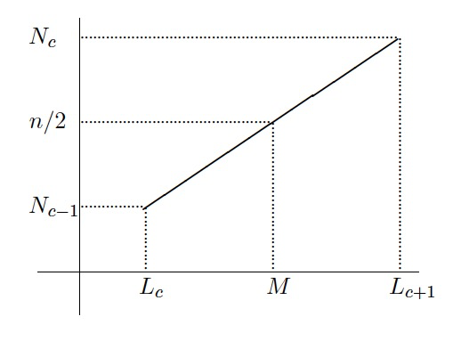
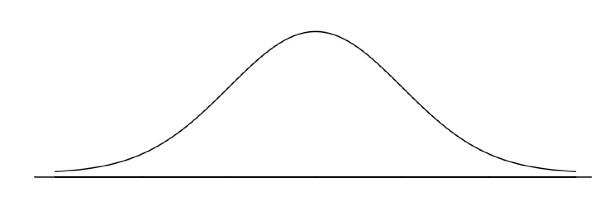

# Datos cuantitativos agrupados

En nuestro lenguaje cotidiano, solemos agrupar datos cuantitativos sin que seamos conscientes de ello. Cuando decimos, por ejemplo, que la edad de alguien es de 18 años, no queremos decir que nació justo hoy hace 18 años, sino que ya ha cumplido los 18 años, pero aún no ha cumplido los 19; es decir, que agrupamos todas las edades que caen dentro del intervalo [18,19) en una misma clase, que llamamos "18 años". Del mismo modo, que alguien mida 1.72 no significa que esta sea su altura exacta, con la precisión del grueso de un cabello, sino que su altura pertenece a un intervalo de valores en torno a 1.72 metros que identificamos con "1.72". Bajo  la calificación de "aprobado" agrupamos todas las notas mayores o iguales que 5 y menores que 7. Y estamos seguros de que se os ocurren otros ejemplos. 

Cuando trabajamos en estadística con datos cuantitativos, puede haber varios motivos por los que nos interese agruparlos. Una posibilidad es que  queramos estudiar la distribución de una cierta variable (pongamos, la altura) en una muestra  de individuos, y que los valores que pueda tomar esta variable sean muy heterogéneos; en esta situación,  lo normal sería que obtuviéramos muy pocas repeticiones, por lo que las frecuencias de los valores individuales serían muy bajas y por lo tanto muy similares. Esto daría lugar  a un diagrama de barras difícil de interpretar. 

Veamos un ejemplo: consideremos la siguiente muestra de 30 alturas de estudiantes:
```{r}
alturas=c(1.71,1.62,1.72,1.76,1.78,1.73,1.67,1.64,1.63,1.68,1.68,1.70,1.67,
  1.56,1.66,1.57,1.69,1.68,1.67,1.75,1.61,1.60,1.74,1.70,1.65,1.55,1.82,1.70,1.69,1.81)
```

El gráfico siguiente muestra el diagrama de barras de sus frecuencias, tomando como posibles niveles todas las alturas entre su mínimo y su máximo, redondeadas a cm.  Todas la barras tienen alturas entre 0 y 3, y salvo una mayor presencia de los valores centrales (entre 1.67 y 1.70), no hay mucho más que salte a la vista en este gráfico.


```{r, echo=FALSE}
alturas1=factor(alturas,levels=1.55+0.01*(0:17))
barplot(table(alturas1))
```

En situaciones como esta, es recomendable dividir los posibles valores de la variable en  intervalos y contar cuántos datos caen dentro de cada intervalo: habitualmente, las frecuencias que se obtienen de esta manera son más fáciles de interpretar que las de los datos individuales. Así, siguiendo con nuestro ejemplo de las alturas, el diagrama de barras siguiente representa sus frecuencias cuando las agrupamos en intervalos de 5 cm. La distribución de estas alturas es mucho más fácil de entender mediante este gráfico que con el primero.


```{r echo=FALSE}
alturas2=cut(alturas,breaks=1.55+0.05*(0:6),right=FALSE)
barplot(table(alturas2))
```


Otro motivo por el que puede ser conveniente agrupar datos es la imposibilidad física de medir  de manera exacta algunas magnitudes continuas como alturas, pesos o tiempos; esto hace que los datos obtenidos sean sólo aproximaciones o redondeos de los valores reales y que cada medida diferente represente todo un intervalo de posibles valores. 


En general, hay tres situaciones concretas en las cuales conviene agrupar datos cuantitativos en intervalos de valores, también llamados  **clases**:

* Cuando los datos son continuos y no se pueden medir de manera exacta: su redondeo ya define un  agrupamiento

* Cuando los datos son discretos, pero con un número muy grande de posibles valores: números de aminoácidos en proteínas, números de bases en cadenas de ADN...  

* Cuando tenemos muchos datos y nos interesa estudiar las frecuencias de sus valores; hay autores que consideran que *muchos*, en este contexto, significa "a partir de 30"


## Cómo agrupar datos

El paso previo al estudio de unos datos agrupados es, naturalmente, agruparlos. El proceso es el siguiente:

1. Se decide el número de intervalos que se van a usar.
2. Se decide su amplitud.
3. Se calculan los extremos de los intervalos.
4. Finalmente, en algunas aplicaciones, se calcula un valor representativo de cada intervalo, llamado su **marca de clase**.


No hay una manera de agrupar datos mejor que otra; por ejemplo, para estudiar las calificaciones de un curso podemos agruparlas en Suspenso, [0,5), Aprobado, [5,7) Notable, [7,9), y Sobresaliente, [9,10], o podemos redondear por defecto las notas a su parte entera y usar  los intervalos [0,1), [1,2), ..., [9,10]. Podría ser que cada uno de estos agrupamientos saque a la luz características diferentes del conjunto de datos.


La función básica de R para estudiar datos agrupados, `hist`, implementa todo el proceso: si le entramos  el vector de datos y el número de intervalos, o el método para determinarlo (véase más adelante), agrupará los datos en, más o menos, el número de clases que le hemos especificado,  sin ningún control por nuestra parte sobre los intervalos que produce. Para un análisis somero de los datos, esto suele ser más que suficiente, pero para una descripción más cuidadosa es conveniente que seamos nosotros quienes controlemos el proceso de agrupamiento, y en particular que calculemos los extremos de los intervalos, en lugar de dejárselos calcular a R.
En esta sección explicamos **nuestra receta** para agrupar datos y calcular marcas de clase; no es ni mejor ni peor que otras, pero es la que os recomendamos que uséis, sobre todo en el test si queréis obtener las respuestas correctas.

Lo primero que tenemos que hacer  es establecer  el número $k$ de clases en las que vamos a  dividir el conjunto de datos, al que denotaremos en lo que sigue por $x$. Podemos decidir este número de clases en función de nuestros intereses concretos, o podemos usar alguna de las reglas que se han propuesto con este fin; las más populares son las siguientes, donde $n$ denota el número de datos en la muestra (recordad en lo que sigue que $\lceil x \rceil$ denota el menor entero que es mayor o igual que $x$, y que con R se calcula mediante la función `ceiling`):


* **Regla de la raíz cuadrada**: $k=\big\lceil \sqrt{n}\big\rceil$.

* **Regla de Sturges**: $k= \big\lceil 1+\log_{2}(n)\big\rceil.$

* **Regla de Scott**: Se determina primero la **amplitud teórica** $A_S$ de las clases mediante la fórmula 
$$
A_S= 3.5\cdot \widetilde{s}\cdot n^{-\frac{1}{3}}
$$ 
    (donde $\widetilde{s}$ es la desviación típica muestral del conjunto de datos), y entonces se toma 
$$
k=\left\lceil
\frac{\max(x) -\min(x)}{A_S}\right\rceil.
$$

* **Regla de Freedman-Diaconis**: Se determina primero la **amplitud teórica** $A_{FD}$ de las clases por medio de la fórmula 
$$
A_{FD}= 2 \cdot (Q_{0.75}-Q_{0.25}) \cdot n^{-\frac{1}{3}}
$$ 
    (recordad que $Q_{0.75}-Q_{0.25}$ es el rango intercuartílico), y entonces se toma de nuevo 
$$
k= \left\lceil \frac{\max(x) -\min(x)}{A_{FD}}\right\rceil.
$$

Como podéis ver, las dos primeras sólo dependen de $n$, mientras que las  dos últimas tienen  en cuenta, de maneras diferentes, su dispersión; no hay una regla mejor que las otras y, además, números de clases diferentes pueden revelar  características diferentes de los datos. Las tres últimas reglas están implementadas en las funciones `nclass.Sturges`, `nclass.scott` y `nclass.FD` de R, respectivamente.


```{example,alerg}
Mucha gente manifiesta reacciones alérgicas sistémicas a las picaduras de insecto; estas reacciones varían entre pacientes, no sólo en lo que se refiere a la gravedad de la reacción, sino también en el tiempo que tarda en manifestarse. En un estudio se midió,  en 40 pacientes que experimentaron una reacción alérgica a una picadura de abeja,  el tiempo de inicio de esta reacción desde la picadura, y se obtuvieron los datos siguientes,  que expresamos en minutos:

  
```

```{r}
alergia=c(10.5,11.2,9.9,15.0,11.4,12.7,16.5,10.1,12.7,11.4,11.6,6.2,7.9,
  8.3,10.9,8.1,3.8,10.5,11.7,8.4,12.5,11.2,9.1,10.4,9.1,13.4,12.3,5.9,11.4,
  8.8,7.4,8.6,13.6,14.7,11.5,11.5,10.9,9.8,12.9,9.9)
```

Vamos a dar los números de intervalos en los que tendríamos que dividir estos datos según las diferentes reglas que hemos explicado. Antes, vamos a calcular los estadísticos de este conjunto de datos que vamos a usar:
```{r}
length(alergia)  #Número de datos
sd(alergia) #Desviación típica muestral
diff(range(alergia))  #Rango de valores
IQR(alergia) # Rango intercuartílico
```


* **Regla de la raíz cuadrada**: $k= \lceil \sqrt{40} \rceil =\lceil 6.3245\rceil=7$

* **Regla de Sturges**: $k= \lceil 1+\log_{2}(40)\rceil= \lceil 6.321928\rceil=7$. Con R:
```{r}
nclass.Sturges(alergia)
```

* **Regla de Scott**: $A_{S}= 3.5\cdot \widetilde{s}\cdot n^{-\frac{1}{3}}=3.5\cdot 2.533609 \cdot 40^{-\frac{1}{3}}= 2.592911$ y entonces, como el rango del conjunto de datos es 12.7, tenemos que  $k=\lceil {12.7}/{2.592911}\rceil=\lceil 4.89797\rceil=5$. Con R:
```{r}
nclass.scott(alergia)
```

* **Regla de Freedman-Diaconis**: $A_{FD}= 2 \cdot (Q_{0.75}-Q_{0.25}) \cdot n^{-\frac{1}{3}}=2\cdot 2.825 \cdot 40^{-\frac{1}{3}}=1.65207$ y por lo tanto  $k= \lceil {12.7}/{1.65207}\rceil=\lceil 7.687\rceil=8$.  Con R:
```{r}
nclass.FD(alergia)
```


Como podéis ver, reglas diferentes pueden dar valores diferentes, y puede que no.


Una vez determinado el número $k$ de clases, tenemos que decidir su amplitud. La forma más sencilla, y que adoptaremos por defecto, es tomar todos los intervalos de la misma amplitud (aunque no es la única forma posible de hacerlo, naturalmente: recordad, por ejemplo,  el agrupamiento de las calificaciones en Suspenso, Aprobado, Notable y Sobresaliente, que representan intervalos de notas de amplitudes diferentes). Para calcular esta amplitud, $A$, dividiremos el rango de los datos entre el número $k$ de clases y redondearemos por exceso a un valor de la precisión de la medida: si medimos edades con una precisión de años, redondearemos este cociente por exceso a años, si medimos alturas con una precisión de centímetros, redondearemos por exceso a centímetros, etc. En el caso improbable de que el cociente del rango entre el número de clases dé un valor exacto en la precisión de la medida, tomaremos como $A$ este cociente más una unidad de precisión; así, por ejemplo, si hemos medido unas alturas en metros con una precisión de centímetros y obtenemos que el cociente del rango entre $k$ da un número exacto de centímetros, tomaremos como amplitud $A$ este cociente más 1 cm.

```{example}
Seguimos con el Ejemplo \@ref(exm:alerg); vamos a continuar el proceso de agrupamiento de los datos en $k=7$ clases. Recordemos que el rango del conjunto de datos en cuestión es 12.7 y que los datos están expresados en minutos con una precisión de una cifra decimal; por lo tanto, la amplitud será el cociente $12.7/7=1.8143$ redondeado por exceso a  una cifra decimal: $A=1.9$.


```

Ahora hemos de calcular los extremos de los intervalos. En este curso, tomaremos estos intervalos siempre cerrados a la izquierda y abiertos a la derecha, y los denotaremos por
$$
[L_1,L_2),[L_2,L_3),\ldots, [L_k,L_{k+1}).
$$
Sin entrar en detalles, el motivo por el que tomamos los intervalos de esta forma y no al revés (abiertos por la izquierda y cerrados por la derecha, que es como los construye R por defecto) es porque así es como se usan en Teoría de Probabilidades al definir la distribución de una variable aleatoria discreta, y también en muchas situaciones cotidianas (calificaciones, edades...).  En todo caso, queremos haceros notar que, con la regla que explicamos a continuación, los extremos de los intervalos nunca van a coincidir con valores del conjunto de datos: si la usáis, tanto dará si consideráis los intervalos abiertos o cerrados en sus extremos.

Los extremos $L_1,\ldots,L_{k+1}$ de estos intervalos se calculan de la manera siguiente: tomamos como extremo izquierdo $L_1$ del primer intervalo el valor 
$$
L_1=\min(x)-\frac{1}{2}\cdot \text{precisión} 
$$
Es decir, si la precisión son las unidades en las que hemos medido los datos, $L_1=\min(x)-0.5$; si la precisión son décimas de unidad, $L_1=\min(x)-0.05$; etc. A partir de este extremo inferior, cada uno de los extremos siguientes se obtiene sumando la amplitud al anterior:  $L_2=L_1+A$, $L_3=L_{2}+A$ y así sucesivamente, hasta llegar a $L_{k+1}=L_{k}+A$. Por consiguiente, estos extremos forman una progresión aritmética de paso $A$:
$$
L_i=L_1+(i-1)A,\quad i=2,\ldots,k+1.
$$
Como decíamos, de esta manera se garantiza que los extremos de los intervalos nunca coincidan con valores del conjunto de datos: por ejemplo, si los datos están expresados con una sola cifra decimal, estos extremos tienen todos un 5 en su segunda cifra decimal.

```{example}
Continuemos con el Ejemplo \@ref(exm:alerg) y $k=7$; hemos visto que tenemos que tomar $A=1.9$. El valor mínimo del conjunto de datos es:
  

```

```{r}
min(alergia)
```
Además, los datos están expresados con una precisión de décimas de unidad. El extremo inferior del primer intervalo será, entonces, $L_1=3.8-0.05=3.75$, y a partir de aquí obtendremos el resto de extremos mediante una progresión aritmética de paso 1.9:
$$
\begin{array}{l}
L_1=3.75\\
L_2=3.75+1.9=5.65\\ 
L_3=3.75+2\cdot 1.9 = 7.55\\ 
L_4= 3.75+3\cdot 1.9 = 9.45\\ 
L_5= 3.75+4\cdot 1.9 = 11.35\\ 
L_6= 3.75+5\cdot 1.9 = 13.25\\
L_7= 3.75+6\cdot 1.9 = 15.15\\
 L_8= 3.75+7\cdot 1.9 = 17.05
\end{array}
$$
Los intervalos son, por lo tanto,
$$
\begin{array}{l}
[3.75,5.65),\ [5.65,7.55),\ [7.55,9.45),\ [9.45, 11.35),\ [11.35 ,13.25),\\{}
[13.25,15.15),\ [15.15,17.05).
\end{array}
$$


Finalmente, hemos de determinar la **marca de clase** $X_i$ de cada intervalo $[L_i,L_{i+1})$; se trata de  un valor  del intervalo que usaremos para identificar la clase y para calcular algunos estadísticos. Como regla general, en este curso marcaremos el punto medio del intervalo, 
$$
X_i=\frac{L_{i}+L_{i+1}}{2};
$$ 
de esta manera, el error máximo que se comete al describir cualquier elemento  del intervalo por medio de su marca de clase es mínimo e igual a la mitad de la amplitud del intervalo. 

Como todos los intervalos tienen la misma amplitud $A$, la diferencia entre dos puntos medios consecutivos será también $A$, y por consiguiente las marcas de clase formarán de nuevo una progresión aritmética de paso $A$:
$$
X_1=\frac{L_1+L_2}{2}\quad \text{ y }\quad X_i=X_1+(i-1)A, \quad i=2,\ldots,k.
$$

```{example}
Continuemos con el Ejemplo \@ref(exm:alerg) para $k=7$. Las marcas de clase serán los puntos medios de los intervalos que hemos determinado en el ejemplo anterior; como hemos visto, formarán  una progresión aritmética de origen el punto medio del primer intervalo y paso la amplitud de las clases:
$$
\begin{array}{l}
X_1=(3.75+5.65)/2=4.7\\
X_2= 4.7 +1.9= 6.6\\
X_3= 4.7 + 2\cdot 1.9 = 8.5\\
X_4= 4.7 + 3\cdot 1.9= 10.4\\
X_5= 4.7 + 4\cdot 1.9= 12.3\\
X_6=4.7 + 5\cdot 1.9= 14.2\\
X_7= 4.7 + 6\cdot 1.9= 16.1
\end{array}
$$
```

```{example}
Volvamos a la situación inicial del Ejemplo \@ref(exm:alerg), y esta vez vamos a agrupar los datos siguiendo la regla de Scott. 
Ya  calculamos en su momento que, con esta regla, tenemos que usar  $k=5$ intervalos. Como el rango de los datos es 12.7 y $12.7/5=2.54$, redondeando por exceso este cociente a una décima obtenemos que la amplitud de los intervalos ha de ser  $A=2.6$.


```

Calculemos los extremos de los intervalos: el extremo inferior del primero es, de nuevo, $L_1=3.8-0.05=3.75$, y a partir de este valor, los otros extremos se obtienen sumando consecutivamente la amplitud hasta llegar a $L_6$:
  
  

```{r}
L=3.75+2.6*(0:5)
L
```
Los intervalos son, por lo tanto,
$$
[3.75, 6.35),\ [6.35,8.95),\ [8.95,11.55),\ [11.55, 14.15),\ [14.15 ,16.75).
$$

La marca de clase del primer intervalo es su punto medio: 
$$
X_1=\frac{3.75+ 6.35}{2}= 5.05.
$$
A partir de este valor, las otras marcas se obtienen sumando consecutivamente la amplitud hasta llegar a $X_5$:
```{r}
X=5.05+2.6*(0:4)
X
```


También podríamos haber calculado estas marcas de clase definiéndolas directamente como los puntos medios de los intervalos:
```{r}
X=(L[-length(L)]+L[-1])/2
X
```
Observad que, en esta última construcción, `L[-length(L)]` es el vector $L_1,L_2,\ldots,L_k$ (obtenido a partir de $L_1,L_2,\ldots,L_k,L_{k+1}$ eliminando su último elemento) y
`L[-1]` es el vector $L_2,L_3,\ldots,L_{k+1}$ (obtenido a partir de $L_1,L_2,\ldots,L_k,L_{k+1}$ eliminando su primer elemento), por lo que 
```{r,eval=FALSE}
(L[-length(L)]+L[-1]])/2
```
define el vector 
$$
\frac{L_1+L_2}{2},\frac{L_2+L_3}{2},\ldots,\frac{L_k+L_{k+1}}{2}
$$
formado por las marcas de clase.


Una vez agrupados los datos, ya podemos empezar a estudiarlos. Una primera posibilidad es  considerar las clases como los niveles de una variable ordinal y  calcular sus frecuencias; así,

* la **frecuencia absoluta** de una clase será el número de datos originales que pertenecen a esta clase 

* la **frecuencia absoluta acumulada** de una clase será el número de datos originales que pertenecen a esta clase o a alguna de las anteriores 

* etc. 

La manera usual de representar las frecuencias de un conjunto de datos agrupados es la mostrada en la tabla siguiente, donde $X_j$ indica la marca de clase, $n_j$ la frecuencia absoluta de la clase, $N_j$ su frecuencia absoluta acumulada, $f_j$ su frecuencia relativa y $F_j$ su frecuencia relativa acumulada. Recordad que $N_k$ será igual al número total de datos recogidos y $F_k$ siempre valdrá 1.

$$
\begin{array}{lccccc}
\hline \text{clases} & X_j &
n_j & N_j & f_j & F_j
\\\hline [L_1,L_2) & X_1 & n_1 & N_1 & f_1 & F_1 \\
[L_2,L_3) & X_2 & n_2 & N_2 & f_2 & F_2 \\ \quad\ \vdots &
\vdots &
\vdots & \vdots & \vdots & \vdots \\ [L_k,L_{k+1}) & X_k &
n_k &
N_k & f_k & F_k\\ \hline
\end{array}
$$


```{example, table1}
Continuemos con el Ejemplo \@ref(exm:alerg). Recordemos los datos, que damos ordenados para facilitar el cálculo de la tabla de frecuencias:

````

```{r}
sort(alergia)
```

Las frecuencias de este conjunto de datos para su agrupamiento en 7 clases  se muestran en la tabla siguiente. Para construir esta tabla, primero hemos calculado las frecuencias absolutas de cada clase: sólo hay 1 valor dentro de [3.75, 5.65), por lo que $n_1=1$; hay 3 valores dentro de [5.65, 7.55), por lo que $n_2=3$; etc. A partir de estas frecuencias absolutas, hemos calculado el resto de la manera usual.

$$
\begin{array}{lrrrrr}
  \hline
\text{clases} & X_j & n_j & N_j & f_j & F_j \\ 
  \hline
[3.75, 5.65) & 4.7 &   1 &   1 & 0.025 & 0.025 \\ 
[5.65, 7.55) & 6.6 &   3 &   4 & 0.075 & 0.100 \\ 
[7.55, 9.45) & 8.5 &   8 &  12 & 0.200 & 0.300 \\ 
[9.45, 11.35) & 10.4 &  11 &  23 & 0.275 & 0.575 \\ 
[11.35, 13.25) & 12.3 &  12 &  35 & 0.300 & 0.875 \\ 
[13.25, 15.15) & 14.2 &   4 &  39 & 0.100 & 0.975 \\ 
[15.15, 17.05) & 16.1 &   1 &  40 & 0.025 & 1.000 \\ 
   \hline
\end{array}
$$

```{example,fruitals}
Los siguientes valores son números de árboles frutales afectados por la mosca de la fruta en 50 terrenos rústicos de las mismas dimensiones:
  
  
````

```{r}
fruta=c(8,11,11,8,9,10,16,6,12,19,13,6,9,13,15,9,12,16,8,7,14,11,15,6,14,
  14,17,11,6,9,10,19,12,11,12,6,15,16,16,12,13,12,12,8,17,13,7,12,14,12)
```

Para estudiar estos valores, vamos a agruparlos; usaremos la regla de Freedman-Diaconis.
```{r} 
nclass.FD(fruta)
diff(range(fruta))/5
min(fruta)
```


Por consiguiente, usaremos 5 clases. Como hemos dado las medidas con una precisión de unidades, 
para calcular su amplitud $A$  hemos de redondear por exceso a unidades el cociente  entre el rango de la variable y el número de clases; este cociente vale 2.6, y por lo tanto $A=3$.  Recordad que, si la precisión hubiera sido de décimas de unidad, como este cociente ha dado exactamente 2.6, hubiéramos tenido que tomar como amplitud el cociente más una unidad de precisión: 2.7.

El extremo inferior de la primera clase será 6-0.5=5.5, y a partir de aquí calculamos los 5 extremos siguientes sumando sucesivamente la amplitud:
```{r}
5.5+3*(0:5)
```
Por consiguiente, los intervalos son
$$
[5.5, 8.5),\ [8.5,11.5),\ [11.5, 14.5),\ [14.5, 17.5),\ [17.5, 20.5).
$$

Las marcas de clase serán los puntos medios de estos intervalos, que calcularemos sumando múltiplos consecutivos de la amplitud al primer punto medio:
```{r}
(5.5+8.5)/2+3*(0:4)
```
Es decir,
$$
X_1=7,\  X_2=10, \ X_3= 13,\  X_4= 16,\  X_5= 19.
$$

Finalmente, ordenamos los datos
```{r}
sort(fruta)
```
y contamos cuántos pertenecen a cada clase (serán las frecuencias absolutas) y a partir de aquí calculamos el resto de frecuencias. Al final, obtenemos la tabla siguiente.

$$
\begin{array}{lccccc}
\hline
\text{clases}  & X_j & n_j & N_j &  f_j &  F_j \\ \hline 
[5.5,8.5)  & \ 7  & 11 & 11 & 0.22 &  0.22 \\ 
[8.5,11.5) & 10  & 11  & 22  & 0.22  & 0.44 \\
[11.5,14.5) & 13 & 17  & 39  & 0.34  & 0.78 \\ 
[14.5,17.5) & 16 & \ 9  & 48 & 0.18  & 0.96\\
[17.5,20.5) & 19   & \ 2  & 50 & 0.04  & 1.00 \\ \hline
\end{array}
$$

 Lo que nos interesa ahora es que R calcule esta tabla por nosotros.


## Agrupamiento de datos con R {#sec:agrupR}

Al agrupar un conjunto de datos con R, lo que hacemos es codificarlos, 
convirtiendo la variable cuantitativa en un factor cuyos niveles son las clases en las que hemos agrupado los valores y asignando cada dato a su clase. Las etiquetas de estos niveles pueden ser de diferentes tipos, en función de los intereses o el gusto del usuario. A modo de ejemplo, supongamos que agrupamos los valores de una variable cuantitativa en los intervalos 
[0.5,3.5), [3.5,6.5) y [6.5,9.5). Los tres tipos de codificación más usuales son:

* **Codificación 1**: Codificamos cada intervalo por medio de él mismo: *[0.5,3.5), [3.5,6.5), [6.5,9.5)*
* **Codificación 2**: Codificamos cada intervalo por medio de su marca de clase, es decir, su punto medio: *2, 5, 8*
* **Codificación 3**: Codificamos cada intervalo por medio de su número de orden: *1, 2, 3*

Naturalmente, en la práctica podemos usar cualquier otra codificación que se nos ocurra.


La función básica de R para agrupar un vector de datos numéricos y codificar 
sus valores  con las clases a las que pertenecen es 
```{r,eval=FALSE}
cut(x, breaks=..., labels=..., right=FALSE, include.lowest=TRUE)
```
donde:

* `x` es el vector numérico que contiene los datos

* El parámetro `breaks` puede ser un vector numérico formado por los extremos de los intervalos en los que queremos agrupar los datos y que habremos calculado previamente. También podemos igualar este parámetro a un número $k$, en cuyo caso  R   agrupa los datos en $k$ clases; para ello, divide el intervalo comprendido entre los valores mínimo y máximo de $x$ en $k$ intervalos y, a continuación, desplaza ligeramente  a la izquierda el extremo inferior del primero  y a la derecha el extremo superior del último. Por consiguiente, estos intervalos no tienen todos la misma amplitud, y además puede pasar que algún extremo intermedio coincida con algún dato del conjunto.

* El parámetro `labels` es un vector con las etiquetas de los intervalos. Su valor por defecto, el que utiliza si no lo especificamos, es la  codificación 1: usa como etiquetas los mismos intervalos. (Aunque puede que escriba sus extremos redondeados, para que muestren todos un número máximo de cifras significativas: por defecto, 3.) Si especificamos `labels=FALSE`,  obtenemos la codificación 3: los intervalos se identifican por medio de números naturales correlativos empezando por 1. Para usar como etiquetas las marcas de clase  o cualquier otro vector, hay que entrarlo  como valor de este parámetro.

* El parámetro `right` es un parámetro lógico que permite indicar qué tipo de intervalos queremos. Si usamos intervalos cerrados por la izquierda y abiertos por la derecha, que va a ser la norma en este curso, tenemos que especificar `right=FALSE`, que **no es el valor por defecto**.

* Combinado con `right=FALSE`, `include.lowest=TRUE` impone que el último intervalo sea cerrado: $[L_k,L_{k+1}]$. De esta manera, si por casualidad (o porque no hemos definido con cuidado las clases) el extremo superior del último intervalo, $L_{k+1}$, coincide con un valor del conjunto de datos, lo contamos en el último intervalo;
sin `include.lowest=TRUE` no tendríamos en cuenta los $L_{k+1}$ del conjunto de datos. Naturalmente, si sabemos que $L_{k+1}$ no pertenece a nuestro conjunto de datos, entonces no hace falta entrar este parámetro.


Podéis consultar la Ayuda de la función para conocer otros parámetros que os puedan ser de utilidad y para saber cómo se pueden especificar otros tipos de intervalos.

```{example, cut}
En un experimento hemos recogido los datos siguientes:
  
  
```


> 10,9,8,7,3,5,6,8,9,5,2,1,3,1,1.

Vamos a agruparlos en los intervalos
$$
[0.5,4.5), [4.5,8.5), [8.5,12.5).
$$

Son $k=3$ intervalos de amplitud $A=4$. 

* Creamos un vector `x` con los datos
```{r}
x=c(10,9,8,7,3,5,6,8,9,5,2,1,3,1,1)
```

* Definimos un vector `L` con los extremos de los intervalos
```{r}
L=0.5+4*(0:3)
```

* Definimos `x_int` como el resultado de la codificación en intervalos empleando como etiquetas los intervalos
```{r}
x_int=cut(x, breaks=L, right=FALSE)
x_int
```

* Definimos `x_MC` como el resultado de la codificación en intervalos empleando como etiquetas las marcas de clase
```{r}
MC=(L[1]+L[2])/2+4*(0:2)  #Las marcas de clase
x_MC=cut(x, breaks=L, labels=MC, right=FALSE)
x_MC
```

* Definimos `x_Num` como el resultado de la codificación en intervalos empleando como etiquetas 1, 2, 3
```{r}
x_Num=cut(x, breaks=L, labels=FALSE, right=FALSE)
x_Num
```


El resultado de `cut` ha sido, en cada caso, una lista con los elementos del vector original codificados con las etiquetas de las clases a las que pertenecen. Podemos observar  que las dos primeras aplicaciones de `cut` han producido factores (cuyos niveles son los intervalos y las marcas de clase, respectivamente, en ambos casos ordenados de manera natural), mientras que aplicándolo con `labels=FALSE`  hemos obtenido un vector.


Antes de continuar, ¿que habría pasado si hubiéramos pedido a R que cortase los datos en 3 grupos?
```{r}
x
cut(x, breaks=3, right=FALSE)
```


R ha repartido los datos en tres intervalos de longitud 3, y ha desplazado ligeramente a la izquierda el extremo izquierdo del primer intervalo. Fijaos en que, según el resultado que muestra R, 10 pertenece a [7,10). Aunque así escrito resulte contradictorio, la realidad es que R ha tomado como  extremo derecho del último intervalo el valor 10.009, tal y como se explica en la Ayuda de `cut`, pero lo ha escrito redondeado a 10.


Una vez agrupados los datos y codificados con las etiquetas de las clases, ya podemos calcular las tablas de frecuencias absolutas, relativas y acumuladas de los datos agrupados. Una posibilidad es usar las funciones `table`, `prop.table` y `cumsum` tal como lo hacíamos en las Lecciones \@ref(chap:edqual) y \@ref(chap:ord). Otra posibilidad es usar la función `hist`, a la que dedicaremos la Sección \@ref(sec:hist). Esta función sirve para dibujar el **histograma** de la variable cuantitativa agrupada (una especie de diagrama de barras para las clases del agrupamiento), pero internamente da lugar a una `list`  cuya componente  `count` es el vector de frecuencias absolutas de las clases. Por consiguiente, para calcular estas frecuencias absolutas, podemos usar la instrucción
```{r,eval=FALSE}
hist(x, breaks=..., right=FALSE, include.lowest=TRUE, plot=FALSE)$count
```
En esta instrucción, es conveniente igualar el parámetro `breaks` al vector de los extremos de los intervalos (porque `cut` y `hist` usan métodos diferentes para agrupar los datos cuando se especifica sólo el número de clases); el significado de `right=FALSE` (y, si es necesario, `include.lowest=TRUE`) es el mismo que en `cut`; y `plot=FALSE` impide que se dibuje el histograma. Por ahora es interesante también saber que el resultado de `hist` incluye la componente `mids` que contiene el vector de puntos medios de los intervalos, nuestras marcas de clase.

```{example,notes}
Supongamos que tenemos las 50 calificaciones siguientes, obtenidas por los estudiantes de una asignatura:


````

```{r}
Notas=c(5.1,1.1,6.4,5.3,10,5.4,1.9,3.1,5.1,0.8,9.6,6.6,7.0,9.6,
  10,1.2,4.2,8.8,2.4,1.8,5.6,6.8,6.7,2.2,8.6,3.9,5.6,5.9,8.4,4.9,
  0.7,8.2,3.7,4.8,5.8,3.3,9.7,7.8,9.3,4.5,6.2,3.9,4.7,6.2,6.3,9.4,
  9.3,2.3,8.5,1.4)
```

Vamos a agruparlas en Suspenso,  Aprobado,  Notable,   y  Sobresaliente, y calcularemos las frecuencias de estas clases. Observad que las clases no tienen la misma amplitud, y que además la última ha de ser cerrada a la derecha (ha de contener los dieces), por lo que tendremos que usar `include.lowest=TRUE`.
```{r}
Notas_cut=cut(Notas, breaks=c(0,5,7,9,10),
  labels=c("Suspenso","Aprobado","Notable","Sobresaliente"),
  right=FALSE, include.lowest=TRUE)
```

* La tabla de frecuencias absolutas 
```{r}
table(Notas_cut)  
```

* La tabla de frecuencias absolutas acumuladas
```{r}
cumsum(table(Notas_cut))  
```

* La tabla de frecuencias relativas 
```{r}
prop.table(table(Notas_cut))   
```

* La tabla de frecuencias relativas acumuladas 
```{r}
cumsum(prop.table(table(Notas_cut)))  
```

También podríamos haber obtenido estas frecuencias usando la función `hist` para calcular el vector de frecuencias absolutas y luego operando con este vector para obtener el resto:

* La tabla de frecuencias absolutas 
```{r}
frec_abs=hist(Notas, breaks=c(0,5,7,9,10), right=FALSE, 
  include.lowest=TRUE, plot=FALSE)$count  #Tabla de frecuencias absolutas 
frec_abs
```

* La tabla de frecuencias absolutas acumuladas
```{r}
cumsum(frec_abs) 
```

* La tabla de frecuencias relativas (ahora no podemos usar `prop.table`, puesto que `frec_abs` no es una `table`)
```{r}
frec_abs/length(Notas)  
```

* La tabla de frecuencias relativas acumuladas
```{r}
cumsum(frec_abs/length(Notas))  
```

Ahora podemos construir un *data frame* que contenga las frecuencias de estas calificaciones con la estructura de las tablas que hemos dado al final de la sección anterior.  Como ya explicamos en el Ejemplo \@ref(exm:dados),
si calculamos las frecuencias absolutas con `table`, no es conveniente usar el resultado como columna del *data frame*:  
es mejor utilizar el vector que se obtiene al aplicar `as.vector` al resultado de   `table`, y así no se generan columnas espurias con los nombres de los niveles.
```{r}
intervalos=c("[0,5)","[5,7)","[7,9)","[9,10]")
calificaciones=c("Suspenso","Aprobado","Notable","Sobresaliente")
marcas=c(2.5,6,8,9.5) #Marcas de clase
f.abs=as.vector(table(Notas_cut)) #Frecuencias absolutas
f.abs.cum=cumsum(f.abs)  #Frecuencias absolutas acumuladas
f.rel=f.abs/length(Notas) #Frecuencias relativas
f.rel.cum=cumsum(f.rel) #Frecuencias relativas acumuladas
tabla.frec=data.frame(intervalos, calificaciones, marcas, f.abs, 
   f.abs.cum, f.rel, f.rel.cum)  #Construimos el data frame
tabla.frec
```

También hubiéramos podido usar 
```{r}
Hist_notas=hist(Notas, breaks=c(0,5,7,9,10), right=FALSE, 
  include.lowest=TRUE, plot=FALSE)
f.abs=Hist_notas$count  
marcas=Hist_notas$mids  
```
y usar el vector `f.abs` como arranque para calcular las columnas de frecuencias del *data frame* y el vector `marcas` como columna de marcas de clase.


```{example}
Continuemos con el Ejemplo \@ref(exm:cut); vamos a calcular  las diferentes frecuencias para la codificación `x_int`:
```{r}
table(x_int)
x_int
prop.table(table(x_int))
x_int
cumsum(table(x_int))
cumsum(prop.table(table(x_int)))
```


Ahora, vamos a construir un *data frame* que contenga la tabla de frecuencias de esta variable agrupada:
```{r}
intervalos=levels(x_int)
marcas=MC  #Las hemos calculado en el Ejemplo 11.8
f.abs=as.vector(table(x_int))
f.abs.cum=cumsum(f.abs)
f.rel=f.abs/length(x)
f.rel.cum=cumsum(f.rel)
tabla.frec=data.frame(intervalos, marcas, f.abs, f.abs.cum, f.rel, f.rel.cum)
tabla.frec
```


Podemos automatizar el cálculo de esta tabla de frecuencias, usando las dos funciones siguientes.
La primera sirve en el caso en que vayamos a tomar todas las clases de la misma amplitud.
Sus parámetros son: $x$, el vector con los datos; $k$, el número de clases; $A$, su amplitud; y $p$, la precisión de los datos ($p=1$ si la precisión son unidades, $p=0.1$ si la precisión son décimas de unidad, etc.).
```{r}
Tabla_frec_agrup=function(x,k,A,p){
    L=min(x)-p/2+A*(0:k)
    x_int=cut(x, breaks=L, right=FALSE)
    intervalos=levels(x_int)
    marcas=(L[1]+L[2])/2+A*(0:(k-1))
    f.abs=as.vector(table(x_int))
    f.rel=f.abs/length(x)
    f.abs.cum=cumsum(f.abs)
    f.rel.cum=cumsum(f.rel)
    tabla_x=data.frame(intervalos, marcas, f.abs, f.abs.cum, f.rel, f.rel.cum)
    tabla_x
  }
```
Si de las clases conocemos de entrada sus extremos, podemos usar la función siguiente.
Sus parámetros son: $x$, el vector con los datos, y $L$, el vector de extremos de clases. 
```{r}
Tabla_frec_agrup_L=function(x,L){
    x_int=cut(x, breaks=L, right=FALSE, include.lowest=TRUE)
    intervalos=levels(x_int)
    marcas=(L[1:(length(L)-1)]+L[2:length(L)])/2
    f.abs=as.vector(table(x_int))
    f.rel=f.abs/length(x)
    f.abs.cum=cumsum(f.abs)
    f.rel.cum=cumsum(f.rel)
    tabla_x=data.frame(intervalos, marcas, f.abs, f.abs.cum, f.rel, f.rel.cum)
    tabla_x
  }
```

````{example}
Volviendo al Ejemplo \@ref(exm:alerg), vamos a calcular, para el agrupamiento en 7 clases,  su tabla  de frecuencias en forma de *data frame* usando la función `Tabla_frec_agrup`. Ya sabemos que $k=7$ y $A=1.9$ y que los datos están expresados con una precisión de décimas de unidad. 

```

```{r}
Tabla_frec_agrup(alergia, 7, 1.9, 0.1)
```
Observad que, como advertíamos en su momento, ha escrito los extremos de los intervalos redondeados para que tengan como máximo 3 cifras. Esto se puede resolver usando en la función  `cut` el parámetro `dig.lab`, que permite especificar el número máximo de cifras significativas en los extremos de las etiquetas. 
```{r}
L=3.75+1.9*(0:7)
L
cut(alergia, breaks=L, right=FALSE)
cut(alergia, breaks=L, right=FALSE, dig.lab=4)
```


Por lo tanto, si quisiéramos permitir que los extremos de las etiquetas tuvieran más de 3 cifras significativas, bastaría redefinir la función `Tabla_frec_agrup` añadiéndole un parámetro `dig.lab`, que tuviera valor por defecto 3, y que se entrara a la función `cut`.
```{r}
Tabla_frec_agrup=function(x,k,A,p,dig.lab=3){
    L=min(x)-p/2+A*(0:k)
    x_int=cut(x, breaks=L, right=FALSE,dig.lab=dig.lab)
    intervalos=levels(x_int)
    marcas=(L[1]+L[2])/2+A*(0:(k-1))
    f.abs=as.vector(table(x_int))
    f.rel=f.abs/length(x)
    f.abs.cum=cumsum(f.abs)
    f.rel.cum=cumsum(f.rel)
    tabla_x=data.frame(intervalos, marcas, f.abs, f.abs.cum, f.rel, f.rel.cum)
    tabla_x
  }
```


````{example}
Vamos a calcular la tabla de frecuencias de los datos del Ejemplo \@ref(exm:fruitals) usando la función `Tabla_frec_agrup`. Ya habíamos decidido que $k=5$ y que en este caso la amplitud era 3. Los datos  estaban expresados en unidades.


````

```{r}
Tabla_frec_agrup(fruta, 5, 3, 1)
```


```{example}
Vamos a volver a calcular la tabla de frecuencias de las notas del Ejemplo \@ref(exm:notes), usando  esta vez una de nuestras funciones. Como las clases tienen amplitudes diferentes, usaremos la función `Tabla_frec_agrup_L`. 

````

```{r}
Tabla_frec_agrup_L(Notas,c(0,5,7,9,10))
```


## Estadísticos para datos agrupados


Si tenemos una muestra de datos numéricos, para calcular sus estadísticos es conveniente usar los datos **brutos**, sin agrupar, ya que al agruparlos perdemos información; pero hay ocasiones en que los datos se obtienen ya agrupados: por ejemplo, mediante encuestas en las que se pida marcar un grupo de edad o una franja salarial en una lista de intervalos prefijados. En este tipo de situaciones, sigue siendo posible calcular los estadísticos de la muestra obtenida y usarlos como aproximaciones de los estadísticos de los datos "reales", que en realidad no conocemos.

La media $\overline{x}$, la varianza $s^2$, la varianza muestral $\tilde{s}^2$, la desviación típica $s$ y la desviación típica muestral $\tilde{s}$ de un conjunto de datos agrupados se calculan con las mismas fórmulas que para los datos sin agrupar, excepto que sustituimos cada clase por su marca y la contamos con su frecuencia. Supongamos, en concreto, que tenemos $k$ clases, sus respectivas marcas son $X_1,\ldots,X_k$ y sus respectivas frecuencias absolutas son $n_1,\ldots,n_k$, de manera que la longitud total de la muestra es
 $n=\sum_{i=1}^k n_i$; entonces
$$
\overline{x}=\frac{\sum_{i=1}^k n_iX_i}{n},\
s^2=\frac{\sum_{i=1}^k n_iX^2_i}{n}-\overline{x}^2,\
\tilde{s}^2=\frac{n}{n-1}\cdot s^2,\
s=\sqrt{s^2},\
\tilde{s}=\sqrt{\widetilde{s}^2}.
$$
Por lo que se refiere  a la moda, se sustituye por el **intervalo modal**, que es la clase con mayor frecuencia (absoluta o relativa). Si se desea un valor numérico, se toma su marca de clase.


```{example,demografia}
Hemos descargado de la [web del Instituto Nacional de Estadística](http://www.ine.es/jaxi/tabla.do?path=/t20/e243/e01/a1981/l0/&file=01006.px&type=pcaxis&L=0) una tabla con la población censal española de 1981 por grupos quinquenales de edad  y la hemos guardado en un fichero en formato CSV en el *url* https://raw.githubusercontent.com/AprendeR-UIB/AprendeR1/master/datos/cens81.csv.

```


Este fichero contiene dos columnas: una con los grupos de edad y otra con las poblaciones.
Vamos a usar estos datos agrupados para calcular algunos estadísticos de la distribución de la población española por edades en ese año.

Lo primero que hacemos es importarlo en un *data frame*; para ello podemos usar la función `read.csv` o la función `read.table` con `header=TRUE` y `sep=","`. Como la variable de grupos de edad tiene todos sus valores diferentes y no la usaremos para clasificar otros valores, la importaremos como un vector de palabras con
`stringsAsFactors=FALSE`. Como las etiquetas de los grupos de edad contienen la palabra "años", para garantizar que las eñes se importan de manera correcta es conveniente incluir `encoding="utf8"`.
```{r}
tabla=read.csv("https://raw.githubusercontent.com/AprendeR-UIB/AprendeR1/master/datos/cens81.csv", 
               stringsAsFactors=FALSE, encoding="utf8")
str(tabla)
tabla
```
Hay que tener en cuenta que, en esta tabla, la clase "De 0 a 4 años" representa el intervalo de edades [0,5), la clase "De 5 a 9 años" representa el intervalo de edades [5,10), y así sucesivamente.

Para calcular las diferentes medidas estadísticas, hemos de asignar a cada grupo de edades un valor numérico como marca de clase: para los 17 primeros grupos, de amplitud 5, tomaremos su punto medio, y para el último, de amplitud indeterminada, tomaremos 90 como marca. Añadiremos estas marcas al *data frame* anterior como una nueva variable.
```{r}
tabla$Marcas=c(2.5+5*(0:16),90)
head(tabla)
```
Ahora ya podemos calcular los estadísticos:

* Población total:
```{r}
Total=sum(tabla$Población)
Total
```

* Media:
```{r}
Edad.media=sum(tabla$Población*tabla$Marcas)/Total  
Edad.media 
```

* Varianza:
```{r}
Edad.varianza=sum(tabla$Población*tabla$marcas^2)/Total-Edad.media^2 
Edad.varianza
```

* Desviación típica:
```{r}
Edad.desv.tip=sqrt(Edad.varianza)  
Edad.desv.tip
```

* Intervalo modal:
```{r}
Int.modal=tabla$Edades[which(tabla$Población==max(tabla$Población))]  
Int.modal
```


Por lo tanto, con los datos de los que disponemos, podemos afirmar que la edad media de los españoles censados en 1981 era de unos 34 años, con una desviación típica de unos 22.5 años, y que el grupo de edad más numeroso era el de los niños y niñas de 5 a 9 años.


Se han propuesto muchos métodos para aproximar la mediana y los otros cuantiles de una variable cuantitativa agrupada a partir de las tablas de frecuencias de sus clases. Aquí explicaremos una de las más sencillas, y la ilustraremos con el ejemplo anterior; para empezar, vamos a completar el *data frame* con las frecuencias absolutas acumuladas, relativas y relativas acumuladas:
```{r}
tabla$FA.acum=cumsum(tabla$Población)
tabla$FR=round(tabla$Población/Total, 3)
tabla$FR.acum=round(tabla$FA.acum/Total, 3)
tabla
```


Llamaremos **intervalo crítico para la mediana** al primer intervalo donde la frecuencia  relativa acumulada sea mayor o igual que 0.5. 
En este caso, el intervalo crítico es la clase "De 30 a 34 años", es decir, $[30,35)$.

Sean $[L_c, L_{c+1})$ este intervalo crítico; $N_{c-1}$, la frecuencia absoluta acumulada del intervalo anterior al crítico (si el intervalo crítico es el primero, tomamos $N_{c-1}=0$); $n_c$, la frecuencia absoluta del intervalo crítico; $A_c=L_{c+1}-L_c$, su amplitud; y $n$, el número total de datos. Entonces, la fórmula siguiente nos da una **aproximación** $M$ para la mediana  de los datos "reales" a partir de los datos agrupados:
$$
M=L_{c}+A_c\cdot \frac{\frac{n}{2}- N_{c-1}}{n_c}.
$$
La justificación de esta fórmula es la siguiente: lo que hacemos es unir con una recta las frecuencias absolutas acumuladas en $L_c$ y en $L_{c+1}$, y aproximar  la mediana por medio de la abscisa del punto sobre esta recta cuya ordenada es $n/2$ (véase la Figura \@ref(fig:median)).


```{r median, out.width="50%", echo=FALSE, fig.cap='Aproximación lineal de la mediana a partir de las frecuencias de los datos agrupados.'}

```


En nuestro ejemplo, $n=37683361$, $L_c=30$, $A_c=5$, $N_{c-1}=18428647$ y $n_c=2455314$, por lo que 
$$
M=30+5\cdot\frac{0.5\cdot 37683361-18428647}{2455314}= 30.8411.
$$
Esto nos permite  estimar que, en 1981, aproximadamente la mitad de la población española tenía menos de 30  años y 10 meses.


En general, este método permite aproximar el cuantil $Q_p$ de los datos "reales" a partir de los datos agrupados  con la fórmula siguiente:
$$
Q_{p} =L_c + A_c \cdot \frac{p\cdot n-N_{c-1}}{n_c},
$$
donde ahora el intervalo crítico $[L_c,L_{c+1})$ es el primer intervalo con frecuencia relativa acumulada mayor o igual que $p$
y el resto de valores se definen relativos a este intervalo crítico.
De este modo,  en nuestro ejemplo, el intervalo crítico para $Q_{0.25}$ es "De 10 a 14 años", y en este caso $L_c=10$, $A_c=5$, $N_{c-1}=6383401$ y $n_c=3302328$, por lo que
$$
Q_{0.25}=10+5\cdot\frac{0.25\cdot 37683361-6383401}{3302328}= 14.6.
$$
En cuanto al tercer cuantil, $Q_{0.75}$, el intervalo crítico es "De 50 a 54 años", por lo que $L_c=50$, $A_c=5$, $N_{c-1}=27547001$ y $n_c=2265091$, y, por consiguiente,
$$
Q_{0.75}=50+5\cdot\frac{0.75\cdot 37683361-27547001}{2265091}=51.58.
$$


## Histogramas {#sec:hist}


Los datos agrupados se describen gráficamente por medio de unos diagramas de barras específicos llamados **histogramas**, donde se dibuja sobre cada clase una barra cuya área  representa la frecuencia de dicha clase. Veamos un ejemplo.

```{example, 1115}
Supongamos que tenemos los datos

````

> 10,9,8,1,9,8,2,5,7,3,5,6,1,3,7,8,9,8,5,6,2,4,1,3,5,4,6,7,10,8,5,4,2,7,8

y que los agrupamos en los intervalos [0.5,4), [4,7.5) y [7.5,11).
Calculemos las frecuencias absolutas de estas clases:
```{r}
x=c(10,9,8,1,9,8,2,5,7,3,5,6,1,3,7,8,9,8,5,6,2,4,1,3,5,4,6,7,
  10,8,5,4,2,7,8)
L1=c(0.5,4,7.5,11)
x_int=cut(x,breaks=L1,right=FALSE)
table(x_int)
x_int
```

La Figura \@ref(fig:201a) muestra un histograma de las frecuencias absolutas de estos datos con este agrupamiento.
Como todas las clases tienen la misma amplitud, las alturas de estas barras son proporcionales a las frecuencias de sus clases (son estas frecuencias divididas por la amplitud) y las representan correctamente, por lo que hemos marcado  sin ningún problema las frecuencias sobre el eje vertical.


```{r,201a,out.width="50%", echo=FALSE, fig.cap='Histograma del Ejemplo ref(exm:1115).'}
hist(x,breaks=L1,right=FALSE,main="",xlab="x",ylab="Frecuencias")
```


Pero si las amplitudes de las clases no son iguales, las alturas de las barras en un histograma no representan correctamente las frecuencias de las clases. A modo de ejemplo, supongamos que los datos anteriores son notas y que  las agrupamos en suspensos, aprobados, notables y sobresalientes: [0,5),  [5,7), [7,9) y [9,10]. Recordad que, en este caso, el último intervalo ha de ser cerrado.
```{r}
L2=c(0,5,7,9,10)
x_int2=cut(x,breaks=L2,right=FALSE,include.lowest=TRUE) 
table(x_int2)
x_int2
```
En la Figura \@ref(fig:203) podéis ver un histograma de frecuencias absolutas de estos datos con este agrupamiento. Comprobaréis que las alturas de las barras son las necesarias para que el área de cada barra sea igual a la frecuencia de la clase correspondiente; como las bases son de amplitudes diferentes, estas alturas no son proporcionales a las frecuencias de las clases, por lo que las marcas en el eje de ordenadas no son las frecuencias de las clases, sino los cocientes entre la frecuencia y la amplitud de las clases. 


```{r,203,out.width="50%", echo=FALSE, fig.cap='Histograma del Ejemplo ref(exm:1115) con clases de diferentes amplitudes.'}
DD=hist(x,breaks=L2,right=FALSE,include.lowest=TRUE,plot=FALSE)$density
hist(x,breaks=L2,right=FALSE,main="",xlab="x",ylab="",yaxt="n")
axis(2,at=(5/350)*(0:10),labels=0.5*(0:10))
```


También se usan histogramas para representar frecuencias acumuladas de datos agrupados; en este caso, y a diferencia del anterior, las alturas representan las frecuencias independientemente de la base. El motivo es que estas alturas tienen que ir creciendo. Así, los histogramas de frecuencias absolutas acumuladas de nuestros datos para los dos agrupamientos anteriores serían los mostrados en la Figura \@ref(fig:204).

```{r 204, echo=FALSE, fig.show="hold", fig.width=10,fig.asp=0.5, fig.cap='Histogramas de frecuencias acumuladas de los datos del Ejemplo \\@ref(exm:1115) para dos agrupamientos diferentes.'}
par(mfrow=c(1,2))
h1=hist(x, breaks=L1, right=FALSE, plot=FALSE)
h1$density=cumsum(h1$density)
plot(h1, axes=FALSE, freq=FALSE,
  main="",xlab="x", ylab="Frec. absolutas acumuladas")
axis(1, at=L1)
axis(2, at=seq(0,max(h1$density),length.out=8),labels=5*(0:7))
#
h2=hist(x, breaks=L2, right=FALSE, plot=FALSE,include.lowest=TRUE )
h2$density=c(2.4,10,15,35)
plot(h2, axes=FALSE, freq=FALSE,
  main="",xlab="x", ylab="Frec. absolutas acumuladas")
axis(1, at=L2)
axis(2, at=seq(0,max(h2$density),length.out=8),labels=5*(0:7))
par(mfrow=c(1,1))
```


La Figura \@ref(fig:205) muestra la estructura básica de dos histogramas, el izquierdo para las frecuencias absolutas y el derecho para las frecuencias absolutas acumuladas. En un histograma, el eje de las abscisas representa los datos, donde marcamos los extremos de las clases, y se dibuja una barra sobre cada clase; esta barra tiene un significado diferente según el tipo de histograma, pero en general representa la frecuencia de su clase:

* En los histogramas de frecuencias absolutas, la altura de cada barra  es la necesaria para que el área de la barra sea igual a la frecuencia absoluta de la clase. Si todas las clases tienen la misma amplitud, esto implica que las alturas de las barras sean proporcionales a las frecuencias de las clases  y que, por tanto, las representen bien; si las clases no son todas de la misma amplitud, estas alturas ya no representan las frecuencias. Tanto en un caso como en otro, para facilitar la comprensión del histograma es conveniente indicar de alguna manera las frecuencias  que representan las barras;
este consejo se extiende a los histogramas de frecuencias relativas.

* En los histogramas de frecuencias relativas, la altura de cada barra es la necesaria para que el área de la barra sea igual a la frecuencia relativa de la clase; en particular, la suma de las áreas de las barras ha de ser igual a 1. En este contexto, llamamos a las alturas de las barras **densidades**. 

* En los histogramas de frecuencias acumuladas (absolutas o relativas), las alturas de las barras son iguales a las frecuencias acumuladas de la clases, independientemente de su amplitud.

```{r 205, echo=FALSE, fig.show="hold", fig.width=10,fig.asp=0.5, fig.cap='Estructura básica de un histograma de frecuencias absolutas (izquierda) y absolutas acumuladas (derecha)'}
par(mfrow=c(1,2))
plot(c(1,1,1.5,1.5,1.5,2,2,2.5,2.5,3,3),c(0,6,6,0,2,2,0,0,4,4,0),
main="Histograma y polígono de frecuencias absolutas",type="S",ylim=c(0.22,6),xlim=c(0.95,3.5),xlab="Intervalos",
 ylab="Frecuencias absolutas",xaxs="i",yaxs="i",bty="l",xaxt="n",yaxt="n")
lines(c(1,1.25,1.75),c(0,6,2),col="red")
lines(c(2.25,2.75,3),c(2,4,0),col="red")
axis(1,at=c(1,1.5,2,2.5, 3),
labels=c(expression(L[1]),expression(L[2]),
expression(L[3]),expression(L[k]),expression(L[k+1])))
text(1.25,3,expression(n[1]))
text(1.75,1,expression(n[k]))
text(2.75,3,expression(n[2]))
text(2.25,1,"......")
#
plot(c(1,1,1.5,1.5,1.5,2,2,2.5,2.5,3,3),c(0,6,6,0,8,8,0,0,12,12,0),type="S",
main="Histograma y polígono de frec. absolutas acumuladas",ylim=c(0.22,12),xlim=c(0.95,3.5),xlab="Intervalos",
 ylab="Frecuencias absolutas acumuladas",xaxs="i",yaxs="i",bty="l",xaxt="n",yaxt="n")
lines(c(1,1.50,2),c(0,6,8),col="red")
lines(c(2.3,2.5,3),c(10,11,12),col="red")
axis(1,at=c(1,1.5,2,2.5,3),
labels=c(expression(L[1]),expression(L[2]),
expression(L[3]),expression(L[k]),expression(L[k+1])))
text(1.25,3.5,expression(N[1]))
text(1.75,4,expression(N[2]))
text(2.75,5,expression(N[k]))
text(2.25,4,"......")
axis(2,at=c(6,8,12),labels=c(expression(N[1]),expression(N[2]),expression(N[k])))
par(mfrow=c(1,1))
```


De este modo, en el histograma de la izquierda de la Figura \@ref(fig:205), el área de la barra sobre cada clase $[L_j,L_{j+1})$ es igual  a la frecuencia absoluta $n_j$ de esta clase; es decir, el producto de la altura $h_j$ de la barra por la amplitud $L_{j+1}-L_j$ es lo que representa la frecuencia, no la altura de la barra. En cambio, en el histograma de la derecha, la barra sobre cada clase $[L_j,L_{j+1})$ tiene una altura igual a la frecuencia absoluta acumulada $N_j$ de esta clase.


Una observación: en la práctica, no es conveniente que en un histograma aparezcan clases con frecuencia nula, excepto cuando represente  dos poblaciones muy diferentes y separadas, sin individuos "intermedios". Si aparecen clases vacías, conviene usar un número menor de clases o unir las clases vacías con alguna de sus adyacentes, aunque de esta última manera rompamos la regla básica de usar clases de la misma amplitud.

La función para dibujar histogramas con R es `hist`. Su estructura básica es 
```{r,eval=FALSE}
hist(x, breaks=..., freq=..., right=..., ...)
```
donde:

* `x` es el vector formado por los datos que queremos representar.

* El parámetro `breaks` es similar al de la función `cut`: con él podemos establecer los valores de los extremos de los intervalos o el número de intervalos; incluso se puede indicar, entre comillas, el método para calcular el número de clases: `"Scott"`, `"Sturges"`, etc. 

    Ahora bien, tanto si entráis el número de clases como el método para calcularlo, R lo considerará sólo como una sugerencia, por lo que no siempre obtendréis el número deseado de intervalos;  además, el método que usa para calcular los intervalos es diferente del usado en `cut`; por todo ello, os recomendamos que, si queréis tener algún control sobre la producción del  histograma,  especifiquéis  los extremos.

* El parámetro `freq` es un parámetro lógico: igualado a `TRUE` (que es el valor por defecto, por lo que en este caso no hace falta incluirlo), produce el histograma de frecuencias absolutas si los intervalos son todos de la misma longitud, y el de frecuencias relativas en caso contrario; igualado a `FALSE`, produce en los dos casos el de frecuencias relativas.

* El parámetro `right` funciona como en `cut`: si queremos nuestros intervalos cerrados a la izquierda y abiertos a la derecha, tenemos que especificar `right=FALSE`.

* Como ya pasaba en `cut`, se tiene que añadir `include.lowest=TRUE` si se ha entrado `right=FALSE` y  el máximo del conjunto de datos coincide con el extremo superior del último intervalo.

* Aparte, podéis usar los parámetros usuales de la función `plot` para poner un título, cambiar las etiquetas de los ejes, colorear las barras, etc.  Recordad también el parámetro `plot`, que ha salido hace unas páginas: igualado a `FALSE`, calcula el histograma, pero no lo dibuja.


Podéis consultar el resto de parámetros en la Ayuda de `hist`. 

  
```{example,frut-hist}
Seguimos con el Ejemplo \@ref(exm:fruitals), sobre árboles frutales afectados por la mosca de la fruta; 
vamos a producir el histograma por defecto de los datos para dos agrupamientos diferentes: el que dábamos en  dicho ejemplo, en tres clases de amplitud 3, y el que los agrupa en las clases
[5,8), [8,12),[12,14) y [14,20),
de amplitudes diferentes. 

````

```{r}
L1=5.5+3*(0:5)
hist(fruta, breaks= L1, right=FALSE)
```
```{r}
L2=c(5,8,12,14,20)
hist(fruta, breaks= L2, right=FALSE)
```


Como podéis ver, `hist`  ha dibujado los ejes y las barras, pero en el eje horizontal no ha marcado los extremos de las clases; por lo que refiere al eje vertical, en el histograma con las clases de las mismas amplitudes, ha marcado las frecuencias absolutas, pero en el otro ha marcado las densidades, lo que puede dificultar su comprensión.
Además, fijaos en los títulos: `hist` titula por defecto los histogramas  "Histogram of" seguido del nombre del vector de datos, lo que no es muy adecuado si no estáis escribiendo en inglés.

Por suerte, el resultado de `hist` contiene mucha información escondida que podemos usar para mejorar estos histogramas. Vamos a consultar el contenido del primer histograma del vector `fruta`; añadimos `plot=FALSE` para que no lo dibuje.
```{r}
h=hist(fruta, breaks=L1, right=FALSE, plot=FALSE)
h
```
En concreto:

* La componente `breaks` contiene el vector de extremos de los intervalos: $L_0,L_1,\ldots,L_k$, $L_{k+1}$.

* La componente `mids`  contiene el vector de puntos medios de los intervalos (que usamos como marcas de clase): $X_1,X_2, \ldots,X_k$.

* La componente `counts`  contiene el vector de frecuencias absolutas de los intervalos: $n_1,n_2,\ldots,n_k$.

* La componente `density`  contiene el vector de las densidades de los intervalos.  Estas densidades son las alturas de las barras del histograma de frecuencias relativas; por lo tanto, la densidad de cada intervalo es su frecuencia relativa dividida por su amplitud.


Podemos servirnos de  toda esta información para mejorar el histograma producido por defecto.

Por ejemplo, para histogramas de frecuencias absolutas, podéis usar la función siguiente; sus parámetros son: $x$, el vector de datos, y $L$, el vector de extremos de los intervalos.
```{r}
hist_abs=function(x,L){
if (sum(diff(diff(L)))==0){ 
h=hist(x, breaks=L, right=FALSE, include.lowest=TRUE,
    xaxt="n", col="lightgray",
    main="Histograma de frecuencias absolutas",
    xlab="Intervalos",ylab="Frecuencias absolutas")
}
  else {
 h=hist(x, breaks=L, right=FALSE, include.lowest=TRUE,
    axes=FALSE, col="lightgray",
    main="Histograma de frecuencias absolutas",
    xlab="Intervalos",ylab="")
 text(h$mids, h$density/2, labels=h$counts, col="blue")
}
axis(1, at=L)}
```


Si la aplicamos a los valores de `fruta` y `L1` o `L2` anteriores, obtenemos los dos histogramas siguientes
```{r ,fig.width=10,fig.asp=0.5}
par(mfrow=c(1,2))
hist_abs(fruta, L1)
hist_abs(fruta, L2)
par(mfrow=c(1,1))
```


Algunos comentarios  sobre la manera como hemos definido esta función, para que la podáis modificar:

* La condición `sum(diff(diff(L)))==0` es equivalente a que los intervalos definidos por los elementos de `L` tengan todos la misma amplitud, y por lo tanto tenga sentido marcar las frecuencias en el eje de ordenadas.

* El parámetro `axes=FALSE` especifica que no se dibujen los ejes, y los parámetros `xaxt="n"` e `yaxt="n"`  especifican, respectivamente, que no se dibuje el eje de abscisas y que no se dibuje el eje de ordenadas.

* La instrucción `axis(i, at=..., labels=...)`  dibuja el eje correspondiente al valor de $i$ ($i=1$, el de abscisas; $i=2$, el de ordenadas) con marcas en los lugares indicados por el vector definido mediante `at` y etiquetas en las marcas indicadas por el valor de `labels`; si este último parámetro no se usa, las etiquetas son los valores de las marcas. Por lo tanto, la instrucción `axis(1, at=L)` añade un eje de abscisas (que no habíamos dibujado) con marcas en los extremos de las clases.


Naturalmente, podéis adaptar a vuestro gusto esta función `hist_abs` o las otras que daremos: podéis cambiar el título, cambiar los colores, la etiqueta del eje de abscisas, etc.

Otra posibilidad para indicar las frecuencias absolutas de las barras es usar la función `rug`, que permite añadir al histograma una "alfombra" con marcas en todos los valores del vector; el grosor de cada marca es proporcional a la frecuencia del valor que representa. 
Veamos un ejemplo:
```{r}
hist_abs(fruta, L1)
rug(fruta)
```

Observaréis que, en este histograma, es difícil deducir de la "alfombra" que la tercera clase tiene una frecuencia mayor que las dos primeras debido a un mayor número de empates. Si encontráis difícil ver los empates, la Ayuda de `rug` os recomienda combinar `rug` con la función `jitter`, que añade un poco de "ruido" a los datos de un vector, deshaciendo empates. Veamos su uso en el histograma anterior:
```{r}
hist_abs(fruta, L1)
rug(jitter(fruta))
```


Para dibujar histogramas de frecuencias absolutas acumuladas, podéis usar la  función:
```{r}
hist_abs.cum=function(x,L){
h=hist(x, breaks=L, right=FALSE, include.lowest=TRUE, plot=FALSE)
h$density=cumsum(h$density)
plot(h, freq=FALSE, axes=FALSE, col="lightgray",
  main="Histograma de frecuencias absolutas acumuladas", 
  xlab="Intervalos", ylab="")
axis(1, at=L)
text(h$mids, h$density/2, labels=cumsum(h$counts), col="blue")
}
```


Aplicándola a los valores de `fruta` y `L1` anteriores:
```{r}
hist_abs.cum(fruta,L1)
```


Con esta función producimos el histograma "básico" de los datos, sin dibujarlo, y a continuación
modificamos su componente `density` para que contenga las sumas acumuladas de la componente `density` del histograma original. Luego dibujamos el nuevo histograma resultante, aplicándole la función `plot}; los parámetros del gráfico se tienen que añadir a este `plot`, no al histograma original. Finalmente, completamos el gráfico añadiendo el eje de abscisas y las frecuencias acumuladas en el interior de las barras. También podéis añadir un eje de ordenadas con marcas de frecuencias, por ejemplo añadiendo una instrucción del estilo de
```{r,eval=FALSE}
axis(2,at=seq(0,max(h$density),length.out=...),labels=seq(0,length(x),length.out=...))
```
con los números de marcas (indicados por los `length.out`) a vuestro gusto: pueden ser un parámetro de la nueva función que defináis. Por ejemplo
```{r}
hist_abs.cum.2=function(x,L,m){
h=hist(x, breaks=L, right=FALSE, include.lowest=TRUE, plot=FALSE)
h$density=cumsum(h$density)
plot(h, freq=FALSE, axes=FALSE, col="lightgray",
  main="Histograma de frecuencias absolutas acumuladas", 
  xlab="Intervalos", ylab="")
axis(1, at=L)
axis(2,at=seq(0,max(h$density),length.out=m),labels=seq(0,length(x),length.out=m))
}
hist_abs.cum.2(fruta,L1,11)
```


Pasemos a los histogramas de frecuencias relativas. En ellos, es costumbre superponer una curva que estime la **densidad** de la
distribución de la variable definida por la característica que medimos. 

La densidad de una variable es una curva tal que el área comprendida entre el eje de abscisas y la curva sobre un intervalo es igual a la fracción de individuos de la población que caen dentro de ese intervalo. Visualmente, 
imaginemos que vamos aumentando el tamaño de la muestra  y que agrupamos los datos
en una familia cada vez mayor de intervalos;  si el rango de los datos se mantiene más o menos constante, la amplitud de los
intervalos del histograma irá decreciendo; cuando el tamaño del conjunto de datos tiende a infinito, 
los intervalos tienden a ser puntos y, las barras, a ser líneas verticales. Los extremos superiores de estas líneas dibujarán una curva: ésta es la densidad de la variable.

La densidad más famosa es la llamada **campana de Gauss**, y  corresponde a una variable que tenga una **distribución normal** (véase la Figura \@ref(fig:norm). La forma concreta de la campana depende de dos parámetros: el valor medio $\mu$ de la variable y su desviación típica $\sigma$.


```{r,norm,out.width="100%", echo=FALSE, fig.cap='Campana de Gauss.'}

```


Hay muchos métodos  para estimar la densidad de la distribución a partir de una muestra; la manera más sencilla de hacerlo con R es usar la función `density`. Cuando aplicamos esta función, con sus parámetros por defecto, a un vector númerico, produce una `list` que incluye los vectores `x` e `y` de primeras y segundas coordenadas de una secuencia de puntos $(x,y)$ sobre la curva densidad estimada. (Explicar el método que usa esta función `density` para estimar la densidad cae fuera del nivel de este curso. Los curiosos pueden consultar  [este artículo de la Wikipedia](http://en.wikipedia.org/wiki/Kernel_density_estimation) y luego la Ayuda de la función.) Aplicando `plot`, con `type="l"`, o `lines` (si hay que añadirla a un gráfico anterior) al resultado de `density`, obtenemos el gráfico de esta curva.

La instrucción siguiente produce el gráfico de la densidad estimada de la variable que ha producido el vector `fruta`:
```{r}
plot(density(fruta), type="l", xlab="Número de árboles",
  ylab="Densidad", main="Densidad de la variable \"fruta\"")
```

La estructura del resultado de `density(fruta)` es la siguiente:

```{r}
str(density(fruta))
```
Destacamos en particular sus componentes `density(fruta)$x` y `density(fruta)$y`, que nos dan las abscisas y las ordenadas de los puntos usados para dibujar su gráfico, y que usaremos más adelante. 


Para dibujar un histograma de frecuencias relativas más informativo que el que produce R por defecto y que incluya la estimación de la densidad, podéis usar la función siguiente:
```{r}
hist_rel=function(x,L){
h=hist(x, breaks=L, right=FALSE, plot=FALSE)
t=round(1.1*max(max(density(x)[[2]]),h$density),2)
plot(h, freq=FALSE, col="lightgray",
 main="Histograma de frec. relativas y curva de densidad estimada",
 xaxt="n", ylim=c(0,t), xlab="Intervalos", ylab="Densidades")
axis(1, at=L)
text(h$mids, h$density/2,
  labels=round(h$counts/length(x),2), col="blue")
lines(density(x), col="red", lwd=2)
}
```


Si la aplicamos a los valores de `fruta` y `L1` anteriores:
```{r}
hist_rel(fruta, L1)
```


En los histogramas de frecuencias relativas acumuladas, se puede superponer una curva que estime la **función de distribución** de la variable definida por la característica que medimos; esta función de distribución de una variable nos da, en cada punto, la fracción de individuos de la población que caen a la izquierda de este punto, es decir, la frecuencia relativa acumulada por la variable sobre la población en ese punto. En general, la función de distribución en un valor determinado es igual al área de la región, a la izquierda de la vertical definida por dicho valor, delimitada por la función de densidad y el eje de abscisas.

Para dibujar un histograma de frecuencias relativas acumuladas que incluya la función de distribución estimada, podéis usar la función siguiente:

```{r}
hist_rel.cum=function(x,L){
h=hist(x, breaks=L, right=FALSE, plot=FALSE)
h$density=cumsum(h$counts)/length(x) #calculamos las f. relativas
plot(h, freq=FALSE, main="Histograma de frec. rel. acumuladas\n y 
  curva de distribución estimada", xaxt="n", col="lightgray",
  xlab="Intervalos", ylab="Frec. relativas acumuladas")
axis(1, at=L)
text(h$mids, h$density/2,
  labels=round(h$density,2), col="blue")
dens.x=density(x)
dens.x$y=cumsum(dens.x$y)*(dens.x$x[2]-dens.x$x[1]) 
lines(dens.x,col="red",lwd=2)
}
```


Aplicándola a los valores de `fruta` y `L1` anteriores:
```{r}
hist_rel.cum(fruta,L1)
```


Veamos otro ejemplo.

```{example}
Consideremos los datos de tiempos de inicio de reacción alérgica a una picadura del Ejemplo \@ref(exm:alerg). Queremos dibujar los histogramas de frecuencias relativas y relativas acumuladas para el agrupamiento según la regla de Sturges. Por completitud, empezaremos de cero.


```

```{r}
alergia=c(10.5,11.2,9.9,15.0,11.4,12.7,16.5,10.1,12.7,11.4,11.6,
  6.2,7.9,8.3,10.9,8.1,3.8,10.5,11.7,8.4,12.5,11.2,9.1,10.4,9.1,
  13.4,12.3,5.9,11.4,8.8,7.4,8.6,13.6,14.7,11.5,11.5,10.9,9.8,
  12.9,9.9)
nclass.Sturges(alergia)
diff(range(alergia))
12.7/7
#Tomamos A=1.9
L.al=min(alergia)-0.05+1.9*(0:7) 
L.al
#Usamos las funciones que hemos definido 
hist_rel(alergia, L.al)
hist_rel.cum(alergia, L.al)
```


Veamos un último ejemplo.

````{example,crab}
El fichero `datacrab.txt`, del cual hemos guardado una copia en el url https://raw.githubusercontent.com/AprendeR-UIB/AprendeR1/master/datos/datacrab.txt,  recoge los datos sobre hembras de límula del Atlántico analizadas en el artículo "Satellite male groups in horseshoe crabs, *Limulus polyphemus*" de H. J. Brockmann (*Ethology* 102 (1996), pp. 1-21). Una de las variables que incluye esta tabla de datos es la amplitud, `width`, de los especímenes analizados. 


````


Vamos a dibujar un histograma de las frecuencias relativas de estas amplitudes que incluya su curva de densidad estimada; para variar, agruparemos estas amplitudes usando la regla de Scott.  Aprovecharemos para calcular la tabla de frecuencias de este agrupamiento.

Empezamos importando esta tabla en un *data frame* y definiendo un vector con la variable correspondiente a la amplitud. 
```{r}
crab=read.table("https://raw.githubusercontent.com/AprendeR-UIB/AprendeR1/master/datos/datacrab.txt", header=TRUE)
str(crab)
crw=crab$width
```
Observamos que las amplitudes están expresadas con una precisión de décimas de unidad.
A continuación, determinamos el número de clases, amplitud, etc. del agrupamiento de este vector `crw` siguiendo la regla de Scott.
```{r}
nclass.scott(crw)
diff(range(crw))/10
#Tomaremos A=1.3
L.cr=min(crw)-0.05+1.3*(0:10)
L.cr
MC.cr=(L.cr[1]+L.cr[2])/2+1.3*(0:9)
MC.cr
crw_int=cut(crw, breaks=L.cr, right=FALSE)
```
Ahora calcularemos la tabla de frecuencias para este agrupamiento `crw_int`. Usaremos la función 
`Tabla_frec_agrup` que hemos definido al final de la Sección \@ref(sec:agrupR).

```{r}
Tabla_frec_agrup(crw,10,1.3,0.1,dig.lab=4)
```
Por lo que se refiere al histograma, es
```{r}
hist_rel(crw, L.cr)
```


La curva de densidad que obtenemos en este gráfico tiene una forma de campana que nos recuerda la campana de Gauss. Para explorar este parecido, vamos a añadir al histograma la gráfica de la función densidad de una distribución normal de  media y  desviación típica la media y la desviación típica muestral del conjunto de datos original, respectivamente. Esta función se define mediante
```{r,eval=FALSE}
dnorm(x, mu=..., sd=...)
```
entrando como valores de `mu` y `sd` la media y la desviación típica deseadas, respectivamente. 

```{r}
hist_rel(crw, L.cr)
curve(dnorm(x, mean(crw), sd(crw)), col="purple", lty=3, lwd=2, add=TRUE)
legend("topright", lwd=c(2,2), lty=c(1,2), col=c("red","purple"),
  legend=c("densidad estimada","densidad normal"))
```
Se observan una ligera diferencia entre la densidad estimada y la campana de Gauss en la zona central.


## Guía rápida de funciones


* `nclass.Sturges` calcula el número de clases de un agrupamiento según la regla de Sturges.

* `nclass.scott` calcula el número de clases de un agrupamiento según la regla de Scott.

* `nclass.FD` calcula el número de clases de un agrupamiento según la regla de Freedman-Diaconis.

* `cut` sirve para agrupar un vector numérico y codificar  sus valores  con las clases a las que pertenecen. Algunos parámetros importantes:

    * `breaks`: sirve para especificar los puntos de corte, o el número de clases.
    * `labels`: sirve para especificar las etiquetas de las clases.
    * `right=FALSE`: especifica que las clases son intervalos cerrados a la izquierda y abiertos a la derecha.
    * `include.lowest=TRUE`: combinado con el anterior, impone que la última clase se tome  cerrada a ambos lados.
    * `dig.lab`: permite especificar el número de cifras significativas en los extremos de las clases cuando se toma el valor por defecto de `labels`.


* `hist` dibuja un histograma de un vector numérico. Algunos parámetros importantes:

    * `breaks`: sirve para especificar los puntos de corte, el número de clases, o el método para calcularlo; en estos dos últimos casos, no siempre se obtiene el número de clases especificado.

    * `freq`:  igualado a `TRUE`, produce el histograma de frecuencias absolutas si los intervalos son todos de la misma amplitud, y el de frecuencias relativas en caso contrario; igualado a `FALSE`, produce siempre el de frecuencias relativas.

    * `plot`: igualado a `FALSE`, impide que se dibuje el histograma.

    * `right` y `include.lowest` tienen el mismo significado que en `cut`.

    Internamente, el resultado de `hist` es una `list` que incluye los siguientes vectores:

    * `breaks`: los extremos de los intervalos.

    * `mids`: los puntos medios de los intervalos.

    * `counts`: las frecuencias absolutas de los intervalos.

    * `density`: las densidades de los intervalos. 


* `axis` añade a un gráfico un eje, con marcas en los lugares indicados por el vector entrado en el parámetro  `at`.

* `rug` permite añadir una "alfombra" a un histograma.

* `jitter` añade  "ruido" estocástico a los datos de un vector numérico.

* `density` calcula una secuencia de puntos sobre la curva de densidad estimada a partir de un vector numérico.

* `dnorm` define la curva de densidad de una distribución normal. Tiene los dos parámetros siguientes:

    *  `mu`: la media.
    * `sd`: la desviación típica.


## Ejercicios

### Test {-}

*(1)* Supongamos que tenemos un conjunto de 80 datos expresados con una precisión de una décima de unidad. Su valor mínimo es 15 y el máximo, 83. Su desviación típica muestral es 2.5623 y su rango intercuartílico 3.1721. Según la regla de Scott, ¿en cuántas clases los tendríamos que agrupar y qué amplitud tendrían estas clases?  Dad estos dos valores en este orden, separados por un único espacio en blanco.

*(2)* Considerad el mismo conjunto de datos que en la pregunta anterior. Si los agrupamos según la regla de Freedman-Diaconis, ¿qué valdría el extremo izquierdo del tercer intervalo que obtendríamos? 

*(3)* Agrupad según la regla de Freedman-Diaconis los datos de la variable `uptake` del *data frame* `CO2` que lleva predefinido R (están expresados con una precisión de una cifra decimal). ¿Qué vale el extremo izquierdo del cuarto intervalo que habéis obtenido? 

*(4)* Agrupad según la regla de Freedman-Diaconis los datos de la variable `uptake` del *data frame* `CO2` que lleva predefinido R (están expresados con una precisión de una cifra decimal).  ¿Cuál es la frecuencia relativa de su tercer intervalo, redondeada a 3 cifras decimales?

*(5)* Supongamos que tenemos un vector de datos llamado *alturas*.  Dad una instrucción que agrupe estos datos en intervalos con extremos dados por un vector llamado *Extremos* y codificando cada intervalo por él mismo, y llame *alturas_cut* al factor resultante. Los intervalos resultantes tienen que ser todos cerrados a la izquierda y abiertos a la derecha. Entrad los parámetros en orden alfabético y no dejéis espacios en blanco innecesarios.

*(6)*  Definid un *data frame* con la tabla  https://raw.githubusercontent.com/AprendeR-UIB/AprendeR1/master/datos/ESD.txt.  A continuación, agrupad los valores de su variable `MB` según la regla de Sturges (mirad antes con qué precisión están dadas sus entradas). ¿Cuál es la frecuencia  absoluta del intervalo modal de este agrupamiento? 

*(7)* Definid un *data frame* con la tabla  https://raw.githubusercontent.com/AprendeR-UIB/AprendeR1/master/datos/ESD.txt.  A continuación, agrupad los valores de su variable `MB` según la regla de Sturges (mirad antes con qué precisión están dadas sus entradas).  ¿Cuánto vale la densidad del tercer intervalo, redondeada a 3 cifras decimales? 


### Ejercicio {-}

La tabla `lobsters.txt`, que hemos guardado en el url  https://raw.githubusercontent.com/AprendeR-UIB/AprendeR1/master/datos/lobsters.txt,  está formada por los pesos de langostas capturadas en dos zonas; estos pesos están expresados en kg, con una precisión de 0.01 kg. Las separaciones entre columnas son espacios en blanco y tiene una primera fila con los nombres de las columnas.

Definid un *data frame* con esta tabla. Echadle un vistazo (y comprobad que se ha importado correctamente). Definid dos vectores con los pesos de las langostas de la zona 1 y de la zona 2, respectivamente.

*(a)* Agrupad los pesos de la zona 1 y de la zona 2 siguiendo la regla de Scott. 

*(b)* Para cada zona, y con este agrupamiento, construid un *data frame* que contenga la tabla de frecuencias agrupadas.

*(c)* Para cada zona, y con este mismo agrupamiento, dibujad el correspondiente histograma de frecuencias relativas incluyendo la curva de densidad estimada. Comparad los dos histogramas: ¿se observa alguna diferencia?


### Respuestas al test {-}

*(1)*  33 2.1

*(2)*   17.95

*(3)* 30.45 

*(4)*    0.143 

*(5)* `alturas_cut=cut(alturas,breaks=Extremos,right=FALSE)`

*(6)* 48

*(7)*    0.033 

