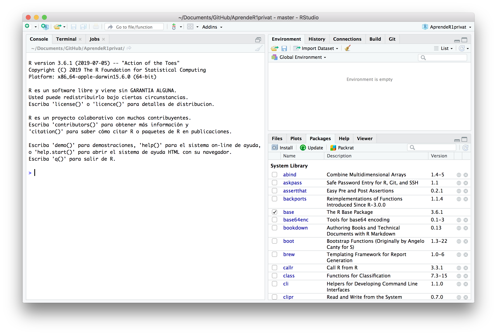
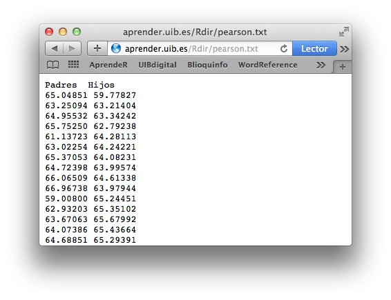
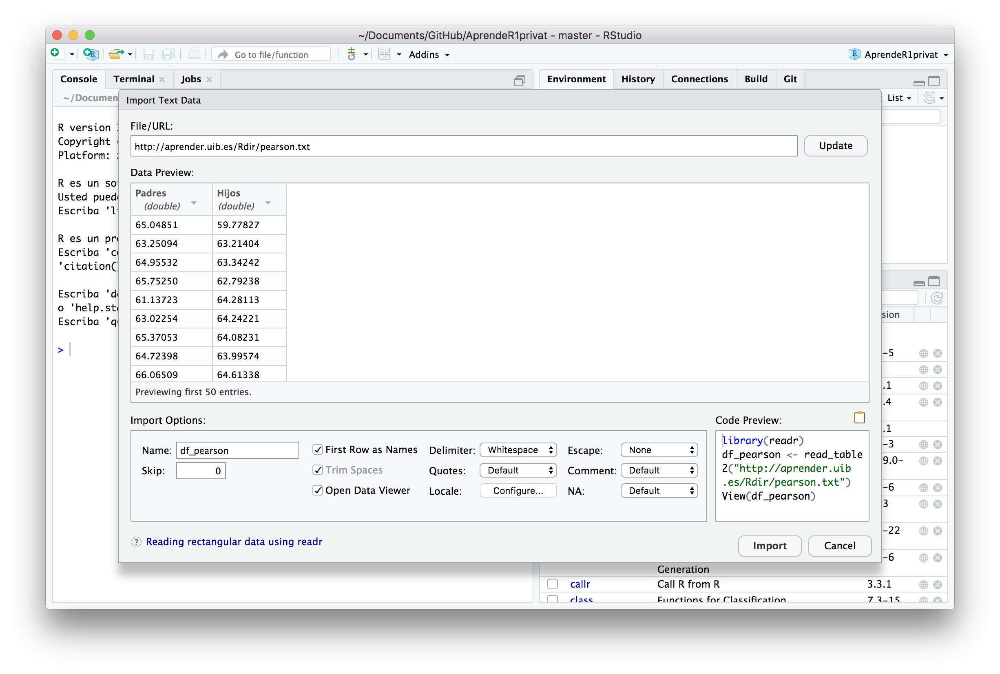
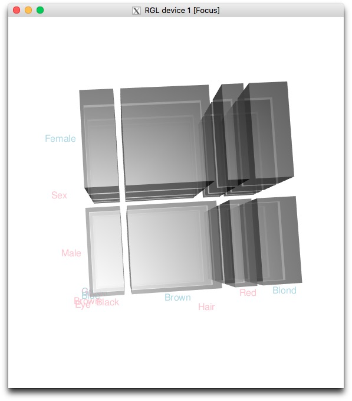
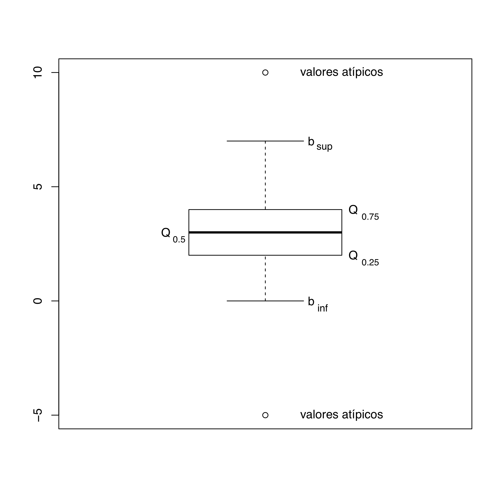

--- 
title: "AprendeR: Parte I"
author: "The UIB-AprendeR team"
date: "`r Sys.Date()`"
site: bookdown::bookdown_site
output: 
   bookdown::pdf_book: default
documentclass: book
#bibliography: [book.bib, packages.bib]
biblio-style: apalike
link-citations: yes
github-repo: AprendeR-UIB/AprendeR1
description: "Apuntes AprendeR bookdown::gitbook."
bookdown::pdf_book:
  includes:
    in_header: preamble.tex
---

```{r global_options, include=FALSE}
library(knitr)
#library(xtable)
#library(printr)
knitr::opts_chunk$set(
  fig.width=5, 
  fig.asp = 1,
  fig.align="center", 
  fig.show = "hold",
  echo=TRUE, 
  warning=FALSE, 
  message=FALSE
  #cache=TRUE
)
knitr::opts_knit$set(global.par=TRUE)
options(knitr.graphics.auto_pdf=TRUE)
```

```{r, include=FALSE}
par(cex.main=0.9,cex.axis=0.8,cex.lab=0.8)
```

\renewcommand{\leq}{\leqslant}
\renewcommand{\geq}{\geqslant}

# Presentación {-}

Edición preliminar en línea de la 1a parte del libro *AprendeR*, producido por un grupo de profesores del Departamento de Ciencias Matemáticas e Informática de la UIB.

El libro está escrito en *R Markdown*, usando *RStudio* como editor de texto y el paquete **bookdown** para convertir los ficheros *markdown* en un libro. 

Este trabajo se publica bajo licencia [Atribución-No Comercial-SinDerivadas 4.0](https://creativecommons.org/licenses/by-nc-nd/4.0/)


<!--chapter:end:index.Rmd-->

# (PART\*) Parte I: R básico {-}


# Logística de R {#chap:0}

R es un entorno de programación para el análisis estadístico y gráfico de datos muy popular, cada día más utilizado en empresas y universidades. Su uso  tiene muchas ventajas. Para empezar, es *software* libre. La elección de *software* libre es, en general, acertada por varios motivos. Por un lado,  transmite valores socialmente positivos, como por ejemplo la libertad individual, el conocimiento compartido, la solidaridad y la cooperación. Por otro, nos aproxima al método científico, porque permite el examen y mejora del código desarrollado por otros usuarios y la reproducibilidad de los resultados obtenidos. Finalmente, pero no menos importante desde un punto de vista práctico, podemos adquirir de manera legal y gratuita copias del programa, sin necesidad de licencias personales o académicas. 

Aparte de su faceta de *software* libre, R tiene algunas ventajas específicas: por ejemplo, su sintaxis básica es sencilla e intuitiva, con la que es muy fácil familiarizarse, lo que se traduce en un  aprendizaje  rápido y cómodo.  Además, tiene una enorme comunidad de usuarios, estructurada alrededor de  la *Comprehensive R Archive Network*, o  *CRAN*, que desarrolla cada día nuevos paquetes que extienden sus funcionalidades  y cubren casi todas las necesidades computacionales y estadísticas de un científico o ingeniero. Para que os hagáis una idea, en el momento de revisar estas notas (septiembre de 2019) el número de paquetes en el repositorio de la CRAN acaba de superar los 15000. 


## Cómo instalar R y *RStudio* 

 Instalar R es muy sencillo; de hecho, seguramente ya lo tenéis instalado en vuestro ordenador, pero es conveniente que dispongáis de su versión más reciente y que regularmente lo pongáis al día. Los pasos a realizar en  Windows o Mac OS X para instalar su última versión son los siguientes:

* Si sois usuarios de Windows, acceded a la página web de la  [*CRAN*](http://cran.r-project.org/) y pulsad sobre el enlace *Download R for Windows*. A continuación, entrad en el enlace *base*,  descargad R y seguid las instrucciones de instalación del  documento *Installation and other instructions* que encontraréis en esa  misma página. 

* Si sois usuarios de Mac OS X, acceded  a la página web de la  [*CRAN*](http://cran.r-project.org/) y pulsad sobre el enlace  *Download R for Mac OS X*. A continuación, descargad el fichero `.pkg`  correspondiente y, una vez descargado, abridlo y seguid las instrucciones del Asistente de Instalación.

* Si trabajáis con Ubuntu o Debian, para instalar  la última versión de R basta que ejecutéis en una terminal, estando conectados a Internet, la siguiente instrucción: 
```
sudo aptitude install r-base
```


Cuando instaláis R para Windows o Mac OS X, con él también se os instala una interfaz gráfica que se abrirá al abrir la aplicación y en la que podréis trabajar. La instalación para Linux no lleva una interfaz por defecto, así que sus usuarios  tienen que  trabajar con R en la terminal (ejecutando R para iniciar una sesión) o instalar aparte una interfaz.  Independientemente de todas estas posibilidades, en este curso usaremos  *RStudio* como interfaz gráfica de usuario de R para todos los sistemas operativos. 

Propiamente hablando, *RStudio* es mucho más que una interfaz de R: se trata de todo un entorno integrado para utilizar y programar con R, que dispone de un conjunto de herramientas que facilitan el trabajo con este lenguaje. Para instalarlo, se ha de descargar  del *url* [http://www.rstudio.com/products/rstudio/download/](http://www.rstudio.com/products/rstudio/download/) la versión correspondiente al sistema operativo en el que se trabaja; en cada caso, escoged la versión gratuita de *RStudio Desktop*. Una vez descargado, si usáis Windows o Mac OS X ya lo podéis abrir directamente. En el caso de Linux, hay que ejecutar en una terminal la siguiente instrucción para completar su instalación:
```
sudo dpkg -i rstudio-<version>-i386.deb
```
donde `version` refiere a la versión concreta que hayáis descargado.  Conviene  recordar que *RStudio* no es R, ni tan sólo lo contiene: hay que instalar ambos programas. De hecho, las instalaciones de R y *RStudio* son independientes una de la otra, de manera que cuando se pone al día uno de estos programas, no se modifica el otro.

```{r rstudio1, fig.cap='Ventana de RStudio para Mac OS X.', out.width='80%', fig.asp=.75, fig.align='center',echo=FALSE}

```

Cuando se abre *RStudio*, aparece una ventana similar a la que  muestra la Figura   \@ref(fig:rstudio1): su apariencia exacta dependerá del sistema operativo, de la versión de *RStudio* e incluso de los paquetes que estemos usando.  De momento, nos concentraremos en la ventana de la izquierda,  llamada la **consola**  de R (la pestaña *Console*). Observaréis que en el momento de abrir la aplicación, dicha ventana contiene una serie de información (versión, 
créditos etc.) y al final una línea en blanco encabezada por el símbolo `>`. Este símbolo es la **marca de inicio**  e indica que R espera que escribáis alguna instrucción y la  ejecutéis.

Durante la mayor parte de este curso, usaremos *RStudio*  de manera interactiva: 

1. Escribiremos  una instrucción en la consola, a la derecha de la  marca de inicio de su última línea.
2. La ejecutaremos pulsando la tecla *Entrar* ($\hookleftarrow$).
3. R la evaluará y, si corresponde,  escribirá el resultado en la línea siguiente de la consola (como veremos, no todas las instrucciones hacen que R  escriba algo).
4. R abrirá una nueva línea en blanco encabezada por una marca de inicio, donde esperará una nueva instrucción. 

Haced una prueba: escribid `1+1` junto a la marca de inicio y pulsad *Entrar*;  R escribirá en la línea siguiente el resultado de la suma, `2`, y a continuación una nueva línea en blanco encabezada por la marca de inicio.
Ya hablaremos  en la Lección \@ref(chap:vect) del `[1]` que os habrá aparecido delante del 2 en el resultado. Hasta entonces, no os preocupéis por él. En los bloques de código de este libro no incluimos la marca de inicio, para que podáis copiar tranquilamente el código y luego pegarlo y ejecutarlo en vuestra consola, y el resultado aparece precedido de `##`, para que si por descuido copiáis un resultado, no se ejecute:  el símbolo `#` sirve para indicar a R que  no ejecute lo que venga a continuación en la misma línea. Así, en este libro el cálculo anterior corresponde a:
```{r}
1+1
```

Para facilitarnos el trabajo, la consola dispone de un mecanismo  para acceder a las instrucciones ya ejecutadas y modificarlas si queremos. Si situamos el cursor a la derecha de la marca de inicio de la línea inferior y pulsamos la tecla de la flecha vertical ascendente $\uparrow$, iremos obteniendo de manera consecutiva, en esa línea,  las instrucciones escritas hasta el momento en la misma sesión; si nos pasamos, podemos usar la tecla $\downarrow$ para retroceder dentro de esta lista; una vez alcanzada la instrucción deseada, podemos volver a ejecutarla o, con las teclas de flechas horizontales, ir al lugar de la instrucción que queramos y  reescribir un trozo antes de ejecutarla. Otra posibilidad es usar la pestaña *History* de la ventana superior derecha de *RStudio*, que contiene la lista de  todas las instrucciones que se han ejecutado en la sesión actual. Si seleccionamos una instrucción de esta lista y pulsamos  el botón *To console* del menú superior de la pestaña, la instrucción se copiará en la consola y la podremos modificar o ejecutar directamente.

También podemos copiar instrucciones de otros ficheros y pegarlas a la derecha de la marca de inicio de la manera habitual en el sistema operativo de nuestro ordenador. Pero hay que ir con cuidado: las instrucciones copiadas de ficheros en formato que no sea  texto simple  pueden contener caracteres invisibles a simple vista que generen errores al intentar ejecutar la instrucción copiada. En particular, esto afecta a las instrucciones que podáis copiar de ficheros en formato PDF, procurad no hacerlo. En cambio, no hay ningún problema en copiar y pegar instrucciones de ficheros html como los de estas lecciones. 

Volvamos a la ventana de *RStudio* de la Figura \@ref(fig:rstudio1). Observaréis que está dividida a su vez en tres ventanas. La de la izquierda es la consola, donde trabajamos en modo interactivo. La ventana inferior derecha tiene algunas pestañas, entre las que destacamos:

* *Files*, que muestra el contenido de la carpeta de trabajo actual (véase la Sección \@ref(sec:guardar)). Al hacer clic sobre un fichero en esta lista, se abrirá en la ventana de ficheros (véase la Sección \@ref(sec:guiones)).
* *Plots*, que muestra los gráficos que hayamos producido durante la sesión. Se puede navegar entre ellos con las flechas de la barra superior de la pestaña.
* *Packages*, que muestra todos los paquetes  instalados y, marcados, los que están cargados en la sesión actual (véase la Sección \@ref(sec:paquetes)).
* *Help*, donde aparecerá la ayuda que pidamos (véase la Sección \@ref(sec:help)).

Por lo que se refiere a la ventana superior izquierda, destacamos las dos pestañas siguientes:

* *Environment*, con la lista de los objetos actualmente definidos (véase la Lección \@ref(chap:calc)).
* *History*, de la que ya hemos hablado, que contiene la lista  de todas las instrucciones que hayamos ejecutado durante la sesión.

Aparte de estas tres ventanas, *RStudio* dispone de una cuarta ventana para ficheros, que se abre en el sector superior izquierdo, sobre la consola (véase la Sección \@ref(sec:guiones)).

Para cerrar *RStudio*, basta  elegir *Quit RStudio*  del menú *RStudio*  o 
pulsar la combinación de teclas usual para cerrar un programa en vuestro sistema operativo.


## Cómo guardar el trabajo realizado {#sec:guardar}

 Antes de empezar a utilizar R  en serio, lo primero que tenéis que hacer es crear en vuestro ordenador una carpeta específica que será  vuestra **carpeta de trabajo**  con R. A continuación, en las *Preferencias*  de *RStudio*, que podréis abrir desde el menú  *RStudio*, tenéis que declarar esta carpeta como *Default working directory*. A partir de este momento, por defecto, todo el trabajo que realicéis quedará guardado dentro de esta carpeta, y  *RStudio* buscará dentro de esta carpeta todo lo que queráis que lea. 
Si en un momento determinado queréis cambiar temporalmente de carpeta de trabajo, tenéis dos opciones:

* Podéis usar el menú *Session* $\rightarrow$ *Set Working Directory* $\rightarrow$ *Choose Directory...* para escoger una carpeta. 

* Podéis abrir la pestaña *Files* de la ventana inferior derecha y navegar por el árbol de directorios  que aparece en su barra superior hasta llegar a la carpeta deseada.

Tanto de una manera como de la otra, la carpeta que especifiquéis será la carpeta de trabajo durante lo que queda de sesión o hasta que la volváis a cambiar.

En cualquier momento podéis guardar la sesión en la que estéis trabajando usando el menú *Session* $\rightarrow$ *Save Workspace as...*.
Además, si no habéis modificado esta opción en las *Preferencias*, cuando cerréis *RStudio* se os pedirá si queréis guardar la sesión; si contestáis que sí, *RStudio*  guardará en la carpeta de trabajo dos ficheros, `.RData` y `.RHistory`, que se cargarán automáticamente al volver a abrir *RStudio* y estaréis exactamente donde lo habíais dejado. Nuestro consejo es que digáis que no: normalmente, no os interesará arrastrar todo lo que hayáis hecho en sesiones anteriores. Y si queréis guardar algunas definiciones e instrucciones de una sesión, lo más práctico es guardarlas en un *guión* (véase la Sección \@ref(sec:guiones)).

Los gráficos que generéis con *RStudio* aparecerán en la ventana inferior derecha, en la pestaña *Plots* que se activa  automáticamente cuando se crea alguno. La apariencia del gráfico dependerá de las dimensiones de esta ventana, por lo que es conveniente que sea cuadrada si queréis que el gráfico no aparezca achatado o estirado. Si modificáis la forma de la ventana, las dimensiones del gráfico que aparezca en ella se modificarán de manera automática.

Para guardar un gráfico, hay que ir al menú *Export* de esta pestaña y seleccionar cómo queréis guardarlo: como una imagen en uno los formatos estándares de imágenes (.png, .jpeg, .tiff, etc.) o en formato PDF. Entonces, se abrirá una ventana donde podéis darle nombre, modificar sus dimensiones y especificar el directorio donde queráis que se guarde, entre otras opciones.


## Cómo trabajar con guiones y otros ficheros {#sec:guiones}

 R admite la posibilidad de crear y usar ficheros de instrucciones que se pueden ejecutar y guardar llamados **guiones**  (*scripts*). Estos guiones son una alternativa muy cómoda a las sesiones interactivas, porque permiten guardar las versiones finales de las instrucciones usadas, y no toda la sesión con pruebas, errores y resultados provisionales, y  facilitan la ejecución de secuencias de instrucciones en un solo paso. Además, un guión se puede guardar, volver a abrir más adelante, editar, etc.  Como ya hemos comentado, el símbolo `#` sirve para indicar a R que omita todo lo que hay a su derecha en la misma línea, lo que permite añadir comentarios a un guión.


Para crear un guión con *RStudio*, tenéis que ir al menú *File* $\rightarrow$ *New File* $\rightarrow$ *R Script*. Veréis que os aparece una ventana nueva  en el sector superior izquierdo de la ventana de *RStudio*, sobre la consola: la llamaremos **ventana de ficheros**. En ella podéis escribir, línea a línea, las instrucciones que queráis. Para ejecutar  instrucciones de esta ventana,  basta que las seleccionéis y pulséis el botón *Run* que aparece en la barra superior  de esta ventana.


Para guardar un guión, basta pulsar el botón con el icono de un disquete de ordenador que aparece en la barra superior de su ventana. Otra posibilidad es usar el menú *File* $\rightarrow$ *Save*, o pulsar la combinación de teclas usual para guardar un fichero en vuestro sistema operativo, siempre y cuando la **ventana activa**  de *RStudio* (donde esté activo el cursor en ese momento) sea la del guión. Al guardar un guión por primera vez,  se abre una ventana de diálogo donde *RStudio* espera que le demos un nombre; la costumbre es usar para los guiones la extensión `.R`.
 
Podéis abrir un guión ya preexistente con *RStudio*  usando el menú *File* $\rightarrow$ *Open File* de *RStudio* o pulsando sobre él en la pestaña *Files*. También podéis arrastrar el icono del guión sobre el de *RStudio* o (si habéis declarado que la aplicación por defecto para abrir ficheros con extensión  `.R` sea *RStudio*) simplemente abrir el fichero de la manera usual en vuestro sistema operativo.
 
Además de guiones, con *RStudio* también podemos crear otros tipos de ficheros que combinen instrucciones de R con instrucciones de otro lenguaje. En este curso lo usaremos para crear ficheros *R Markdown*, que permiten generar de manera muy cómoda informes y presentaciones que incorporen instrucciones de R (o sólo sus resultados). Para crear un fichero *R Markdown*, tenéis que ir al menú *File* $\rightarrow$ *New File* $\rightarrow$ *R Markdown...*, donde os aparecerá una ventana que os pedirá el tipo de documento (*Document*, *Presentation*...), su título  y el formato de salida.  Una vez completada esta información, se abrirá el fichero en la ventana superior izquierda. 

Por poner un ejemplo, supongamos que habéis elegido realizar un informe (*Document*) con formato de salida html (los formatos posibles son: PDF, HTML o Word); entonces, para  generar un informe básico  basta sustituir las palabras clave que  ha generado *RStudio* en esta ventana. Probadlo: cambiad el título y el texto; a continuación, guardad el fichero con el nombre que queráis y extensión `.Rmd`, y pulsad el botón *Knit* situado en la barra superior de la ventana; se generará un fichero HTML en la carpeta de trabajo, con el texto del fichero *R Markdown* y el mismo título cambiando la extensión  `.Rmd` por  `.html`, y se abrirá en una ventana aparte.

Aprender los primeros pasos de   *R Markdown* es sencillo. Para ello, podéis consultar el manual de referencia rápida de  *R Markdown*  que encontraréis en el menú *Help* de *RStudio*, que para la mayoría de ejercicios de este curso es más que suficiente.
También os puede ser útiles  las "chuletas"  de  *R Markdown*   siguientes:

* [https://www.rstudio.com/wp-content/uploads/2015/03/rmarkdown-reference.pdf](https://www.rstudio.com/wp-content/uploads/2015/03/rmarkdown-reference.pdf)

* [https://github.com/rstudio/cheatsheets/raw/master/rmarkdown-2.0.pdf](https://github.com/rstudio/cheatsheets/raw/master/rmarkdown-2.0.pdf) 

* [https://www.rstudio.com/wp-content/uploads/2015/02/rmarkdown-cheatsheet.pdf](https://www.rstudio.com/wp-content/uploads/2015/02/rmarkdown-cheatsheet.pdf)

En la Lección \@ref(chap:Rmd)  explicamos algunas técnicas para mejorar los ficheros resultantes.


## Cómo obtener ayuda {#sec:help}

Para conocer toda la información (qué hace, cuál es la sintaxis correcta, qué parámetros tiene, algunos ejemplos de uso...) sobre una función o un objeto, se puede usar el campo de búsqueda, marcado con una lupa, en la esquina superior derecha de la pestaña de **Ayuda** (*Help*), situada en la ventana inferior derecha de *RStudio*. Como alternativa, se pueden usar las instrucciones

```{r,eval=FALSE}
help(nombre del objeto)
```
o, equivalentemente, 
```{r,eval=FALSE}
?nombre del objeto
```


Por ejemplo, si entramos  en el campo de búsqueda de la pestaña de Ayuda la palabra `sum`, o si **entramos** en la consola (es decir, si escribimos a la derecha de la marca de inicio y a continuación pulsamos la tecla *Entrar*)    la instrucción

```{r,eval=FALSE}
help(sum)
```
 obtenemos en la pestaña de Ayuda toda la información sobre la función `sum`.

Cuando hayamos avanzado un poco en este curso, la Ayuda os será muy útil.  Aquí sólo veremos alguna aplicación simple de la mayoría de las funciones que estudiemos, con los parámetros más importantes y suficientes para nuestros propósitos, y necesitaréis consultar su Ayuda para conocer todos sus usos, todos sus parámetros u otra información relevante. 

Si queremos pedir ayuda sobre un tema concreto, pero no sabemos el nombre exacto de la función, podemos entrar una palabra clave en el campo de búsqueda de la  pestaña de Ayuda, o usar la función 
```{r,eval=FALSE}
help.search("palabra clave")
```
o, equivalentemente, 
```{r,eval=FALSE}
??"palabra clave"
```
(las comillas ahora son obligatorias). De esta manera, conseguiremos en la ventana de Ayuda una lista de las funciones que R entiende que están relacionadas con la palabra clave entrada. Entonces, pulsando en la función que nos interese de esta lista, aparecerá la información específica sobre ella.
Como podéis imaginar, conviene que la palabra clave esté en inglés.

Además de la ayuda que incorpora el mismo R, siempre podéis acudir a foros y listas de discusión para encontrar ayuda sobre cualquier duda que podáis tener. Algunos recursos que nosotros encontramos especialmente útiles son los siguientes:

* La sección dedicada a R del foro [*stackoverflow*](http://stackoverflow.com/questions/tagged/r) 
* El archivo de la lista de discusión  [*R-help*](http://r.789695.n4.nabble.com/r-help-f789696.html) 
* El grupo de Facebook [*R project en español*](https://www.facebook.com/groups/rprojectsp) 

Si tenéis alguna dificultad, es muy probable que alguien ya la haya tenido y se la hayan  resuelto en alguno de estos foros. 

Existe también una comunidad muy activa de usuarios hispanos de R, en cuyo [portal web](http://r-es.org/Comunidad) encontraréis muchos recursos útiles para mejorar vuestro conocimiento de este lenguaje.


## Cómo instalar y cargar paquetes {#sec:paquetes}

Muchas funciones y tablas de datos útiles no vienen con la instalación básica de R, sino que forman parte de **paquetes** (*packages*), que se tienen que instalar y cargar para poderlos usar. Por citar un par de ejemplos, el paquete **magic** lleva una función `magic` que crea **cuadrados mágicos** (tablas cuadradas de números naturales diferentes dos a dos tales que las sumas de todas sus columnas,  de todas sus filas y  de sus dos diagonales principales valgan todas lo mismo), y para usarla tenemos que instalar y cargar este paquete. De manera similar,  el paquete **ggplot2** incorpora una serie  de funciones para dibujar gráficos avanzados que no podemos usar si primero no instalamos y cargamos este paquete.

Podemos consultar en la pestaña  *Packages*  la lista de paquetes que tenemos instalados. Los paquetes que aparecen marcados en esta lista son los que  tenemos  cargados en la sesión actual. Si queremos cargar un paquete ya instalado, basta marcarlo en esta lista; podemos hacerlo también desde la consola, con la instrucción 
```{r, eval=FALSE}
library(nombre del paquete)
```

En caso de necesitar un paquete que no tengamos instalado, hay que instalarlo antes de poderlo cargar. La mayoría de los paquetes se pueden instalar desde el repositorio del CRAN; esto se puede hacer de dos maneras:

* Desde la consola, entrando la instrucción 
```{r, eval=FALSE}
install.packages("nombre del paquete", dep=TRUE)
```
(las comillas son obligatorias, y fijaos en el plural de `packages` aunque sólo queráis instalar uno). El parámetro `dep=TRUE` hace que R instale no sólo el paquete requerido, sino todos aquellos de los que dependa para funcionar correctamente. 

* Pulsando el botón *Install* de la barra superior de la pestaña de paquetes; al hacerlo, *RStudio* abre una ventana dónde se nos pide el nombre del paquete a instalar. Conviene dejar marcada la opción *Install dependencies*, para que se instalen también los paquetes necesarios para su funcionamiento.

Así, supongamos que queremos construir cuadrados mágicos, pero aún no hemos cargado el paquete `magic`.

```{r, error=TRUE}
magic(10)
```

Así que instalamos y cargamos dicho paquete (también lo podríamos hacer desde la ventana *Packages*):
```{r,eval=FALSE}
install.packages("magic", dep=TRUE)
library(magic)
```

```{r,include=FALSE}
library(magic)
```

Ahora ya podemos usar la función `magic`:

```{r}
magic(10)
```

Cuando cerramos *RStudio*, los paquetes instalados en la sesión siguen instalados, pero los cargados se pierden; por lo tanto, si queremos volver a usarlos en otra sesión, tendremos que volver a cargarlos.

Hay paquetes que no se encuentran en el CRAN y que, por lo tanto, no se pueden instalar de la forma que hemos visto. Cuando sea necesario, ya explicaremos la manera de instalarlos y cargarlos en cada caso. 

Para terminar, observad que a la derecha del nombre de cada paquete en la pestaña *Packages* aparecen dos símbolos. Al pulsar el primero, seis puntitos, se abrirá en el navegador la página de información del paquete, y al pulsar el segundo, una crucecita, desinstalamos el paquete. Asimismo, en la barra superior de la pestaña *Packages* encontraréis un botón *Update* que sirve para poner al día  los paquetes instalados, obteniendo sus últimas versiones publicadas.

## Guía rápida

* `help` o `?` permiten pedir información sobre una función. También se puede usar el campo de búsqueda de la pestaña *Help* en la ventana inferior derecha de *RStudio*.
* `help.search` o `??` permiten pedir información sobre una palabra clave (entrada entre comillas). De nuevo, también se puede usar el campo de búsqueda de la pestaña *Help* en la ventana inferior derecha de *RStudio*.
* `install.packages("paquete", dep=TRUE)` instala el `paquete` y todos los otros paquetes de los que dependa. También se puede usar el botón *Install* de la pestaña *Packages* en la ventana inferior derecha de *RStudio*.
* `library(paquete)` carga el `paquete`. También se puede cargar marcándolo en la ventana *Packages*  de *RStudio*.

<!--chapter:end:01chap00_Logistica_de_R.Rmd-->

# La calculadora {#chap:calc}

 Cuando se trabaja en modo interactivo en la consola de R, hay que escribir las instrucciones a la derecha de la marca de inicio `>` de la línea inferior (que omitimos en los bloques de código de este libro). 
Para evaluar una instrucción al terminar de escribirla, se tiene que pulsar la tecla *Entrar* ($\hookleftarrow$); así, por ejemplo, si junto a la marca de inicio escribimos 2+3 y pulsamos  *Entrar*, R escribirá en la línea siguiente el resultado, 5, y a continuación una nueva línea en blanco encabezada por la marca de inicio, donde podremos continuar entrando instrucciones.

```{r}
2+3 #Y ahora aquí pulsamos Entrar
```


Bueno, hemos hecho trampa. Como ya habíamos comentado en la lección anterior, se pueden escribir comentarios: R ignora  todo lo que se escribe en la línea después de un signo `#`. También podéis observar que R ha dado el resultado en una línea que empieza con `[1]`; ya discutiremos en la Lección \@ref(chap:vect) qué significa este `[1]`. 


Si la expresión que entramos no está completa, R no la evaluará y en la línea siguiente esperará a que la acabemos, indicándolo con la **marca de continuación**, por defecto un signo +. (En estas notas, y excepto en el  ejemplo que damos a continuación, no mostraremos este signo + para no confundirlo con una suma.)  Además, si cometemos algún error de sintaxis, R nos avisará con un mensaje de error.


```{r, eval=FALSE,error=TRUE}
2*(3+5 #Pulsamos Entrar, pero no hemos acabado
+ ) #ahora sí
```

```{r,echo=FALSE}
2*(3+5)
```

```{r,error=TRUE}
2*3+5)
```

Como podemos ver, al ejecutar la segunda instrucción, R nos  avisa de que el paréntesis  no está en su sitio.

Se puede agrupar más de una instrucción en una sola línea separándolas con signos de punto y coma. Al pulsar la tecla *Entrar*, R las ejecutará todas, una tras otra y en el orden en el que las hayamos escrito. 

```{r}
2+3; 2+4; 2+5
```

## Números reales: operaciones y funciones básicas

 La separación entre la parte entera y la parte decimal en  los números reales se indica con un punto, no con una coma. Por consistencia, en el texto también seguiremos el convenio angloamericano de usar un punto en lugar de una coma como separador decimal.


```{r,error=TRUE}
2+2,5
```

```{r}
2+2.5
```

Las operaciones usuales se indican en R con los signos que damos en la lista siguiente.
Por lo que se refiere a los dos últimos operadores en esta lista, recordad que si $a$ y $b$ son dos números  reales, con $b>0$, la **división entera**  de $a$ por $b$ da como **cociente entero** el mayor número entero $q$ tal que $q\cdot b\leq a$, y como **resto**
la diferencia $a-q\cdot b$. Por ejemplo, la división entera de 29.5 entre 6.3 es 29.5=4·6.3+4.3, con cociente entero 4 y resto 4.3. (Cuando $b<0$, R da como cociente entero el menor número entero $q$ tal que $q\cdot b\geq a$, y como resto  la diferencia $a-q\cdot b$, que en este caso es negativa.)

* **Suma**: `+`
* **Resta**: -
* **Multiplicación**: `*`
* **División**: `/` 
* **Potencia**: `^`
* **Cociente entero**: `%/%`
* **Resto de la división entera**: `%%`

<!--
\begin{table}[htb]
\abovecaptionskip=-1ex
\begin{center}
\begin{tabular}{|c|c|c|c|c|c|c|c|}
\hline
Operación\vphantom{$\Big($} & Suma & Resta & Multiplicación & División & Potencia & Cociente & Resto \\[-1ex] 
& & & & & & entero & div. entera\\\hline
Signo\vphantom{$\Big($} & `+` & `-` & `*` & `/` & `\^{`}  &\quad `\%/\%` & \qquad `\%\%` \\ \hline
\end{tabular}
\end{center}
\caption{Signos de operaciones aritméticas.}\label{tab:ops}
\end{table}
-->


A continuación, damos algunos ejemplos de manejo de estas operaciones. Observad el uso natural de los paréntesis para indicar la precedencia de las operaciones.

```{r}
2*3+5/2
2*(3+5/2) #Aquí lo único que dividimos entre 2 es 5
2*((3+5)/2)
2/3+4 #Aquí el denominador de la fracción es 3
2/(3+4)
2^3*5 #Aquí el exponente es 3
2^(3*5)
2^-5  #En este caso no hacen falta paréntesis...
2^(-5) #Pero queda más claro si se usan
534%/%7 #¿Cuántas semanas completas caben en 534 días?
534%%7 #¿Y cuántos días sobran? 
534-76*7
```

El objeto `pi` representa el número real $\pi$.

```{r}
pi
```

¡Cuidado! No  podemos omitir el signo `*` en las  multiplicaciones.

```{r,error=TRUE}
2(3+5)
```

```{r}
2*(3+5)
```

```{r,error=TRUE}
2pi
```

```{r}
2*pi
```

Cuando un número es muy grande o muy pequeño, R emplea la llamada `notación científica` para dar una aproximación.

```{r}
2^40
2^(-20)
```

En este ejemplo, `1.099512e+12` representa el número 1.099512·10^12^, es decir, 1099512000000, y `9.536743e-07` representa el número 9.536743· 10^-7^, es decir,
0.0000009536743. Como muestra el ejemplo siguiente, no es necesario que un número sea  especialmente grande o pequeño
para que R lo escriba en notación científica: basta que esté rodeado de otros números en esa notación.


```{r}
c(2^40,2^(-20),17/3) #La función c sirve para definir vectores
```

Este  `5.666667e+00`  representa el número 5.666667·10^0^, es decir, 
5.666667. 

R dispone, entre muchas otras, de las funciones numéricas de la lista siguiente:

* **Valor absoluto**, $|x|$: `abs(x)`

* **Raíz cuadrada**, $\sqrt(x)$: `sqrt(x)`

* **Exponencial**, $e^x$: `exp(x)`

* **Logaritmo neperiano**, $\ln(x)$: `log(x)`

* **Logaritmo decimal**, $\log_{10}(x)$: `log10(x)`

* **Logaritmo binario**, $\log_2(x)$: `log2(x)`

* **Logaritmo en base $a$**, $\log_a(x)$: `log(x,a)`

* **Factorial**, $n!$: `factorial(n)`

* **Número combinatorio**, $\binom{n}{m}$: `choose(n,m)`

* **Seno**, $\sin(x)$: `sin(x)`

* **Coseno**, $\cos(x)$: `cos(x)`

* **Tangente**, $\tan(x)$: `tan(x)`

* **Arcoseno**, $\arcsin(x)$: `asin(x)`

* **Arcocoseno**, $\arccos(x)$: `acos(x)`

* **Arcotangente**, $\arctan(x)$: `atan(x)`


Recordad que el **valor absoluto**  $|x|$ de un número $x$ se obtiene tomando $x$ sin signo: $|-8|=|8|=8$. Recordad también que el **factorial** $n!$ de $n$, es el producto
$$
n!=n\cdot (n-1)\cdot (n-2) \cdots 3\cdot 2 \cdot 1
$$
(con el convenio de que $0!=1$), y es igual al número de maneras posibles de ordenar una lista de $n$ objetos diferentes (su número de **permutaciones**),
y que el **número combinatorio**  $\binom{n}{m}$, con $m\leq n$, es
$$
\binom{n}{m}=\frac{n!}{m!\cdot (n-m)!}=\frac{n(n-1)(n-2)\cdots (n-m+1)}{m(m-1)(m-2)\cdots 2\cdot 1},
$$
y es igual al número de maneras posibles de escoger un subconjunto de $m$ elementos de un conjunto de $n$ objetos diferentes. 


<!--
|Función  | $\sqrt{x}$ | $e^x$ | $\ln(x)$ | $\log_{10}(x)$ | $\log_a(x)$ | $n!$ | $\binom{n}{m}$|
|---:|---:|---:|---:|---:|---:|---:|---:|  
**Signo** | sqrt | exp | log | log10 | log( , a) |`factorial`|`choose`|

|Función | $\sin(x)$ | $\cos(x)$ | $\tan(x)$ | $\arcsin(x)$ | $\mathrm{arccos}(x)$ | $\arctan(x)$ | `|`$x$`|` |
|---:|---:|---:|---:|---:|---:|---:|---:|  
**Signo** | `sin` | `cos`|`tan`|`asin`|`acos`| `atan`|`abs`|
-->


<!--
```
Signo & `sqrt`\vphantom{$\Big($} & `exp` & `log` & `log10` & `log( , a)` & `factorial` & `choose`\\ \hline\hline
Función &$\sin(x)$\vphantom{$\Big($} & $\cos(x)$ & $\tan(x)$ & $\arcsin(x)$ & $\mathrm{arccos}(x)$ & $\arctan(x)$ & $|x|$ \\ \hline
Signo & `sin`\vphantom{$\Big($} & `cos` & `tan` & `asin` & `acos`& `atan` & `abs`\\ \hline

```

```{r fun,}

#\caption{Funciones numéricas.}\label{tab:fun}

```
-->


<!--
\begin{table}[htb]
\abovecaptionskip=-1ex
\begin{center}
\begin{tabular}{|c|c|c|c|c|c|c|c|}
\hline
Función & $\sqrt{x}$ \vphantom{$\Big($} & $e^x$ & $\ln(x)$ & $\log_{10}(x)$ & $\log_a(x)$ & $n!$ & $\binom{n}{m}$\\ \hline
Signo & `sqrt`\vphantom{$\Big($} & `exp` & `log` & `log10` & `log( , a)` & `factorial` & `choose`\\ \hline\hline
Función &$\sin(x)$\vphantom{$\Big($} & $\cos(x)$ & $\tan(x)$ & $\arcsin(x)$ & $\mathrm{arccos}(x)$ & $\arctan(x)$ & $|x|$ \\ \hline
Signo & `sin`\vphantom{$\Big($} & `cos` & `tan` & `asin` & `acos`& `atan` & `abs`\\ \hline
\end{tabular}
\end{center}
\caption{Funciones numéricas.}\label{tab:fun}
\end{table}
-->


Las funciones de R se aplican a sus argumentos introduciéndolos siempre entre paréntesis. Si la función se tiene que aplicar a más de un argumento, éstos se tienen que especificar en el orden que toque y separándolos mediante comas; R no tiene en cuenta los espacios en blanco alrededor de las comas. Veamos algunos ejemplos:

```{r}
sqrt(4)
sqrt(8)-8^(1/2)
log10(8)
log(8)/log(10)
7^log(2,7) #7 elevado al logaritmo en base 7 de 2 es 2
```

```{r,error=TRUE}
10! #R no entiende esta expresión
```

```{r}
factorial(10)
exp(sqrt(8))
choose(5,3)  #Núm. de subconjuntos de 3 elementos de un conjunto de 5 
choose(3,5)  #Núm. de subconjuntos de 5 elementos de un conjunto de 3
```

R entiende que los argumentos de las funciones `sin`, `cos` y `tan` están en radianes. Si queremos aplicar una de estas funciones a un número de grados, podemos traducir los grados a radianes multiplicándolos por $\pi/180$.
De manera similar, los resultados de `asin`, `acos` y `atan` también están en radianes, y se pueden traducir a grados 
multiplicándolos por $180/\pi$.

```{r}
cos(60) #Coseno de 60 radianes
cos(60*pi/180) #Coseno de 60 grados
acos(0.5)  #Arcocoseno de 0.5 en radianes
acos(0.5)*180/pi #Arcocoseno de 0.5 en grados
acos(2) 
```

Este último `NaN` (acrónimo de `Not a Number`) significa que el resultado no existe; en efecto, $\mathrm{arccos}(2)$ no existe como número real, ya que $\cos(x)$ siempre pertenece al intervalo $[-1,1]$.

Ya hemos visto que R dispone del signo `pi` para representar el número real $\pi$. En cambio, 
no tiene ningún signo para indicar la constante de Euler $e$, y hay que emplear `exp(1)`.

```{r}
2*exp(1) #2·e
exp(pi)-pi^exp(1) #e^pi-pi^e
```


Para terminar esta sección, observad el resultado siguiente:

```{r}
sqrt(2)^2-2
```

R opera numéricamente con $\sqrt{2}$, no formalmente,
y por eso no  da como resultado de $(\sqrt{2})^2-2$ el valor 0 exacto, sino
el número pequeñísimo 4.440892·10^-16^; de hecho, R trabaja internamente con una precisión de aproximadamente 16 cifras decimales, por lo que no siempre podemos esperar resultados exactos. Si necesitáis trabajar de manera exacta con más cifras significativas, os recomendamos usar las funciones del paquete **Rmpfr**. 


## Cifras significativas y redondeos

En cada momento, R decide cuántas cifras muestra de un número según el contexto. También podemos especificar este número de cifras para toda una sesión, entrándolo en lugar de los puntos suspensivos en `options(digits=...)`. Hay que tener presente que ejecutar esta instrucción no cambiará la precisión de los cálculos, sólo cómo se muestran los resultados. 

Si queremos conocer una cantidad específica *n* de cifras significativas de un número *x*, podemos emplear la función 
```{r,eval=FALSE}
print(x, n)
```
Observad su efecto:
```{r}
sqrt(2)
print(sqrt(2), 20)
print(sqrt(2), 2)
2^100
print(2^100, 15)
print(2^100, 5)
```


El número máximo de cifras que podemos pedir con `print` es 22; si pedimos más, R nos dará un mensaje de error.

```{r}
print(sqrt(2), 22)
```

```{r,error=TRUE}
print(sqrt(2), 23)
```


Por otro lado, hay que tener en cuenta que, como ya hemos comentado, R trabaja con una precisión de unas 16 cifras decimales y por lo tanto los dígitos más allá de esta precisión pueden ser incorrectos. Por ejemplo, si le pedimos las 22 primeras cifras de $\pi$, obtenemos el resultado siguiente:

```{r}
print(pi, 22)
```
En cambio, $\pi$ vale  en realidad 3.141592653589793***238462...***, lo que significa que el valor que  da R es erróneo a partir de la decimosexta cifra decimal.

La función `print`  permite indicar las cifras que queremos *leer*, pero no sirve para especificar las cifras decimales con las que queremos *trabajar*.
Para *redondear*un número $x$ a una cantidad específica *n* de cifras decimales, y trabajar solamente con esas cifras, hay que usar la función
```{r,eval=FALSE}
round(x, n)
```

La diferencia entre los efectos de `print` y `round` consiste en que `print(sqrt(2), 4)` es igual a $\sqrt{2}$, pero  R sólo muestra sus primeras 4 cifras, 1.414, mientras que  `round(sqrt(2), 3)` *es igual a*  1.414.  Veamos algunos ejemplos

```{r}
print(sqrt(2), 4)
print(sqrt(2), 4)^2
1.414^2
round(sqrt(2), 3)
round(sqrt(2), 3)^2
```


En caso de empate, R redondea al valor que termina en cifra par, siguiendo la regla de redondeo en caso de empate recomendada por el estándar IEEE 754 para aritmética en coma flotante.

```{r}
round(2.25, 1)
round(2.35, 1)  
```

¿Qué pasa si no se indica el número de cifras en el argumento de `round`?

```{r}
round(sqrt(2)) 
round(sqrt(2), 0) 
```

Al entrar `round(sqrt(2))`, R ha entendido que el número de cifras decimales al que queríamos redondear era 0. Esto significa que 0 es el **valor por defecto**  de este parámetro. No es necesario especificar los valores por defecto de los parámetros de una función, y para saber cuáles son, hay que consultar su Ayuda. Así, por ejemplo, la Ayuda de `round`  indica que su sintaxis es
```{r,eval=FALSE}
round(x, digits=0)
```
donde  el valor de `digits` ha de ser un número entero que indique el número de cifras decimales. Esta sintaxis significa que el valor por defecto del parámetro `digits` es  0. 

Escribir `digits=` en el argumento para especificar el número de cifras decimales es optativo, siempre que mantengamos el orden de los argumentos indicado en la Ayuda: en este caso, primero el número y luego las cifras. Este es el motivo  por el que podemos escribir 
`round(sqrt(2), 1)` en lugar de `round(sqrt(2), digits=1)`. Si cambiamos el orden de los argumentos, entonces sí que hay que especificar el nombre del parámetro, como muestra el siguiente ejemplo:

```{r}
round(digits=3, sqrt(2))
round(3, sqrt(2))
```


En la lista de funciones ya vimos una función de dos argumentos que toma uno por defecto: `log`. Su sintaxis completa es `log(x, base=...)`, y si no especificamos la `base`, toma su valor por defecto, $e$, y calcula el logaritmo neperiano.


La función `round(x)` redondea $x$ al valor entero más cercano (y en caso de empate, al que termina en cifra par). R también dispone de otras funciones que permiten redondear a números enteros en otros sentidos específicos:

* `floor(x)` redondea $x$ a un número entero **por defecto**, dando el mayor número entero menor o igual que $x$, que denotamos por $\lfloor x\rfloor$.

* `ceiling(x)` redondea $x$ a un número entero **por exceso**, dando el menor número entero mayor o igual que $x$, que denotamos por $\lceil x\rceil$.

* `trunc(x)` da la **parte entera** de $x$, eliminando la parte decimal: es lo que se llama **truncar** $x$ a un entero.


```{r}
floor(8.3) #El mayor entero menor o igual que 8.3
ceiling(8.3) #El menor entero mayor o igual que 8.3
trunc(8.3) #La parte entera de 8.3
round(8.3) #El entero más cercano a 8.3
floor(-3.7) #El mayor entero menor o igual que -3.7
ceiling(-3.7) #El menor entero mayor o igual que -3.7
trunc(-3.7) #La parte entera de -3.7
round(-3.7) #El entero más cercano a -3.7
```

## Definición de variables

 R funciona mediante **objetos**, estructuras de diferentes tipos que sirven para realizar diferentes tareas. Una **variable**  es un tipo de objeto que sirve para guardar datos. 
Por ejemplo, si queremos crear una variable `x` que  contenga el valor $\pi^2$, podemos escribir:

```{r}
x=pi^2
```


Al entrar esta instrucción, R creará el objeto `x` y le asignará el valor que hemos especificado.
En general, se puede crear una variable y asignarle un valor, o asignar un nuevo valor a una variable definida anteriormente, mediante
la construcción 
```{r, eval=FALSE}
nombre_de_la_variable=valor
```


También se puede conectar el nombre de la variable con el valor por medio de una flecha `->` o `<-`, compuesta de un guión y un signo de desigualdad, de manera que el sentido de la flecha vaya del valor a la variable; por ejemplo, las tres primeras instrucciones siguientes son equivalentes, y asignan el valor 2 a la variable $x$, mientras que las dos últimas son incorrectas:

```{r}
x=2
x<-2
2->x
```

```{r,error=TRUE}
2=x
```

```{r,error=TRUE}
2<-x
```

Nosotros usaremos sistemáticamente el signo `=` para hacer asignaciones. 

Se puede usar como nombre de una variable cualquier palabra que combine letras mayúsculas y minúsculas (R las distingue), con acentos o sin (aunque os recomendamos que no uséis letras acentuadas, ya que se pueden importar mal de un ordenador a otro), dígitos (0,..., 9), puntos `.` y  guiones bajos `_`, siempre que empiece con una letra o un punto. Aunque no esté prohibido, es  muy mala idea redefinir  nombres que ya sepáis que tienen significado para R, como por ejemplo `pi` o `sqrt`.  

Como podéis ver en las instrucciones anteriores y en las que siguen, cuando asignamos un valor a una variable, R no da ningún resultado; después podemos usar el nombre de la variable para referirnos al valor que representa. 
Es posible asignar varios valores a una misma variable en una misma sesión: naturalmente, en cada momento R empleará el último valor asignado. Incluso se puede redefinir el valor de una variable usando en la nueva definición su valor actual.

```{r}
x=5
x^2
x=x-2 #Redefinimos x como su valor actual menos 2
x
x^2
x=sqrt(x) #Redefinimos x como la raíz cuadrada de su valor actual
x
```


## Definición de funciones

 A menudo querremos definir alguna función. Para ello tenemos que usar, en vez de simplemente `=`, una construcción especial: 
 
```{r, eval=FALSE}
nombre_de_la_función=function(variables){definición}
```
Una vez definida una función, la podemos aplicar a valores de la variable o variables. 

Veamos un ejemplo. Vamos a llamar $f$ a la función $x^2-2^x$, usando $x$ como variable, y a continuación la aplicamos a $x=30$:
```{r}
f=function(x){x^2-2^x}
f(30)
```


Conviene que os acostumbréis a escribir la fórmula que define la función entre llaves `{...}`. A veces es necesario y a veces no, pero no vale la pena discutir cuándo.

El nombre de la variable se indica dentro de los paréntesis que siguen al `function`. En el ejemplo anterior, la variable era $x$, y por eso hemos escrito `=function(x)`. Si hubiéramos querido definir la función con  variable $t$, habríamos usado `=function(t)` (y, naturalmente, habríamos escrito la fórmula que define la función con la variable $t$):

```{r}
f=function(t){t^2-2^t}
```

Se pueden definir funciones de dos o más variables con  `function`, declarándolas todas. Por ejemplo, para definir la función $f(x,y)=e^{(2x-y)^2}$, tenemos que entrar

```{r}
f=function(x, y){exp((2*x-y)^2)}
```
y ahora ya podemos aplicar esta función a pares de valores:

```{r}
f(0, 1)
f(1, 0)
```


Las funciones no tienen por qué tener como argumentos o resultados sólo números reales: pueden involucrar vectores, matrices, tablas de datos, etc.
Y se pueden definir por medio de secuencias de instrucciones, no sólo mediante fórmulas numéricas directas; en este caso,
hay que separar las diferentes instrucciones con signos de punto y coma o escribir cada instrucción en una nueva línea.
Ya iremos viendo ejemplos a medida que avance el curso.

En cada momento  se pueden saber los objetos (por ejemplo, variables y funciones)  que se han definido en la sesión hasta ese momento entrando 
la instrucción `ls()` o consultando la pestaña *Environment*.
Para borrar la definición de un objeto, hay que aplicarle la función `rm`.
Si se quiere hacer limpieza y borrar  de golpe las definiciones de todos los objetos que se han definido hasta el momento,
se puede emplear la instrucción `rm(list=ls())` o usar el botón con el icono de la escoba de la barra superior de la pestaña  *Environment*.

```{r}
rm(list=ls())    #Borramos todas las definiciones
f=function(t){t^2-2^t}
a=1
a
ls()
rm(a)
ls()
```

```{r,error=TRUE}
a
```


## Números complejos (opcional)

 Hasta aquí, hemos operado con números reales. Con R también podemos operar con números complejos. Los signos para las operaciones son los mismos que en el caso real.

```{r}
(2+5i)*3
(2+5i)*(3+7i)
(2+5i)/(3+7i)
```


Fijaos en que cuando entramos en R un número complejo escrito en forma binomial $a+bi$, *no* escribimos un `*` entre la `i` y su coeficiente; de hecho, *no hay que escribirlo* :

```{r,error=TRUE}
2+5*i
```
Por otro lado, si el coeficiente de $i$ es 1 o -1, hay que escribir el 1: por ejemplo, $3-i$ se tiene que escribir `3-1i`. Si no lo hacemos, R da un mensaje de error.

```{r,error=TRUE}
(3+i)*(2-i)
```

```{r}
(3+1i)*(2-1i)
```


Los  complejos que tienen como parte imaginaria un número entero o un racional escrito en forma decimal se pueden entrar directamente en forma binomial, como lo hemos hecho hasta ahora. Para definir números complejos más... complejos, se puede usar la función 
```{r,eval=FALSE}
complex(real=..., imaginary=...)
```


Veamos un ejemplo:

```{r}
1+2/3i #Esto en realidad es 1 más 2 partido por 3i
```

```{r,error=TRUE}
1+(2/3)i  
```

```{r}
complex(real=1, imaginary=2/3)
```

```{r,error=TRUE}
z=1+sqrt(2)i
```

```{r}
z=complex(real=1, imaginary=sqrt(2))
z
```


Como sabéis, los números complejos se inventaron para poder trabajar con raíces cuadradas de números negativos. Ahora bien, por defecto, cuando calculamos la raíz cuadrada de un número negativo R no devuelve un número complejo, sino que se limita a avisarnos de que no existe.

```{r,error=TRUE,warning=TRUE}
sqrt(-3)
```
Si queremos que R produzca un número complejo al calcular la raíz cuadrada de un número negativo, tenemos que especificar que este número negativo es un número complejo. La mejor manera de hacerlo es declarándolo como  complejo aplicándole la función `as.complex`

```{r}
sqrt(as.complex(-3))
```


La mayoría de las funciones que hemos dado para los números reales admiten extensiones para números complejos, y con R se calculan con la misma función. Ahora no entraremos a explicar cómo se definen estas extensiones, sólo lo comentamos por si sabéis qué hacen y os interesa calcularlas.

```{r}
sqrt(2+3i)
exp(2+3i)
sin(2+3i)
acos(as.complex(2)) #El arcocoseno de 2 es un número complejo
```


La raíz cuadrada merece un comentario. Naturalmente, `sqrt(2+3i)` calcula un número complejo $z$ tal que $z^2=2+3i$. Como ocurre con los números reales, todo número complejo diferente de 0 tiene dos raíces cuadradas, y una se obtiene multiplicando la otra por -1.
R  da como raíz cuadrada de un número real la positiva, y como raíz cuadrada de un complejo la que tiene parte real positiva, y si su parte real es 0, la que tiene parte imaginaria positiva. 
<!--
AAAAAAAA pendiente dibujo de raíces de  complejos
-->

```{r geom,fig.cap="Interpretación geométrica de los números complejos.", out.width='80%', fig.asp=.75, fig.align='center',echo=FALSE}
library(latex2exp)
plot(x=c(10),y=c(10),xlim=c(-1,15),ylim=c(-2,15), cex=1.2,pch=21,bg="black",xlab="",ylab="",axes=FALSE)
#igraph:::igraph.Arrows(2.79,5.5,5.5,8,curved=2)
segments(0,-1,0,15,lty=1)
text(x=-0.5,y = 10,TeX("$b$"))
segments(-1,0.2,15,0.2,lty=1)
text(x=4,y = -1,TeX("$|z| \\cos(\\theta_{z})$"),col="red")
text(x=10,y = -1,TeX("$a$"))
segments(0,10,10,10,lty=3)
segments(10,0,10,10,lty=3)
segments(0,0,10,10,lty=1)
text(x=12.5,y = 10.5,TeX("$z=(a,b)=a+bi$"))
text(x=12,y = 5,TeX("$|z| \\sin(\\theta_{z})$"),col="red")
text(x=3,y = 6,TeX("$|z| = \\sqrt{a^2+b^2}$"),col="red")
text(x=3.3,y = 1.2,TeX("$\\theta_z$"))
#text(x=12,y = 5,TeX("$|z| \\sin(\\theta_{z})$"),col="red")
getangle<- function(r=sqrt(2^2+2^2),cx=0,cy=0,x0=0,x1=2,inc=0.01){
  x1=min(x1,r)
  x=seq(x0,x1,by=inc)
  y=cx+sqrt(r^2-x^2)
  data.frame(x,y)
}
getangle(r=sqrt(2^2+2^2),cx=0,cy=0,x0=2,x1=3,inc=0.01)-> xy
points(xy$x,xy$y,type="l")
```


<!--
\begin{figure}[htb]
    \begin{center}
      \begin{picture}(200,140)(-40,-30)
      \put(-20,0){\line(1,0){200}} % l'eix x
      \put(0,-20){\line(0,1){130}} % l'eix y
      \put(120,80){$\bullet$}
      \multiput(120,0)(0,2){40}{$\scriptstyle\cdot$}
      \multiput(0,80)(2,0){60}{$\scriptstyle \cdot$}
    %   \curve(0,0, 59,40)
      \arc(30,20){-33.7}
      \put(31,18.4){\vector(-2,3){1}}
      \put(5,50){\small \red{$|z|=\sqrt{a^2+b^2}$}}
      \put(38,10){\small $ \theta_{z}$}
      \put(126,86){\small $ z=(a,b)=a+bi$}
      \put(120,-10){\small $ a$}
     \put(-10,80){\small $ b$}
     \put(45,-10){\small \red{$|z|\cos(\theta_{z})$}}
     \put(125,40){\small \red{$|z|\sin(\theta_{z})$}}
     \thicklines
\put(0,0){\line(3,2){120}}
      \end{picture}
    \end{center}
\caption{Interpretación geométrica de los números complejos.}
\label{fig:geom}
\end{figure}
-->

Un número complejo $z=a+bi$ se puede representar como el punto $(a,b)$ del plano cartesiano $\mathbb{R}^2$. Esto permite asociarle dos
magnitudes geométricas: véase la Figura \@ref(fig:geom)

* El **módulo**  de $z$, que denotaremos por $|z|$, es la distancia
euclídea de $(0,0)$ a $(a,b)$:
$$
|z|=\sqrt{a^2+b^2}.
$$
Si $z\in \mathbb{R}$, su módulo coincide con su valor absoluto; en particular, si $z=0$, su módulo es $0$, y es el único número complejo de módulo 0.

* El **argumento**  de $z$ (para $z\neq 0$), que denotaremos por 
$\theta_{z}$, es el ángulo que forman el semieje positivo de abscisas y el vector que va de $(0,0)$ a $(a,b)$.
Este ángulo está determinado por las ecuaciones
$$
\cos (\theta_{z})=\frac{a}{\sqrt{a^2+b^2}},\qquad
\sin (\theta_{z})=\frac{b}{\sqrt{a^2+b^2}}.
$$


<!--
\begin{table}[htb]
\abovecaptionskip=-1ex
\begin{center}
\begin{tabular}{|c|c|c|c|c|c|}
\hline
Operación\vphantom{$\Big($} & Parte real & Parte imaginaria & Módulo & Argumento & Conjugado \\ \hline
Signo\vphantom{$\Big($} & `Re` & `Im` & `Mod` & `Arg` & `Conj` \\ \hline
\end{tabular}
\end{center}
\caption{Funciones específicas para números complejos.{Re}{Im}{Mod}{Arg}{Conj}}\label{tab:comp}
\end{table}
-->


<!--
```{r,echo=FALSE}
df_aux=cbind(x=c("Parte real", "Parte imaginaria", "Módulo" , "Argumento"," Conjugado"),
y=c("`Re`","`Im`","`Mod`" , "`Arg`" , "`Conj`" ))
```


```{r comp,echo=FALSE}
knitr::kable(df_aux,caption = "Funciones específicas para números complejos.", booktabs = FALSE,col.names=c("Operación","Signo"))
```
-->


R sabe calcular módulos y argumentos de números complejos. Los argumentos los da en radianes y dentro del intervalo $(-\pi,\pi]$.
En general, R dispone de las  funciones básicas específicas para números complejos de la lista siguiente:

* **Parte real**: `Re` 
* **Parte imaginaria**: `Im`
* **Módulo**: `Mod`
* **Argumento**: `Arg`
* **Conjugado**: `Conj`

Recordad que el **conjugado**  de un número complejo $z=a+bi$ es $\overline{z}=a-bi$.  Veamos algunos ejemplos de uso de estas funciones:

```{r}
Re(4-7i)
Im(4-7i)
Mod(4-7i)
Arg(4-7i)
Conj(4-7i)
```


El módulo y el argumento de un número complejo $z\neq 0$ lo determinan de manera única, porque
$$
z=|z|\big(\cos(\theta_z)+\sin(\theta_z)i\big).
$$
Si queremos definir un número complejo mediante su módulo y  argumento, no hace falta utilizar esta igualdad: podemos usar la instrucción
```{r,eval=FALSE}
complex(modulus=..., argument=...)
```

Por ejemplo:

```{r}
z=complex(modulus=3, argument=pi/5)
z
Mod(z)
Arg(z)
pi/5
```

## Guía rápida

* Signos de operaciones aritméticas:
    * Suma: `+`
    * Resta: `-`
    * Multiplicación: `*`
    * División: `/` 
    * Potencia: `^`
    * Cociente entero: `%/%`
    * Resto de la división entera: `%%`
* Funciones numéricas:
    * Valor absoluto: `abs`
    * Raíz cuadrada: `sqrt`
    * Exponencial de base *e*: `exp`
    * Logaritmo neperiano: `log`
    * Logaritmo decimal: `log10`
    * Logaritmo binario: `log2`
    * Logaritmo en base $a$: `log(...,base=a)`
    * Factorial: `factorial`
    * Número combinatorio: `choose`
    * Seno: `sin`
    * Coseno: `cos`
    * Tangente: `tan`
    * Arcoseno: `asin`
    * Arcocoseno: `acos`
    * Arcotangente: `atan`
* `pi` es el número $\pi$.
* `print(x, n)`  muestra el valor de $x$ con $n$ cifras significativas.
* `round(x, n)` redondea el valor de $x$ a $n$ cifras decimales.
* `floor(x)` redondea $x$ a un número entero por defecto.
* `ceiling(x)` redondea $x$ a un número entero por exceso.
* `trunc(x)` da la parte entera de $x$.
* `variable=valor`  asigna el `valor`  a la `variable`. Otras construcciones equivalentes son `variable<-valor`  y `valor->variable`.
* `función=function(variables){instrucciones}` define la `función`   de variables  las especificadas entre los paréntesis mediante las instrucciones especificadas entre las llaves.
* `ls()` nos da la lista de objetos actualmente definidos.
* `rm` borra la definición del objeto u objetos a los que se aplica.
* `rm(list=ls())` borra las definiciones de todos los objetos que hayamos definido.
* `complex` se usa para definir números complejos que no se puedan entrar directamente en forma binomial. Algunos parámetros importantes:
    * `real` e `imaginary`: sirven para especificar su parte real y su parte imaginaria.
    * `modulus` y `argument`: sirven para especificar su módulo y su argumento.
* `as.complex` convierte un número real en complejo.
* Funciones específicas para números complejos:
    * Parte real: `Re` 
    * Parte imaginaria: `Im`
    * Módulo: `Mod`
    * Argumento: `Arg`
    * Conjugado: `Conj`


## Ejercicios

### Test {-}

En los tests, tenéis que entrar las respuestas sin dejar ningún espacio en blanco excepto los que se pidan explícitamente. Cuando os pidan que deis una instrucción de R, *no* tenéis que incluir la marca de inicio `>`. Del mismo modo, cuando os pidan que copiéis un resultado dado por R, *no* tenéis que incluir el `[1]`. 

*(1)* Dad una expresión para calcular $(2+7)8+\frac{5}{2}-3^6+8!$, con las operaciones escritas exactamente en el orden dado y sin paréntesis innecesarios, y a continuación, separado por un único espacio en blanco, copiad exactamente el resultado que ha dado R al evaluarla.

*(2)* Dad una expresión para calcular $|\sin(\sqrt{2})-e^{\sqrt[5]{2}}|$, con las operaciones y funciones escritas exactamente en el orden dado, y a continuación, separado por un único espacio en blanco, copiad exactamente el resultado que ha dado R al evaluarla.

*(3)* Dad una expresión para calcular $\sin(37^{\mathrm{o}})$, empleando la construcción explicada en esta lección para calcular funciones trigonométricas de ángulos dados en grados, y a continuación, separado por un único espacio en blanco, copiad exactamente el resultado que ha dado R al evaluarla.

*(4)* Dad una expresión para calcular $3e-\pi$, con las operaciones escritas exactamente en la orden dado, y a continuación, separado por un único espacio en blanco, copiad exactamente el resultado que ha dado R al evaluarla.

*(5)* Dad una expresión para calcular $e^{2/3}$ redondeado a 3 cifras decimales y a continuación, separado por un único espacio en blanco, copiad exactamente el resultado que ha dado R al evaluarla.

*(6)* En una sola línea, definid $x$ como $\sqrt{2}$ e $y$ como  $\cos(3\pi)$ y calculad $\ln(x^{y})$; separad las tres instrucciones con puntos y comas seguidos de un único espacio en blanco. A continuación, separado por un espacio en blanco (sin punto y coma), copiad exactamente el resultado que ha dado R al evaluar  esta secuencia de instrucciones.

*(7)* Corresponde el número en notación científica `3.3333e10` al número 33333000000? Tenéis que contestar SI (sin acento) o NO.


### Ejercicio {-}

Si hubiéramos empezado a contar segundos a partir de las 12 campanadas que marcaron el inicio de 2015, ¿qué día de qué año llegaríamos a los 250 millones de segundos? ¡Cuidado con los años bisiestos!


### Respuestas al test {-}

*(1)* `(2+7)*8+5/2-3^6+factorial(8) 39665.5`

*(2)* `abs(sin(sqrt(2))-exp(2^(1/5))) 2.166319`

También sería correcto `abs(sin(2^(1/2))-exp(2^(1/5))) 2.166319`

*(3)* `sin(37*pi/180) 0.601815`

*(4)* `3*exp(1)-pi 5.013253`

*(5)* `round(exp(2/3),3) 1.948`

*(6)* `x=sqrt(2); y=cos(3*pi); log(x^y) -0.3465736`

*(7)* SI 


<!--chapter:end:02chap01_La_calculadora.Rmd-->

# Un aperitivo: Introducción a la regresión lineal {#chap:lm}

En muchos libros de texto y artículos científicos encontraréis gráficos donde una línea recta o algún otro tipo de curva se ajusta a una serie de observaciones representadas por medio de puntos en el plano. La situación en general es la siguiente. Supongamos que tenemos una serie de puntos del plano cartesiano $\mathbb{R}^2$, 
$$
(x_1,y_1), (x_2,y_2),\ldots,(x_n,y_n),
$$
que representan pares de observaciones de dos variables numéricas: por ejemplo, $x=$ año e $y=$ población, o $x=$ longitud de una rama e $y=$ número de hojas en la rama.  Queremos describir cómo depende la variable **dependiente**  $y$ de la variable **independiente**  $x$ a partir de estas observaciones. Para ello, buscaremos una función $y=f(x)$ cuya gráfica  se aproxime lo máximo posible a los puntos $(x_i,y_i)_{i=1,\ldots,n}$. Esta función nos dará un modelo matemático del comportamiento de las observaciones realizadas que nos permitirá entender mejor los mecanismos que relacionan las variables estudiadas o hacer predicciones sobre futuras observaciones.

Una primera opción, y la más sencilla, es estudiar si los puntos 
$(x_i,y_i)_{i=1,\ldots,n}$ satisfacen una relación lineal. En este caso, se busca la recta de ecuación $y=b_1x+b_0$, con $b_0,b_1\in \mathbb{R}$, que aproxime mejor los puntos dados, en el sentido de que la suma 
de los cuadrados de las diferencias entre los valores $y_i$ y sus aproximaciones $b_1x_i+b_0$,
$$
\sum_{i=1}^n (y_i-(b_1x_i+b_0))^2,
$$
sea mínima.  A esta recta $y=b_1x+b_0$ se la llama **recta de regresión por mínimos cuadrados**; para abreviar, aquí la llamaremos simplemente **recta de regresión**, porque es la única que estudiaremos por ahora. 

El objetivo de esta lección es ilustrar el uso de R mediante el cálculo de  esta recta de regresión. Para ello, introduciremos algunas funciones de R que ya explicaremos con más detalle en otras lecciones. Utilizaremos también transformaciones logarítmicas para tratar casos en los que los puntos dados se aproximen mejor mediante una función potencial o exponencial. 

## Cálculo de rectas de regresión {#sec:introlm}

Consideremos la Tabla  \@ref(tab:nin1), que da la altura media  de los niños a determinadas edades. Los datos se han extraído de  [http://www.cdc.gov/growthcharts/clinical_charts.htm](http://www.cdc.gov/growthcharts/clinical_charts.htm).  Queremos determinar a partir de estos datos si hay una relación lineal entre la edad y la altura media de los niños.


```{r,echo=FALSE}
edad=c(1,2,3,5,7,9,11,13)
altura=c(76.11,86.45,95.27,109.18,122.03,133.73,143.73,156.41)
df_aux=cbind(edad, altura)
```

```{r nin1,echo=FALSE}
knitr::kable(df_aux, 
             caption ='Alturas medias de niños por edad.', booktabs = FALSE,col.names=c("edad (años)","altura (cm)"))
```


<!--
\begin{table}[htb]
\begin{center}
\abovecaptionskip=7pt
\begin{tabular}{lcccccccc}
\toprule
edad (años) & 1 & 2 & 3 & 5 & 7 & 9 & 11 & 13\\
\midrule
altura (cm) & 76.11 & 86.45 & 95.27 & 109.18 & 122.03 & 133.73 & 143.73 & 156.41\\
\bottomrule
\end{tabular}
\caption{Alturas medias de niños por edad.}\label{tab:1}
\end{center}
\vspace*{-4ex}

\end{table}
-->

Cuando tenemos una serie de observaciones emparejadas como las de esta tabla, la manera natural de almacenarlas en R es mediante una **tabla de datos**, un ***data frame***  en el argot de R. Aunque en este ejemplo concreto no sería necesario, lo haremos así para que empecéis a acostumbraros. La ventaja de tener los datos organizados en forma de *data frame* es que con ellos luego se pueden hacer muchas más cosas. Estudiaremos en detalle los _data frames_ en la Lección \@ref(chap:df).

Para crear este *data frame*, en primer lugar guardaremos cada fila de la Tabla \@ref(tab:nin1) como un **vector**, es decir, como una lista ordenada de números, y le pondremos un nombre adecuado.  Para definir un vector, podemos aplicar la función `c` a la secuencia ordenada de números, separados por comas:


```{r}
edad=c(1,2,3,5,7,9,11,13)
altura=c(76.11,86.45,95.27,109.18,122.03,133.73,143.73,156.41)
edad
altura
```


Ahora vamos a construir un *data frame* de dos columnas, una para la edad  y otra para la altura, y lo llamaremos `datos1`. Estas columnas serán las **variables**  de nuestra tabla de datos.
Para organizar diversos vectores de la misma longitud en un  *data frame*, podemos aplicar la función `data.frame` a los vectores:

```{r}
datos1=data.frame(edad, altura)
datos1
```
Observad que las filas del *data frame* resultante corresponden a los pares (edad, altura) de la Tabla  \@ref(tab:nin1).

Al analizar unos datos, siempre es conveniente empezar con una representación gráfica  que nos permita hacernos una idea de sus características. En este caso, lo primero que haremos será dibujar los pares (edad,altura) usando la función `plot`. Esta función tiene muchos parámetros que permiten mejorar el resultado, pero ya los veremos al estudiarla en detalle en la Lección \@ref(chap:plot). Por ahora nos conformamos con un gráfico básico de estos puntos que nos muestre su distribución.

Dada una familia de puntos $(x_n,y_n)_{n=1,\ldots,k}$, si llamamos `x` al vector $(x_n)_{n=1,\ldots,k}$ de sus abscisas e `y` al vector $(y_n)_{n=1,\ldots,k}$ de sus ordenadas, podemos obtener el gráfico de los puntos $(x_n,y_n)_{n=1,\ldots,k}$ mediante la instrucción
```{r,eval=FALSE}
plot(x, y)
```
Si los vectores `x` e `y` son, en este orden, la primera y la segunda columna de un *data frame* de dos variables, como es nuestro caso, es suficiente aplicar la función `plot` al *data frame*.
Así, por ejemplo, para dibujar el gráfico de la Figura  \@ref(fig:A301) de los puntos $(\mathrm{edad}_n,\textrm{altura}_n)_{n=1,\ldots,8}$, basta entrar la siguiente instrucción:
```{r A301, fig.cap="Representación gráfica de la altura media de los niños a determinadas edades."}
plot(datos1)
```

Al ejecutar esta instrucción en la consola de `Rstudio`, el gráfico resultante se abrirá en la pestaña *Plots*, y en él se puede observar a simple vista que nuestros puntos siguen aproximadamente una recta. 
Vamos a calcular ahora  su recta de regresión. 

Dada una familia de puntos $(x_n,y_n)_{n=1,\ldots,k}$, si llamamos `x` al vector $(x_n)_{n=1,\ldots,k}$ de sus abscisas e `y` al vector $(y_n)_{n=1,\ldots,k}$ de sus ordenadas, su recta de regresión se calcula con R por medio de la instrucción 
```{r,eval=FALSE}
lm(y~x)
```
Fijaos en la sintaxis: dentro del argumento de `lm`, primero va el vector `y`, seguido del vector `x` conectado a `y`  por una tilde `~`. Para R, esta tilde significa **en función de**: es decir, `lm(y~x)`  significa **la recta de regresión de $y$ en función de $x$**. Para obtener este signo, los usuarios de Windows y Linux tienen que pulsar Ctrl+Alt+4 seguido de un espacio en blanco y los de Mac OS X con teclado español pueden pulsar Alt+Ñ seguido de un espacio en blanco.

Si los vectores `y` y `x` son dos columnas de un *data frame*, para calcular la recta de regresión de $y$ en función de $x$ podemos usar la instrucción
```{r,eval=FALSE}
lm(y~x, data=nombre del data frame)
```


Así pues, para calcular la recta de regresión de los puntos $(\mathrm{edad}_n,\textrm{altura}_n)_{n=1,\ldots,8}$, entramos la siguiente instrucción:


```{r}
lm(altura~edad, data=datos1)
```


El resultado que hemos obtenido significa que la recta de regresión tiene término independiente 73.968 (el punto donde la recta *interseca*  al eje de las $y$) y el coeficiente de $x$ es 6.493 (el coeficiente de la variable `edad`). Es decir, es la recta
$$
y=6.493x+73.968.
$$ 
Ahora la podemos superponer al gráfico anterior, empleando la función `abline`. Esta función permite añadir una recta al gráfico activo en la pestaña *Plots*. Por lo tanto, si no hemos cerrado el gráfico anterior, la instrucción

```{r,eval=FALSE}
abline(lm(altura~edad, data=datos1))
```
le añade la recta de regresión, produciendo la Figura  \@ref(fig:A302).
Se ve a simple vista que, efectivamente, esta recta aproxima muy bien los datos.


```{r A302,fig.cap="Ajuste mediante la recta de regresión de la altura media de los niños respecto de su edad.",echo=FALSE}
plot(datos1)
abline(lm(altura~edad, data=datos1))
```


Es importante tener presente que el análisis que hemos realizado de los pares de valores $(\mathrm{edad}_n, \textrm{altura}_n)_{n=1,\ldots,8}$ ha sido puramente descriptivo: hemos mostrado que estos datos son consistentes con una función lineal, pero *no hemos demostrado* que la altura media sea función aproximadamente lineal de la edad. Esto último requeriría una demostración matemática o un argumento biológico, no una simple comprobación numérica para una muestra pequeña de valores, que, al fin y al cabo, es lo único que hemos hecho.

Lo que sí que podemos hacer ahora es usar la relación lineal observada para predecir la altura media de los niños de otras edades. Por ejemplo, ¿qué altura media estimamos que tienen los niños de 10 años? Si aplicamos la regla

$$
\textrm{altura}=6.493\cdot \mathrm{edad}+73.968,
$$
podemos predecir que la altura media a los 10 años es 
6.493·10+73.968=138.898, es decir, de unos 139 cm.

Para evaluar numéricamente si la relación lineal que hemos encontrado es significativa o no, podemos usar el *coeficiente de determinación* $R^2$. No explicaremos aquí cómo se define, ya lo haremos en la Lección \@ref(chap:regresion). Es suficiente saber que es un valor entre 0 y 1 y que cuanto más se aproxime  la recta de regresión  al conjunto de puntos, más cercano será a 1. Por el momento, y como regla general, si este coeficiente de determinación $R^2$ es mayor que 0.9, consideraremos que el ajuste de los puntos a la recta es  bueno. 

Cuando R calcula la recta de regresión también obtiene este valor, pero no lo muestra si no se lo pedimos. Si queremos saber todo lo que ha calculado R con la función `lm`, tenemos que emplear la construcción `summary(lm(...))`. En general, la función `summary` aplicada a un objeto de R nos da un resumen de los contenidos de este objeto, resumen que depende de la clase de objeto que se trate. 


Veamos cuál es el resultado de esta instrucción en nuestro ejemplo:

```{r summary_regresion_lineal1}
summary(lm(altura~edad, data=datos1))
```


Por ahora podemos prescindir de casi toda esta información (en todo caso, observad que la columna `Estimate` nos da los coeficientes de la recta de regresión) y fijarnos sólo en el primer valor de la penúltima línea, `Multiple R-squared`. Éste es el coeficiente de determinación $R^2$ que nos interesa. En este caso ha sido de 0.992, lo que confirma que la recta de regresión aproxima muy bien  los datos.

Podemos pedir a R que nos dé el valor  `Multiple R-squared` sin tener que obtener todo el `summary`, añadiendo el sufijo `$r.squared` a la construcción `summary(lm(...))`.

```{r}
summary(lm(altura~edad, data=datos1))$r.squared
```


Los sufijos que empiezan con `$` suelen usarse en R para obtener componentes de un objeto. Por ejemplo, si al nombre de un *data frame* le añadimos el sufijo formado por  `$` seguido del nombre de una de sus variables, obtenemos el contenido de esta variable.

```{r}
datos1$edad
```


Veamos otro ejemplo de cálculo de recta de regresión. 

```{example reg2}
Karl Pearson recopiló en 1903 las alturas de 1078 parejas formadas por un padre y un hijo. Hemos guardado en el `url` [http://aprender.uib.es/Rdir/pearson.txt](http://aprender.uib.es/Rdir/pearson.txt) un fichero que contiene estas alturas.
Si lo abrís en un navegador, veréis que es una tabla de dos columnas, etiquetadas `Padres` e `Hijos` (Figura \@ref(fig:pearson)). Cada fila contiene las alturas  en pulgadas de un par Padre-Hijo.


```


```{r pearson, echo=FALSE, fig.cap="Vista en un navegador del fichero pearson.txt."}

```


Vamos a usar estos datos para estudiar si hay dependencia lineal entre la altura de un hijo y la de su padre. Para ello, lo primero que haremos será cargarlos en un *data frame*. Esto se puede llevar a cabo de dos maneras:

* Usando el menú *Import Dataset* \label{page:import} de la pestaña *Environment* de la ventana superior derecha de *RStudio*,  sobre el que volveremos en la Lección  \@ref(chap:df). Al pulsar sobre este menú, se nos ofrece la posibilidad de importar un fichero de diferentes maneras; en este ejemplo, vamos a usar *From Text (readr)...*, que es la adecuada para importar tablas de Internet. Al seleccionarla, se nos pide el `url`  del fichero y se nos dan a escoger una serie de opciones donde podemos  especificar el nombre del *data frame* que queremos crear, si el fichero tiene o no una primera fila con los nombres de las columnas, cuál es el signo usado para separar columnas, etc. Pulsando el botón *Update* podremos ver en el campo *Data Preview* de esta ventana de diálogo el aspecto del *data frame* que obtendremos con las opciones seleccionadas; se trata entonces de escoger las opciones adecuadas para que se cree la versión correcta del *data frame*.
En el caso concreto de esta tabla `pearson.txt`, se tiene que seleccionar la casilla de *First Row as Names* y escoger el valor *Whitespace* en *Delimiter* (Figura \@ref(fig:guardpearson)). Al pulsar el botón *Import*, se importará el fichero en un *data frame* con el nombre especificado en el campo *Name* y se verá su contenido en la ventana de ficheros si se ha seleccionado la casilla *Open Data Viewer*.


<!--
AAAAAAAAAAAAAAAA arreglar problemas con la caption que no va en latex
Opciones para guardar el fichero `pearson.txt` en un *data frame* llamado df_pearson usando el menú *Import Dataset*.
-->

```{r guardpearson, fig.cap="Opciones para guardar el fichero *pearson.txt* en un *data frame* llamado *df_pearson* usando el menú *Import Dataset*.", echo=FALSE}

```

* Usando la instrucción `read.table`, de la que también hablaremos en la Lección \@ref(chap:df); por ahora simplemente hay que saber que se ha de aplicar al nombre del fichero entre comillas, si está en el directorio de trabajo, o a su `url`, también escrito  entre comillas. Si además el fichero contiene una primera fila con los nombres de las columnas, hay que añadir el parámetro `header=TRUE`.

Así pues, para cargar esta tabla de datos concreta en un *data frame* llamado `df_pearson`, podemos usar el menú *Import Dataset*, o entrar  la instrucción siguiente:

```{r}
df_pearson=read.table("http://aprender.uib.es/Rdir/pearson.txt", header=TRUE)
```


En ambos casos, para comprobar que se ha cargado bien, podemos usar las funciones `str`, que muestra la estructura del *data frame*, y `head`, que muestra sus primeras filas.

```{r}
str(df_pearson)
head(df_pearson)
```
El resultado de `str(df_pearson)` nos dice que este *data frame* está formado por 1078 observaciones (filas) de dos variables (columnas) llamadas `Padres` e `Hijos`. El resultado de `head(df_pearson)` nos muestra sus primeras seis filas, que podemos comprobar que coinciden con las del fichero original mostrado en  la Figura \@ref(fig:pearson).

Calculemos la recta de regresión de las alturas de los hijos respecto de las de los padres: ahora las siguientes instrucciones:

```{r}
lm(Hijos~Padres, data=df_pearson)
summary(lm(Hijos~Padres, data=df_pearson))$r.squared
```
Obtenemos la recta de regresión
$$
y=33.8866+0.5141x,
$$
donde $y$ representa la altura de un hijo y $x$ la de su padre, y un coeficiente de determinación $R^2=0.25$,
muy bajo. La regresión no es muy buena, como se puede observar en la Figura \@ref(fig:pears2) que generamos con el código siguiente:

```{r pears2,fig.cap="Representación gráfica de las alturas de los hijos en función de la de sus padres, junto con su recta de regresión."}
plot(df_pearson)
abline(lm(Hijos~Padres, data=df_pearson),col="red")
```


Hemos usado el parámetro `col="red"` en el `abline`  para que la recta de regresión sea roja y facilitar así su visualización en medio de la nube de puntos.


## Rectas de regresión y transformaciones logarítmicas

La dependencia de un valor en función de otro no siempre es lineal. A veces podremos detectar otras dependencias (en concreto, exponenciales o potenciales) realizando un **cambio de escala**  adecuado en el gráfico. 

Cuando dibujamos un gráfico, lo normal es marcar  cada eje de manera que la misma distancia entre marcas signifique la misma diferencia entre sus valores; por ejemplo, en el gráfico de la Figura \@ref(fig:A301), las marcas sobre cada uno de los ejes están igualmente espaciadas, de manera que entre cada par de marcas consecutivas en el eje de abscisas hay una diferencia de  2 años y entre cada par de marcas consecutivas en el eje de ordenadas hay una diferencia de  20 cm.
Decimos entonces que los ejes están 
en **escala lineal**.
Pero a veces es conveniente dibujar algún  eje en **escala logarítmica**, situando las marcas de tal manera que la misma distancia entre marcas signifique el mismo *cociente*  entre sus valores. Como el logaritmo transforma cocientes en restas, un eje en escala logarítmica representa el logaritmo de sus valores en escala lineal.


Decimos que un gráfico está en **escala semilogarítmica** cuando su eje de abscisas está en escala lineal y su eje de ordenadas en escala logarítmica. Salvo por los valores en las marcas sobre el eje de las $y$, esto significa que dibujamos  en escala lineal el gráfico de $\log(y)$ en función de $x$. Así pues, si al representar unos puntos $(x,y)$ en escala semilogarítmica observamos que siguen aproximadamente una recta, esto querrá decir que los valores $\log(y)$ siguen una ley aproximadamente lineal en los valores $x$, y, por lo tanto, que $y$ sigue una ley aproximadamente exponencial en  $x$. En efecto, si $\log(y)= ax+b$, entonces
$$
y=10^{\log(y)}= 10^{ax+b}=10^{ax}\cdot 10^{b}=10^{b}\cdot (10^{a})^{x}=\beta\cdot \alpha^x,
$$
donde $\beta=10^b$ y $\alpha=10^a$.

De manera similar, decimos que un gráfico está en **escala doble logarítmica** cuando ambos ejes están en escala logarítmica. Esto es equivalente, de nuevo salvo por los valores en las marcas sobre los ejes, a dibujar  en escala lineal el gráfico de $\log(y)$ en función de $\log(x)$. Por consiguiente, si al dibujar unos puntos $(x,y)$ en escala doble logarítmica observamos que siguen aproximadamente una recta, esto querrá decir que los valores $\log(y)$ siguen una ley aproximadamente lineal en los valores $\log(x)$, y, por lo tanto, que $y$ sigue una ley aproximadamente potencial en  $x$. En efecto, si $\log(y)= a\log(x)+b$, entonces
$$
y=10^{\log(y)}= 10^{a\log(x)+b}=10^{a\log(x)}\cdot 10^{b}=10^{b}\cdot (10^{\log(x)})^{a}
=10^{b}\cdot x^{a}=\beta \cdot x^{a},
$$
donde $\beta=10^b$.

Veamos algunos ejemplos de regresiones lineales con cambios de escala.
 
 
```{example reg3}
La serotonina se asocia a la estabilidad emocional en el hombre. En un  experimento (véase el artículo de B. Peskar y S. Spector  "Serotonin: Radioimmunoassay" en  *Science*  179 (1973), pp. 1340-1341)  se midió, para algunas cantidades de serotonina (expresadas en *nanogramos*, la milmillonésima parte de un gramo), el porcentaje de inhibición de un cierto proceso bioquímico en el que se observaba su presencia. El objetivo era estimar la cantidad de serotonina presente en un tejido a partir del porcentaje de inhibición observado. Los datos que se obtuvieron son los de la Tabla  \@ref(tab:T4).


```


```{r T4,echo=FALSE}
df=data.frame(c( 1.2 , 3.6 , 12 , 33),c( 19 , 36 , 60 , 84))
knitr::kable(df,caption = "Porcentajes de inhibición de un cierto proceso bioquímico en presencia de serotonina.", booktabs = TRUE,col.names=c("serotonina (ng)","inhibición (%)"))
```

<!--
```
\begin{table}[htb]
\begin{center}
\abovecaptionskip=6pt
\begin{tabular}{ccccc}
\toprule
serotonina (ng) & 1.2 & 3.6 & 12 & 33 \\
\midrule
inhibición (\%) & 19 & 36 & 60 & 84 \\
\bottomrule
\end{tabular}
\caption{Porcentajes de inhibición de un cierto proceso bioquímico en presencia de serotonina.}\label{tab:4}
\end{center}
\end{table}
```
-->


Como queremos predecir la cantidad de serotonina en función de la inhibición observada, consideraremos los pares (inhibición,serotonina). En esta ocasión, en vez de trabajar con un *data frame*, trabajaremos directamente con los vectores. 
```{r}
inh=c(19,36,60,84)
ser=c(1.2,3.6,12,33)
```
Con la instrucción siguiente obtenemos la Figura  \@ref(fig:F304bis), donde vemos claramente que la cantidad de serotonina no es función lineal de la inhibición.


```{r F304bis,fig.cap="Representación gráfica en escala lineal del porcentaje de inhibición en función de la cantidad de serotonina."}
plot(inh, ser)
```


<!--
```
\begin{figure}[htb]
\begin{center}
\includegraphics[width=0.45\textwidth]{regr-ser1.pdf}
\end{center}
\caption{Representación gráfica en escala lineal del porcentaje de inhibición en función de la cantidad de serotonina.}\label{fig:3.4}
\end{figure}
```
-->

Vamos a dibujar ahora el gráfico semilogarítmico de estos puntos, para ver si de esta manera quedan sobre una recta.  Para ello, tenemos que añadir al argumento de `plot` el parámetro `log="y"`. 

```{r F305bis,fig.cap="Representación gráfica en escala semilogarítmica del porcentaje de inhibición en función de la cantidad de serotonina."}
plot(inh, ser, log="y")
```


<!--
```
\begin{figure}[htb]
\begin{center}
\includegraphics[width=0.45\textwidth]{regr-ser2.pdf}
\end{center}
\caption{Representación gráfica en escala semilogarítmica del porcentaje de inhibición en función de la cantidad de serotonina.}\label{fig:3.5}
\end{figure}
```
-->

Obtenemos la Figura  \@ref(fig:F305bis). Observad cómo las marcas en el eje de ordenadas no están distribuidas de manera lineal: la distancia de 5 a 10 es la misma que de 10 a 20. Los puntos en este gráfico sí que parecen seguir una recta. Por lo tanto, parece que el logaritmo de la cantidad de serotonina es una función aproximadamente lineal del porcentaje de inhibición.
Para confirmarlo, calcularemos la recta de regresión de los puntos 

$$
(\textrm{inhibición}_n,\log(\textrm{serotonina}_n))_{n=1,\ldots,4}.
$$
Para calcular los logaritmos en base 10 de todas las cantidades de serotonina en un solo paso, podemos aplicar la función `log10` directamente al vector `ser`.

```{r}
log10(ser)
lm(log10(ser)~inh)
summary(lm(log10(ser)~inh))$r.squared
```


El resultado indica que la recta de regresión de estos puntos es
$y= 0.02196x-0.28427$, con un valor de $R^2$ de 0.992, muy bueno.
Por lo tanto, podemos afirmar que, aproximadamente,

$$
\log(\textrm{serotonina})= 0.02196\cdot \mbox{inhibición}-0.28427.
$$
Elevando 10 a cada uno de los lados de esta identidad, obtenemos

\begin{align*}
\textrm{serotonina} = & 10^{\log(\textrm{serotonina})}= 10^{-0.28427}\cdot 10^{0.02196\cdot \textrm{inhibición}} \\ = &  0.52\cdot 1.052^{\textrm{inhibición}}.
\end{align*}
Es decir, los puntos de partida siguen aproximadamente la función exponencial 

$$
y=0.52\cdot 1.052^{x}.
$$

Vamos ahora a dibujar en un mismo gráfico 
los puntos  $(\textrm{inhibición}_n,\textrm{serotonina}_n)$ y esta función exponencial. Para añadir la gráfica de una función $y=f(x)$ al gráfico activo en la pestaña *Plots* podemos emplear la función  
```{r,eval=FALSE}
curve(f(x), add=TRUE)
```

Así, el código siguiente produce la Figura  \@ref(fig:F306bis); fijaos en cómo hemos especificado la función $y=0.52\cdot 1.052^{x}$ dentro del `curve`. 

```{r F306bis,fig.cap="Representación gráfica en escala lineal del porcentaje de inhibición en función de la cantidad de serotonina, junto con la función $y=0.52\\cdot 1.052^x$."}
plot(inh, ser)
curve(0.52*1.052^x, add=TRUE)
```


<!--
```
\begin{figure}[htb]
\begin{center}
\includegraphics[width=0.45\textwidth]{regr-ser3.pdf}
\end{center}
\caption{Representación gráfica en escala lineal del porcentaje de inhibición en función de la cantidad de serotonina, junto con la función $y=0.52\cdot 1.052^x$.}\label{fig:3.6}
\end{figure}
```
-->

Ahora podemos usar la relación observada,

$$
\textrm{serotonina}= 0.52\cdot 1.052^{\textrm{inhibición}},
$$
para estimar la cantidad de serotonina presente en el tejido a partir de una inhibición concreta. Por ejemplo, si hemos observado un 25% de inhibición, podemos estimar que la cantidad de serotonina es 
0.52·1.052^25^=1.84 ng


```{example reg4}
Consideremos ahora los datos de la Tabla \@ref(tab:sida). Se trata de los números acumulados de casos de SIDA en los Estados Unidos desde 1981 hasta 1992, extraídos del *HIV/AIDS Surveillance Report* de 1993 ([http://www.cdc.gov/hiv/topics/surveillance/resources/reports/index.htm](http://www.cdc.gov/hiv/topics/surveillance/resources/reports/index.htm)).  *Acumulados*  significa que, para cada año, se da el número de casos detectados *hasta*  entonces.


```


```{r,echo=FALSE}
df_aux=cbind(c(1981:1992),c(97,709, 2698, 6928 , 15242 , 29944 , 52902 , 83903,120612 , 161711 , 206247 , 257085 ))
```


```{r sida,echo=FALSE}
knitr::kable(df_aux,caption = "Números acumulados anuales de casos de SIDA en los Estados Unidos, 1981 a 1992.", booktabs = FALSE,col.names=c("año","casos"))
```


<!--
\begin{table}[htb]
\begin{center}
\abovecaptionskip=7pt
\begin{tabular}{ccccccccccccc}
\toprule
año & 1981 & 1982 &1983 &1984& 1985 &1986 &1987 &1988 \\
\midrule
casos & 97 & 709 & 2698 & 6928 & 15242 & 29944 & 52902 & 83903 \\
\bottomrule
año &1989\vphantom{$A^{\mbox{ A}}$} &1990& 1991 &1992\\
\midrule
casos & 120612 & 161711 & 206247 & 257085\\
\bottomrule
\end{tabular}
\caption{Números acumulados anuales de casos de SIDA en los Estados Unidos.}
\label{tab:3}
\end{center}
\end{table}
-->

Queremos estudiar el comportamiento de estos números acumulados de casos en función del tiempo  expresado en años a partir de 1980.  Lo primero que hacemos es cargar los datos en un *data frame*. Fijaos en que la lista de años va a ser la secuencia de números consecutivos entre 1 y 12. Para definir la secuencia de números consecutivos entre $a$ y $b$ podemos usar la construcción `a:b`. Esto nos ahorra trabajo y reduce las oportunidades de cometer errores al escribir los números.


```{r eval=TRUE,fig.show=FALSE}
tiempo=1:12
SIDA_acum=c(97,709,2698,6928,15242,29944,52902,83903,120612,161711,206247,257085)
df_SIDA=data.frame(tiempo, SIDA_acum)
```

Con la instrucción siguiente dibujamos estos datos:

```{r F307a, fig.cap="Representación gráfica en escala lineal  del número acumulado de casos de SIDA en EEUU desde 1980 en función de los años transcurridos desde ese año."}
plot(df_SIDA)
```

Obtenemos  el gráfico de la Figura \@ref(fig:F307a), y está claro que los puntos $(x_n,y_n)$, donde $x$ representa el año e $y$ el número acumulado de casos  de SIDA, no se ajustan a una recta. De hecho, a simple vista se diría que el crecimiento de $y$ en función de $x$ es exponencial. 

Para confirmar este crecimiento exponencial, dibujamos el gráfico semilogarítmico: 

```{r F307b, fig.cap="Representación gráfica en escala semilogarítmica  del número acumulado de casos de SIDA en EEUU desde 1980 en función de los años transcurridos desde ese año."}
plot(df_SIDA, log="y")
```

Obtenemos el gráfico de la Figura \@ref(fig:F307b), donde los puntos tampoco siguen una recta. Así pues, resulta que $y$ tampoco parece ser función exponencial de $x$.

Vamos a ver si el crecimiento de $y$ en función de $x$ es potencial. Para ello, dibujaremos un  gráfico doble logarítmico de los puntos $(x_n,y_n)$, especificando  `log="xy"` dentro del argumento de `plot`.

```{r F307c, fig.cap="Representación gráfica en escala doble logarítmica  del número acumulado de casos de SIDA en EEUU desde 1980 en función de los años transcurridos desde ese año."}
plot(df_SIDA, log="xy")
```

Obtenemos el gráfico de  la Figura \@ref(fig:F307c), y ahora sí que parece lineal. Así que parece que los números acumulados de casos de SIDA crecieron potencialmente con el transcurso de los años.


Lo que haremos ahora será calcular la recta de regresión del logaritmo de `SIDA_acum` respecto del logaritmo de `tiempo` y mirar el coeficiente de determinación. Recordad que podemos aplicar una función a todas las entradas de un vector en un solo paso.

```{r loglogreg}
lm(log10(SIDA_acum)~log10(tiempo), data=df_SIDA)
summary(lm(log10(SIDA_acum)~log10(tiempo), data=df_SIDA))$r.squared
```


La regresión que obtenemos es $\log(y)=1.918 + 3.274\log(x)$, con un valor de $R^2$ de 0.998, muy alto. 
Elevando 10 a ambos lados de esta igualdad, obtenemos

\begin{align*}
y=10^{\log(y)}= & 10^{1.918}\cdot 10^{3.274\log(x)}=10^{1.918}\cdot (10^{\log(x)})^{3.274}
\\ = & 82.79422\cdot x^{3.274}.
\end{align*}

Para ver si los puntos $(\textrm{tiempo}_n,{\textrm{SIDA_acum}}_n)_{n=1,\ldots,12}$ se ajustan bien a la curva 

$$
y=82.79422\cdot x^{3.274},
$$ 
dibujaremos los puntos y la curva en un único gráfico (en escala lineal):

```{r SF3010, fig.cap="Representación gráfica en escala lineal de la cantidad acumulada de enfermos de SIDA en EEUU desde 1980 en función de los años transcurridos desde ese año, junto con su ajuste mediante la función potencial $82.79422 · x^{3.274}$."}
plot(df_SIDA)
curve(82.79422*x^3.274, add=TRUE)
```
Obtenemos la Figura 
\@ref(fig:SF3010), donde vemos que la curva se ajusta bastante bien a los puntos.

```{r F3010, fig.cap="Representación gráfica en escala lineal de la cantidad acumulada de enfermos de SIDA en EEUU desde 1980 en función de los años transcurridos desde ese año, junto con su ajuste mediante la función potencial $82.79422 · x^{3.274}$.", eval=FALSE, out.width='80%',  fig.align='center',echo=FALSE}
knitr::include_graphics("images/regr9.png")
```


<!--
\begin{figure}[h]
\begin{center}
\includegraphics[width=0.45\textwidth]{regr9.pdf}
\end{center}
\caption{Representación gráfica en escala lineal de la cantidad acumulada de enfermos de SIDA en EEUU desde 1980 en función de los años transcurridos desde ese año, junto con su ajuste mediante la función potencial $82.79422\cdot x^{3.274}$.}\label{fig:3.10} 
\end{figure}
-->

Hay que mencionar aquí que se han propuesto modelos matemáticos que predicen que, cuando se inicia una epidemia de SIDA en una población, los números acumulados de casos en los primeros años son proporcionales al cubo del tiempo transcurrido desde el inicio; véase, por ejemplo, el artículo de S.A. Colgate, E. A. Stanley, J. M. Hyman, S. P. Layne y C. Qualls "Risk behavior-based model of the cubic growth of acquired immunodeficiency syndrome in the United States", en  *PNAS*  86 (1989), pp. 4793-4797. El resultado del análisis que hemos realizado es consistente con esta predicción teórica.


## Guía rápida

* `c` sirve para definir vectores.
* `a:b`, con a<b, define un vector con la secuencia a,a+1,a+2,..., b.
* `data.frame`, aplicada a unos vectores de la misma longitud, define un *data frame* (el tipo de objetos de R en los que guardamos usualmente las tablas de datos) cuyas  columnas serán estos vectores.
* `read.table` define un *data frame* a partir de un fichero externo. También se puede usar el menú *Import Dataset* de la pestaña *Environment* en la ventana superior derecha de *RStudio*.
* `lm(y~x)` calcula la recta de regresión del vector $y$ respecto del vector $x$. Si $x$ e $y$ son dos columnas de un *data frame*, éste se ha de especificar en el argumento mediante el parámetro `data` igualado al nombre del *data frame*.
* `summary` sirve para obtener un resumen estadístico de un objeto. Este resumen depende del objeto. En el caso de una recta de regresión calculada con `lm`, muestra una serie de información estadística extra obtenida en dicho cálculo. 
* `plot(x, y)` produce el gráfico de los puntos $(x_n,y_n)$. Si $x$ e $y$ son, respectivamente, la primera y la segunda columna de un *data frame* de dos columnas, se le puede entrar directamente el nombre del *data frame* como argumento. El parámetro `log` sirve para indicar los ejes que se desea que estén en escala logarítmica: `"x"` (abscisas),
`"y"` (ordenadas) o `"xy"` (ambos).
* `abline` añade  una recta al gráfico activo. 
* `curve(función, add=TRUE)` añade la gráfica de la `función`  al gráfico activo. 


## Ejercicios


### Ejercicio {-}

Las larvas de *Lymantria dispar*, conocidas como *orugas peludas del alcornoque*, son una plaga en bosques y huertos. En un experimento  se quiso determinar la capacidad de atracción de una cierta feromona sobre los machos de esta especie, con el objetivo de emplearla en trampas (véase el artículo de M. Beroza y E. F. Knipling "Gypsy moth control with the sex attractant pheromone" en *Science* 177 (1972), pp. 19-27).
En la Tabla \@ref(tab:cuques), $x$ representa la cantidad de feromona empleada, en microgramos (la millonésima parte de un gramo)  y $N$ el número de machos atrapados en una trampa empleando esta cantidad de feromona para atraerlos.


```{r, echo=FALSE}
df.aux=cbind(c(0.1 , 1 , 5 , 10 , 100),c( 3 , 6 , 9 , 11 , 20 ))
```


```{r cuques, echo=FALSE}
knitr::kable(
df.aux,
  caption = 'Cantidades de feromona empleadas en trampas y números de machos atrapados.', booktabs = FALSE,col.names=c("$x$","$N$"))
```

<!--
\begin{table}[htb]
\abovecaptionskip=7pt
\begin{center}
\begin{tabular}{lccccc}
\toprule
$x$ & 0.1 & 1 & 5 & 10 & 100 \\
\midrule
$N$ & 3 & 6 & 9 & 11 & 20 \\
\bottomrule
\end{tabular}
\caption{Cantidades de feromona empleadas en trampas y números de machos atrapados.}\label{tabla:cuques}
\end{center}
\end{table}
-->


1. Decidid si, en los puntos $(x,N)$ dados en la Tabla \@ref(tab:cuques), el valor de $N$ sigue una función aproximadamente lineal, exponencial o potencial  en el valor de $x$. 

2. En caso de ser una función de uno de estos tres tipos, calculadla.

3. Representad en un  gráfico los puntos $(x,N)$ de la Tabla \@ref(tab:cuques) y la función que hayáis calculado en el apartado anterior, para visualizar la bondad del ajuste de la curva a los puntos.

4. Estimad cuánta feromona tenemos que usar en una trampa para atraer a 50 machos.


<!--chapter:end:03chap02_Un_aperitivo.Rmd-->

# Vectores y otros tipos de listas {#chap:vect}

Un **vector** es una secuencia ordenada de datos. R dispone de muchos tipos de datos, entre los que destacamos:

* `logical` (lógicos: `TRUE`, verdadero,  o `FALSE`, falso)
* `integer` (números enteros)
* `numeric` o `double`  (números reales)
* `complex` (números complejos)
* `character` (palabras)

Una restricción fundamental de los vectores en R es que todos sus objetos han de ser del mismo tipo: todos números, todos palabras, etc. 
Cuando queramos usar vectores formados por objetos de diferentes tipos, tendremos que usar **listas heterogéneas**  (véase la Sección \@ref(sec:lists)). 

## Construcción de vectores {#sec:vect}

Para definir un vector  con unos elementos dados, por ejemplo 

<p style="text-align:center">1, 5, 6, 2, 5, 7, 8, 3, 5, 2, 1, 0</p>

podemos aplicar la función `c` a estos elementos separados por comas.


```{r}
x=c(1,5,6,2,5,7,8,3,5,2,1,0)
x
```


Si  queremos crear un vector de palabras con la instrucción `c`, tenemos que entrarlas obligatoriamente entre comillas. R también nos las muestra entre comillas. 

```{r}
nombres=c("Pep","Catalina","Joan","Pau")
nombres
```


Si nos olvidamos de las comillas:
```{r,error=TRUE}
nombres=c(Pep,Catalina,Joan,Pau)
```


Hemos mencionado que todos los elementos de un vector han de ser del mismo tipo.  Por este motivo, si juntamos datos de diferentes tipos en un vector, R automáticamente los convertirá a un tipo que pueda ser común a todos ellos. El orden de conversión entre los tipos que hemos explicado al principio de la lección es: `character` gana a `complex`, que gana a `numeric`, que gana a `integer`, que gana a `logical`. Así, cuando alguna entrada de un vector  es de tipo palabra, R considera el resto de sus entradas como palabras (y  las muestra entre comillas), como se puede ver en el siguiente ejemplo:

```{r}
c(2,3.5,TRUE,"casa")
```


Otra posibilidad para crear un vector es usar la función `scan`.
Si ejecutamos la instrucción  `scan()` (así, con el argumento vacío), R abre en la consola un entorno de diálogo donde podemos ir entrando  datos separados por espacios en blanco; cada vez que pulsemos la tecla *Entrar*, R importará los datos que hayamos escrito desde la vez anterior en que la pulsamos y abrirá una nueva línea donde esperará más datos; cuando hayamos acabado, dejamos la última línea en blanco (pulsando por última vez la tecla *Entrar*) y R cerrará el vector. 

Por ejemplo, para crear un vector `x_scan` que contenga dos copias de 

<p style="text-align:center">1, 5, 6, 2, 5, 7, 8, 3, 5, 2, 1, 0</p>


una posibiidad sería primero entrar `scan()`, a continuación copiar esta secuencia con el editor de textos y pegarla dos veces en la última línea de la consola, pulsando *Entrar* después de cada vez, y finalmente pulsar *Entrar* por tercera vez en la última línea en blanco. Probadlo vosotros.

```{r,eval=FALSE}
x_scan=scan()  #Y pulsamos Entrar
1: 1 5 6 2 5 7 8 3 5 2 1 0
13: 1 5 6 2 5 7 8 3 5 2 1 0
25: 
Read 24 items
```

```{r, echo=FALSE}
x_scan=c(1,5,6,2,5,7,8,3,5,2,1,0,1,5,6,2,5,7,8,3,5,2,1,0)
```

```{r}
x_scan
```


La función `scan` también se puede usar para copiar en un vector  el contenido de un fichero de texto situado en el directorio de trabajo, o del que conozcamos su dirección en Internet. La manera de hacerlo es aplicando `scan` 
al nombre del fichero o a su *url*, entrados en ambos casos  entre  comillas. Por ejemplo, para definir un vector llamado `notas` con las notas de un examen que tenemos guardadas en el fichero 
[http://aprender.uib.es/Rdir/notas.txt](http://aprender.uib.es/Rdir/notas.txt) , sólo tenemos que entrar:

```{r}
notas=scan("http://aprender.uib.es/Rdir/notas.txt")
notas
```


Si primero descargamos este fichero, sin cambiarle el nombre, en el directorio de trabajo de R, para definir el vector anterior bastará entrar:

```{r}
notas2=scan("notas.txt")
notas2
```

Si usamos el menú *Import Dataset* de la pestaña *Environment* para importar un vector contenido en un fichero externo como explicamos en el Ejemplo \@ref(exm:reg2), obtendremos en realidad un *data frame* de una sola columna, llamada `V1`. Para construir un vector con esta columna, podemos usar luego la instrucción 
```{r,eval=FALSE}
nombre_del_vector=nombre_del_dataframe$V1
```
Véase la Lección  \@ref(chap:df) para más detalles.


La función `scan` dispone de muchos parámetros, que podéis consultar en su Ayuda. Estos parámetros se entran entre los paréntesis de `scan()`. Los más útiles en este momento son los siguientes:

* `sep`: sirve para indicar el signo usado para separar entradas consecutivas si no son espacios en blanco. Para ello se ha de igualar  `sep` a este signo, entrecomillado. Por ejemplo, si vamos a entrar las entradas separadas por comas (o si están así en el fichero que vamos a importar), tenemos que especificar `sep=","`.

```{r,eval=FALSE}
x_scan2=scan()  
1: 1,2,3,4
1: 
```
```
## Error in scan() : scan() expected 'a real', got '1,2,3,4'
```

```{r,eval=FALSE}
x_scan2=scan(sep=",")
1: 1,2,3,4
5: 
Read 4 items
````

```{r, echo=FALSE}
x_scan2=c(1,2,3,4)
```
```{r}
x_scan2
```


* `dec`: sirve para indicar el separador decimal cuando no es un punto.
Para ello hemos de igualar `dec` al separador decimal entre comillas.
 Por ejemplo, si queremos crear con `scan` un vector formado por los dos números reales  4,5 y 6,2 escritos exactamente de esta manera, tenemos que especificar `dec=","`.


```{r,eval=FALSE}
x_scan3=scan()
1: 4,5 6,2
```
```
## Error in scan() : scan() expected 'a real', got '4,5'
```


```{r,eval=FALSE}
x_scan3=scan(dec=",")
1: 4,5 6,2
3: 
Read 2 items
```

```{r, echo=FALSE}
x_scan3=c(4.5,6.2)
```


```{r}
x_scan3
```


* `what`: sirve para indicar a R de qué tipo tiene que considerar los datos que se le entren. En particular,
`what="character"`  especifica que los valores que se le entran son palabras, aunque no estén entre comillas (si se entran entre comillas, no hace falta especificarlo).


```{r,eval=FALSE}
x_scan4=scan()
1:  Pep Catalina Joan Pau
```
```
## Error in scan() : scan() expected 'a real', got 'Pep'
```

```{r,eval=FALSE}
x_scan4=scan(what="character")
1: Pep Catalina Joan Pau
5: 
Read 4 items
```

```{r, echo=FALSE}
x_scan4=c("Pep", "Catalina", "Joan", "Pau")
```

```{r}
x_scan4
```


* `encoding`: sirve para indicar la codificación de alfabeto del fichero externo que se va a importar. Sólo es necesario especificarlo si dicho fichero contiene caracteres que no sean de 7 bits; o sea, letras acentuadas o caracteres especiales. En este caso, si su codificación no es la que espera nuestro ordenador y no la especificamos con este parámetro, estos caracteres se importarán mal. Sus dos posibles valores son `"latin1"` y `"UTF-8"`. Por ejemplo, si sois usuarios de Windows, seguramente vuestro ordenador espere que el fichero a importar esté codificado en `latin1`; entonces, si está codificado en `utf8`  y contiene letras acentuadas, no las entenderá a no ser que especifiquéis `encoding="UTF-8"`.

<!--
Veamos un ejemplo en sentido contrario: en [http://aprender.uib.es/Rdir/enlatin1.txt](http://aprender.uib.es/Rdir/enlatin1.txt)  hemos guardado algunos nombres con acentos y hemos codificado el fichero en latin1. En la sesión siguiente se puede ver cómo si lo importamos desde un ordenador Mac sin avisar de la codificación, los acentos se traducen mal.


```{r}
x_scan5=scan("http://aprender.uib.es/Rdir/enlatin1.txt", what="character")
head(x_scan5, 20)
x_scan6=scan("http://aprender.uib.es/Rdir/enlatin1.txt", what="character", encoding="latin1")
head(x_scan6, 20)
```
-->

Para definir un vector constante podemos usar la función 
```{r,eval=FALSE}
rep(a, n)
```
que genera un vector que contiene el valor $a$ repetido $n$ veces.

```{r}
rep(1, 6)
rep("Palma", 5) #Las palabras, siempre entre comillas
```


La función `rep` también se puede usar para repetir vectores. Ahora bien, cuando  decimos que queremos repetir cinco veces los valores 1, 2, 3, podemos referirnos a 

<p style="text-align:center">1, 2, 3, 1, 2, 3, 1, 2, 3, 1, 2, 3, 1, 2, 3</p>

o a

<p style="text-align:center">1, 1, 1, 1, 1, 2, 2, 2, 2, 2, 3, 3, 3, 3, 3.</p>

Para especificar el tipo de repetición tenemos que usar el parámetro adecuado en el argumento de  `rep`: si añadimos `times=5`, repetiremos el vector en bloque cinco veces (en el primer sentido), y si en cambio añadimos `each=5`, repetiremos cada valor cinco veces (en el segundo sentido). 

```{r}
rep(c(1,2,3), times=5)
rep(c(1,2,3), each=5)
```


Si queremos repetir cada elemento de un vector un número diferente de veces, podemos especificarlo con el parámetro `times` igualado al vector de estas multiplicidades.

```{r}
rep(c(1,2,3,4), times=c(2,3,4,5)) 
```


Las progresiones aritméticas se pueden especificar de manera compacta usando la función `seq`. Una primera manera de hacerlo es mediante la instrucción 
```{r,eval=FALSE}
seq(a, b, by=p)
```
que especifica la progresión aritmética de paso $p$ que empieza en $a$, 
$a, a+p, a+2p, \ldots$, hasta llegar a  $b$. En concreto, si $a<b$ y $p>0$, la función `seq(a, b, by=p)` genera un vector con la secuencia creciente
$a,a+p,a+2p,\ldots$ hasta llegar al último valor de esta sucesión menor o igual que $b$. Por ejemplo:

```{r}
seq(3, 150, by=4.5)
```
Si en cambio $a>b$ y $p<0$, entonces `seq(a, b, by=p)` genera un vector con la secuencia decreciente $a,a+p, a+2p, \ldots$
hasta parar en el último valor de esta sucesión `mayor`  o igual que $b$. Por ejemplo:

```{r}
seq(80, 4, by=-3.5)
```

Finalmente, si el signo de $p$ no es el correcto, obtenemos un mensaje de error:

```{r, error=TRUE}
seq(80, 4, by=3.5)
```


Como vimos en la lección anterior, la instrucción `seq` con paso $\pm 1$ se puede abreviar con el signo `:`. La instrucción `a:b` define la secuencia de números consecutivos entre dos números  $a$ y $b$, es decir, la secuencia $a, a+1, a+2, \ldots$ hasta llegar a $b$ (si $a< b$), o $a, a-1, a-2, \ldots$ hasta llegar a $b$ (si $a> b$).

```{r}
1:15
2.3:12.5
34:-5
```

Id con cuidado con los paréntesis y las operaciones al usar este operador:

```{r}
-3:5
-(3:5)
2:3*4
2:(3*4)
```


La función `seq` también se puede usar para definir progresiones aritméticas de otras dos maneras. En primer lugar, la función
```{r,eval=FALSE}
seq(a, b, length.out=n)
```
define la progresión aritmética de longitud $n$ que va de $a$ a $b$; su paso es, por lo tanto, $p=(b-a)/(n-1)$ si $n>1$; si $n=1$ sólo produce el valor $a$.
```{r}
seq(2, 10, length.out=10)
```

Por otro lado, 
```{r,eval=FALSE}
seq(a, by=p, length.out=n)
```
define la progresión aritmética de longitud $n$ y paso $p$ que empieza en $a$:
$a, a+p, a+2p, \ldots, a+(n-1)p$.

```{r}
seq(2, by=0.5, length.out=10)
```

A estas alturas habréis observado que cuando el resultado de una instrucción es un vector, R comienza cada línea del resultado con un número entre corchetes `[ ]`. Este número indica la posición dentro del vector de la primera entrada de la línea correspondiente. De esta manera, en el resultado de `seq(2, 10, length.out=10)`, R nos indica que 2.000000 es el primer elemento de este vector y 8.222222 su octavo elemento.


La función `c` que hemos usado para crear vectores en realidad *concatena* sus argumentos en un vector (de ahí viene la `c`). Si la aplicamos a vectores, crea un nuevo vector concatenando  sus elementos. Podemos mezclar vectores y datos en su argumento. 

```{r}
x=c(rep(1, 10), 2:10)
x
x=c(0,x,20,30)
x
```
Esta última construcción, `x=c(0,x,20,30)`, muestra que la función `c` se puede usar para añadir valores al principio o al final de un vector sin cambiarle el nombre: en este caso, hemos redefinido `x` añadiéndole un 0 al principio y 20, 30  al final.

Un vector se puede modificar fácilmente usando el editor de datos que incorpora *Rstudio*.  Para hacerlo, se aplica la función `fix`  al vector que queremos editar. R abre entonces el vector en una nueva ventana de edición. Mientras esta ventana esté abierta, será la ventana activa de R y no podremos volver a nuestra sesión de R hasta que la cerremos. Los cambios que hagamos en el vector con el editor de datos se guardarán cuando cerremos esta ventana. 

Probadlo. Cread un vector con R y abridlo en el editor. Por ejemplo:

```{r, eval=FALSE}
x=c(rep(1, 10), 2:10)
fix(x)
```

Se abrirá entonces una ventana como la que mostramos en la Figura \@ref(fig:editvect). Ahora, en esta ventana, podéis añadir, borrar y cambiar los datos que queráis. Por ejemplo, añadid un 0 al principio y 20, 30 al final y guardad el resultado (pulsando el botón *Save* en la  ventana del editor). El contenido del vector `x` se habrá modificado, como podréis comprobar entrando `x` en la consola.


```{r editvect, echo=FALSE, fig.cap="Ventana del editor de vectores de *RStudio* para Mac OS X."}
knitr::include_graphics("AprendeR-Parte-I_files/figure-html/finestres0.png")
```


## Operaciones con vectores

 El manejo de vectores con R tiene una propiedad muy útil, que ya observamos en la sección anterior al entrar `-(3:5)` o `2:3*4`: podemos aplicar  una función a todos los elementos de un vector en un solo paso. 

```{r}
x=seq(2, 30, by=3)
x
x+2.5
2.5*x
sqrt(x) 
2^x
x^2
(1:4)^2
1:4^2 #Cuidado con los paréntesis
```
A veces no es posible aplicar una función concreta a todo un vector entrándolo dentro del argumento de la función, como  hemos hecho en los ejemplos anteriores. En estos casos, podemos usar la instrucción `sapply(vector, FUN=función)`.

Por ejemplo, dentro de un rato veremos que la función `mean` calcula la media aritmética de un vector. Supongamos que definimos una función `F` que, aplicada a un número natural $x$, calcula la media de los números
$1,2,\ldots,x$.

```{r}
F=function(x){mean(1:x)}
F(20)
F(30)
```


Resulta que no podemos aplicar esta función a todas las entradas de un vector $x$ entrando simplemente `F(x)`.

```{r}
F(20:30)
```


En  casos como este,  podemos recurrir a la función `sapply`.

```{r}
sapply(20:30, FUN=F)
```


También podemos operar término a término las entradas de dos vectores de la misma longitud. 

```{r}
1:5+1:5 #Suma entrada a entrada
(1:5)*(1:5) #Producto entrada a entrada
(1:5)^(1:5) #Potencia entrada a entrada
```


Esto nos permite calcular fácilmente vectores de la forma $(x_n)_{n=p, \ldots, q}$, formados por los   términos $x_p, x_{p+1}, \ldots, x_q$ de una sucesión $(x_n)_n$, a partir de la fórmula explícita de $x_n$ como función del índice $n$: basta aplicar esta fórmula a `p:q`. Por ejemplo, para definir el vector 
$$
x=(3\cdot 2^n-20)_{n=1, \ldots, 20}
$$
 podemos entrar lo siguiente:

```{r}
n=1:20 #Secuencia 1,...,20, y la llamamos n por comodidad
x=3*2^n-20 #Aplicamos la fórmula a n=1,...,20
x
```
De manera similar, para definir el vector 
$$
y=\Big(\dfrac{n}{n^2+1}\Big)_{n=0, \ldots, 20}
$$
podemos usar lo siguiente:

```{r}
n=0:20
y=n/(n^2+1)
y
```


En ambos casos, y para facilitar la visualización de la construcción, hemos creado el vector $n$ con los índices de los términos de la sucesión, y después hemos obtenido el trozo de sucesión deseado aplicando la función que la define a $n$. También habríamos podido generar estos vectores escribiendo directamente la sucesión de índices en la fórmula que los define. Por ejemplo:

```{r}
(0:20)/((0:20)^2+1)
```


R dispone de muchas funciones para aplicar a vectores, relacionadas principalmente  con la estadística. Veamos algunas que nos pueden ser útiles por el momento, y ya iremos viendo otras a medida que avance el curso:

* `length` calcula la longitud del vector.
* `max` y `min` calculan sus valores máximo y mínimo, respectivamente.
* `sum` calcula la suma de sus entradas.
* `prod` calcula el producto de sus entradas.
* `mean` calcula la media aritmética  de sus entradas.
* `diff` calcula el vector formado por las diferencias sucesivas entre entradas del vector original.
* `cumsum` calcula el vector de **sumas acumuladas**  de las  entradas del vector original: cada entrada de   `cumsum(x)` es la suma de las entradas de `x` hasta su posición.
* `sort` ordena los elementos del vector en el orden natural creciente del tipo de datos que lo forman: el orden numérico, el orden alfabético, etc. Si lo queremos ordenar en orden decreciente, podemos incluir en su argumento el parámetro `dec=TRUE`.
* `rev` invierte el orden de los elementos del vector; por lo tanto, `rev(sort(...))` es otra opción para ordenar en orden decreciente.

Veamos algunos ejemplos:
```{r}
x=c(1,5,6,2,5,7,8,3,5,2,1,0)
length(x)
max(x)
min(x)
sum(x)
prod(x)
mean(x)
cumsum(x)
diff(x)
sort(x)
sort(x, dec=TRUE)
rev(x)
```


La función `sum` es útil para evaluar sumatorios; por ejemplo, si queremos calcular
$$
\sum_{n=0}^{200} \frac{1}{n^2+1}
$$
sólo tenemos que entrar:

```{r}
n=0:200
sum(1/(n^2+1))
```


La función `cumsum` permite definir sucesiones descritas mediante sumatorios; a modo de ejemplo, para definir la sucesión de los 20 primeros **números armónicos**
$$
y=\Big(\sum_{i=1}^n \frac{1}{i}\Big)_{n=1, \ldots, 20}
$$
basta aplicar `cumsum` al vector  $x=(1/i)_{i=1, \ldots, 20}$ de la manera siguiente:

```{r}
i=1:20
x=1/i
y=cumsum(x)
y
```


## Entradas y trozos de vectores


 Si queremos extraer el valor de una entrada concreta de un vector, o si queremos referirnos a esta entrada para usarla en un cálculo, podemos emplear la construcción
```{r,eval=FALSE}
vector[i]
```
que indica la $i$-ésima entrada del `vector`. En particular, `vector[length(vector)-i]` es la $(i+1)$-ésima entrada del `vector`  empezando por el final:  su última entrada es  `vector[length(vector)]`, la penúltima es `vector[length(vector)-1]` y así sucesivamente.

Observad que para referirnos a elementos de un vector, empleamos corchetes `[ ]`, y no los paréntesis redondos usuales.

```{r}
x=seq(2, 50, by=1.5)
x
```
```{r,error=TRUE}
x(3) #¿La tercera entrada del vector?
```
```{r}
x[3] #La tercera entrada del vector, ahora sí
x[length(x)]  #La última entrada del vector
x[length(x)-5] #La sexta entrada del vector empezando por el final
```


También podemos extraer subvectores de un vector. Una primera manera de obtener un subvector es especificando los índices de las entradas que lo han de formar:

* `vector[y]`, donde `y` es un vector (de índices), crea un nuevo vector con las entradas del `vector`  original cuyos índices pertenecen a `y`.
* En particular, si $a$ y $b$ son dos números naturales, `vector[a:b]` crea un nuevo vector con las entradas del `vector`  original que van de la $a$-ésima a la $b$-ésima.
* `vector[-y]`, donde `y`  es un vector (de índices), es el complementario de `vector[y]`: sus entradas son las del `vector`  original cuyos índices *no*  pertenecen a `y`.
* En particular, `vector[-i]` borra la entrada  $i$-ésima del `vector`  original.

Veamos algunos ejemplos:

```{r}
n=1:10
x=2*3^n-5*n^3*2^n
x
x[-3] #x sin la tercera entrada
x[3:7] #Los elementos tercero a séptimo de x
x[7:3] #Los elementos séptimo a tercero de x
x[seq(1, length(x), by=2)] #Los elementos de índice impar de x
x[seq(2, length(x), by=2)] #Los elementos de índice par 
x[-seq(1, length(x), by=2)] #Borramos los elementos de índice impar
x[(length(x)-5):length(x)] #Los últimos 6 elementos de x
x[length(x)-5:length(x)] #No os dejéis los paréntesis ...
```

Fijaos en las dos últimas instrucciones: si denotamos `length(x)` por $n$, entonces 
`(length(x)-5):length(x)` es la secuencia de índices
$n-5, n-4, n-3, n-2, n-1, n$, mientras que `length(x)-5:length(x)` es la secuencia
$n-(5, 6, 7, \ldots, n)=n-5, n-6, n-7, \ldots, 1, 0$.


<!--
Table: (\#tab:opslog) Operadores lógicos
|Operador  | $=$ | $\neq$ | $<$ | $>$ | $\leq$ | $\geq$ | negación  | conjunción | disjunción|
|---|---|---|---|---|---|---|---|---|---| 
|Signo  | `==` | `!=` | `<` | `>` | `<=`| `>=` | `!` | `&` | `|` |

\begin{table}[htb]
\abovecaptionskip=-1ex
\begin{center}
\indR{==}\indR{\char33 =}\indR{>}\indR{<=}\indR{>=}\indR{<}\indR{\char33}\indR{\&}\indR{\char124}
\begin{tabular}{|c|c|c|c|c|c|c|c|c|c|}
\hline
Operador \vphantom{$\Big($} & $=$ & $\neq$ & $<$ & $>$ & $\leq$ & $\geq$ & negación & conjunción & disjunción \\ \hline
Signo \vphantom{$\Big($} & `==` & `!=` & `<` & `>` & `<=`& `>=` & `!` & `\&` & `|` \\
\hline
\end{tabular}
\end{center}
\caption{\label{tab:opslog} Signos de operadores lógicos}
\end{table}
-->
También podemos extraer las entradas de un vector (o sus  índices)  que satisfagan alguna condición.  Los operadores lógicos que podemos usar para definir estas condiciones son los que damos en la lista siguiente:

* $=$: `==` 
* $\neq$: `!=`
* $<$: `<`
* $>$: `>`
* $\leq$: `<=`
* $\geq$: `>=`
* negación: `!`
* conjunción: `&`
* disjunción: `|`


Veamos un ejemplo (y observad su sintaxis). Vamos a extraer los elementos  mayores que 3 de un vector `x`.

```{r}
x=c(1,5,6,2,5,7,8,3,5,2,1)
x[x>3]
```
En esta última instrucción, la construcción `x>3` define un  vector que, en cada posición, contiene un `TRUE` si el elemento correspondiente del vector `x` es mayor que 3 y un `FALSE` si no lo es. 

```{r}
x>3
```
Entonces `x[x>3]` lo que nos da son las entradas del vector `x` correspondientes a los `TRUE` de este  vector de valores lógicos.

Veamos otros ejemplos.

```{r}
x[x>2 & x<=5] #Elementos mayores que 2 y menores o iguales que 5
x[x!=2 & x!=5] #Elementos diferentes de 2 y de 5
x[x>5 | x<=2] #Elementos mayores que 5 o menores o iguales que 2
x[x>=4] #Elementos mayores o iguales que 4
x[!x<4] #Elementos que NO son menores que 4; es equivalente a la anterior
x[x%%4==0] #Elementos múltiplos de 4
```


```{r}
x[x>3] 
```


Esta construcción también permite extraer las entradas de un vector cuyos índices sean los de las entradas de otro vector que satisfagan una condición lógica. Por ejemplo:

```{r}
x
y=c(2,-3,0,1,2,-1,4,-1,-2,3,5)
x[y>0] #Entradas de x correspondientes a entradas positivas de y
```


Para obtener los *índices*  de las entradas del vector que satisfacen una condición dada, podemos usar la función `which`. Esta función, aplicada a un vector de valores lógicos, da los índices de las posiciones de los `TRUE`. Así, para saber   los índices de las entradas de `x` que son mayores que 3, usamos `which(x>3)`, que nos dará los índices de las entradas `TRUE` del vector `x>3`.

```{r}
x
x[x>3] #Elementos mayores que 3
which(x>3) #Índices de los elementos mayores que 3
```

Veamos otros ejemplos:
```{r}
which(x>2 & x<=5) #Índices de los elementos > 2 y <= 5
which(x!=2 & x!=5) #Índices de los elementos diferentes de 2 y 5
which(x>5 | x<=2) #Índices de los elementos > 5 o <= 2
which(x%%2==0) #Índices de los elementos pares del vector
```


La instrucción `which.min(x)` nos da la primera posición en la que el vector toma su valor mínimo; `which.max(x)` hace lo mismo, pero para el máximo. En cambio, con
`which(x==min(x))`  obtenemos todas las posiciones en las que el vector toma su valor mínimo y, con `which(x==max(x))`, aquellas en las que toma su valor máximo.

```{r}
x
which.min(x)
which(x==min(x))
```

 


Si un vector no contiene ningún término que satisfaga la condición que imponemos,  obtenemos como respuesta un vector vacío. R lo indica con `numeric(0)` si es de números,  `character(0)` si es de palabras,  o `integer(0)` si es de índices de entradas de un vector. Estos vectores vacíos tienen longitud, naturalmente, 0.

```{r}
x=2^(0:10)
x
x[20<x & x<30] #Elementos de x estrictamente entre 20 y 30
length(x[20<x & x<30]) #¿Cuántas entradas hay entre 20 y 30?
which(x>1500) #Índices de elementos mayores que 1500
```


Si R no sabe de qué tipo son los datos que faltan en un vector vacío, lo indica con `NULL`. También podemos usar este valor para definir un vector vacío.

```{r}
x=c()
x
z=NULL
z
y=c(x,2,z)
y
```


Los operadores lógicos que hemos explicado también se pueden usar para pedir si una condición sobre unos números concretos se satisface o no. Por ejemplo:

```{r}
exp(pi)>pi^(exp(1)) #¿Es mayor e^pi que pi^e?
1234567%%9==0 #¿Es 1234567 múltiplo de 9?
```


Podemos modificar algunas entradas de un vector simplemente declarando sus nuevos valores. Esto se puede hacer entrada a entrada, o para todo un subvector de golpe.

```{r}
x=1:10
x
x[3]=15 #En la posición 3 escribimos 15
x[11]=25 #Añadimos en la posición 11 un 25
x
x[2:4]=x[2:4]+10 #Sumamos 10 a las entradas en las posiciones 2 a 4
x
x[(length(x)-2):length(x)]=0   #Igualamos las últimas tres entradas a 0
x
```

Fijaos en la próxima instrucción:
```{r}
x[length(x)+3]=2   
x
```


 Hemos añadido al vector `x` el valor 2 tres posiciones más allá de su última entrada. Entonces, en las posiciones 12 y 13 ha escrito `NA` antes de añadir en la 14 el 2. Estos `NA`, de *Not Available*, indican que las entradas correspondientes del vector no existen. 

Los `NA` serán muy importantes cuando usemos vectores en estadística descriptiva, donde podrán representar valores desconocidos, errores, etc.
Serán importantes porque son molestos, puesto que, por norma general, una función aplicada a un vector que contenga algún `NA` da `NA`. 

```{r}
sum(x)
mean(x)
```


Afortunadamente, muchas de las funciones para vectores admiten un parámetro `na.rm` que, igualado a `TRUE`, hace que la función sólo tenga en cuenta las entradas definidas.

```{r}
sum(x, na.rm=TRUE)
mean(x, na.rm=TRUE)
```


Para especificar las entradas no definidas de un vector $x$ no podemos usar la condición lógica `x==NA`, sino la función `is.na(x)`.

```{r,warning=TRUE}
x
which(x==NA) #¿Índices de entradas NA?
is.na(x)
which(is.na(x))   #Índices de entradas NA
y=x  #Creamos una copia de x y la llamamos y
y[is.na(y)]=mean(y, na.rm=TRUE) #Cambiamos los NA de y por la media del resto de entradas
y
```


Naturalmente, podemos usar la negación de `is.na(x)` para obtener las entradas 
definidas  de un vector `x`: formarán el vector `x[!is.na(x)]`. 

```{r}
x
x[!is.na(x)]
sum(x[!is.na(x)])
cumsum(x)
```
```{r,error=TRUE}
cumsum(x, na.rm=TRUE) #cumsum no admite na.rm
```
```{r}
cumsum(x[!is.na(x)])
```


Las entradas no definidas de un vector también se pueden borrar aplicándole la función `na.omit`.

```{r}
na.omit(x)
sum(na.omit(x))
cumsum(na.omit(x))
```


Observad el resultado de `na.omit(x)`. Contiene un primer vector formado por las entradas del vector original que no son `NA`, y luego una serie de información extra llamados **atributos**, e indicados por R con `attr`: los índices de las entradas que ha eliminado y el tipo de acción que ha llevado a cabo. 
Como  podéis ver, estos atributos no interfieren para nada en las operaciones que se realicen con el primer vector, pero si os molestan, se pueden eliminar: la instrucción 
```{r,eval=FALSE}
attr(objeto , atributo)=NULL
```
borra el `atributo`  del `objeto`.

```{r}
x_sinNA=na.omit(x)
x_sinNA
attr(x_sinNA, "na.action")=NULL
attr(x_sinNA, "class")=NULL
x_sinNA
```


## Factores {#subsec:factor}

 Un **factor** es como un vector, pero con una estructura interna más rica que permite usarlo para clasificar observaciones. Para ilustrar la diferencia entre vectores y factores, vamos a crear un vector `Ciudades` con los nombres de algunas ciudades, y a continuación un factor `Ciudades.factor` con el mismo contenido, aplicando a este vector la función `factor`.

```{r}
Ciudades=c("Madrid","Palma","Madrid","Madrid","Barcelona","Palma","Madrid","Madrid")
Ciudades
Ciudades.factor=factor(Ciudades)
Ciudades.factor
```


Observad la diferencia. El factor dispone de un atributo especial llamado `niveles`  (*levels*), y cada elemento del factor es igual a un nivel; de esta manera, los niveles *clasifican* las entradas del factor.
Podríamos decir, en resumen, que un factor es una lista formada por copias de etiquetas (los niveles), como podrían ser el sexo o la especie  de unos individuos. 

Cuando tengamos un vector que queramos usar para clasificar datos, conviene definirlo como un factor y así podremos hacer más cosas con él.  Para crear un factor, hemos de definir un vector y  transformarlo en factor por medio de una de las funciones `factor` o  `as.factor`. La diferencia entre estas funciones es que `as.factor` *convierte* el vector en un factor, y toma como sus niveles los diferentes valores que aparecen en el vector, mientras que `factor` *define* un factor a partir del vector, y dispone de algunos parámetros que permiten modificar el factor que se crea, tales como: 

* `levels`, que permite  especificar los niveles e incluso añadir niveles que no aparecen en el vector. 
* `labels`, que permite cambiar los nombres de los niveles.

De esta manera, con `as.factor` o con `factor` sin especificar `levels`, el factor tendrá como niveles los diferentes valores  que toman las entradas  del vector, y además aparecerán en su lista de niveles, `Levels`, ordenados en orden  alfabético. Si especificamos el parámetro `levels` en la función `factor`, los niveles aparecerán en dicha lista en el orden en el que los entremos en él. 

```{r}
S=c("M","M","F","M","F","F","F","M","M","F")
Sex=as.factor(S)
Sex
Sex2=factor(S)   #Esto definirá el mismo factor
Sex2
```

Ahora vamos a añadir un tercer nivel, `I`, que no está representado en `S`:
```{r}
Sex3=factor(S, levels=c("F","M","I"))
Sex3
```
Fijaos en que ahora R no ordena alfabéticamente los niveles, sino en el orden especificado en el `levels`. 

Y ahora vamos a cambiar el orden de los niveles y su nombre:

```{r}
Sex4=factor(S, levels=c("M","F","I"), labels=c("Masc.","Fem.","Indet."))
Sex4
```


Para obtener los niveles de un factor, podemos emplear la función `levels`.

```{r} 
levels(Sex)
levels(Sex4)
```

La función `levels` también permite cambiar los nombres de los niveles de un factor. 


```{r}
Notas=as.factor(c(1,2,2,3,1,3,2,4,2,3,4,2))
Notas
levels(Notas)=c("Muy.mal","Mal","Bien","Muy.bien")
Notas
```
Observad que los niveles han heredado el orden  del factor original. 

Con la función `levels` también podemos agrupar  varios niveles de un factor en uno solo, simplemente repitiendo nombres al especificarlos; por ejemplo, en el factor de notas anterior, vamos a agrupar los niveles "Muy mal" y "Mal" en uno solo, y lo mismo con los niveles "Muy bien" y "Bien":

```{r}
Notas_2niv=Notas
levels(Notas_2niv)=c("Mal","Mal","Bien","Bien")
Notas_2niv
```


Nos hemos referido varias veces al orden de los niveles. En realidad, hay dos tipos de factores: simples y ordenados. Hasta ahora sólo hemos considerado los factores **simples**, en los que el orden de los niveles realmente no importa, y si lo modificamos es sólo por razones estéticas o de comprensión de los datos; en este caso, la manera más sencilla de hacerlo es redefiniendo el factor con `factor` y modificando en el parámetro `levels` el orden de los niveles. 
Pero si el orden de los niveles es relevante para analizar los datos, entonces es conveniente definir el factor como **ordenado**. Esto se lleva a cabo con la función `ordered`, que dispone de los mismos parámetros que `factor`. Así, si queremos que nuestro factor `Notas` sea un factor ordenado, con sus niveles ordenados de "Muy mal" a "Muy bien", hay que entrar lo siguiente:

```{r}
Notas=ordered(Notas, levels=c("Muy.mal","Mal","Bien","Muy.bien"))
Notas
```
Observad que R indica el orden de los niveles de un factor ordenado mediante el signo `<`.

Aunque en la instrucción anterior hemos aplicado la función `ordered` a un factor, también se puede aplicar a un vector, como si usáramos `factor`.

## Listas heterogéneas {#sec:lists}

Los vectores que hemos estudiado hasta el momento sólo pueden contener datos, y estos datos han de ser de un solo tipo. Por ejemplo, no podemos construir un vector que contenga simultáneamente palabras y números, o cuyas entradas sean a su vez vectores. Este problema se resuelve con las  **listas heterogéneas**; para abreviar, las llamaremos por su nombre en R:   ***list***.  Una *list* es una lista formada por objetos que pueden ser  de clases diferentes. Así, en una misma *list* podemos combinar  números, palabras, vectores, otras *list*, etc. En la Lección  \@ref(chap:lm) ya aparecieron dos objetos de clase `list`: los resultados de   `lm(...)` y  `summary(lm(...))`.

Supongamos por ejemplo que queremos guardar en una lista un vector, su nombre, su media, y su vector de sumas acumuladas. En este caso, tendríamos que hacerlo en forma de lista heterogénea usando la función `list`. 

```{r}
x=c(1,2,-3,-4,5,6)
L=list(nombre="x", vector=x, media=mean(x), sumas=cumsum(x))
L
```


Observad la sintaxis de la función `list`: le hemos entrado como argumento los diferentes objetos que van a formar la lista heterogénea, poniendo a cada uno un nombre adecuado. Este nombre es interno de la *list*: por ejemplo, pese a que `L` contiene un objeto llamado `sumas`, en el entorno de trabajo de R no tenemos definida ninguna variable con ese nombre (a no ser que la hayamos definido previamente durante la sesión).

```{r,error=TRUE}
sumas
```


Para referirnos o usar una componente concreta de una  *list*, tenemos que añadir al nombre de la *list* el sufijo formado por un signo `$` y el nombre de la componente; recordad cómo extraíamos el valor de $R^2$ de un `summary(lm(...))` en la Sección \@ref(sec:introlm).

```{r}
L$nombre
L$vector
L$media
```


También podemos indicar el objeto por su posición en la *list* usando un par de dobles corchetes `[[ ]]`. Si usamos sólo un par de corchetes, como en los vectores, lo que obtenemos es una *list* formada por esa única componente, no el objeto que forma la componente.

```{r}
L[[1]]
L[[4]]  #Esto es un vector
3*L[[4]] #Y podemos operar con él
L[4]   #Esto es una list, no un vector
```

```{r,error=TRUE}
3*L[4]   #Y NO podemos operar con él
```

Para conocer la estructura interna de una *list*, es decir, los nombres de los objetos que la forman y su naturaleza, podemos usar la función `str`. Si sólo queremos saber sus nombres, podemos usar la función  `names`. Si la *list* se obtiene con una función de R cuyo resultado sea una estructura de este tipo, como, por ejemplo, `lm`, es recomendable consultar la Ayuda de la función, ya que probablemente explique el significado de los objetos que la forman.

```{r}
str(L)
names(L)
```

Finalmente, queremos comentar que la función `c` también se puede usar para concatenar *lists* o para añadir miembros a una *list*:

```{r}
L=c(L, numero.pi=pi)
L
```


## Guía rápida de funciones

* `c` sirve para definir un vector concatenando elementos o vectores. También sirve para concatenar *lists*.
* `scan` crea un vector importando datos que se entren en la consola o contenidos en un fichero. Algunos parámetros importantes:
    * `dec`:  indica el separador decimal.
    * `sep`:  indica el signo usado para separar las entradas.
    * `what`:  indica el tipo de datos que se importan.
    * `encoding`:  indica la codificación de alfabeto del fichero externo;
sus dos valores posibles  son `"latin1"` y `"UTF-8"`. 
* `rep` sirve para definir un vector repitiendo un valor o las entradas de otro vector. Algunos parámetros  importantes:
    * `each`: cuando aplicamos la función a un vector, sirve para indicar cuántas veces queremos repetir cada entrada del vector.
    * `times`: cuando aplicamos la función a un vector, sirve para indicar cuántas veces  queremos repetir todo el vector en bloque.
* `seq` sirve para definir progresiones aritméticas. Sus tres usos principales son:
    * `seq(a, b, by=p)` define la progresión  $a, a+p, a+2p, \ldots, b$ (o parándose en el término inmediatamente anterior a $b$, si $b$ no pertenece a la progresión).
    *  `seq(a, b, length.out=n)` define la progresión  $\overbrace{a, a+p, a+2p, \ldots, b}^n$ de longitud $n$, tomando como paso $p=(b-a)/(n-1)$.
    *  `seq(a, by=p, length.out=n)` define la progresión  $a, a+p, a+2p, \ldots, a+(n-1)p$
* `a:b` es sinónimo de `seq(a, b, by=1)` (si $a<b$) o `seq(a, b, by=-1)` (si $a>b$).
* `NULL` indica un vector vacío.
* `fix` abre un vector (o, en general, un objeto de datos: una matriz, un *data frame*...) en el editor de datos.
* Funciones para vectores:
    * `length`: calcula la longitud de un vector.
    * `max`: calcula el máximo de un vector.
    * `min`: calcula el mínimo de un vector
    * `sum`: calcula la suma de las entradas de un vector.
    * `prod`: calcula el producto de las entradas de un vector.
    * `mean`: calcula la media de las entradas de un vector.
    * `cumsum`: calcula el vector de sumas acumuladas de un vector
    * `diff`: calcula el vector de diferencias consecutivas de un vector.
    * `sort`: ordena en orden creciente las entradas de un vector.
    * `rev`: invierte el orden de un vector.
 
    Las funciones `max`, `min`, `sum`, `prod` y  `mean` admiten el parámetro   `na.rm=TRUE` que impone que no se tengan en cuenta los valores `NA` del vector al calcularla.
* `sapply(vector, FUN=función)` aplica la `función`  a todas las entradas del `vector`.
* `vector[...]` se usa para especificar un elemento o un subvector del `vector`. Las entradas que formarán el subvector pueden especificarse mediante el vector de sus índices o mediante una condición lógica sobre las entradas. Los signos de operadores lógicos que se pueden usar para definir condiciones lógicas son los siguientes:
    * `==`: $=$
    * `!=`: $\neq$
    *  `<`: $<$
    *  `>`: $>$
    *  `<=`: $\leq$
    *  `>=`: $\geq$
    *  `!`: negación
    *  `&`: conjunción
    *  `|`: disjunción
* `which` sirve para obtener los índices de las entradas de un vector que satisfacen una condición lógica.
* `which.min` y `which.max` dan la primera posición en la que el vector toma su valor mínimo o máximo, respectivamente.
* `is.na` es la alternativa correcta a la condición `==NA`.
* `na.omit` elimina las entradas `NA` de un vector.
* `as.factor` transforma un vector en un factor.
* `factor` crea  un factor a partir de un vector. Algunos parámetros importantes:
    * `levels`: sirve para especificar los niveles.
    * `labels`: sirve para cambiar los nombres de los niveles.
    
* `ordered` crea  un factor ordenado a partir de un vector o un factor; sus parámetros son los mismos que los de `factor`.
* `levels` sirve para obtener los niveles de un factor, y también para cambiar sus nombres.
* `list` construye listas heterogéneas, *lists*.
* `str` sirve para obtener la estructura de una *list*.
* `names` sirve para conocer los nombres de las componentes de una *list*.
* `list$componente`  sirve para referirnos al objeto que forma la `componente`  de la *list*.
* `list[[i]]` sirve para referirnos al objeto que forma la $i$-ésima componente de la *list*.


## Ejercicios

### Test {-}

*(1)*  Dad el valor del elemento decimocuarto de la sucesión de números consecutivos entre -25 y 71.

*(2)* Dad la instrucción que crea, usando la función `c`, un vector llamado  `Pueblos` formado por los nombres Palma, Inca, Manacor, Binissalem. 

*(3)* Tomad la progresión de números consecutivos que va de -7 a 20, cambiad el décimo elemento  empezando por el final por un 30 y calculad la media. Dad su valor redondeado a 3 cifras decimales (el valor, no las instrucciones empleadas).

*(4)* Dad la instrucción que crea, usando la función `rep`,  un vector llamado `As`  formado por 100 copias de la letra A.

*(5)* Decid, indicándolo con  SI (sin acento) o NO, si la igualdad $2\cdot 3^n-4\cdot 2^n=1560$ es verdadera para algún número natural $n$ entre 0 y 100. 

*(6)* Dad el menor número natural $n$ tal que $2\cdot 3^n-4\cdot 0.8^n\geq 10^6$. 

*(7)* Dad el valor de $n$ en el que la secuencia $(2\cdot 3^n-4\cdot 2.5^n)_{n=0,\ldots,100}$ toma su valor mínimo. 

*(8)* Decid, respondiendo SI (sin acento) o NO, si la secuencia $(4^n-3\cdot 2^n)_{n=0,\ldots,200}$ es creciente o no.

*(9)* Decid si la secuencia $(4^n-7\cdot 2^n)_{n=0,\ldots,200}$ es creciente, decreciente o ninguna de las dos cosas. La respuesta tiene que ser CRECIENTE, DECRECIENTE o NADA, según sea el caso.

*(10)*  Dad el primer valor de $n$ para el que 
$$
\sum_{y=0}^n \frac{e^y}{y+1}
$$
es mayor o igual que $10^6$. Si no existe, tenéis que contestar NO.

*(11)* Dad el valor de la suma 
$$
\sum_{n=0}^{30} n\cdot e^{-n}
$$
redondeado a 3 cifras decimales.

*(12)* Dad una instrucción que cambie los nombres de los niveles de un factor llamado `F` de 5 niveles  a `S`, `A`, `N`, `E` y `MH` (en este orden).

*(13)* Dad una instrucción que defina  un factor llamado F01 a partir del vector (0, 1, 0, 0, 1, 0), asignando al 0 y al 1 los niveles `No` y `Yes`, respectivamente.

*(14)* El quinto objeto de una *list* llamada `Datos` es un vector que además contiene valores `NA`. Dad una instrucción que calcule su media sin tener en cuenta los `NA`.

### Ejercicio {-}

 
Tenemos las siguientes notas obtenidas por unos estudiantes en un examen:

```
7.9, 4.3, 5.5, 7.9, 9.8, 2.7, 4.7, 2.4, 8.3, 7.3, 6.8, 6.3, 4.8, 5.7, 3.8, 6.3, 5.4, 
5.4, 80, 4.2, 8.3, 4.7, 6.0, 6.8, 5.7, 6.5, 4.6, 5.4, 3.7, 7.1, 5.5, 6.0, 6.7, 7.0, 
7.3, 3.0, 6.6, 6.1, 2.4, 7.1,  9.4, 3.7, 4.5, 5.1, 5.9, 4.7, 5.5, 8.9, 8.1, 8.3, 4.3,
7.1, 9.3, 5.1, 6.1, 3.0, 5.7, 6.8, 3.1, 7.7,  7.3 , 7.0, 6.2, 8.8, 5.3, 4.0.
```

1. Cread un vector con estas notas (podéis copiarlas de este documento y pegarlas) y ponedle un nombre adecuado. 
2. ¿Cuántas notas contiene este vector? ¿Cuál es su valor medio? 
3. ¡Vaya! El 80 ha sido un error, tenía que ser un 8.0. Cambiad el 80 del vector anterior por un 8.0, sin volver a entrar el resto de notas. Volved a calcular la media de las notas tras haber corregido este error. 
4. ¿Cuál es la nota mínima obtenida por estos estudiantes? ¿Cuántos estudiantes la han sacado?
5. ¿Cuántos estudiantes han logrado un notable (entre 7 y 8.9)? ¿Qué porcentaje del total de estudiantes representan?
6. ¿Qué grupo es más numeroso: el de los estudiantes que han sacado entre 4 y 4.9, o el de los que han sacado entre 5 y 5.9?
7. Ordenad en orden creciente estas notas y obtened su `mediana` : una vez ordenado el vector, si tiene un número impar de entradas, su mediana es el valor central, y si tiene un número par de entradas, su mediana es la media aritmética de los dos valores centrales. 
8. La mediana de un vector se puede calcular directamente con la función `median`.
Calculad la del vector anterior con esta función.
¿Da lo mismo que el valor obtenido en el punto anterior?
9. ¿Cuántos notas diferentes hay en esta muestra? (Podéis emplear astutamente algunas funciones explicadas en esta lección, o podéis consultar  `help.search("duplicated")` a ver si encontráis  una función que elimine las entradas duplicadas de un vector.)


### Respuestas al test {-}

*(1)* `r x=(-25):71; x[14]`

*(2)* `Pueblos=c("Palma","Inca","Manacor","Binissalem")`

*(3)* `r x=(-7):20; x[length(x)-9]=30; round(mean(x),3)` 

*(4)*  `As=rep("A",100)`

*(5)*  NO 

*(6)*   `r n=0:100; min(which(2*3^n-4*0.8^n>=10^6))-1`

*(7)* `r n=0:100; x=2*3^n-4*2.5^n; which(x==min(x))-1`

*(8)*  SI

*(9)*  NADA

*(10)* `r n=0:1000; x=exp(n)/(n+1); y=cumsum(x); min(which(y>=10^6))-1`

*(11)* `r round(sum((0:30)*exp(-(0:30))),3)`

*(12)* `levels(F)=c("S","A","N","E","MH")` 

*(13)* `F01=factor(c(0,1,0,0,1,0), labels=c("No","Yes"))`

*(14)* `mean(Datos[[5]],na.rm=TRUE)`. También sería correcto `mean(na.omit(Datos[[5]]))`.


<!--chapter:end:04chap03_Vectores.Rmd-->

# Matrices {#chap:matrix}

 Una **matriz de orden**  $n\times m$ es una tabla
rectangular de números (o, en algunas situaciones específicas, algún otro tipo de datos: valores lógicos, etiquetas...) formada por $n$ filas y $m$ columnas. Una matriz es **cuadrada**  cuando tiene el mismo número de filas que de columnas, es decir, cuando $n=m$; en este caso, decimos que la matriz es de **orden**  $n$. En matemáticas, es costumbre escribir las matrices rodeadas por  paréntesis para marcar con claridad sus límites. Por ejemplo, 

$$
A = \left(\begin{matrix}
2 & 1 & -3\\ -4 & 3 & \sqrt{3}\end{matrix}
\right)
$$

es una matriz $2\times 3$.


## Construcción de matrices
 Disponemos de dos maneras básicas de definir una matriz en R. En primer lugar, la instrucción
```{r,eval=FALSE}
matrix(vector , nrow=n, byrow=valor_lógico)
```
define una matriz de $n$ filas (*rows*) formada por las entradas del `vector`. Si se entra `byrow=TRUE`,  la matriz se construye por filas, mientras que con `byrow=FALSE` se construye por columnas; este último es el valor por defecto, por lo que  no hace falta especificarlo. En vez de emplear `nrow`,  se puede indicar el número de columnas con  `ncol`. Veamos algunos ejemplos:

```{r}
matrix(1:6, nrow=2)
matrix(1:6, nrow=3)
matrix(1:6, nrow=2, byrow=TRUE)
matrix(1:6, nrow=3, byrow=TRUE)
```
Observad cómo muestra R las matrices: indica las filas con `[i,]`, donde $i$ es el índice de la fila, y las columnas con `[,j]`, donde $j$ es el índice de la columna.

Para construir una matriz de $n$ filas o $n$ columnas, es conveniente que la longitud del vector al que se aplica `matrix`  sea múltiplo de $n$. Si no es así, R rellena la última fila o columna con entradas del principio del vector y emite un mensaje de advertencia.

```{r,warning=TRUE}
matrix(1:6, nrow=4)
```
En particular, se puede definir una matriz constante aplicando la función `matrix` a un número. En este caso, se han de usar los  parámetros `nrow` y `ncol` para especificar el orden de la matriz. Por ejemplo, la siguiente instrucción define una matriz de orden $2\times 3$ con todas sus entradas iguales a 1:

```{r}
matrix(1, nrow=2, ncol=3) 
```


Otra manera posible de definir matrices es combinando filas o columnas. La instrucción
```{r,eval=FALSE}
rbind(vector1, vector2, ....)
``` 
construye la matriz de filas *vector1*, *vector2*... (que han de tener la misma longitud) en este orden. Si en lugar de `rbind` se usa `cbind`, se obtiene la matriz cuyas  columnas son los vectores a los que se aplica.

```{r}
rbind(c(1,0,2), c(2,3,6), c(1,2,0))
cbind(c(1,0,2), c(2,3,6), c(1,2,0))
```


Con las funciones `cbind` o `rbind` también podemos añadir columnas, o filas, a una matriz; en concreto, si $A$ es una matriz de orden $n\times m$ y $v$ es un vector de longitud $n$, la instrucción  `cbind(A, v)` define la matriz de orden $n\times(m+1)$ que tiene como primeras $m$ columnas las de $A$ y como columna $m+1$ el vector $v$; de manera similar,  `cbind(v, A)` define la matriz de orden $n\times(m+1)$ que tiene como primera columna el vector $v$ y después las columnas de $A$. Con `cbind` también podemos concatenar por columnas dos matrices con el mismo número de filas. La instrucción `rbind` es similar a  `cbind`, pero actúa por filas en vez de por columnas: permite añadir filas arriba o abajo de una matriz ya existente, y, en general, concatenar por filas dos matrices con el mismo número de columnas.

Veamos algunos ejemplos de uso de estas dos funciones.

```{r}
A=matrix(c(1,2,3,4), nrow=2)
A
cbind(c(7,8), c(5,6), A)
cbind(A, A)
rbind(A, c(10,12))
rbind(A, A)
```


Como pasaba con los vectores, todas las entradas de una matriz en R han de ser del mismo tipo de datos, y si una matriz contiene datos de diferentes tipos, automáticamente los convierte a un tipo que pueda ser común a todos ellos.

Si los vectores que concatenamos con `rbind` o `cbind` tienen nombres, las filas o columnas correspondientes de la matriz los heredan.

```{r}
x=c(1,2,3)
y=c(0,1,-1)
rbind(x, y)
cbind(x, y)
```


Se puede también poner nombres a las filas y las columnas de una matriz con la instrucción 

```{r,eval=FALSE}
dimnames(matriz)=list(vector de nombres de filas, vector de nombres de columnas)
```

Si las filas o las columnas no han de tener nombres, se declara su vector de nombres como `NULL` en esta `list`. 

```{r}
A=matrix(1:6, nrow=3)
A
dimnames(A)=list(c("X1","X2","X3"), c("Y1","Y2"))
A
dimnames(A)=list(NULL, c("Palma","Barcelona"))
A
```
Los nombres de las filas y columnas de una matriz pueden servir para hacer más clara la información contenida en la misma. 

## Acceso a entradas y submatrices {#sec:entrmatr}

 La **entrada** $(i, j)$  de una matriz es el elemento situado en su fila $i$ y su columna $j$. Por ejemplo, las entradas (1,2) y (2,1) de la matriz
$$
A = \left(\begin{matrix}
2 & 1 & -3\\ -4 & 3 & \sqrt{3}\end{matrix}
\right)
$$
son, respectivamente, 1 y -4.

El acceso a las entradas de una matriz se realiza como en los vectores, sólo que ahora en las matrices podemos especificar la fila y la columna:

* `M[i,j]` indica la entrada $(i, j)$ de la matriz `M`.

* `M[i, ]` indica la fila $i$-ésima de  `M`.

* `M[ ,j]` indica la columna $j$-ésima de  `M`.

En los dos últimos casos, el resultado es un vector. Si queremos que el resultado sea una matriz de una sola fila o de una sola columna, respectivamente, tenemos que añadir el parámetro `drop=FALSE` dentro de los corchetes.

```{r}
M=matrix(c(1,3,5,2,3,6,2,9,8,4,2,5), nrow=3, byrow=TRUE)
M
M[2,4]  #Entrada (2,4)
M[3,1]  #Entrada (3,1)
M[1, ]  #Fila 1
M[1, , drop=FALSE] #ATENCIÓN: fijaos en las dos comas
M[ ,3]  #Columna 3
M[ ,3, drop=FALSE]
```


Estas construcciones sirven también para definir submatrices, y no sólo entradas, filas o columnas. Naturalmente,  para indicar más de una fila o más de una columna tenemos que usar vectores de índices.

```{r}
M[c(1,2),c(1,3)] #Submatriz de filas 1, 2 y columnas 1, 3
M[c(1,3), ] #Submatriz de filas 1, 3 y todas las columnas
M[ ,c(2,3,4)] #Submatriz de columnas 2, 3, 4 y todas las filas
```


Si las filas o las columnas de una matriz tienen nombres, se pueden usar para especificar trozos de la misma.

```{r}
A=matrix(1:9, nrow=3)
dimnames(A)=list(c("X1","X2","X3"), c("Y1","Y2","Y3"))
A
A[c(1,3),2]
A[c("X1","X3"),"Y2"]
A[c("X1","X3"),c("Y1","Y2")]
```


La diagonal principal de una matriz cuadrada (la que va de la esquina superior izquierda a la esquina inferior derecha) se obtiene con la función `diag`. Si la matriz no es cuadrada, `diag` produce el vector de entradas (1, 1), (2, 2) ... hasta que se para en la última fila o la última columna.

```{r}
A=matrix(1:9, nrow=3, byrow=TRUE)
A 
diag(A)
B=matrix(1:10, nrow=2, byrow=TRUE)
B
diag(B)
```

## Algunas funciones para matrices

Las **dimensiones**  de una matriz, es decir, sus números de filas y de columnas, se obtienen con las funciones `nrow` y `ncol`, respectivamente. Si queremos un vector formado por las dos dimensiones, podemos emplear la función `dim`.

```{r}
X=matrix(c(1,2,4,3,5,1,4,6,7,1,6,4), byrow=TRUE, nrow=2)
X
nrow(X)
ncol(X)
dim(X)
```


La mayoría de las funciones numéricas para vectores se pueden aplicar a matrices. Por ejemplo, podemos  usar las funciones `sum`, `prod` o `mean` para obtener la suma, el producto o la media, respectivamente, de *todas* las entradas de una matriz.

```{r}
A=matrix(c(1,2,1,3,-1,3), nrow=2, byrow=TRUE)
A
sum(A)
mean(A)
```


En estadística a veces es necesario calcular la suma o la media por filas o por columnas de una matriz. Esto se puede llevar a cabo con las instrucciones siguientes:

* `colSums` produce un vector con las sumas de las columnas.
* `rowSums` produce un vector con las sumas de las filas.
* `colMeans` produce un vector con las medias de las columnas.
* `rowMeans` produce un vector con las medias de las filas.

```{r}
A=rbind(c(1,2,3,2), c(2,5,3,1), c(4,1,2,4))
A
colSums(A)  #Sumas de columnas
rowSums(A)  #Sumas de filas
colMeans(A)  #Medias de columnas
rowMeans(A)  #Medias de filas
```


Si queremos aplicar otras funciones a las filas o las columnas de una matriz, podemos emplear la función `apply`. Su estructura básica es 

```{r,eval=FALSE}
apply(A, MARGIN=..., FUN=función)
```

donde `A` es una matriz, la `función`  es la que queremos aplicar, 
y el valor de `MARGIN` ha de ser `1` si la queremos aplicar por filas, `2` si la queremos aplicar por columnas, o `c(1, 2)` si la queremos aplicar entrada a entrada; como pasaba con los vectores, en muchas ocasiones podemos aplicar una función a todas las entradas de una matriz entrando la matriz en su argumento, pero a veces es necesario usar `apply` con `MARGIN=c(1,2)`.

Por ejemplo, vamos a calcular la **norma euclídea**   de las filas de la matriz $A$ anterior (la raíz cuadrada de la suma de los cuadrados de sus entradas):


```{r}
f=function(x){sqrt(sum(x^2))}
apply(A, MARGIN=1, FUN=f)  
```
Vamos a ordenar cada columna de la matriz $A$:

```{r}
A_ord=apply(A, MARGIN=2, FUN=sort)  #Matriz con cada columna de A ordenada
A_ord
```
Finalmente, vamos a calcular la matriz de raíces cuadradas de las entradas de $A$ 
sin usar `apply` y usándola:
```{r}
sqrt(A)  
apply(A, MARGIN=c(1,2), FUN=sqrt)  
```


## Cálculo matricial 


Las operaciones algebraicas usuales con matrices numéricas se indican de la manera siguiente:

* La **traspuesta**  se obtiene con la función `t`.

* La **suma** de matrices se indica con el signo usual `+`.

* El **producto por un escalar** de una matriz se indica con el signo usual `*`.

* El **producto** de matrices se indica con `%*%`.

**¡Atención!** Si *multiplicáis* dos matrices con el signo `*`,  no obtenéis el producto de las dos matrices, sino la matriz que tiene en cada  entrada $(i, j)$ el producto de las entradas $(i, j)$ de cada una de las dos  matrices. Esto a veces es útil, pero no es el producto de matrices. De manera  similar, si $M$ es una matriz y entráis `M^n`, el resultado no es la  potencia $n$-ésima de $M$, sino la matriz que tiene en cada entrada   la  potencia $n$-ésima de la  entrada correspondiente de $M$. De nuevo,  esto a veces es útil, pero muy pocas veces coincide con la potencia $n$-ésima de $M$. 

Veamos algunos ejemplos de operaciones matriciales:
```{r}
A=matrix(c(1,2,1,3), nrow=2, byrow=TRUE)
A
B=matrix(c(-2,4,3,1,0,2), nrow=3, byrow=TRUE)
B
C=matrix(c(1,0,1,2,1,0), nrow=2, byrow=TRUE)
C
t(B) #Traspuesta
t(B)+C #Suma
5*A #Producto por escalar
C%*%B #Producto
(C%*%B)%*%A #Producto 
A^2 #Esto no es elevar al cuadrado
A%*%A  #Esto sí
```


Al multiplicar matrices por vectores, R trata por defecto estos últimos como vectores columna, pero si en alguna situación concreta la manera natural de entender un vector es como vector fila, lo hace sin ningún reparo. Veamos algunos ejemplos:

```{r}
A=rbind(c(1,2), c(3,4))
A
v=c(5,6)
```

El producto
$$
\left(\begin{array}{cc}
1 & 2 \\ 3 & 4\end{array}
\right)\cdot \left(\begin{array}{c}
5\\ 6\end{array}
\right)
$$
se obtiene mediante

```{r}
A%*%v
```

El producto
$$
\left(\begin{array}{cc}
5 & 6\end{array}\right)\cdot\left(\begin{array}{cc}
1 & 2 \\ 3 & 4\end{array}
\right)
$$
se obtiene mediante

```{r}
v%*%A
```

El producto
$$
\left(\begin{array}{cc}
5 & 6\end{array}\right)\cdot \left(\begin{array}{c}
5\\ 6\end{array}
\right)
$$
se obtiene mediante

```{r}
v%*%v
```

El producto
$$
\left(\begin{array}{c}
5\\ 6\end{array}
\right)\cdot
\left(\begin{array}{cc}
5 & 6\end{array}\right) 
$$
se obtiene mediante

```{r}
v%*%t(v)
```


La versión básica de R no lleva ninguna función para calcular potencias de matrices, 
y hay que cargar algún paquete adecuado para disponer de ella. Por ejemplo,
el paquete **expm** dispone de la operación `%^%` y el paquete **matrixcalc**,  que aporta muchas funciones específicas para efectuar cálculos con matrices, de la función `matrix.power`.  No obstante, hay que tener en cuenta que estas funciones, y otras parecidas, no calculan las potencias de manera exacta, sino que emplean algoritmos de cálculo numérico para aproximarlas a cambio de calcularlas rápido, y por lo tanto no siempre dan el resultado exacto. 

Así, para calcular
$$
\left(\begin{array}{cc}
1 & 2 \\ 1 & 3\end{array}
\right)^{20}
$$
podemos entrar
```{r}
A=matrix(c(1,2,1,3), nrow=2, byrow=TRUE)
library(expm)
A%^%20 
```
o
```{r}
library(matrixcalc)
matrix.power(A, 20)
```


El determinante de una matriz cuadrada se calcula con la función `det`.

```{r}
Y=rbind(c(1,3,2), c(2,3,5), c(-1,3,2))
Y
det(Y)
```


Para ganar en rapidez, R calcula los determinantes usando un método numérico que a veces produce efectos no deseados como el siguiente:

```{r}
A=matrix(c(3,10,30,100), nrow=2)
A
det(A)
```

Pero, de hecho,
$$
\left|\begin{array}{cc}
3 & 30\\ 10 &100
\end{array}\right|=
3\cdot 100-30\cdot 10=0.
$$

Por lo tanto, este determinante 3.552714·10^-14^ es en realidad 0.


Para calcular el rango de una matriz $A$, si esta es cuadrada y ya tenéis cargado el paquete **matrixcalc**, podéis usar la fución `matrix.rank`. Si la matriz no es cuadrada, podéis usar la función `rankMatrix` del paquete **Matrix**.

```{r}
X=matrix(c(0,1,0,-7,3,-1,16,-3,4), nrow=3, byrow=TRUE)
X
det(X)
matrix.rank(X)
```

```{r}
library(Matrix)
Y=rbind(rep(0,3), rep(1,3))
Y
rankMatrix(Y)
```


Podemos calcular la inversa de una matriz invertible con la instrucción `solve`. Por ejemplo, para calcular la inversa $A^{-1}$ de la matriz

$$
A=\left(\begin{array}{ccc}
1 & 3 & 4 \\ 0 & 2 & -1 \\ 2 & 1 & 2\end{array}
\right)
$$
podemos entrar lo siguiente:

```{r}
A=matrix(c(1,3,4,0,2,-1,2,1,2), nrow=3, byrow=TRUE)
solve(A) 
```

Obtenemos

$$
A^{-1}=\left(\begin{array}{ccc}
-0.2941176 & 0.1176471 & 0.64705882\\
0.1176471 & 0.3529412 & -0.05882353\\
0.2352941 & -0.2941176 & -0.11764706
\end{array}
\right).
$$
Comprobemos si esta matriz es realmente la inversa de $A$:

```{r}
A%*%solve(A) 
solve(A)%*%A 
```
Los productos`A%*%solve(A)` y `solve(A)%*%A` no han dado exactamente la matriz identidad, como deberían, pero la diferencia está en la decimosexta cifra decimal. Recordad que R no trabaja con precisión infinita, a veces los errores de redondeo son inevitables.

La función `solve` también sirve para resolver sistemas de ecuaciones lineales

$$
\left.\begin{array}{c}
a_{1,1} x_1+\cdots +a_{1,n}x_n = b_1 \\
a_{2,1} x_1+\cdots +a_{2,n}x_n = b_2 \\
\vdots\qquad\ \\
a_{n,1} x_1+\cdots +a_{n,n}x_n = b_n
\end{array}
\right\}
$$
cuya **matriz del sistema**

$$
A=\left(\begin{array}{ccc}
a_{1,1} & \cdots & a_{1,n} \\
\vdots & \ddots & \vdots\\
a_{n,1} & \cdots & a_{n,n}
\end{array}
\right)
$$
sea cuadrada e invertible. Para ello, se usaría la instrucción

```{r,eval=FALSE}
solve(A, b)
```
 donde `A` es la matriz $A$ del sistema y `b` es el vector de términos independientes 
$$
b=(b_1, \ldots, b_{n}).
$$

Por ejemplo, para resolver el sistema
$$
\left.\begin{array}{r}
x+6y-3z = 7 \\
2x-y+z = 2\\
x+y-z = 3
\end{array}
\right\},
$$
que escrito en forma matricial es
$$
\left(\begin{array}{ccc}
1 & 6 & -3 \\ 2 & -1 & 1 \\ 1 & 1 & -1\end{array}
\right)\cdot 
\left(\begin{array}{c} x \\ y \\ z \end{array}
\right)=
\left(\begin{array}{c} 7 \\ 2 \\ 3 \end{array}
\right), 
$$
podemos entrar
```{r}
A=matrix(c(1,6,-3,2,-1,1,1,1,-1), nrow=3, byrow=TRUE)
A
b=c(7,2,3)
solve(A, b)
```
y obtenemos que la solución del sistema (redondeada a 7 cifras decimales) es  

$$
x=1.6666667, \ y=0.4444444, \ z=-0.8888889.
$$


## Valores y vectores propios 

La función básica para calcular valores y vectores propios es `eigen`, por el hecho  que,  en inglés, los valores y vectores propios se llaman `eigenvalues`  y `eigenvectors`, respectivamente. (Si necesitáis repasar las definiciones de vector y valor propio de una matriz y de descomposición canónica de una matriz diagonalizable, y por qué son importantes, podéis consultar las entradas correspondientes de la *Wikipedia*: 
[http://es.wikipedia.org/wiki/Vector_propio_y_valor_propio](http://es.wikipedia.org/wiki/Vector_propio_y_valor_propio) 
y [http://es.wikipedia.org/wiki/Matriz_diagonalizable](http://es.wikipedia.org/wiki/Matriz_diagonalizable).)


Supongamos, por ejemplo, que queremos calcular los valores propios de la matriz

$$
A=\left(\begin{array}{ccc}2 & 6 & -8 \\ 0 & 6 & -3 \\ 0 & 2 & 1\end{array}
\right).
$$
```{r}
A=matrix(c(2,6,-8,0,6,-3,0,2,1), nrow=3, byrow=TRUE)
A
eigen(A)
```


El resultado de `eigen` es una `list` con dos objetos: `values` y `vectors`. 

```{r}
str(eigen(A))
eigen(A)$values
eigen(A)$vectors
```


El objeto `values` es un vector con los valores propios, y el objeto `vectors` es una matriz cuyas columnas son vectores propios: la primera columna es un vector propio del primer valor propio del vector `values`, la segunda lo es del segundo, y así sucesivamente. De este modo, del resultado anterior deducimos que los valores propios de $A$ son 2, 3 y 4 y que 

$$
\left(\begin{array}{c} 1 \\ 0 \\ 0\end{array}\right),
\left(\begin{array}{c} -0.8164966 \\ 0.4082483 \\ 0.4082483\end{array}\right),
\left(\begin{array}{c} 0.2672612 \\ 0.8017837 \\ 0.5345225\end{array}\right)
$$

son vectores propios de $A$ de valores propios 2, 3 y 4, respectivamente (o, para ser precisos, los dos últimos son vectores propios de valor propio 3 y 4 redondeados a 7 cifras decimales).

Es importante tener en cuenta algunas propiedades de la función `eigen`:

* Da los valores propios  en orden decreciente de su valor absoluto (o de su módulo, si hay valores propios complejos) y repetidos tantas veces como su multiplicidad.

* Si hay algún valor propio con multiplicidad mayor que 1, da tantos vectores de este valor propio como su multiplicidad. Además, en este caso  procura que estos vectores propios sean linealmente independientes. Por lo tanto, cuando da vectores propios repetidos de algún valor propio es porque para este valor propio no existen tantos vectores propios linealmente independientes como su multiplicidad y, por consiguiente, la matriz no es diagonalizable.


Del resultado de `eigen(A)` se puede obtener una **descomposición canónica**
$$
A= P\cdot D\cdot P^{-1}
$$
de una matriz diagonalizable $A$: basta tomar como $D$ la matriz diagonal que tiene como diagonal principal el vector `eigen(A)$values` y como $P$ la matriz `eigen(A)$vectors`. 

Para construir una matriz diagonal cuya diagonal principal sea un  `vector`  dado, podemos usar la instrucción `diag(vector)`. Si aplicamos `diag` a un número $n$, produce la matriz identidad de orden $n$.

```{r}
diag(c(2,5,-1))
diag(3)
```


La función `diag` ya había salido en la Sección \@ref(sec:entrmatr): si se aplica a una matriz, se obtiene el vector formado por sus entradas (1,1), (2,2) ...; ahora vemos que si se aplica a un vector, produce una matriz diagonal.

```{r}
B=matrix(1:10, nrow=2, byrow=TRUE)
B
diag(B)
diag(diag(B))
```


Veamos un ejemplo de uso de `eigen` para calcular una descomposición canónica.
Como hemos visto, la matriz 
$$
A=\left(\begin{array}{ccc}2 & 6 & -8 \\ 0 & 6 & -3 \\ 0 & 2 & 1\end{array}
\right)
$$
es de orden 3 y tiene sus tres valores propios diferentes. Por lo tanto, es diagonalizable y las matrices de una  descomposición canónica  son las siguientes:

* La matriz diagonal $D$ de valores propios es
```{r}
D=diag(eigen(A)$values) 
D
```

* La matriz $P$ de vectores propios es
```{r}
P=eigen(A)$vectors 
P
```

Por consiguiente, una descomposición canónica de $A$ es (redondeando)

$$
A=\left(\begin{array}{ccc}
0.2673 & -0.8165 & 1\\
0.8019 & 0.4082 & 0\\
0.5345 & 0.4082 & 0
\end{array}
\right)\!\cdot\!
\left(\begin{array}{ccc}
4 & 0 & 0 \\ 0 & 3 & 0\\ 0 & 0 & 2 \end{array}
\right)\!\cdot\!
\left(\begin{array}{ccc}
0.2673 & -0.8165 & 1\\
0.8019 & 0.4082 & 0\\
0.5345 & 0.4082 & 0
\end{array}
\right)^{-1}.
$$

Comprobemos que, efectivamente,  $A=P\cdot D\cdot P^{-1}$:
```{r}
P%*%D%*%solve(P)
A
```


Veamos otro ejemplo. Queremos decidir si  la matriz
$$
B=\left(\begin{array}{ccc}0 & 1 & 0 \\ -7 & 3 & -1 \\ 16 & -3 & 4\end{array}
\right)
$$
es diagonalizable y, en caso afirmativo, obtener una descomposición canónica.

```{r}
B=matrix(c(0,1,0,-7,3,-1,16,-3,4), nrow=3, byrow=TRUE)
eigen(B)
```
Da dos veces el mismo vector propio de valor propio 2. Esto significa que $B$ no tiene dos vectores propios linealmente independientes de este valor propio, y, por lo tanto,  no es diagonalizable.


## Matrices complejas (opcional)

La mayoría de las instrucciones explicadas en esta lección para operar con matrices numéricas sirven sin ningún cambio para operar con matrices de entradas números complejos. Por ejemplo, para elevar al cuadrado la matriz\index{números complejos}
$$
\left( \begin{array}{cc} 3-2i & 5+3\\ 1+2i & 2-i \end{array}
\right),
$$
podemos entrar:

```{r}
A=matrix(c(3-2i,5+3i,1+2i,2-1i), nrow=2, byrow=TRUE)
A
A%*%A
```


Para calcular sus valores y vectores propios, podemos entrar:

```{r}
eigen(A)
```


Y para resolver el sistema de ecuaciones
$$
\left.
\begin{array}{rl} 
(3-2i)x+(5+3i)y & = 2-i\\
(1+2i)x+(2-i)y & = 3 
\end{array}
\right\}
$$
podemos entrar:

```{r}
A=matrix(c(3-2i,5+3i,1+2i,2-1i), nrow=2, byrow=TRUE)
b=c(2-1i,3)
solve(A, b)
```


La excepción más importante son los determinantes.

```{r,error=TRUE}
det(A)
```

Pero resulta que el determinante de una matriz es igual al producto de sus valores propios, incluyendo repeticiones. Por lo tanto, para calcular el determinante de una matriz compleja $A$ podemos usar `prod(eigen(A)$values)`.

```{r}
A=matrix(c(3-2i, 5+3i, 1+2i, 2-1i), nrow=2, byrow=TRUE)
prod(eigen(A)$values)
```

## Guía rápida de funciones

* `matrix` sirve para construir una matriz a partir de un vector. Algunos parámetros importantes:
    * `byrow`:  un parámetro lógico para indicar si la matriz se construye por filas (igualado a `TRUE`) o por columnas (valor por defecto).
    * `nrow`:  el número de filas.
    * `ncol`:  el número de columnas.
* `cbind` concatena vectores y matrices por columnas.
* `rbind`  concatena vectores y matrices por filas.
* `dimnames` permite poner nombres a las filas y las columnas de una matriz.
* `matriz[..., ...]` se usa para especificar un elemento, una fila, una columna o una submatriz de la `matriz`. Si extraemos una fila o una columna con el parámetro `drop=FALSE`, el resultado es una matriz y no un vector.
* `diag` tiene dos usos: 
    * aplicada a un vector, construye una matriz diagonal
    * aplicada a una matriz, extrae su diagonal principal.
* `nrow` da el número de filas de una matriz.
* `ncol` da el número de columnas de una matriz.
* `dim` da un vector con las dimensiones de una matriz.
* `sum` calcula  la suma  de las entradas de una matriz. 
* `prod` calcula  el producto  de las entradas de una matriz.
* `mean`  calcula  la media aritmética de las entradas de una matriz.
* `colSums` y `rowSums` calculan, respectivamente, las sumas de las entradas de cada una de las columnas  y de cada una de las  filas de una matriz.
* `colMeans` y  `rowMeans` calculan, respectivamente, las medias de cada una de las columnas  y de cada una de las filas de una matriz.
* `apply(matriz, MARGIN=..., FUN=función)` aplica la `función`  a las filas (`MARGIN=1`), a las columnas (`MARGIN=2`) o a todas las entradas (`MARGIN=c(1, 2)`) de la `matriz`.
* Signos de operaciones del álgebra matricial:
    * `+`: Suma
    * `*`: Producto por escalar
    * `%*%`: Producto de matrices
    * `%^%` del paquete **expm**: Potencia
    * `t`: Traspuesta 
* `matrix.power(X, k)` del paquete **matrixcalc** calcula la potencia $k$-ésima de la matriz $X$.
* `det` calcula el determinante de una matriz.
*  `matrix.rank` del paquete **matrixcalc**, calcula el rango de una matriz cuadrada.
* `rankMatrix` del paquete **Matrix**, calcula el rango de una matriz arbitraria.
* `solve`, aplicada a una matriz invertible $A$, calcula su inversa $A^{-1}$, y aplicada a una matriz invertible $A$ y un vector $b$, calcula $A^{-1}\cdot b$.
* `eigen` calcula los valores y vectores propios de una matriz. El resultado es una `list` con dos componentes:
    * `values`: un vector con los valores propios.
    * `vectors`: una matriz cuyas columnas son vectores propios de los correspondientes valores propios.
    
## Ejercicios

### Test {-}

*(1)* Dad una instrucción, empleando la función `matrix` con el parámetro `nrow`, que construya por filas la matriz
$\left(\begin{array}{ccc} 1 & 5 & 3\\ 2 & 3 & 9\end{array}
\right)$.


*(2)* Dad una instrucción que use la función `rbind`  para construir la matriz
$\left(\begin{array}{ccc} 1 & 5 & 3\\ 2 & 3 & 9\end{array}
\right)$.


*(3)* Dad la instrucción que indica la entrada (2,3) de una matriz llamada M.


*(4)* Dad la instrucción que da una matriz de una sola columna formada por la octava columna de una matriz llamada M.


*(5)* Emplead la función `diag`  para construir la matriz diagonal con diagonal principal $(1,-1,3,4)$.


*(6)* Dad el valor del determinante de la matriz $$\left(\begin{array}{cccc}
1 & 2 & 3 & 4\\ 5 & 6 & 7 & 8 \\ 9 & 8 & 7 & 6\\ 5 & 4 & 3 & 2\end{array} \right).$$ 


*(7)* Dad la entrada (2,2) de $A\cdot (A+ A^t)\cdot A$, donde $A=\left(\begin{array}{cc} 1 & 3 \\ 2 & 4 \end{array} \right)$. Si no existe, tenéis que responder NO.


*(8)* Dad la entrada (2,3) de la matriz $$\left(\begin{array}{ccc} 1 & 5 & 3\\ 2 & 3 & 9\\ 4 & 1 & 1\end{array} \right)^{-1}$$ como un número real redondeado a 4 cifras decimales. Si no existe, tenéis que responder NO.

*(9)* Dad el valor de $y$, redondeado a 4 cifras decimales, en la solución del sistema 
$$
\left.\begin{array}{ll} x+5y+3z & = 1\\ 2x+3y+9z & =1\\ 4x+y+z & = 1\end{array}
\right\}
$$
Si no existe o no es único, tenéis que contestar NO.

*(10)* Dad los valores propios, separados por un espacio en blanco, en orden decreciente de su valor absoluto y repetidos tantas veces como su multiplicidad, de la matriz
$$\left(\begin{array}{ccc}
2 & 4 & -6 \\ 0 & 0 & 3 \\ 0 & -2 & 5
\end{array} \right).$$


*(11)* Dad, redondeado a 3 cifras decimales, el vector propio de valor propio 4 de la matriz
$$\left(\begin{array}{ccc}
-48 & 35 & -12\cr -134 & 95 & -32\cr -194 & 133 &-44
\end{array}
\right)$$ que da R. Dad sus entradas separadas por exactamente un espacio en blanco. Si no existe, responded NO.

*(12)* Dad el rango de la matriz $$\left(\begin{array}{cccc}
-2 & -8 & -2 & 3\\ -3 & -6 & -1 & 2\\ -9 &-22 & -3 & 7\\ -18 & -44 & -8 & 15
\end{array}
\right).$$

### Ejercicio {-}

Sean $x$ e $y$ dos cantidades de las cuales efectuamos una serie de $k$
observaciones conjuntas, de forma que obtenemos una secuencia de pares de valores
$$
(x_{1}, y_{1}), (x_{2}, y_{2}), \ldots, (x_{k}, y_{k}).
$$
Como veíamos en la Lección \@ref(chap:lm), si queremos encontrar la recta $y=ax+b$ que aproxime mejor estas observaciones, una posibilidad es calcular los valores $a, b\in \mathbb{R}$ tales que
$$
\sum_{i=1}^k (ax_{i}+b-y_{i})^2
$$
sea mínimo. De este modo encontraríamos la **recta de regresión por mínimos cuadrados**. Resulta (no lo demostraremos aquí) que los coeficientes $a$ y $b$ de esta recta de regresión se obtienen por medio de la fórmula
$$
\left(\begin{matrix} b\\ a \end{matrix}
\right)=
(D_{2}\cdot D_{2}^t)^{-1}\cdot D_{2}\cdot w, 
$$
donde
$$
w=\left(\begin{matrix}y_{1}\\ \vdots\\ y_{k}\end{matrix}
\right), \quad
D_{2}=\left(\begin{matrix}
1 & 1 & \ldots & 1 \\
x_{1} & x_{2} & \ldots & x_{k}
\end{matrix}
\right).
$$

a.  Calculad de este modo los valores de $a$ y $b$ cuando las observaciones son las de la Tabla \@ref(tab:Ex501) (es la Tabla \@ref(tab:nin1) de la Lección \@ref(chap:lm)), y comprobad que obtenéis el mismo resultado que obteníamos en su momento con la función `lm`.


```{r,echo=FALSE}
edad=c(1,2,3,5,7,9,11,13)
altura=c(76.11,86.45,95.27,109.18,122.03,133.73,143.73,156.41)
df_aux=cbind(edad,altura)
```

```{r Ex501,echo=FALSE}
knitr::kable(df_aux, 
             caption ='Alturas medias de niños por edad.', booktabs = FALSE,col.names=c("edad (años)","altura (cm)"))
```


<!--
\begin{table}[htb]
\abovecaptionskip=-3pt
\begin{center}
\begin{tabular}{ccccccccc}
\toprule
$x$: (edad, en años) & 1 & 2 & 3 & 5 & 7 & 9 & 11 & 13\\
\midrule
$y$: (altura, en cm) & 76.11 & 86.45 & 95.27 & 109.18 & 122.03 & 133.73 & 143.73 & 156.41\\
\bottomrule
\end{tabular}
\end{center}
\caption{Alturas medias de niños por edad.\label{tab:Ex5.1}} 
\end{table}
-->

De manera similar, si queremos obtener una función cuadrática $y=a x^2+b x+c$ que aproxime los pares $(x_i, y_i)_{y=1, \ldots, k}$, podemos buscar los coeficientes $a, b, c$ que minimicen el valor de 
$$
\sum_{i=1}^k (ax_{i}^2+bx_{i}+c-y_{i})^2.
$$
Estos coeficientes se obtienen de manera similar, por medio de la fórmula
$$
\left(\begin{matrix}
c\\ b\\ a \end{matrix}
\right)=
(D_{3}\cdot D_{3}^t)^{-1}\cdot D_{3}\cdot w, 
$$
donde $w$ es como antes y ahora
$$
D_{3}=\left(\begin{matrix}
1 & 1 & \ldots & 1 \\
x_{1} & x_{2} & \ldots & x_{k}\\[0.5ex]
x_{1}^2 & x_{2}^2 & \ldots & x_{k}^2
\end{matrix}
\right).
$$


b.  Calculad los valores de $a, b, c$ para los pares $(x,y)$ de la Tabla \@ref(tab:Ex501). 

c. Con R, podemos calcular estos coeficientes de la manera siguiente: si definimos un nuevo vector $z$ con los cuadrados de los valores de $x$, y aplicamos  la función 
```{r,eval=FALSE}
lm(y~x+z)
```
obtenemos los coeficientes de la función lineal $y=c+bx+az$ que mejor se ajusta a las ternas $(x_i,z_i,y_i)$, en el sentido de que minimiza la suma de las diferencias al cuadrado entre los valores $y_i$ y los correspondientes $c+bx_i+az_i$; substituyendo entonces $z$  por $x^2$ en esta relación, obtenemos la función $y=c+bx+ax^2$ que buscábamos. Comprobad que, efectivamente, coincide con la calculada en el apartado anterior.

### Respuestas al test {-}

*(1)*  `matrix(c(1,5,3,2,3,9),nrow=2,byrow=TRUE)`


*(2)*      `rbind(c(1,5,3),c(2,3,9))`


*(3)* `M[2,3]`

*(4)*  `M[,8,drop=FALSE]`

*(5)*  `diag(c(1,-1,3,4))`

*(6)*  0


*(7)*  240
<!--
(Nosaltres ho hem calculat definint $A$ i llavors fent `(A%*%(A+t(A))%*%A)[2,2]`.)
-->

*(8)*  -0.0224
<!--
(Nosaltres ho hem calculat amb `A=matrix(c(1,5,3,2,3,9,4,1,1),nrow=3,?\\ `byrow=TRUE); round(solve(A)[2,3],4)`.)
-->

*(9)*  0.1493
<!--
(Nosaltres ho hem calculat amb `A=matrix(c(1,5,3,2,3,9,4,1,1),nrow=3,byrow=TRUE); b=c(1,1,1); round(solve(A,b),4)[2]`.)
-->

*(10)*   3 2 2
<!--
(Nosaltres ho hem calculat amb `A=matrix(c(2,4,-6,0,0,3,0,-2,5),nrow=3,byrow=TRUE); eigen(A)$values`.)
-->

*(11)*  0.371 0.743 0.557
<!--
(Nosaltres ho hem calculat definint aquesta matriu com a $A$, i aleshores fent primer `eigen(A)$values` per mirar a quina posició li correspon el valor propi 4 i després  `round(eigen(A)$vectors,3)` per calcular els vectors propis arrodonits.)
-->

*(12)*  3
<!--
(Nosaltres ho hem calculat amb `A=matrix(c(-2,-8,-2,3,-3,-6,-1,2,-9,-22,-3,7,-18,-44,-8,15),nrow=4,byrow=TRUE); qr(A)$rank`.)
-->


<!--chapter:end:05chap04_Matrices.Rmd-->

# *Data frames* {#chap:df}

 Habitualmente, dispondremos de una serie de datos que describirán algunos
aspectos de un conjunto de individuos, y querremos analizarlos. El análisis estadístico de estos datos puede ser  de dos tipos básicos:


*  **Análisis exploratorio**, o  **descriptivo**, cuando nuestro objetivo sea resumir, representar y explicar los datos concretos de los que disponemos. La **estadística descriptiva**  es el conjunto de técnicas que se usan con este fin.\index{estadística descriptiva}

* **Análisis inferencial**, si nuestro objetivo es deducir  (**inferir**),  a partir de estos datos,
información significativa sobre el total de la población o las poblaciones de interés.  Las técnicas que se usan en este caso forman la **estadística inferencial**.

En las próximas lecciones explicaremos algunas técnicas básicas de estadística descriptiva orientadas al análisis de datos. Estas técnicas consistirán en una serie de  medidas, gráficos y modelos descriptivos que nos permitirán resumir y explorar un conjunto de datos, con el objetivo final de entenderlos lo mejor posible. De todas formas, ambos tipos de análisis estadístico están relacionados. Así, por un lado,  cualquier análisis inferencial se suele empezar explorando los datos que se usarán, y por otro, muchas técnicas descriptivas permiten estimar propiedades de la población de la que se ha extraído la muestra. Por citar un ejemplo, la media aritmética de las alturas de una muestra de individuos nos da un valor supuestamente  representativo de esta muestra, pero también *estima*  la media de las alturas del total de la población, si la muestra es aleatoria.


Los datos de los que disponemos suelen ser multidimensionales, en el sentido de que
observamos varias características de una serie de individuos. Estos datos
se tienen que registrar de alguna manera. Normalmente, los 
guardaremos en un archivo de ordenador con un formato preestablecido.
Los formatos de almacenamiento de datos en un ordenador son diversos: texto
simple (codificado en diferentes formatos: ASCII, isolatin, utf8...), hojas 
de cálculo (archivos de *Open Office* o *Excel*), bases de datos, etc.
Una de las maneras básicas de almacenar datos es en forma de **tablas
de datos**, pequeñas bases de datos donde se han anotado los valores de algunas variables para una serie de observaciones.

Como ya comentamos en la Lección \@ref(chap:lm), la manera más conveniente de guardar en R una tabla de datos  es en forma de  *data frame*.  En concreto, un *data frame* es  una tabla de doble entrada, formada por variables en las columnas y observaciones de estas variables en las filas, de manera que cada fila contiene los valores de las variables para un mismo caso o   individuo. En este sentido, un *data frame* tiene la apariencia de una matriz, pero con la diferencia de que cada columna de un *data frame* puede contener datos de un tipo diferente, siempre que todos los datos de una misma columna sean del mismo tipo, porque corresponden a  observaciones
de una misma propiedad: así, una columna puede estar formada por números, por ejemplo, alguna medida; otra, por palabras, por ejemplo, la especie del individuo; otra, por valores lógicos,  por ejemplo, que describan si una cierta propiedad está presente o ausente en el individuo; etc.  De esta manera, las columnas de un *data frame* son vectores o factores, mientras que las filas son listas heterogéneas.

Los tipos de datos que consideramos en este curso son los siguientes:

* Datos de tipo **atributo**, o  **cualitativos**. Son los que expresan una cualidad del individuo, tales como el sexo, el nombre, la especie... . En R, guardaremos las listas de datos cualitativos en vectores (habitualmente, de palabras), o en factores  si vamos a usarlos para clasificar individuos.

* Datos **ordinales**. Son datos similares a los cualitativos, con la única diferencia de que se pueden ordenar de manera natural. Por ejemplo, los niveles de calidad ambiental de un ecosistema (malo, regular, normal, bueno, muy bueno) o las calificaciones en un examen (suspenso, aprobado,   notable, sobresaliente) son datos ordinales. En cambio, no se pueden ordenar de manera significativa los sexos o las especies de los individuos. En R, guardaremos las listas de datos ordinales en factores ordenados.


* Datos **cuantitativos**. Son datos que se refieren a medidas, tales como edades, longitudes, pesos, tiempos, números de individuos, etc.  En R, guardaremos las listas de datos cuantitativos en vectores de números.

El análisis, tanto descriptivo como inferencial, de un conjunto de  datos es 
diferente según su tipo. Así, para datos cualitativos sólo tiene interés estudiar y representar las frecuencias con que aparecen sus diferentes valores, mientras que el análisis de datos cuantitativos suele involucrar el cálculo de medidas estadísticas que evalúen numéricamente sus propiedades.


## Estructura de un *data frame*

La instalación básica de R lleva predefinidos algunos objetos de datos. 
Podemos echarles un vistazo entrando la instrucción `data()`, que mostrará en la ventana de ficheros la lista de los objetos de datos a los que tenemos acceso en la sesión actual de R (los que lleva la instalación básica de R y los que aporten los paquetes que tengamos cargados). Estos objetos no aparecen cuando hacemos `ls()` ni se borran con `rm(list=ls())`, y podemos pedir información sobre cada uno de ellos en la ventana de Ayuda. Al final de la lista que obtenemos con  `data()` se nos indica que si entramos 
```{r,eval=FALSE}
data(package=.packages(all.available=TRUE))
```
obtendremos la lista de *todos*  los objetos de datos a los que tenemos acceso, incluyendo los de  los paquetes  instalados pero no cargados en la sesión actual.


Una de las tablas de datos más populares que lleva R es el llamado *iris data set*, que contiene la longitud y la anchura de los pétalos y sépalos y la especie de 150 flores iris. El famoso estadístico Sir R. A. Fisher usó este conjunto de datos  en su artículo "The Use of Multiple Measurements in Taxonomic Problems" (publicado en *Annals of Eugenics*  7 (1936), pp. 179-188, y que podéis descargar de [http://digital.library.adelaide.edu.au/coll/special//fisher/138.pdf](http://digital.library.adelaide.edu.au/coll/special//fisher/138.pdf)).   En R, este conjunto de datos de flores iris está recogido en el *data frame* `iris`.  Para más información sobre estos datos, podéis leer su  [entrada en la *Wikipedia*](http://en.wikipedia.org/wiki/Iris_flower_data_set)  y para más información específica sobre la tabla `iris` de R, podéis consultar la Ayuda de `iris`.

En esta sección vamos a trabajar con esta tabla de datos, así que lo primero que haremos será copiarla en un nuevo  *data frame* que llamaremos `d.f`; de este modo trabajaremos sobre la copia `d.f` y  tendremos acceso al *data frame* `iris` original  si necesitamos volver a él. De todas formas,  si trabajamos directamente sobre `iris` y lo echamos a perder, lo podemos recuperar ejecutando la instrucción `data(iris)`, que devolverá a este objeto  su contenido original.
 
 
 
```{r}
d.f=iris
```
Si pidiéramos ahora a R que nos mostrase el objeto `d.f` mediante
```{r, eval=FALSE}
d.f
```
obtendríamos el contenido del *data frame* en la consola: una larga lista de datos formada por las 150 filas de la tabla; naturalmente, no vamos a copiar aquí esta salida. Para echarle un vistazo al *data frame*, y así poder entender su estructura y conocer los nombres de sus variables, os recomendamos usar la instrucción
```{r, eval=FALSE}
View(d.f)
```
que lo mostrará en la ventana superior izquierda de *RStudio*:
véase la Figura \@ref(fig:View).


```{r View, echo=FALSE, fig.cap='Vista de un *data frame* con `View`.'}
knitr::include_graphics("AprendeR-Parte-I_files/figure-html/View.png")
```

<!--

\begin{figure}[htb]
\abovecaptionskip=-1ex
\begin{center}
\includegraphics[width=0.7\linewidth]{View}
\end{center}
\caption{Vista de un *data frame* con `View`.}\label{fig:View}
\end{figure}
-->

También podemos consultar en la consola las primeras filas del *data frame*, aplicando la función `head`  al *data frame* y al número de filas que queremos que muestre; su valor por defecto es 6.

```{r}
head(d.f, 5)  #Las primeras 5 filas
```


La función `tail`, con una estructura similar a `head`, nos muestra la "cola" de la tabla.

```{r}
tail(d.f, 5)    #Las últimas 5 filas
```


Observad que las columnas del *data frame* tienen **nombres**  (R los llama `names`) y las filas, que corresponden a individuos, tienen como **identificador**  (R llama a estos identificadores `rownames`) un número natural correlativo que va del 1 al 150. Podemos comprobar también que, en cada fila, la columna  `Species` contiene una palabra que describe la especie de la flor, mientras que las otras cuatro columnas contienen números que corresponden a medidas.
Como veremos, la  columna  `Species` no es un vector propiamente dicho, sino un factor (con niveles las tres especies de iris: *setosa*, *versicolor* y *virginica*), lo que nos facilita el uso de esta variable para clasificar las flores.

Si queremos conocer la estructura global de un *data frame*, le podemos aplicar la función `str`.

```{r}
str(d.f)
```
El resultado de esta instrucción nos muestra la estructura del objeto `d.f`. Nos dice que es un *data frame* formado por 150 observaciones (filas) de 5 variables (columnas), y de cada variable nos da su nombre (precedido de un signo `$`) y su tipo de datos: las cuatro primeras son variables cuantitativas, formadas por vectores numéricos (`num`), y la quinta es una variable cualitativa, un factor con (`w/`, de *with*) 3 niveles que corresponden a las especies. Además, nos muestra los primeros valores de cada variable: en el caso del factor, los unos significan *setosa*, su primer nivel por orden alfabético.


Las funciones siguientes nos permiten obtener los nombres de las variables, los identificadores de las filas y las dimensiones de un *data frame*:

* `names`: Produce un vector con los nombres de las columnas.
* `rownames`: Produce un vector con los identificadores de las filas.
* `dimnames`: Produce una `list` formada por dos vectores: el de los identificadores de las filas y el de los nombres de las columnas.
* `dim`: Produce un vector con  el número de filas y el número de columnas. 

Veamos sus valores sobre nuestro *data frame*:

```{r}
names(d.f)
rownames(d.f)
dimnames(d.f)
dim(d.f)
```
Fijaos en que el resultado de `rownames` son los identificadores de las filas entre comillas, es decir, considerados como palabras;  R entiende siempre que estos identificadores son palabras, aunque, como en este caso, sean números.

Recordaréis que se puede obtener el valor de una componente de una `list` añadiendo al nombre de esta última el sufijo formado por el signo `$` seguido del nombre de la componente. De manera similar, para obtener una columna concreta de un *data frame* basta añadir al nombre de este último el sufijo formado por el signo`$`seguido del nombre de la variable; el resultado será un vector o un factor, según cómo esté definida la columna dentro del *data frame*.

```{r}
d.f$Sepal.Length[1:30]
d.f$Species[1:30]
```


Como también pasaba con las componentes de las `list`, las variables de un *data frame* son internas, no están definidas en el entorno global de trabajo de R.
```{r,error=TRUE}
Sepal.Length 
```
En la Sección \@ref(sub:attach) explicaremos cómo podemos declarar las variables internas de un *data frame* como variables globales, y así poder usarlas directamente por su nombre, sin tener que añadirles delante el nombre del *data frame* y el `$`.


Los *data frames* comparten con las matrices el uso de los corchetes para extraer trozos por filas y columnas. Los resultados que se obtienen son de nuevo *data frames*, y tanto los nombres de las columnas como los identificadores de las filas se heredan del *data frame* original. Podemos comprobarlo en los siguientes ejemplos.

* La subtabla formada por las 5 primeras filas de `d.f`:
```{r}
d.f[1:5, ]
```
* La subtabla formada por las 3 primeras columnas de las  5 primeras filas de `d.f`:
```{r}
d.f[1:5, 1:3]
```
* La subtabla formada por las filas correspondientes a las flores de especie *virginica* cuya longitud del sépalo es mayor que 7: 
```{r}
d.f[d.f$Species=="virginica" & d.f$Sepal.Length>7, ]  
```
* La subtabla formada por las 4 primeras filas de la subtabla anterior: 
```{r}
d.f[d.f$Species=="virginica" & d.f$Sepal.Length>7, ][1:4, ]
```
En todos los casos, obtenemos subtablas del *data frame* `d.f` con sus filas y columnas determinadas por las expresiones entre corchetes. 


## Cómo importar y exportar *data frames*

R dispone de varias instrucciones que permiten importar ficheros externos como objetos de datos; por ejemplo, ya vimos en la Sección \@ref(sec:vect) la función `scan`, que permitía  definir un vector con el contenido de un fichero. En esta sección explicaremos cómo podemos definir un *data frame* a partir de una tabla de datos contenida en un fichero externo. Para ello, usaremos la función `read.table` o  el menú *Import Dataset* de la pestaña **Environment** de la ventana superior derecha de *RStudio*. 

Empecemos con la función `read.table`. Para crear un *data frame* a partir de un fichero de texto simple que contenga una tabla de datos, podemos aplicar esta función al nombre del fichero, si está en el directorio de trabajo de R, o a su *url*, si está en Internet; en ambos casos, entre comillas. Esta función `read.table` tiene algunos parámetros  que evitan errores en la creación del *data frame*:

* `sep`. Como ya ocurría con la función `scan`, la función `read.table` entiende por defecto que las separaciones entre columnas en el fichero están marcadas por espacios en blanco. Si esta separación está marcada  por comas, signos de punto y coma,  tabuladores o de cualquier otra manera, hay que especificarlo con este parámetro. Por ejemplo, tenemos que especificar `sep=","` para indicar que las separaciones entre columnas son comas, `sep=";"` para indicar que las separaciones entre columnas son signos de punto y coma,  y  `sep="\t"` para indicar que las separaciones entre columnas son tabuladores.

* `header`. Si la tabla que importamos tiene una primera fila con los nombres de las columnas, es conveniente especificarlo con el parámetro `header=TRUE`; en caso contrario, y según cómo esté formateado el fichero, puede que R entienda la fila de los nombres de las variables como la primera fila de observaciones. 
Si, en cambio, las columnas de la tabla que importamos no tienen nombre, no hace falta especificar el parámetro `header` (o usar `header=FALSE`, que es su valor por defecto), y después  ya pondremos nombres a las variables con la función `names` (véase la Sección \@ref(sec:moddf)).

* `dec`. Como ya explicamos en la función `scan`, podemos usar el parámetro `dec` para especificar el separador decimal, si no es un punto.

* `stringsAsFactors`.  Por defecto, `read.table` transforma  en factores las columnas de palabras de la tabla que importa. Para impedir esta transformación, de manera que los vectores de palabras se importen como tales, podemos usar `stringsAsFactors=FALSE`.

* `encoding`. Como también ya explicamos en el contexto de la función `scan`, este parámetro sirve para indicar la codificación de alfabeto del fichero que se va a importar, y se ha de usar si dicho fichero contiene palabras con letras acentuadas o caracteres especiales y su codificación no coincide con la que espera nuestro ordenador: lo notaremos porque si importamos el fichero sin especificar este parámetro, los acentos se  importan mal. Como los ficheros externos que usamos en este curso están codificados en utf8, los  usuarios de Windows de vez en cuando tendrán que usar  `encoding="latin1"`. Avisaremos cada vez que sea necesario.

Para otros parámetros, podéis consultar la Ayuda de `read.table`. 

Vamos a ilustrar el uso de esta función con los ficheros los dos *urls* siguientes:

* [http://aprender.uib.es/Rdir/NotaHermanos.txt](http://aprender.uib.es/Rdir/NotaHermanos.txt)
* [http://aprender.uib.es/Rdir/NotaHermanosc.txt](http://aprender.uib.es/Rdir/NotaHermanosc.txt) 


Ambos ficheros son básicamente la misma tabla de datos, que recoge, para algunos estudiantes de primer curso  de la UIB de hace unos años, el grado en el que estaban matriculados (Biología, *BL*, o Bioquímica, *BQ*), su número de hermanos y la nota que obtuvieron en un determinado examen; la diferencia  es que, en el primero, "NotaHermanos.txt", las columnas están separadas por espacios en blanco, y en el segundo, "NotaHermanos*c*.txt", por comas. Ambos ficheros contienen una primera fila con los nombres de las variables. Están codificados en utf8, pero como no contienen letras acentuadas ni caracteres especiales, no tenéis que preocuparos por su codificación.

Para crear un *data frame* llamado `NH1` a partir del fichero `NotaHermanos.txt`, basta aplicar la función `read.table` a su *url* entre comillas y especificar `header=TRUE`. Naturalmente, para poder importar un fichero de Internet, hay que estar conectados a Internet, el servidor que aloja el fichero tiene que funcionar, y además  no tiene que requerir una palabra clave para acceder. 


```{r}
NH1=read.table("http://aprender.uib.es/Rdir/NotaHermanos.txt", header=TRUE)
```


Es una buena costumbre, una vez definido un *data frame* a partir de un fichero externo, comprobar que se ha importado bien. Como una tabla de datos puede tener muchas filas, verla entera en la consola puede ser poco práctico; lo mejor es   usar las funciones `str` y `View` o `head`. Os aconsejamos que, siempre que vayáis a trabajar con un *data frame*, le echéis antes un vistazo con estas funciones para comprobar su estructura, los nombres de sus variables, los tipos de sus datos, etc. Esto es especialmente importante cuando se trata de *data frames* importados, porque si no hemos especificado los parámetros adecuados, puede que en el proceso de lectura y definición del *data frame* se hayan perdido los nombres de las variables o la estructura de columnas.
```{r}
head(NH1)
str(NH1)
```


Si no hubiéramos especificado `header=TRUE`, el formato del *data frame* resultante no habría sido el adecuado.

```{r}
NH1.mal=read.table("http://aprender.uib.es/Rdir/NotaHermanos.txt")
str(NH1.mal)
```
Sin el parámetro `header=TRUE`, R ha entendido que `Grado`, `Hermanos` y `Nota` son elementos de sus columnas respectivas, y no sus nombres; en consecuencia, por un lado, ha llamado por defecto `V1`, `V2` y `V3` a las columnas del *data frame*, y por otro, como  `Grado`, `Hermanos` y `Nota` son palabras y los datos de cada variable de un *data frame* han de ser del mismo tipo, ha considerado que todas las entradas de cada columna eran palabras. Finalmente, como, al crear un *data frame*, R transforma los vectores de palabras en factores si no especificamos lo contrario, hemos obtenido un *data frame* formado por tres factores, y hemos perdido la información numérica que contenían las columnas con el número de hermanos y la nota.

Para importar el fichero `NotaHermanosc.txt`, donde las columnas están separadas por comas, hay que usar el parámetro `sep=","`.

```{r}
NH2=read.table("http://aprender.uib.es/Rdir/NotaHermanosc.txt", header=TRUE, sep=",")
str(NH2)
```
Sin este parámetro, R hubiera entendido cada fila como una sola palabra.

```{r}
NH2.mal=read.table("http://aprender.uib.es/Rdir/NotaHermanosc.txt", header=TRUE)
str(NH2.mal)
```
Veamos el efecto de `stringsAsFactors=FALSE`:

```{r}
NH3=read.table("http://aprender.uib.es/Rdir/NotaHermanosc.txt", header=TRUE, 
               sep=",", stringsAsFactors=FALSE)
str(NH3)
```
La variable `Grado` se ha importado como un vector de palabras:  lo indica el `chr`, de *character*, en la fila correspondiente del resultado de `str`.

Para importar versiones locales de estos ficheros, tendríamos que usar las mismas instrucciones, cambiando el *url* por el nombre del fichero, siempre entre comillas. Por ejemplo, si disponemos de una copia del fichero `NotaHermanos.txt` en nuestro escritorio de trabajo, lo podemos cargar con la instrucción:


```{r}
NH4=read.table("NotaHermanos.txt", header=TRUE)
str(NH4)
```

Para importar tablas de datos también se puede usar el menú *Import Dataset* de la pestaña **Environment**, y de hecho esta es la opción más aconsejable cuando usamos R de manera interactiva. Este menú dispone de varias opciones, según el tipo de fichero (texto simple, Excel, SPSS ...) y según que esté en el ordenador o en un *url* (si entráis un *url* pulsad a continuación el botón *Update* para que se conecte). Según la opción que escojáis, puede ser que tengáis que instalar algún paquete, como **readr** o **readxl**, ya  os avisará *RStudio* con un mensaje de error. En cada caso, se os presentarán diversas opciones que os permitirán, por ejemplo, poner nombre al *data frame* (en el campo *Name*), indicar si tiene una primera fila con los nombres de las variables (seleccionando *Yes* en el campo *Heading* o marcando  el botón *First Row as Names*, según la opción del menú que hayáis elegido), especificar el signo que separa las columnas (*Separator* o *Delimiter*, de nuevo según la opción del menú que hayáis elegido) y cómo aparecen identificados los valores `NA` en el fichero, etc.  La ventaja de estos menús es que podéis ver el aspecto del *data frame* que crearéis con nuestras elecciones. Su inconveniente es que, si queréis que vuestro análisis de datos sea reproducible por otras personas, es necesario incluir en el documento que publiquéis la instrucción usada para cargar los datos. Por suerte, en la mayoría de opciones de este menú podéis ver las instrucciones que se usan y podéis copiarlas. En las Figuras \@ref(fig:ID1) y \@ref(fig:ID2) mostramos las ventanas que aparecen usando en el menú *Import Dataset* las opciones *From Text (base)...* (para importar con `read.table` un fichero local) y *From Text (readr)...* (para importar con funciones del paquete **readr** ficheros locales o en línea) para importar el fichero  "NotaHemanosc.txt". En esta última, observad que en el campo inferior derecho (*Code Preview*) aparecen las instrucciones que usará R y que podéis copiar (no copiéis el `View`, naturalmente).


```{r ID1, fig.cap='Importador de tablas de datos del *Rstudio* usando *From Text (base)...*.',echo=FALSE}
knitr::include_graphics("AprendeR-Parte-I_files/figure-html/figID1.png")
```


```{r ID2, fig.cap='Importador de tablas de datos del *Rstudio* usando *From Text (readr)...*.',echo=FALSE}
knitr::include_graphics("AprendeR-Parte-I_files/figure-html/figID2.png")
```


Podemos exportar un *data frame*  a un fichero usando la función `write.table`. Su sintaxis básica es
```{r,eval=FALSE}
write.table(data frame, file="nombre del fichero")
```

Esta función crea un fichero, en el directorio de trabajo de R, que contiene el *data frame* que hemos especificado en el argumento, y lo llama el  nombre  que hemos especificado entrecomillado en `file`. Además, por ejemplo, podemos usar el parámetro `sep` para indicar el signo de separación de columnas en el fichero que creemos.

Así, por ejemplo, vamos a crear un *data frame* llamado `A` con un trozo de `iris`.

```{r}
A=iris[1:5, 1:4]
A
```

Para guardar este *data frame* `A` en un fichero llamado `trozoiris.txt` donde las columnas aparezcan separadas con signos de punto y coma, entramos:
```{r}
write.table(A, file="trozoiris.txt", sep=";")
```

Y ahora podemos volver a importar este fichero con un `read.table` adecuado:

```{r}
B=read.table("trozoiris.txt", header=TRUE, sep=";")
B
```

Para terminar, una última instrucción para importar tablas, basada en funciones del paquete **readr**.  Podéis seleccionar y copiar toda el contenido de una tabla de datos en el portapapeles con la combinación de teclas que corresponda en vuestro sistema operativo y "pegarlo" en un *data frame* con la siguiente instrucción (tras cargar primero el paquete **readr** si es necesario):

```{r,eval=FALSE}
Nombre=read_delim(clipboard(),delim=...)
```
donde `Nombre` refiere al nombre que queréis dar al *data frame* y en el parámetro  `delim` tenéis que especificar el separador de columnas de manera similar a cómo usamos `sep` en `read.table`; la función `clipboard()` de **readr** devuelve el contenido del portapapeles. Leed la Ayuda de  la función `read_delim` para conocer otros parámetros que podéis especificar. 

## Cómo crear *data frames*

Además de trabajar con *data frames* importados o predefinidos, también podemos crearlos; para ello, organizaremos en forma de tabla algunos vectores, cada uno de los cuales contendrá las observaciones de una variable para un conjunto de individuos o casos, y de manera que los datos en todos estos vectores estén en el mismo orden de los individuos: es decir, que la primera entrada de cada vector corresponda a un mismo individuo, la segunda entrada de cada vector corresponda a otro mismo individuo, y así sucesivamente.

Para construir un *data frame* a partir de unos vectores, se usa la función `data.frame` aplicada a los vectores en el orden en el que queramos disponer las columnas de la tabla;
de esta manera, las variables tomarán los nombres de los vectores. Estos nombres también se pueden especificar en el argumento de  la función `data.frame`, entrando cada columna con una construcción de la forma
 
```
Nombre de la variable=Vector con el contenido de la variable
```
 

Vamos a ilustrar esta función con un ejemplo sencillo, que arrastraremos durante buena parte de lo que queda de lección. Vamos a construir un *data frame* que contenga algunos datos sobre estudiantes; concretamente, este *data frame* tendrá tres variables: una primera columna con el sexo del estudiante, la segunda columna con su edad en años y la tercera con su número de hermanos. Como ejemplo de la construcción anterior, a los vectores conteniendo las dos primeras variables les pondremos de entrada nombres razonables, que mantendremos en el *data frame*, y al vector con los números de hermanos lo llamaremos `X` y le asignaremos el nombre `Hermanos` al crear el *data frame*.


```{r}
Sexo=c("Hombre","Hombre","Mujer","Hombre","Hombre","Hombre","Mujer")
Edad=c(17,18,20,18,18,18,19)
X=c(2,0,0,1,1,1,0)
d.f1=data.frame(Sexo, Edad, Hermanos=X)
d.f1
```


Puesto que iremos modificando este *data frame*, vamos a guardar una copia de seguridad (un *backup*) en `d.f1bk` para poder recuperar su estado original si lo necesitamos.

```{r}
d.f1bk=d.f1
```
Es muy prudente y recomendable que guardéis siempre copias de seguridad de los *data frames*  que generéis si vais a manipularlos, porque hay cambios en un *data frame* que son irreversibles y, por lo tanto, si os arrepentís de haber hecho algún cambio, bien podría ser que no lo pudierais deshacer. 

Vamos a consultar  algunas características del *data frame*  `d.f1`.

```{r}
str(d.f1)
rownames(d.f1)
```
Vemos que la primera variable es un factor con dos niveles, y las otras dos son vectores  numéricos (`num`). Vemos también que R ha asignado como identificadores  de las filas los números del 1 al 7, pero los considera palabras. 

La función `data.frame` dispone de algunos parámetros que permiten ajustar a nuestras necesidades el *data frame* que creamos. Los más útiles son los siguientes:


* `row.names`. Sirve para especificar los identificadores de las filas.

* `stringsAsFactors`. Por defecto, `data.frame` convierte los vectores de palabras en factores. Con `stringsAsFactors=FALSE`, imponemos que los vectores de palabras se mantengan como tales en el *data frame*

Veamos un ejemplo de aplicación de estos dos parámetros.

```{r}
d.f2=data.frame(Sexo, Edad, Hermanos=X, stringsAsFactors=FALSE, 
  row.names=c("E1","E2","E3","E4","E5","E6","E7"))
d.f2
str(d.f2)
d.f2$Sexo
```
Como vemos, el efecto de `stringsAsFactors=FALSE` ha sido que la variable `Sexo` es ahora un vector de palabras, y el del parámetro `row.names` ha sido llamar  `E1,E2,...,E7` a las filas.

Si hemos asignado identificadores a las filas, podemos usarlos para extraer subtablas del *data frame* (aunque también podemos seguir usando los números de las filas). Recordad que, si usáis los identificadores, como son palabras, hay que escribirlos entre comillas.

```{r}
d.f2[c("E1","E2"), ] #Subtabla con las filas E1 y E2
```

Para crear un *data frame* a partir de cero, entrando los datos en una tabla, lo más práctico es usar un programa externo, por ejemplo *Open Office*, para crear la tabla de datos, y luego importar la tabla con el menú *Import Dataset* tal y como explicábamos en la sección anterior.

## Cómo modificar un *data frame* {#sec:moddf}

 En esta sección veremos la manera de modificar un *data frame* una vez creado o importado.

Para cambiar los nombres de las variables, podemos usar la instrucción

```{r,eval=FALSE}
names(data frame)=vector con los nombres de las variables
```


Volvamos al `d.f1`. Tras recordar su estructura, cambiaremos los nombres de sus variables, sustituyéndolos por sus iniciales, y volveremos a consultar su estructura para ver cómo han cambiado estos nombres.

```{r}
str(d.f1)
names(d.f1)=c("S","E","H")
str(d.f1)
```


Si sólo queremos cambiar el nombre de algunas variables, basta redefinir el trozo correspondiente del vector `names`. Así, si en la nueva copia de `d.f1` quisiéramos volver a cambiar el nombre de la variable `E` por `Edad`, podríamos usar una de las dos instrucciones siguientes:

```{r,eval=FALSE}
names(d.f1)[2]="Edad"
```
o 
```{r}
names(d.f1)[names(d.f1)=="E"]="Edad"
```

Con la primera, cambiaríamos el nombre de la segunda variable por `Edad`; con la segunda,  cambiaríamos el nombre de la variable llamada `E` por `Edad`. En los dos casos, la estructura del *data frame* resultante es la siguiente:

```{r}
str(d.f1)
```


Para modificar los identificadores de las filas, podemos usar la instrucción

```{r,eval=FALSE}
rownames(data frame)=vector con los nombres de las filas
```

Como cada identificador ha de determinar el individuo al que corresponde la fila, conviene que estos identificadores sean todos diferentes.

```{r}
rownames(d.f1)=paste("Alumno", 1:7, sep="")
d.f1
```


Como podéis deducir de su efecto, la función `paste` *pega*  vectores, entrada a entrada, usando como separador el valor del parámetro `sep`. El separador por defecto es un espacio en blanco, nosotros hemos optado por no usar nada para separar la palabra "Alumno" del número, y por eso hemos especificado `sep=""` (entre las comillas no hay nada, ni siquiera un espacio en blanco). Fiajos en que si en lugar de pegar un vector pegamos un elemento, éste se entiende como un vector constante formado por el número adecuado de copias. 

Podemos modificar los nombres de las filas y de las columnas simultáneamente con la instrucción

```{r,eval=FALSE}
dimnames(dataframe)=list(vector con los nombres de las filas, vector con los nombres de las columnas)
```

Por ejemplo, vamos a cambiar de golpe en `d.f1` los identificadores de las filas, para que ahora sean números romanos, y los nombres de las variables, para que pasen a ser "Var1", "Var2" y "Var3":

```{r}
dimnames(d.f1)=list(c("I","II","III","IV","V","VI","VII"), c("Var1","Var2","Var3"))
d.f1
```

En lugar del vector con los números romanos, hubiéramos podido usar la función `as.roman` para traducir números arábigos a romanos:

```{r}
as.roman(1:dim(d.f1)[1])
```


Para modificar entradas concretas de un *data frame*, podemos usar instrucciones similares a las que usábamos en los vectores y las matrices para modificar entradas. Por ejemplo, vamos a volver a la copia guardada de `d.f1` y vamos a cambiar en ella la primera entrada de la tercera columna, es decir, la entrada (1,3), por un 3:

```{r}
d.f1=d.f1bk 
d.f1
```

Para referirnos a la entrada (1,3) de un *data frame* usamos la misma construcción que usábamos en las matrices:

```{r}
d.f1[1,3]=3
d.f1
```

Otra posibilidad hubiera sido modificar directamente la variable con:
```{r}
d.f1$Hermanos[1]=3
```

Pero fijaos en que la modificamos invocándola con su "nombre compuesto" `dataframe$variable`; usar solo el nombre de la variable hubiera sido un error:

```{r,error=TRUE}
Hermanos[1]=3
```

En este caso hemos tenido suerte porque como la variable `Hermanos` no existe en el entorno global de R, hemos obtenido un mensaje de error. Pero por ejemplo con
```{r}
Edad[1]=28
```
no obtenemos ningún error, porque el vector `Edad` que hemos modificado existe fuera del *data frame*, pero no hemos modificado el *data frame*:
```{r}
d.f1
Edad
```


Otra posibilidad es usar el editor de datos del que ya hemos hablado en la Lección \@ref(chap:vect).  Recordaréis que, para abrir un objeto de datos con este editor, se le aplica la función `fix`. R abre entonces el objeto en una nueva ventana de edición. Los cambios que realicemos en un objeto con el editor de datos se guardarán cuando cerremos esta ventana. Es muy probable que para abrir *data frames* con el editor de datos de *Rstudio* tengáis que instalar algún programa auxiliar. Por ejemplo, en el caso del Mac OS X, se tiene que tener instalada la última versión de *XQuartz*, que será el programa en el que se abrirá el editor; el  instalador de *XQuartz* se puede descargar de [http://xquartz.macosforge.org](http://xquartz.macosforge.org). 

Así, para realizar el cambio anterior, hubiéramos entrado
```{r,eval=FALSE}
fix(d.f1)
```
y se hubiera abierto una ventana como la que muestra  la  Figura \@ref(fig:edit), donde podríais efectuar los cambios que quisiérais.


```{r edit, fig.cap='Editor de *data frames*  de `Rstudio` en  Mac OS X.', echo=FALSE}
knitr::include_graphics("AprendeR-Parte-I_files/figure-html/dataeditordf2.png")
```
<!--
\begin{figure}[htb]
\abovecaptionskip=-1ex
\begin{center}
\includegraphics[width=0.5\linewidth]{dataeditordf2.pdf}
\end{center}
\caption{Editor de *data frames* \ del `Rstudio` de Mac OS X.}\label{fig:edit}
\end{figure}
-->

Veamos otro ejemplo. Volvemos de nuevo a la copia guardada de `d.f1` y ahora vamos a substituir su entrada (2,2) (la segunda entrada de la segunda columna) por la palabra "Joven":
```{r}
d.f1=d.f1bk 
d.f1[2,2]="Joven" 
d.f1
str(d.f1)
```
¡Vaya! Al introducir un dato de tipo palabra en la variable `Edad`, toda la columna ha pasado a ser un vector de palabras: recordemos que R considera del mismo tipo de datos todas las entradas de una columna de un *data frame*. Y ahora ya no lo podemos arreglar volviendo a poner un número:

```{r}
d.f1[2,2]=18
str(d.f1)
```
Parece que hemos estropeado definitivamente el *data frame* `d.f1`. Por suerte,  no es así: simplemente tenemos que volver a redefinir la variable  `Edad` como un vector numérico. 


Para modificar una columna entera, hay que igualar su nombre completo (que, recordemos, se especifica añadiendo al nombre del *data frame* el sufijo formado por el signo `$` seguido del nombre de la variable dentro del *data frame*) a su nuevo valor: 
 
```{r,eval=FALSE}
data frame$variable=nuevo valor
```

Este nuevo valor puede ser el resultado de un cambio de tipo de datos aplicado a la variable. R dispone de una serie de funciones de la forma `as.tipo_de_objeto`, que convierten el objeto al tipo que expresa el nombre de la función. Ya hemos visto en la Sección \@ref(subsec:factor) la función `as.factor`, que transforma un vector en un factor. Otras funciones de este estilo son  `as.character`, `as.integer` o `as.numeric`, que transforman todos los datos de un objeto en palabras, números enteros o números reales, respectivamente.


Un error típico al intentar modificar la variable `Edad` es entrar sólo 
```{r}
as.numeric(d.f1$Edad)
```
Con esta instrucción, hemos obtenido la variable `Edad` transformada en números, pero no hemos modificado el *data frame*:
```{r}
str(d.f1)
```
Tampoco sirve entrar 
```{r}
Edad=as.numeric(d.f1$Edad)
```
porque esto define un vector llamado `Edad` de entradas `r Edad`, pero sigue sin modificar la variable `Edad` del *data frame*:
```{r}
Edad
str(d.f1)
```

La manera correcta de hacerlo es redefinir la variable del *data frame* con:
```{r}
d.f1$Edad=as.numeric(d.f1$Edad)
```
Comprobemos que ahora sí que ha funcionado:
```{r}
str(d.f1)
```


Veamos otros ejemplos. Vamos a convertir la variable `Sexo` en un vector de palabras:
```{r}
d.f1$Sexo=as.character(d.f1$Sexo)
str(d.f1)
```
Y ahora vamos a convertir la variable `Hermanos` en un factor ordenado:
```{r}
d.f1$Hermanos=ordered(d.f1$Hermanos, levels=c(0,1,2))
str(d.f1)
```


Naturalmente, podemos cambiar el contenido de toda una variable de otras maneras que no sea sólo modificar su tipo de datos: basta igualarla a su nuevo valor. Por ejemplo, vamos a substituir todas las entrada de la variable `Edad` por "Joven":
```{r}
d.f1$Edad="Joven"
d.f1
```
Al igualar la variable `Edad` a la palabra "Joven", la ha substituido por el correspondiente vector constante.


## Cómo añadir filas y columnas a un *data frame* {#sec:dfaf}

La mejor manera de añadir filas a un *data frame* es organizándolas en un nuevo *data frame* con los mismos nombres de las variables, y a continuación concatenarlas al *data frame* usando la función `rbind` que ya usábamos para matrices.

```{r}
d.f1=d.f1bk  #Volvemos a la copia original
d.f1
nuevas.filas=data.frame(Sexo=c("Hombre","Hombre"), Edad=c(18,18), Hermanos=c(1,2))
d.f1=rbind(d.f1, nuevas.filas)
d.f1
str(d.f1)
```

Para añadir una variable, basta especificar el valor de la columna correspondiente; por ejemplo, vamos a añadir a  `d.f1` una nueva variable llamada `Nueva` con el producto de la edad por el número de hermanos:

```{r}
d.f1$Nueva=d.f1$Edad*d.f1$Hermanos
d.f1
```


También podemos añadir columnas a la derecha de un *data frame*  usando la función `cbind`; en este caso, se puede añadir directamente la columna, sin necesidad de convertirla previamente en un *data frame*.  Por ejemplo:

```{r}
d.f1=cbind(d.f1, Grado=rep("Biología", 9))
d.f1
str(d.f1)
```

Tanto en un caso como en otro, la variable añadida ha de tener la misma longitud que las variables del *data frame* original: en última instancia, se trata de nuevas observaciones sobre los sujetos a los que correspondían las filas del *data frame* original.

Finalmente, hay que recordar que también podemos usar el editor de datos para añadir (o eliminar) filas o columnas a un *data frame*, abriéndolo con la función `fix` y manipulándolo.


## Cómo seleccionar trozos de un *data frame*

 Veamos ahora con más detalle cómo podemos extraer trozos de un *data frame*; el método básico es similar al que usábamos en las matrices. De hecho, para seleccionar un trozo de un *data frame*, podemos hacerlo exactamente como en las matrices, especificando los índices de las filas y columnas que nos interesen entre corchetes. Pero como los individuos y las variables tienen nombres, también podemos usarlos para especificar filas y columnas.

Por ejemplo, supongamos que queremos crear un nuevo  *data frame* formado por las dos primeras filas de `d.f1`; podríamos hacerlo, al menos, de las tres maneras siguientes:

* Con los índices de las filas:
```{r}
d.f1[1:2, ]
```
* Con los identificadores de las filas:
```{r}
d.f1[c("1","2"), ] 
```
* Con un subvector del vector de identificadores de las filas:
```{r}
d.f1[rownames(d.f1)[1:2], ]
```


Podemos usar este tipo de instrucciones para obtener las filas en un orden diferente del que presentan en el *data frame* original:

```{r}
d.f1[c(2,3,1), ]
```


También podemos seleccionar filas de un *data frame* mediante una condición lógica; en este caso, nos quedaremos sólo con los individuos que satisfagan esta condición. Por ejemplo, si queremos seleccionar los estudiantes de `d.f1` de menos de 19 años, podemos usar la construcción siguiente:

```{r}
d.f1[d.f1$Edad<19, ]
```


Esta condición lógica puede involucrar más de una variable. Por ejemplo, para seleccionar las filas correspondientes a los estudiantes de menos de 19 años y con un solo hermano, podríamos entrar:
```{r}
d.f1[d.f1$Edad<19 & d.f1$Hermanos==1, ]
```


En cada caso, hemos obtenido un *data frame*. Vamos a llamar `d.f.18` al primero.

```{r}
d.f.18=d.f1[d.f1$Edad<19, ]
d.f.18
str(d.f.18)
```


Como vemos, las columnas que son factores heredan en estos sub *data frames* todos los niveles del factor original, aunque no aparezcan en el trozo que hemos extraído. Podemos borrar los niveles sobrantes de todos los  factores redefiniendo el *data frame* como el resultado de aplicarle la función 
`droplevels`.

```{r}
d.f.18=droplevels(d.f.18)
str(d.f.18)
```


Naturalmente, el mismo tipo de construcción se puede utilizar para definir un *data frame* formado sólo por algunas variables de la tabla original, o incluso por sólo algunas filas y columnas. Si sólo queremos definir la subtabla quedándonos con algunas variables, basta aplicar el nombre del *data frame* al vector de variables entre corchetes. Contrariamente a lo que pasa con las matrices, en los *data frames* no hay necesidad de dejar el espacio en blanco seguido de una coma que serviría para indicar que nos referimos a columnas y no a filas. Por ejemplo, con las cuatro instrucciones siguientes obtenemos cada vez el mismo resultado, un *data frame* formado por las dos primeras variables de `d.f1`:

* Con la coma:
```{r}
d.f1[ ,c(1,2)]
```
* Sin la coma
```{r}
d.f1[c(1,2)]
```
* Eliminando las tres últimas columnas:
```{r}
d.f1[-(3:5)]
```
* Usando los nombres de las variables:
```{r}
d.f1[c("Sexo","Edad")]
```


Esta construcción se puede usar también para reordenar las columnas de un *data frame*; por ejemplo:

```{r}
d.f1=d.f1[c("Edad","Hermanos","Sexo")]
d.f1
```


El paquete `dplyr` incluye la función `select` que amplía las posibilidades para especificar las variables que queremos extraer de un *data frame*; por ejemplo:

* `select(data frame, starts_with("x"))` extrae del *data frame*    las variables cuyo nombre empieza con la palabra `x`.
* `select(data frame, ends_with("x"))` extrae del *data frame*    las variables cuyo nombre termina con la palabra `x`.
* `select(data frame, contains("x"))` extrae del *data frame*    las variables cuyo nombre contiene en algún sitio la palabra `x`.

Veamos algunos ejemplos:
```{r}
library(dplyr)
iris_Petal=select(iris, starts_with("Petal")) 
head(iris_Petal, 4)
iris_Length=select(iris, ends_with("Length"))
head(iris_Length, 4)
```
Para más información sobre otras habilidades de la función `select`, podéis consultar su Ayuda.


Como podéis constatar, hay muchas maneras de extraer una misma subtabla de un *data frame* dado;  veamos una última posibilidad, usando la función `subset`. La instrucción
```{r,eval=FALSE}
subset(data frame, condición, select=columnas)
```
extrae del *data frame* las filas que cumplen la `condición` y las columnas especificadas en el `select`; si queremos todas las filas, no hay que especificar ninguna condición, y  si queremos  todas las columnas, no hace falta especificar el parámetro `select`.

Así, si del *data frame* `iris` queremos extraer un *data frame* formado sólo por las variables numéricas de las plantas de especie `virginica`, podemos usar la instrucción siguiente:

```{r}
iris.vir=subset(iris, Species=="virginica", select=1:4)
head(iris.vir, 5)
```
Fijaos en que las variables en  la condición que usamos para seleccionar las filas  se especifican con su nombre, sin añadir antes el nombre del *data frame* 

Las filas de este *data frame* han heredado los identificadores del *data frame* `iris`. Si esto nos molesta, los podemos cambiar.
```{r}
rownames(iris.vir)=1:length(rownames(iris.vir))
head(iris.vir, 5)
```


## Cómo aplicar una función a las variables de un *data frame*

 La mejor manera de aplicar una función a todas las columnas de un *data frame* en un solo paso es por medio de la instrucción

```{r,eval=FALSE}
sapply(data frame, FUN=función)
```

A modo de ejemplo, vamos a aplicar algunas funciones a las columnas numéricas del *data frame* `iris`:

* Para calcular las medias de sus variables numéricas:
```{r}
sapply(iris[1:4], FUN=mean)
```
* Para calcular las sumas de sus variables numéricas
```{r}
sapply(iris[1:4], FUN=sum) 
```
* Para calcular las normas euclídeas de sus variables    numéricas
```{r}
f=function(x){sqrt(sum(x^2))} 
sapply(iris[1:4], FUN=f) 
```


Es conveniente añadir en el argumento de `sapply` el parámetro `na.rm=TRUE`, sin el cual el valor que devolverá la función para las columnas que contengan algún  `NA` será `NA`. Veamos un ejemplo:

```{r}
D=data.frame(V1=c(1,2,NA,3), V2=c(2,5,2,NA))
D
sapply(D, FUN=mean)
sapply(D, FUN=mean, na.rm=TRUE)
```


A menudo querremos aplicar una función a variables de un *data frame* clasificadas por los niveles de un, o más de un, factor; esto se puede hacer con la instrucción `aggregate`, cuya sintaxis básica es
```{r,eval=FALSE}
aggregate(variable(s)~factor(es), data=data frame, FUN=función)
```
El resultado será un *data frame*

Por ejemplo, si queremos calcular las medias de las longitudes de los pétalos de las flores de cada una de las tres especies representadas en la tabla `iris`, podemos entrar la instrucción siguiente:
```{r}
aggregate(Petal.Length~Species, data=iris, FUN=mean, na.rm=TRUE)
```
Hemos añadido `na.rm=TRUE` dentro del `aggregate` para que no tenga en cuenta los `NA` al calcular la media, por si acaso. Observad que el resultado es un *data frame* con variables `Species` y `Petal.Length`. Cada fila corresponde a un nivel del factor  `Species`.

Si queremos aplicar la función a más de una variable,  tenemos que agruparlas a la izquierda de la tilde con `cbind`.

```{r}
aggregate(cbind(Petal.Length, Petal.Width)~Species, data=iris, FUN=mean)
```


Si queremos separar las variables mediante más de un factor,  tenemos que agruparlos a la derecha de la tilde con signos de suma, `+`. Veamos un ejemplo. El paquete **alr4** contiene la tabla de datos `Rateprof`, con los resultados globales de la evaluación de un grupo de profesores  universitarios por parte de sus estudiantes. Algunas de sus variables son: `gender`, el sexo del profesor; `pepper`, que indica si en las encuestas se le ha considerado mayoritariamente atractivo o no; y `clarity` y `easiness`, que valoran, entre 1 y 5, la claridad de exposición y la accesibilidad del profesor, respectivamente. Vamos a calcular las medias de estas dos  últimas variables agrupándolas por sexo y atractivo.

```{r}
library(alr4)
aggregate(cbind(clarity,easiness)~gender+pepper, data=Rateprof, FUN=mean)
```
Observamos que tanto la claridad como la accesibilidad medias de los profesores atractivos de ambos sexos son considerablemente mayores que las de sus colegas considerados no atractivos. Además, en promedio, se considera a los profesores  no atractivos menos accesibles que a las profesoras no atractivas, y  a los profesores atractivos  *más*  accesibles que a las profesoras atractivas. 

## Cómo añadir las variables de un *data frame* al entorno global {#sub:attach}

 Hasta ahora, cada vez que  queríamos referirnos a una variable de un *data frame*, teníamos que escribir el nombre del *data frame* seguido de `$` y el nombre de la variable. Aplicando `attach` a un *data frame*, hacemos que R entienda sus variables como globales y que las podamos usar por su nombre, sin necesidad de añadir delante el nombre del *data frame* y el signo `$`; esto puede ser útil  para no tener que escribir mucho.


A modo de ejemplo, vamos a añadir las variables del *data frame* `iris` al entorno global de R. Comprobemos en primer lugar que no  tenemos definida ninguna variable llamada `Petal.Length`:

```{r,error=TRUE}
Petal.Length
```
Ahora sí que la habrá:
```{r}
attach(iris)
Petal.Length[1:30]
```
Si ya hubiera existido una variable definida con el mismo nombre que una variable del *data frame* al que aplicamos `attach`, hubiéramos obtenido un mensaje de error al ejecutar esta función, y no se hubiera reescrito la variable global original.

La función `detach` devuelve la situación original, eliminando del entorno global las variables del *data frame*.

```{r,error=TRUE}
detach(iris)
Petal.Length
```

<!--

## <<*Big data*>> *frames* con `data.table` (opcional).

 Aunque  la manera usual de trabajar en R con  tablas de datos es en forma de *data frame*,  
su estructura interna los hace poco eficientes a la hora de manejar las tablas de datos de millones de entradas que empiezan a ser habituales en estos tiempos de proyectos *big data*.
Una solución es usar la clase de objetos para definir tablas de datos que incorpora el paquete  `data.table`; para distinguirlos de los *data frame*,  llamaremos a estos objetos *data tables*. 

Un *data table* vendría a ser un *data frame* enriquecido, con la particularidad de que sus filas no tienen   identificadores; en particular  se pueden usar con ellos todas las construcciones y funciones para *data frames*, pero esto no es lo recomendable, puesto que entonces no se gana nada usándolos. Los *data tables* ofrecen unas construcciones específicas para extraer subtablas, añadir, borrar o modificar variables, y aplicar operaciones a variables, que son mucho más eficientes que las propias de los  *data frames* ; su sintaxis es muy diferente de la usada en matrices o *data frames*, pero vale la pena <<cambiar el chip>> si necesitáis trabajar con tablas realmente grandes.

Se puede crear un  *data table* de varias maneras:

* Aplicando la función  `data.table` a un conjunto de vectores, exactamente igual como si usáramos `data.frame`.
* Aplicando la función  `data.table` a un *data frame* Como hemos comentado, las filas de los *data tables* no tienen identificadores; si las del *data frame*  tenían identificadores que no fueran números correlativos, se copian como una variable extra llamada `rn` (de *rownames*).


* Importando un fichero externo con la función  `fread`, exactamente igual  como si usáramos `read.table`.
Algunas ventajas de `fread` son que detecta automáticamente los separadores de columnas y si el fichero contiene o no una primera fila con los nombres de las variables, aunque su ventaja principal es la rapidez: tablas de varios Gb, que con `read.table` tardan varias  horas en importarse, con  `fread` tardan pocos minutos. Es importante tener en cuenta que, al contrario que `read.table`, la función  `fread` importa por defecto las columnas de palabras como tales, y no como factores: esto se puede cambiar añadiendo `stringsAsFactors=TRUE`. 

Vamos a crear  un *data table* para ilustrar su manejo básico.
```{r}
#Instalamos y cargamos el paquete "data.table"
#...
library(data.table)
Letras=c("A","B","A","A","B","A","C","C","A","A")
Var1=c(3,7,5,9,3,6,5,2,4,9)
Var2=c(2.3,5.2,6.4,-2.2,1.6,7.1,3.2,-3.5,-2.7,1.8)
Var3=c(6.8,6.4,5.5,6.2,5.3,7.8,6.3,6.3,6.3,7.5)
DT=data.table(Letras,Var1,Var2,Var3)
DT
str(DT)
```


Una de las operaciones específicas más útiles para  *data tables* es la creación de índices (*keys*) a partir de una o varias variables; estos índices sirven para identificar las filas y agilizan las búsquedas y extracciones de filas. La manera de indexar un   *data table* es mediante la instrucción

`setkey(`*data table*`, `*variable1*`, `*variable2*`, ...)`.

El resultado visible de esta instrucción es que R reordena las filas del *data table* en orden creciente de la *variable1* y, en caso de empate, de la *variable2*, y así sucesivamente; las variables se han de entrar  con su nombre sin entrecomillar. Fijaos también en que `no igualamos`  el *data table* al resultado de `setkey`, simplemente le aplicamos esta función.

```{r}
setkey(DT,Letras,Var3)
DT
```
Vemos que las filas se han ordenado según su entrada en la variable `Letras` y, en los empates,  según su entrada en `Var3`. A partir de ahora, las búsquedas de filas con valores concretos en estas variables se realizaría mediante búsqueda binaria usando esta ordenación. Este método es mucho más eficiente que el  que usaría un *data frame* : visitaría toda la primera variable y generaría un vector de valores lógicos que indicara, para cada entrada, si cumple o no la condición;  visitaría toda la segunda variable y generaría un segundo vector de valores lógicos que indicara, para cada entrada, si cumple o no la condición; generaría un tercer vector que tuviera un `TRUE` en aquellas entradas que lo tuvieran en cada uno de los vectores anteriores; finalmente, daría las filas correspondientes a los `TRUE` en este último vector.

Una vez hemos indexado un *data table*, podemos usar las variables que hemos definido como índices para extraer filas. La conjunción de varias condiciones se indica con la función `J`; veamos varios ejemplos, observad la sintaxis:

```{r}
DT["B"]   #Filas con una B en Letras
DT[c("B","C")]  #Filas con una B o una C en Letras
DT[Letras>"A"]  #Filas con entrada mayor que A en Letras
DT[J("A",c(6.2,6.3))]  #Filas con A en Letras y 6.2 o 6.3 en Var3
```


La construcción `[\ ]` en los  *data tables* tiene un significado, y, por lo tanto, un uso diferente que en los *data frames* ; en general, el argumento dentro de los corchetes aplicados a un *data table* tiene tres partes, separadas por comas:

* La primera indica las filas, como ya hemos visto. Normalmente, para que el proceso sea eficiente, impondremos condiciones sobre las filas usando las variables definidas para indexar la tabla. Si dejamos esta posición vacía, se toman todas las filas.

* La segunda parte indica columnas, o, más en general, expresiones aplicadas a columnas, incluyendo operaciones u otro tipo de funciones: `plot`, `lm`\ldots\ Podemos usar los nombres de las variables, sin entrecomillar, o su número de orden: en este último caso, se ha de añadir `with=FALSE` en la tercera posición.
Si queremos extraer varias columnas de un  *data table* o efectuar varias operaciones, hay que especificarlas en esta segunda posición dentro de una  `list`. Si queremos sólo la primera o la última fila de una subtabla, se ha de especificar en esta segunda posición con \verb?mult="first"? o \verb?mult="last"?, respectivamente.

* La tercera precisa la expresión en la segunda posición: por ejemplo, si se ha de aplicar agrupando los datos (con el parámetro `by`) o cómo se han indicado las variables (con el parámetro `with`). Si queremos agrupar según una combinación de variables, tenemos que especificarlas en esta tercera posición dentro de una  `list`.

En resumen,

`DT[X, Y, by=Z]`

equivale a: <<En el *data table* `DT`, extrae las filas `X` y ejecuta  `Y` sobre sus columnas agrupando las filas según `Z`>>.


Veamos varios ejemplos:

```{r}
DT[ ,Var1]  #El contenido de Var1
DT[ ,2]  #Esto no es la segunda variable
DT[ ,2,with=FALSE] #Esto sí
DT[ ,list(Var1,Var2)]  #Un data table con las variables Var1 y Var2
DT["A",mult="first"] #La primera fila con A en Letras
DT["A",mult="last"] #La última fila con A en Letras
DT["A",sum(Var1)]  #Suma de Var1 de las filas con una A en Letras
DT[ ,sum(Var1),by=Letras]  #Suma de Var1 agrupando según el valor de Letras
DT[ ,list(sumas1=sum(Var1),medias1=mean(Var2)), 
  by=list(Letras,Var3)] #Suma de Var1 y media de Var2, agrupando según Letras y Var3
```
Para más ejemplos, consultad `example(data.table)`.

Para modificar una variable, o añadir una variable, podemos usar la construcción

`nombre` `:=``valor` 

en la segunda posición dentro de los corchetes; esta construcción sirve también para eliminar una variable, igualándola a `NULL`.
```{r}
DT[ ,Var4:=2*Var1+Var2]  #Añadimos esta nueva columna Var4
DT
DT["A",Var5:=3*Var4]   #Añadimos esta nueva columna Var5, sólo en las filas con una A en Letras
DT
```
-->

## Guía rápida de funciones

* `data()` produce una lista con los objetos de datos a los que tenemos acceso.
* `View` muestra el *data frame* al que se aplica en la ventana de ficheros.
* `head` aplicado a un *data frame* y un número *n*, nos muestra las *n* primeras filas del *data frame* (por defecto, 6).
* `tail` aplicado a un *data frame* y un número *n*, nos muestra las  *n* últimas filas del *data frame* (por defecto, 6).
* `str` da la estructura global de un objeto de datos.
* `names` sirve para obtener un vector con los nombres de las columnas de un *data frame*, y también para modificar estos nombres.
* `rownames` sirve para obtener  un vector con los identificadores de las filas  de un *data frame*, y también para modificar estos identificadores. 
* `dimnames` sirve para obtener  una `list` formada por el vector de los identificadores de las filas y el vector de los nombres de las columnas de un *data frame*, y también para modificar estos vectores simultáneamente.
* `dim` da el número de filas y el número de columnas de un *data frame*. 
* `read.table` permite importar un fichero externo  en formato texto simple en un *data frame*. Algunos parámetros importantes:
    * `sep`: sirve para indicar los separadores de las columnas.
    * `header`: sirve para indicar si el fichero a importar  tiene una primera fila con los nombres de las variables o no.
    * `dec`: sirve para especificar el separador decimal.
    * `stringsAsFactors`: igualado a `FALSE`, impone que las columnas de palabras se importen como tales, y no como factores.
    * `encoding`:  indica la codificación de alfabeto del fichero externo.
* `write.table(data frame, file="fichero")` exporta el *data frame* al *fichero* externo.
* `data.frame` crea un *data frame* con los vectores a los que se aplica. Algunos parámetros importantes:
    * `rownames`: sirve para especificar los identificadores de las filas.
    * `stringsAsFactors`: como en `read.table`.
* `fix` abre un objeto de datos en el editor de datos.
* `paste(x,y,..., sep="separador")` pega los vectores `x`, `y` ... entrada a entrada, usando como separador el valor del parámetro `sep`.
* `as.character` transforma todos los datos de un objeto en palabras.
* `as.integer` transforma todos los datos de un objeto en números enteros.
* `as.numeric` transforma todos los datos de un objeto en números reales.
* `as.roman` transforma números enteros en números romanos.
* `droplevels` borra todos los niveles sobrantes de todos los factores de un *data frame*.
* `select`, del paquete `dplyr`, permite definir un *data frame*  con todas las variables de un *data frame* que empiecen por una secuencia de letras dada (con el parámetro `starts_with`), que terminen por una secuencia de letras dada (con el parámetro `ends_with`), o que contengan una secuencia de letras dada (con el parámetro `contains`).
* `subset(data frame, condición, select=columnas)` define un *data frame* con las filas del *data frame* que cumplen la `condición` y las columnas especificadas en el parámetro `select`.
* `sapply(data frame, FUN=función)` aplica la `función`  a las columnas de un *data frame*.
* `aggregate` sirve para aplicar una función a una o varias variables de un *data frame* agrupando sus entradas por los niveles de uno o varios factores.
* `attach` añade las variables de un *data frame* al entorno global de R.
* `detach` deshace el efecto de `attach`.
* `clipboard()`, del paquete **readr** , da el contenido del Portapapeles.
<!--
* `data.table`, del paquete `data.table`, crea un *data table* a partir de vectores o de un *data frame*
* `fread`, del paquete `data.table`,  permite importar un fichero externo en un *data table*.
* `setkey`, del paquete `data.table`,  indexa un *data table*.
* `[1, 2, by=3]`, aplicado a un  `data.table`, extrae las filas especificadas en la posición `1` y ejecuta  la expresión `2` sobre sus columnas, agrupando las filas según la condición `3`.

-->

## Ejercicios


### Test {-}

*(1)* El  data frame `CO2` es uno de los que lleva predefinidos R. ¿Qué vale la variable `conc` para la observación correspondiente a la cuadragésima quinta fila? Dad su valor, no cómo lo habéis obtenido.

*(2)* Suponed que tenéis un *data frame* llamado `Datos1`. Dad una instrucción que muestre su estructura.

*(3)* Suponed que tenéis un *data frame* llamado `Datos1` que tiene una variable llamada `Temp` de tipo entero (`int`). Dad una instrucción, lo más sencilla posible, que redefina este *data frame* de forma que ahora su variable "Temp" sea de tipo numérico (`num`).

*(4)*  El *data frame* `DNase` es uno de los que lleva predefinidos R. Cread un nuevo *data frame* añadiéndole una nueva fila donde la variable `Run` tome el valor 5, la variable `conc` tome el valor 0.5 y la variable `density` tome el valor 2.3. ¿Qué vale la media, redondeada a 4 cifras decimales, de los valores de la variable  `density` en las filas del data frame resultante cuyo valor de la variable `Run` sea 5? Tenéis que dar el resultado final, no cómo lo habéis obtenido.

*(5)* Definid un *data frame* con la tabla contenida en el *url* [http://aprender.uib.es/Rdir/heartatk4R.txt](http://aprender.uib.es/Rdir/heartatk4R.txt) y calculad el valor máximo de la variable `AGE` entre los individuos cuya variable `SEX` valga `F`. Tenéis que dar el resultado final, no cómo lo habéis obtenido.

*(6)* Definid un *data frame* con la tabla contenida en el *url* [http://aprender.uib.es/Rdir/ESD.txt](http://aprender.uib.es/Rdir/ESD.txt)  y calculad, redondeado a 2 cifras decimales, el valor medio de la variable `MB`. Tenéis que dar el resultado final, no cómo lo habéis obtenido.

*(7)* Definid un *data frame* con la tabla contenida en el *url* [http://aprender.uib.es/Rdir/ESD.txt](http://aprender.uib.es/Rdir/ESD.txt)  y dad el valor de la variable `Year` para el cual el valor medio de la variable `BH` sea mayor. Tenéis que dar el resultado final, no como lo habéis obtenido.

*(8)*  Dad una instrucción que use la función `read.table` para importar en un *data frame* llamado `Datos` un fichero llamado "datos.txt" situado en la carpeta de trabajo de R. Las separaciones entre columnas en este fichero  son tabuladores y  tiene una primera fila con los nombres de las columnas.


### Ejercicio {-}

 La tabla de datos `pulse.txt` que encontraréis en [http://aprender.uib.es/Rdir/pulse.txt](http://aprender.uib.es/Rdir/pulse.txt)  recoge una serie de informaciones de tipo general (altura, peso, sexo, si corren, si fuman y su nivel de actividad física: 1 si es bajo, 2 si es moderado y 3 si es alto) sobre algunos estudiantes matriculados en un curso de estadística de la Universidad Estatal de Pensilvania hace unos  años. A estos estudiantes se les pidió que lanzasen una moneda  al aire: a los que sacaron cara, se les hizo correr un minuto sin moverse del sitio, y los que sacaron cruz, descansaron un minuto. Todos los estudiantes (tanto los que corrieron como los que no) midieron sus pulsaciones por minuto antes y después de este minuto de ejercicio o descanso, y estas medidas también aparecen en esta tabla (en las variables `PuBefor` y `PuAfter`, respectivamente).


a.  ¿Cuántos  estudiantes tomaron parte en este estudio? ¿Cuántos son hombres y cuántas mujeres?

b. Calculad el porcentaje medio de variación en el número de pulsaciones tras el minuto de ejercicio o descanso de los estudiantes que corrieron (se indica con el valor `yes` en la variable `Ran.`) y de los que no. ¿Hay mucha diferencia?

c. Calculad el porcentaje medio  de incremento en el número de pulsaciones tras el minuto de ejercicio sólo para los estudiantes que corrieron, pero ahora distinguiendo los hombres de las mujeres. ¿Cuál de los dos incrementos medios es mayor?

d. Calculad el porcentaje medio de incremento en el número de pulsaciones tras el minuto de ejercicio para los estudiantes  que corrieron, pero ahora distinguiendo los estudiantes que fuman de los que no. ¿Cuál de los dos incrementos medios es mayor?

e. Calculad el número medio de pulsaciones antes del minuto de ejercicio o descanso de todos los estudiantes, separados según su nivel de actividad física. ¿Se observa alguna diferencia significativa?

### Respuestas al test {-}


*(1)* `r CO2$conc[45]`

*(2)* `str(Datos1)`

*(3)* `Datos1$Temp=as.numeric(Datos1$Temp)`

*(4)* `r D=rbind(DNase,data.frame(Run=5,conc=0.5,density=2.3));
round(mean(D[D$Run==5,]$density),4)`

*(5)* `r D=read.table("http://aprender.uib.es/Rdir/heartatk4R.txt",header=TRUE); DF=D[D$SEX=="F",]; max(DF$AGE)`

*(6)* `r D=read.table("http://aprender.uib.es/Rdir/ESD.txt", header=TRUE); round(mean(D$MB),2)`

*(7)* `r D=read.table("http://aprender.uib.es/Rdir/ESD.txt", header=TRUE); RR=aggregate(BH~Year,data=D,mean);
RR[RR$BH==max(RR$BH),1]`

*(8)* `Datos=read.table("datos.txt",sep="\t",header=TRUE)`


<!--chapter:end:06chap05_Data_frames.Rmd-->


# Gráficos básicos {#chap:plot}

El objetivo de esta lección es introducir los aspectos básicos de los gráficos que se obtienen por medio de la función `plot`. Muchos de los parámetros y funciones auxiliares que explicamos en esta lección se podrán usar más adelante en otras funciones que producen tipos específicos de gráficos en estadística descriptiva.


## La función `plot`
Dada una familia de puntos
$$
(x_1, y_1), \ldots, (x_n, y_n), 
$$
podemos usar la función `plot` para dibujar su gráfico. La construcción básica para hacerlo es 
```{r, eval=FALSE}
plot(x, y)
```
donde $x=(x_1, \ldots, x_n)$ es el vector de las primeras coordenadas de los puntos e $y=(y_1, \ldots, y_n)$ el vector de sus segundas coordenadas. Por ejemplo, para dibujar el gráfico de los puntos

<p style="text-align:center">(2, 1), (5, 7), (6, 3), (3, 2), (4, 1), </p>

basta entrar

```{r, eval=FALSE}
x=c(2,5,6,3,4)
y=c(1,7,3,2,1)
plot(x, y)
```
y obtenemos la Figura  \@ref(fig:F501).
<!--
\begin{figure}[htb]
\begin{center}
\includegraphics[width=0.45\textwidth]{ex1.pdf}
\end{center}
\caption{Gráfico básico de los puntos $(2, 1)$, $(5, 7)$, $(6, 3)$, $(3, 2)$, $(4, 1)$.}\label{fig:5.1}  
\end{figure}
-->


```{r F501, echo=FALSE, fig.cap="Gráfico básico de los puntos (2,1), (5,7), (6,3), (3,2), (4,1)."}
x=c(2, 5, 6, 3, 4)
y=c(1, 7, 3, 2, 1)
plot(x, y)
```

Cuando aplicamos `plot` a un solo vector $(x_1, \ldots, x_n)$, R produce el gráfico de los puntos
$$
(1, x_1), \ldots, (n, x_n).
$$
Es decir, si el vector tiene longitud $n$, `plot(x)` es una abreviatura de `plot(1:n, x)`.  Así, la Figura  \@ref(fig:F50105) se obtiene  con la siguiente instrucción:

```{r F50105, fig.cap="Gráfico básico de las diez primeras potencias de 2."}
plot(2^(1:10))
```
<!--
\begin{figure}[h]
\begin{center}
\includegraphics[width=0.45\textwidth]{ex15.pdf}
\end{center}
\caption{Gráfico básico de los valores $(2^n)_{n=1, \ldots, 5}$.}\label{fig:5.1.5}  
\end{figure}
-->
La función `plot` también sirve para dibujar el gráfico de una función definida mediante `function`. 
Por ejemplo, el código siguiente produce la gráfica de la parábola $y=x^2$ entre $x=0$ y $x=1$ de la Figura  \@ref(fig:x2):
```{r x2, fig.cap="Gráfico básico de la curva $y=x^2$."}
f=function(x){x^2}
plot(f)
```
<!--
\begin{figure}[h]
\begin{center}
\includegraphics[width=0.45\textwidth]{ex-x2.pdf}
\end{center}
\caption{Gráfico básico de la función $y=x^2$.}\label{fig:x2}  
\end{figure}
-->

## Parámetros de `plot`


 El aspecto de los gráficos que produce `plot` se puede modificar  especificando parámetros en su argumento. Por ejemplo, ya vimos en la Lección \@ref(chap:lm) el parámetro `log`, que sirve para indicar si queremos algún eje en escala logarítmica.

Un primer grupo de parámetros permiten modificar el aspecto *exterior* del gráfico:

* Para poner un título al gráfico, tenemos que especificarlo con el parámetro `main`.
* Para modificar las etiquetas de los ejes de coordenadas, tenemos que usar los parámetros `xlab` e `ylab`.

Los valores de estos parámetros se tienen que entrar  entre comillas o, si son fórmulas matemáticas, aplicarles la función `expression`, para que aparezcan en un formato matemático más adecuado.

Por ejemplo, suponemos que conocéis la sucesión $(F_n)_{n\geq 0}$ de los números de Fibonacci

<p style="text-align:center">1, 1, 2, 3, 5, 8, 13, 21 ... </p>


que empieza con $F_0=F_1=1$ y a partir de aquí cada término es la suma de los dos anteriores. Esta sucesión está definida, para todo $n\geq 0$, por la fórmula
$$
F_n=\frac{1}{\sqrt{5}}\cdot\Biggl(
\Bigl(\frac{1+\sqrt{5}}{2}\Bigr)^{n+1}-
\Bigl(\frac{1-\sqrt{5}}{2}\Bigr)^{n+1}\Biggl).
$$
Para comprobarlo para algunos valores, vamos a generar la parte inicial $(F_n)_{n=0, \ldots, 30}$ de la sucesión definida por esta fórmula.

```{r}
n=0:30
Fib=(1/sqrt(5))*(((1+sqrt(5))/2)^(n+1)-((1-sqrt(5))/2)^(n+1))
Fib
```


Para dibujar los pares $(n, F_n)_{n=0, \ldots, 30}$ en un gráfico titulado "Números de Fibonacci", con el eje de abscisas etiquetado con $n$ y  el eje de ordenadas etiquetado con $F_n$ igualado a su fórmula explícita, podemos entrar la instrucción siguiente. El resultado es la Figura  \@ref(fig:F402). 

```{r F402, fig.cap="Gráfico de los 31 valores iniciales $F_n$ de la sucesión de Fibonacci."}
plot(n, Fib, xlab="n", main="Números de Fibonacci", 
  ylab=expression(F[n]==(1/sqrt(5))*(((1+sqrt(5))/2)^(n+1)-((1-sqrt(5))/2)^(n+1))))
```

```{r , echo=FALSE, eval=FALSE}
viejo.par=par() #Guardamos los valores antiguos de par
par(mar=c(5, 4.5, 4, 2)+0.1)  #Modificamos los márgenes
plot(n, Fib, xlab="n", main="Números de Fibonacci", 
     ylab=expression(F[n]==(1/sqrt(5))*(((1+sqrt(5))/2)^(n+1)-((1-sqrt(5))/2)^(n+1))))
par=viejo.par  #Volvemos a los valores anteriores de par
```

Si os interesa información sobre cómo escribir las fórmulas dentro de `expression`, podéis consultar la Ayuda de `plotmath`.

<!--
\begin{figure}[htb]
\begin{center}
\includegraphics[width=0.45\textwidth]{Fplot3.pdf}
\end{center}
\caption{Gráfico de los 31 valores iniciales $F_n$ de la sucesión de Fibonacci.}\label{fig:4.2} 
\end{figure}

Vale, hemos hecho trampa. Si habéis ejecutado la instrucción anterior tal cual, la etiqueta del eje de ordenadas os habrá quedado demasiado cerca del borde, y, por ejemplo, no se verá la línea horizontal superior de las raíces cuadradas. Para solucionarlo, hemos modificado los márgenes de la figura. Estos márgenes, especificados en números de líneas, se controlan con el parámetro  `mar`, pero este parámetro no se puede especificar dentro de `plot`, sino antes, como argumento de la función `par`, que sirve para modificar el aspecto general de los gráficos. Así que en realidad, las instrucciones que han producido el gráfico
han sido:

```
viejo.par=par() #Guardamos los valores antiguos de par
par(mar=c(5, 4.5, 4, 2)+0.1)  #Modificamos los márgenes
plot(n, Fib, xlab="n", main="Números de Fibonacci", 
     ylab=expression(F[n]==(1/sqrt(5))*((1+sqrt(5))/2)^(n+1)
                     -(1/sqrt(5))*((1-sqrt(5))/2)^(n+1)))
par=viejo.par  #Volvemos a los valores anteriores de par
```
Consultad la Ayuda de `par` para conocer cómo modificar otros parámetros gráficos.
-->

Cómo podéis ver, por defecto `plot` dibuja los puntos como círculos vacíos. Esto se puede cambiar con el parámetro `pch`, que puede tomar como valor  cualquier número natural entre 0 y 25. Con `pch=0` obtenemos cuadrados, `pch=1` produce los círculos que ya habéis visto (es el valor por defecto), `pch=2` produce triángulos, etc. La Figura 
\@ref(fig:F403) muestra los signos correspondientes a los valores de `pch`. También se pueden usar letras para representar los puntos: hay que especificarlo igualando el parámetro `pch` a la letra entre comillas.


```{r F403, fig.cap='Signos correspondientes a los diferentes valores de `pch`.', echo=FALSE}
knitr::include_graphics("AprendeR-Parte-I_files/figure-html/pchh.png", )
```
<!--
\begin{figure}[htb]
\begin{center}
\includegraphics[width=0.7\textwidth]{pchh.pdf}
\end{center}
\caption{Signos correspondientes a los diferentes valores de `pch`.}\label{fig:4.3}
\end{figure}
-->

El tamaño de estos signos se puede modificar  mediante el parámetro `cex` igualado al factor de escalado: `cex=2` produce signos el doble de grandes que los que obtenemos por defecto, `cex=0.5` produce signos de la mitad de tamaño, etc. Por ejemplo, el siguiente código produce la Figura \@ref(fig:cex). 

```{r cex, fig.cap="Gráfico de los puntos (2,1), (5,7), (6,3), (3,2), (4,1) con puntos de tamaño triple."}
plot(x, y, pch=20, cex=3)
```
<!--
\begin{figure}[htb]
\begin{center}
\includegraphics[width=0.45\textwidth]{plotcex.pdf}
\end{center}
\caption{Gráfico de los puntos $(2, 1)$, $(5, 7)$, $(6, 3)$, $(3, 2)$, $(4, 1)$ con puntos de tamaño triple.}\label{fig:cex}
\end{figure}
-->

El color de los puntos se puede especificar mediante el parámetro `col` igualado al nombre del color en inglés. La paleta de colores de R consta de 502 colores diferentes. Podéis encontrar una presentación muy clara de esta paleta en el documento *Rcolor.pdf* que encontraréis en el `url` [http://www.stat.columbia.edu/~tzheng/files/Rcolor.pdf](http://www.stat.columbia.edu/~tzheng/files/Rcolor.pdf) 
 
Así, por ejemplo, la función siguiente produce la Figura  \@ref(fig:F402051):

```{r F402051, fig.cap="Gráfico de los puntos (2,1), (5,7), (6,3), (3,2), (4,1) como cuadrados rojos."}
plot(x, y, col="red", pch=15)
```
<!--
\begin{figure}[htb]
\begin{center}
\includegraphics[width=0.45\textwidth]{Plotcol1.pdf}\
\includegraphics[width=0.45\textwidth]{Plotbg.pdf}
\end{center}
\caption{Dos gráficos de los puntos $(2, 1)$, $(5, 7)$, $(6, 3)$, $(3, 2)$, $(4, 1)$.}\label{fig:4.2.5} 
\end{figure}
-->
Los puntos que se obtienen con `pch` de 21 a 25 admiten un color para el borde (que se especifica con `col`) y uno de diferente para el relleno, que se especifica con `bg`. A modo de ejemplo, el gráfico de la Figura  \@ref(fig:F402052) se obtiene con el código siguiente:


```{r F402052, fig.cap="Gráfico de los puntos (2,1), (5,7), (6,3), (3,2), (4,1) bicolores."}
plot(x, y, pch=21, col="blue", bg="red", cex=2)
```


El parámetro `type` permite indicar el tipo de gráfico que queremos producir. El valor del parámetro se tiene que entrar entre comillas y puede ser:

* `"p"`, para dibujar los puntos como simples puntos, como hasta ahora; es el valor por defecto.
* `"l"`, para dibujar los puntos unidos por líneas rectas sin que se vean los puntos.
* `"b"`, para dibujar los puntos unidos por líneas rectas de manera que se vean los puntos (los dibuja  ambos, *both*: rectas y puntos), pero sin que las rectas  entren dentro de los signos que representan los puntos.
* `"o"`, que es como `"b"`, pero ahora las rectas sí que entran dentro de los puntos.
* `"h"`, para dibujar líneas verticales desde el eje de abscisas a cada punto (un **histograma de líneas**).
* `"s"`, para dibujar un diagrama de escalones.
* `"n"`, para no dibujar los puntos, sólo el exterior del gráfico (ejes, título, etc.).

Veamos el efecto de los diferentes valores de `type`:

```{r}
X=c(1,3,5,7,11)
Y=c(2,8,4,6,3)
plot(X, Y, type="p")  #Tipo por defecto
```
```{r}
plot(X, Y, type="l")
```
```{r}
plot(X, Y, type="b")
```
```{r}
plot(X, Y, type="o")
```
```{r}
plot(X, Y, type="h")
```
```{r}
plot(X, Y, type="s")
```
```{r}
plot(X, Y, type="n")
```


<!--
\begin{figure}[p]
\begin{center}
\includegraphics[width=0.35\linewidth]{plot-p.pdf}\
\includegraphics[width=0.35\linewidth]{plot-l.pdf}\\[-2ex]
\includegraphics[width=0.35\linewidth]{plot-b.pdf}\
\includegraphics[width=0.35\linewidth]{plot-o.pdf}\\[-2ex]
\includegraphics[width=0.35\linewidth]{plot-h.pdf}\
\includegraphics[width=0.35\linewidth]{plot-s.pdf}\\[-2ex]
\includegraphics[width=0.35\linewidth]{plot-n.pdf}
\end{center}
\caption{Gráficos de los puntos $(1, 2)$, $(3, 8)$, $(5, 4)$, $(7, 6)$, $(11, 3)$ con los distintos valores del parámetro `type`.}\label{fig:5.2} 
\end{figure}
-->

La función `plot` aplicada a una función $f$ en realidad produce el gráfico de tipo  `"l"` de una familia de puntos $(x, f(x))$ (por defecto, 101 puntos distribuidos uniformemente a lo largo del dominio; este valor se puede modificar con el parámetro `n`).

El estilo de las líneas usadas por `plot` se puede modificar con los parámetros siguientes:

* El parámetro `col` especifica el color tanto de los puntos como de las líneas.

* El tipo de línea  se puede especificar con el parámetro `lty` igualado a  uno de los valores siguientes: `"solid"`, o `1`, (el valor por defecto, que produce una línea continua); `"dashed"`, o `2`, (que produce una línea discontinua); `"dotted"`, o `3`, (que produce una línea de puntos);  `"dotdash"`, o `4`, (que produce una línea que alterna puntos y rayas).

* El grosor se puede especificar con el parámetro `lwd`, que igualado a *r* hace que  el grosor de las líneas sea $r$ veces su valor por defecto.

Veamos dos ejemplos:

```{r}
plot(X, Y, type="o", col="blue", pch=19, lty="dotted")
```
```{r}
plot(X, Y, type="o", pch=19, lty="dashed", lwd=2)
```

<!--
\begin{figure}[htb]
\begin{center}
\includegraphics[width=0.45\textwidth]{plotlty1.pdf}\quad
\includegraphics[width=0.45\textwidth]{plotlty2.pdf}\
\end{center}
\caption{Gráficos de los puntos $(1, 2)$, $(3, 8)$, $(5, 4)$, $(7, 6)$, $(11, 3)$ con distintos valores de los parámetros `lty` y  `lwd`.}\label{fig:lwd} 
\end{figure}
-->

Si el argumento de `plot` son dos vectores, por norma general los rangos de los ejes de coordenadas van, por defecto, del mínimo al máximo de los vectores correspondientes. Si su argumento es una función $f$, por defecto el rango del eje de abscisas es el intervalo $[0, 1]$ y el rango del eje de ordenadas va del valor mínimo de $f$ sobre el rango de las abscisas al máximo.  Si queremos modificar  estos rangos, tenemos que usar los parámetros `xlim` e `ylim`, igualados cada uno a un vector de entradas los extremos del rango. 

Veamos un ejemplo de uso de estos parámetros. Vamos a dibujar tres gráficas de la función $f(x)=x\ln(x)$, variando los rangos de sus ejes. 

* Con los rangos por defecto:
```{r}
f=function(x){x*log(x)}
plot(f)    
```

* Modificando el rango del eje de abscisas:
```{r}
plot(f, xlim=c(1, 10))    
```

* Modificando los rangos de ambos ejes:
```{r}
plot(f, xlim=c(1, 10), ylim=c(0, 50))  
```

```{r lims, echo=FALSE, fig.width=15, fig.asp = 1/3, fig.cap="Gráficas de la función $f(x)=x\\ln(x)$ con diferentes rangos en los ejes.",eval=FALSE}
par(mfrow=c(1, 3))
f=function(x){x*log(x)}
plot(f)    
plot(f, xlim=c(1, 10))    
plot(f, xlim=c(1, 10), ylim=c(0, 50))  
par(mfrow=c(1, 1))
```


<!--
\begin{figure}[htb]
\begin{center}
\includegraphics[width=0.32\linewidth]{ylim1.pdf}\
\includegraphics[width=0.32\linewidth]{ylim2.pdf}\
\includegraphics[width=0.32\linewidth]{ylim3.pdf}\
\end{center}
\caption{Gráficas de la función $f(x)=x\log{x}$ con diferentes rangos de coordenadas de los ejes.}\label{fig:xlim} 
\end{figure}
-->

Para modificar las posiciones de las marcas en los ejes de abscisas y ordenadas podemos usar los parámetros  `xaxp` e  `yaxp`, respectivamente. Mediante la expresión `xaxp=c(a, b, m)`, imponemos que R dibuje $m+1$ marcas igualmente espaciadas  entre los puntos $a$ y $b$ del eje de abscisas. La sintaxis para `yaxp` es la misma. Estas instrucciones no definen los rangos  de los ejes de coordenadas, que se han de especificar con `xlim` e `ylim` si se quieren modificar. Veamos tres ejemplos:

* Con las marcas por defecto:
```{r}
plot(f, xlim=c(1, 10))
```
* Definiendo las marcas sobre el eje de abscisas:
```{r}
plot(f, xlim=c(1, 10), xaxp=c(1, 10, 9))
```
* Definiendo las marcas sobre ambos ejes:
```{r}
plot(f, xlim=c(1, 10), xaxp=c(1, 10, 9), ylim=c(0, 25), yaxp=c(0, 25, 10))
```


```{r xaxp, echo=FALSE, fig.width=15, fig.asp = 1/3, fig.cap="Gráficas de la función $f(x)=x\\ln(x)$ con diferentes disposiciones de marcas en los ejes.",eval=FALSE}
par(mfrow=c(1, 3))
f=function(x){x*log(x)}
plot(f, xlim=c(1, 10))
plot(f, xlim=c(1, 10), xaxp=c(1, 10, 9))
plot(f, xlim=c(1, 10), xaxp=c(1, 10, 9), ylim=c(0, 25), yaxp=c(0, 25, 10))
par(mfrow=c(1, 1))
```


<!--
\begin{figure}[htb]
\begin{center}
\includegraphics[width=0.32\linewidth]{ylim2.pdf}\
\includegraphics[width=0.32\linewidth]{xaxp1.pdf}\
\includegraphics[width=0.32\linewidth]{xaxp2.pdf}\
\end{center}
\caption{Gráficas de la función $f(x)=x\log{x}$ con diferentes posiciones de las marcas en los ejes.}\label{fig:xaxp}  
\end{figure}
-->

La función `plot` dispone de muchos otros parámetros, que podéis consultar en la Ayuda de `plot` y las  de las funciones que se citan en su sección *See Also*. Son especialmente útiles los parámetros que se explican en la Ayuda de  `par`.

## Cómo añadir elementos a un gráfico

 La función `plot` permite dibujar una sola cosa (una familia de puntos o una función) con un único estilo. Si queremos dibujar varios objetos en un gráfico, los tenemos que añadir uno a uno, usando  las funciones adecuadas. En esta sección veremos algunas funciones que permiten añadir elementos a un gráfico. 

Antes de empezar, queremos avisaros de algo muy importante. Cuando añadimos objetos a un gráfico, ya no podemos modificar  su diseño general. Por ejemplo, los rangos de coordenadas de los ejes del gráfico final o sus etiquetas serán los del primer gráfico, aunque especifiquemos valores nuevos en el argumento de las funciones que usemos para añadir objetos. 

La instrucción 
```{r, eval=FALSE}
points(x, y)
```
añade un punto de coordenadas $(x, y)$ al gráfico activo si `x` e `y` son números. Podemos declarar el color de este punto, el signo que lo represente, etc. mediante los parámetros usuales.   Por ejemplo, 
```{r, eval=FALSE}
f=function(x){x^2}
plot(f, xlim=c(-3, 3))
points(0, 0, pch=19)
```
produce  la Figura \@ref(fig:ex1punt), en la que hemos dibujado la parábola $y=x^2$ y hemos marcado su vértice con un punto.

```{r ex1punt, echo=FALSE, fig.cap="Gráfica de una parábola con su vértice marcado."}
f=function(x){x^2}
plot(f, xlim=c(-3, 3))
points(0, 0, pch=19)
```

<!--
\begin{figure}[htb]
\begin{center}
\includegraphics[width=0.45\textwidth]{ex2.pdf}
\end{center}
\caption{Gráfica de la función $f(x)=x^2$ con su vértice marcado.}\label{fig:ex1punt}  
\end{figure}
-->

La función `points` también sirve para añadir una familia de puntos. En 
este caso, hay que  entrar como `x` el vector de sus primeras coordenadas y como `y` el  de sus segundas coordenadas, como lo haríamos en `plot`. 

Veamos algunos ejemplos. El código
```{r, eval=FALSE}
f=function(x){x^2}
plot(f, xlim=c(0, 10))
points(0:10, (0:10)^2, pch=19)
```
dibuja un trozo de la parábola $y=x^2$ y añade los puntos 
$(n, n^2)_{n=0, \ldots, 10}$, produciendo la Figura \@ref(fig:expoints1).

```{r expoints1, echo=FALSE, fig.cap="Gráfico de la función $f(x)=x^2$ con varios puntos marcados"}
f=function(x){x^2}
plot(f, xlim=c(0, 10))
points(0:10, (0:10)^2, pch=19)
```

Por su parte, el código
```{r, eval=FALSE}
n=0:20
x=1.3^n-2*0.8^n
y=0.2*1.3^n+1.7*0.8^n
plot(n, x, col="blue")
points(n, y, pch=19, col="red")
```
primero dibuja los puntos $(n, 1.3^n-2\cdot 0.8^n)_{n=0, \ldots, 20}$  como circulitos azules vacíos, y después añade los puntos $(n, 0.2\cdot 1.3^n+1.7 \cdot 0.8^n)_{n=0, \ldots, 20}$ como circulitos rojos llenos, produciendo  la Figura \@ref(fig:expoints2). 


```{r expoints2, fig.cap="Gráfico de dos trozos de sucesiones.", echo=FALSE}
n=0:20
x=1.3^n-2*0.8^n
y=0.2*1.3^n+1.7*0.8^n
plot(n, x, col="blue")
points(n, y, pch=19, col="red")
```
<!--
\begin{figure}[htb]
\abovecaptionskip=-1ex
\begin{center}
\begin{tabular}{cc}
\includegraphics[width=0.45\textwidth]{expoints1.pdf} &
\includegraphics[width=0.45\textwidth]{expoints2.pdf}\\
(a) & (b)
\end{tabular}
\end{center}
\caption{(a) Gráfico de la función $y=x^2$ y los puntos $(n, n^2)_{n=0, \ldots, 10}$; (b) Gráfico de las familias de puntos $(n, 1.3^n-2\cdot 0.8^n)_{n=0, \ldots, 20}$ y $(n, 0.2\cdot 1.3^n+1.7 \cdot 0.8^n)_{n=0, \ldots, 20}$ usando diferentes signos para cada familia.}\label{fig:expoints} 
\end{figure}
-->


La función `abline` sirve para añadir una recta; ya la usamos en la Lección \@ref(chap:lm) para añadir a un gráfico una recta  de regresión calculada con  `lm`. Esta función tiene tres 
variantes:

* `abline(a, b)` añade la recta $y=a+bx$. 
* `abline(v=a)` añade la recta vertical $x=a$. 
* `abline(h=a)`  añade la recta horizontal $y=a$. 

Podemos especificar  las características de estas rectas, como  su grosor, su estilo o su color, mediante los 
parámetros pertinentes. Por ejemplo, 

```{r eval=FALSE}
f=function(x){x^2}
plot(f, xlim=c(-3, 3), col="red")
points(0, 0, pch=19, col="blue")
points(1, 1, pch=19, col="blue")
abline(v=1, lty="dashed")
abline(h=0, lty="dotted")
abline(-1, 2, lty="dotdash")
```
produce la Figura \@ref(fig:F10014). En este caso, hemos añadido a la gráfica de la  parábola $y=x^2$, dos puntos  en (0, 0) y  (1, 1), la  recta horizontal $y=0$ de puntos, la recta vertical $x=1$ discontinua y  la recta $y=-1+2x$ de puntos y rayas.


```{r F10014, fig.cap="Gráfica conjunta de una parábola, dos puntos y tres rectas.", echo=FALSE}
f=function(x){x^2}
plot(f, xlim=c(-3, 3), col="red")
points(0, 0, pch=19, col="blue")
points(1, 1, pch=19, col="blue")
abline(v=1, lty="dashed")
abline(h=0, lty="dotted")
abline(-1, 2, lty="dotdash")
```


<!--
\begin{figure}[htb]
\begin{center}
\includegraphics[width=0.45\textwidth]{ex3.pdf}
\end{center}
\caption{Gráfica de la función $f(x)=x^2$, los puntos $(0, 0)$ y $(1, 1)$ y  las rectas $x=1$, $y=0$ e $y=2x-1$.}\label{fig:10.14}  
\end{figure}
-->

Los parámetros `v` y `h` de `abline` se pueden igualar a vectores numéricos, en cuyo caso la instrucción añade en un solo paso todas las rectas verticales u horizontales correspondientes, todas del mismo estilo. Incluso se pueden combinar los parámetros  `v` y `h` en una misma función. Por ejemplo, el código siguiente produce la Figura \@ref(fig:multivh):
```{r multivh, fig.cap="Gráfica de una parábola y una rejilla de rectas horizontales y verticales."}
f=function(x){x^2}
plot(f, xlim=c(-3, 3), col="red")
abline(h=0:9, v=-3:3, lty="dotted")
```

<!--
\begin{figure}[htb]
\begin{center}
\includegraphics[width=0.45\textwidth]{multivh.pdf}
\end{center}
\caption{Gráfica de la función $f(x)=x^2$ y una rejilla de rectas horizontales y verticales.}\label{fig:multivh}  
\end{figure}
-->


La instrucción 
```{r, eval=FALSE}
text(x, y, labels=...)
```
añade en el punto de coordenadas $(x, y)$ el texto especificado como argumento de  `labels`. El texto se puede entrar  entre comillas o en una `expression`. La función `text` admite un parámetro opcional, `pos`, que puede tomar valores 1, 2, 3 o 4 y permite indicar la  posición del texto alrededor de las coordenadas $(x, y)$: 1 significa  abajo, 2 a la izquierda, 3 arriba y 4 a la derecha. Sin especificar `pos` (o, equivalentemente, especificando `pos=NULL`, que es su valor por defecto), el texto se sitúa centrado en el punto $(x, y)$. El efecto de `pos` se ilustra en la Figura \@ref(fig:F10015), producida con el código siguiente:

```{r F10015, fig.cap="Significado del parámetro `pos` de la función `text`."}
plot(0, 0, pch=19, xlab="", ylab="")
text(0, 0, labels="pos 1", pos=1)
text(0, 0, labels="pos 2", pos=2)
text(0, 0, labels="pos 3", pos=3)
text(0, 0, labels="pos 4", pos=4)
points(0, 0.5, pch=19)
text(0, 0.5, labels="no pos")

```
<!--
\begin{figure}[htb]
\begin{center}
\includegraphics[width=0.45\textwidth]{ex4.pdf}
\end{center}
\caption{Significado del parámetro `pos` de la función `text`.}\label{fig:10.15} 
\end{figure}
-->

La función `text` se puede usar para añadir varios textos en un solo paso. En este caso, $x$ e $y$ han de ser los vectores de abscisas y ordenadas de los puntos donde se añadirán los textos, `labels` el vector de textos, y `pos` el vector de sus posiciones; en este vector, los textos que queremos centrados en su posición se han de indicar con `NULL`. Así, la Figura \@ref(fig:F10015) también se hubiera podido obtener con el código siguiente, como podréis comprobar si lo ejecutáis:

```{r, eval=FALSE}
plot(0, 0, pch=19, xlab="", ylab="")
points(0, 0.5, pch=19)
text(rep(0, 5), c(rep(0, 4), 0.5), pos=c(1, 2, 3, 4, NULL), 
     labels=c("pos 1", "pos 2", "pos 3", "pos 4", "no pos"))
```

La instrucción 
```{r, eval=FALSE}
lines(x, y)
```
donde  $x=(x_i)_{i=1, \ldots, n}$ e $y=(y_i)_{i=1, \ldots, n}$ son dos vectores numéricos  de la misma longitud, añade al gráfico una línea poligonal que une los puntos $(x_i, y_i)$  sucesivos.  El efecto es como si añadiéramos un 
```{r, eval=FALSE}
plot(x, y, type="l")
```
Naturalmente, la apariencia de  las líneas la podemos modificar con los parámetros usuales de grosor, color, estilo, etc. A modo de ejemplo, la Figura \@ref(fig:F10016) se obtiene con el código siguiente:

```{r F10016, fig.cap="Gráfica conjunta de una función y una línea poligonal inscrita."}
f=function(x){x^2}
plot(f, xlim=c(0, 9))
lines(3*(0:3), (3*(0:3))^2, lwd=2, lty="dashed")
```
<!--
\begin{figure}[htb]
\begin{center}
\includegraphics[width=0.45\textwidth]{exlines.pdf}
\end{center}
\caption{Gráfica de la función $f(x)=x^2$ junto a la línea poligonal que une los puntos $(3.33n, (3.33n)^2)_{n=0, \ldots, 3}$.}\label{fig:10.16} 
\end{figure}
-->
La instrucción `curve` con el parámetro `add=TRUE` permite añadir la gráfica de una curva a un gráfico anterior. La curva se puede especificar mediante una expresión algebraica con variable $x$, o mediante su nombre si la hemos definido antes. Por ejemplo, el código siguiente produce el gráfico de la Figura \@ref(fig:mons).
```{r mons, fig.cap="Gráfica conjunta de diferentes monomios."}
f=function(x){x^2}
plot(f, xlim=c(-10, 10), xlab="x", ylab="y")
curve(x^3, lty="dashed", add=TRUE)
curve(x^4, lty="dotted", add=TRUE) 
```

<!--
\begin{figure}[htb]
\begin{center}
\includegraphics[width=0.45\textwidth]{monomis.pdf}
\end{center}
\caption{Gráficas de diferentes monomios.}\label{fig:mons} 
\end{figure}
-->

Las funciones `points`, `abline`, `lines` o `text` sólo sirven para *añadir*  elementos a un gráfico. En cambio, la función `curve` también se puede usar para producir la gráfica de una función, como `plot`, con la ventaja sobre esta última que no sólo se puede aplicar a una función definida con `function`, sino también a una expresión algebraica. Además, la función `curve` admite todos los parámetros de `plot`. Así, el gráfico de la Figura \@ref(fig:mons) también se obtiene con el código siguiente:

```{r, eval=FALSE}
curve(x^2, xlim=c(-10, 10), xlab="x", ylab="y")
curve(x^3, lty="dashed", add=TRUE)
curve(x^4, lty="dotted", add=TRUE) 
```


Cuando dibujamos varias funciones en un gráfico, como el de la Figura \@ref(fig:mons), es conveniente usar una *leyenda*  para distinguirlas. Para añadirla, se ha de usar la instrucción
```{r, eval=FALSE}
legend(posición, legend=vector de nombres de las curvas, 
       parámetro=vector de  valores del parámetro, ..., 
       parámetro=vector de  valores del parámetro)
```
donde:

* La *posición*  indica dónde queremos situar  la leyenda, y puede ser o bien dos números para especificar las coordenadas de su esquina superior izquierda, o bien una de las palabras siguientes: `"bottomright"` (esquina inferior derecha), `"bottom"`   (centrada abajo), `"bottomleft"` (esquina inferior izquierda), `"left"`  (centrada a la izquierda), `"topleft"`  (esquina superior izquierda), `"top"`  (centrada arriba), `"topright"`  (esquina superior derecha), `"right"`  (centrada a la derecha) o `"center"`  (en el centro del gráfico).

* El vector `legend` contiene los nombres (entre comillas o aplicándoles     `expression`) con los que queremos identificar las curvas dentro de la leyenda.

* Cada *parámetro*  se usará para especificar el vector de sus valores sobre las diferentes curvas, en el orden en el que aparecen en el vector `legend` e incluyendo los valores por defecto. Se pueden usar varios parámetros. Si  se quieren distinguir las curvas por su color, obligatoriamente también se ha de especificar algún otro parámetro, y en particular si sólo se distinguen por el color, se ha de añadir `lty` igualado al tipo de línea; por defecto, `"solid"`. 

* Se puede usar también el parámetro `cex` dentro de la función `legend` para especificar el factor que queremos que se aplique al tamaño de la leyenda, si queremos modificar este último.

Por ejemplo, 

```{r, eval=FALSE}
curve(x^2, xlim=c(-10, 10), xlab="x", ylab="y")
curve(x^3, lty="dashed", add=TRUE)
curve(x^4, lty="dotted", add=TRUE) 
legend("bottomleft", legend=c(expression(x^2), expression(x^3), expression(x^4)), 
       lty=c("solid", "dashed", "dotted"))
```
produce el gráfico de la Figura \@ref(fig:mons21). Observad que, aunque en el primer `curve` no hemos especificado el parámetro `lty`, y ha tomado su valor por defecto, en el parámetro `lty` del `legend` sí que hemos especificado su valor para la primera función.

```{r, mons21, echo=FALSE, fig.cap="Ejemplo de gráfica conjunta de diferentes funciones con una leyenda."}
curve(x^2, xlim=c(-10, 10), xlab="x", ylab="y")
curve(x^3, lty="dashed", add=TRUE)
curve(x^4, lty="dotted", add=TRUE) 
legend("bottomleft", legend=c(expression(x^2), expression(x^3), expression(x^4)), 
       lty=c("solid", "dashed", "dotted"))
```


Veamos otro ejemplo:
```{r, eval=FALSE}
curve(2*x+3, xlim=c(-10, 10), ylab="")
curve(2*x^2+3, col="red", lwd=2, add=TRUE)
curve(2*x^3+3, col="blue", lwd=3, add=TRUE)
legend("topleft", legend=c(expression(2*x+3), expression(2*x^2+3), expression(2*x^3+3)), 
       lwd=c(1, 2, 3), col=c("black", "red", "blue"), cex=0.5)
```
produce el gráfico de la Figura \@ref(fig:mons22). Observad el efecto del parámetro `cex` comparando esta leyenda con la de la Figura \@ref(fig:mons21).


```{r, mons22, echo=FALSE, fig.cap="Ejemplo de gráfica conjunta de diferentes funciones con una leyenda reducida."}
curve(2*x+3, xlim=c(-10, 10), ylab="")
curve(2*x^2+3, col="red", lwd=2, add=TRUE)
curve(2*x^3+3, col="blue", lwd=3, add=TRUE)
legend("topleft", legend=c(expression(2*x+3), expression(2*x^2+3), expression(2*x^3+3)), 
       lwd=c(1, 2, 3), col=c("black", "red", "blue"), cex=0.5)
```
<!--
\begin{figure}[htb]
\begin{center}
\includegraphics[width=0.45\textwidth]{monomis2.pdf}\qquad
\includegraphics[width=0.45\textwidth]{legcol.pdf}\qquad
\end{center}
\caption{Gráficas de diferentes funciones usando como leyenda el tipo de línea (izquierda) o el color y el grosor (derecha).}\label{fig:mons2} 
\end{figure}
-->

El código siguiente produce la Figura \@ref(fig:caca); en ella podemos observar  que si  el único parámetro que especificamos dentro del `legend` es el color, no se ven las líneas dentro de la leyenda.

```{r caca, fig.cap="Ejemplo de gráfica conjunta de diferentes funciones con una leyenda inútil"}
curve(2*x+3, -10, 10, ylab="")
curve(2*x^2+3, col="red", add=TRUE)
curve(2*x^3+3, col="blue", add=TRUE)
legend("topleft", legend=c(expression(2*x+3), expression(2*x^2+3), 
                           expression(2*x^3+3)), col=c("black", "red", "blue"))
```

<!--
\begin{figure}[htb]
\begin{center}
\includegraphics[width=0.45\textwidth]{caca.pdf}
\end{center}
\caption{Gráficas de diferentes monomios usando como leyenda el color y su expresión, pero no el tipo de línea.}\label{fig:caca} 
\end{figure}
-->


Si os interesan, también disponéis de las funciones `segments` (para 
añadir segmentos), `arrows` (para añadir flechas), `symbols` 
(para añadir signos, como  estrellas, termómetros, ...), `polygon` 
(para añadir polígonos  cerrados especificando sus vértices), etc. 
Consultad las Ayudas de estas instrucciones para los detalles sobre cómo se 
usan.

## Guía rápida

* `expression` sirve para producir textos matemáticamente bien formateados.
*  `par` sirve para modificar el aspecto general de los gráficos. Consultad su Ayuda para conocer todos los parámetros que se pueden especificar en esta función.
* `plot` es la función genérica para producir gráficos. Sus dos usos principales (por el momento) son:
    * `plot(x, y)`, que dibuja el gráfico de los puntos con vector de primeras coordenadas `x` y vector de segundas coordenadas `y`.
    * `plot(función)`, que dibuja la gráfica de la `función`.
    
    Algunos parámetros importantes:
    * `main`: sirve para especificar el título.
    * `xlab` e `ylab`: sirven para especificar  las etiquetas de los ejes de coordenadas.
    * `xlim` e `ylim`: sirven para especificar los rangos de los ejes  de coordenadas.
    * `xaxp` e `yaxp`: sirven para especificar las marcas en los ejes de coordenadas.
    * `log`: sirve para especificar  los ejes de coordenadas que estarán en escala logarítmica.
    * `type`: sirve para especificar el tipo de gráfico.
    * `pch`: sirve para especificar el estilo de los puntos.
    * `cex`: sirve para especificar el tamaño de los puntos.
    * `col`: sirve para especificar el color del gráfico.
    * `bg`: sirve para especificar el color de relleno de los puntos de estilos `pch` de 21 a 25.
    * `lty`: sirve para especificar el tipo de las líneas.
    * `lwd`: sirve para especificar  el grosor de la líneas.

    Los parámetros `pch`, `cex`, `col`, `bg`, `type`, `lty` y  `lwd` también se pueden usar en las funciones que siguen.

* `points` añade puntos al gráfico activo.
* `abline` añade una recta al gráfico activo. Algunos parámetros específicos importantes:
    * `v`: la abscisa de una recta vertical.
    * `h`: la ordenada de una recta horizontal.
* `lines` añade una línea poligonal al gráfico activo.
* `text` añade textos al gráfico activo. Algunos parámetros específicos importantes:
    * `pos`: la posición del texto con respecto a sus coordenadas.
    * `labels`: el texto.
* `legend` añade una leyenda al gráfico activo. 
* `curve`, con el parámetro `add=TRUE`, sirve para añadir la gráfica de una función al gráfico activo. Esta función admite todos los parámetros de `plot`.


## Ejercicios

### Test {-}


*(1)* Dad una sola instrucción que dibuje un histograma de líneas de los puntos $(5\cdot 3^n)_{n=10,\ldots,20}$ (con las operaciones escritas exactamente en este orden). No dejéis espacios en blanco innecesarios. (Y antes de contestar, comprobad con R que la instrucción que dais hace el que os pedimos.)


*(2)* Dad  dos instrucciones sucesivas, separadas por puntos y coma seguidos de un espacio en blanco, que definan la función $f(x)=x^3-3x^2+5$ (con las operaciones en el orden dado) y a continuación dibujen su gráfica (usando la función `plot`) para $x$ entre -15 y 15 y le pongan el título "Una cúbica". No dejéis espacios en blanco innecesarios. (Y antes de contestar, comprobad con R que la instrucción que dais funciona.)


*(3)* Dad una sola instrucción (usando la función `curve`) que dibuje una gráfica de la función $y=x^3-3x^2+5$ (con las operaciones en el orden dado) para $x$ entre -15 y 15, deje sin etiquetar el eje de abscisas, etiquete con una *y* el eje de ordenadas y le ponga título  "Una cúbica".  Los parámetros se tienen que especificar en el orden dado en el enunciado. No dejéis espacios en blanco innecesarios. (Y antes de contestar, comprobad con R que la instrucción que donau funciona.)

*(4)* Dad tres instrucciones sucesivas, separadas por puntos y coma seguidos de un espacio en blanco, de manera que las dos primeras dibujen (usando ambas la función `curve`) una gráfica conjunta de las rectas $y=2x$ e $y=3x$ para $x$ entre -20 y 20, con ambos ejes de coordenadas sin etiquetar, con la primera recta roja y la segunda azul, y a continuación la tercera instrucción añada al gráfico producido por las dos primeras una leyenda en la esquina superior izquierda  que indique que la función $2x$ es roja y la  $3x$ azul. No dejéis espacios en blanco innecesarios. (Y antes de contestar, comprobad con R que las instrucciones que dais funcionan.)

*(5)* Dad dos instrucciones sucesivas, separadas por puntos y coma seguidos de un espacio en blanco, que dibujen un gráfico conjunto de las secuencias de puntos $(n,2n^2)_{n=5,\ldots,10}$ y $(n,3n^3)_{n=0,\ldots,5}$, con ambos ejes de coordenadas sin etiquetar y el rango del eje de ordenadas entre 0 y 500, con los puntos de la primera secuencia de estilo `pch=18` y los de la segunda de estilo `pch=20`. No dejéis espacios en blanco innecesarios. (Y antes de contestar, comprobad con R que las instrucciones que dais hacen el que os pedimos.)

*(6)* Dad una instrucción que añada al gráfico inmediatamente anterior un punto en las coordenadas (2,3) de estilo `pch=15`. No dejéis espacios en blanco innecesarios.

*(7)* Dad una instrucción que añada al gráfico inmediatamente anterior la recta $y=3x+5$ de triple grosor. No dejéis espacios en blanco innecesarios.


*(8)* Dad una instrucción que añad al gráfico inmediatamente anterior la recta horizontal $y=2$ de color rojo. No dejéis espacios en blanco innecesarios.


*(9)* Dad una instrucción que añada al gráfico inmediatamente anterior el texto "(2,3)" a la derecha de las coordenadas (2,3). No dejéis espacios en blanco innecesarios.

### Ejercicio {-}

 La *función de Gompertz*  es $G(t)=ae^{-be^{-ct}}$, con $a, b, c\in \mathbb{R}$ estrictamente positivos, y se usa para modelar
el crecimiento de tumores o  de poblaciones con recursos limitados. Vamos a analizar gráficamente el efecto de los parámetros $a, b, c$.

* La recta $y=a$ es una asíntota horizontal de $G(t)$. Comprobadlo dibujando en un mismo gráfico dos funciones de Gompertz con los mismos valores de $b$ y $c$ y diferentes valores de $a$, y las rectas horizontales definidas por estos valores de $a$. Usad colores, tipos de líneas, textos, leyenda\ldots, todo lo que consideréis necesario para ayudar a que el gráfico muestre la información que se desea.
* Para estudiar el efecto de $b$, dibujad en un mismo gráfico  tres funciones de Gompertz con los mismos valores de $a$ y $c$ y diferentes valores de $b$. De nuevo, usad todo lo que consideréis necesario para mejorar la comprensión del gráfico. 
A partir de este gráfico, ¿qué efecto diríais que tiene el parámetro $b$ sobre la gráfica de la función?
* Para estudiar el efecto de $c$, dibujad en un mismo gráfico tres funciones de Gompertz con los mismos valores de $a$ y $b$ y diferentes valores de $c$. De nuevo, usad todo lo que consideréis necesario para mejorar la comprensión del gráfico. A partir de este gráfico, ¿qué efecto diríais que tiene el parámetro $c$ sobre la gráfica de la función?


### Respuestas al test {-}

*(1)*  `plot(10:20,5*3^(10:20),type="h")`

*(2)*   `f=function(x){x^3-3*x^2+5}; plot(f,xlim=c(-15,15),main="Una cúbica")` 

*(3)*   `curve(x^3-3*x^2+5,xlim=c(-15,15),xlab="",ylab="y",main="Una cúbica")`

*(4)*   `curve(2*x,xlim=c(-20,20),xlab="",ylab="",col="red"); curve(3*x, col="blue",add=TRUE); legend("topleft",legend=c("2x","3x"),lty=c(1,1),col=c("red","blue"))`


*(5)*   `plot(5:10,2*(5:10)^2,xlim=c(0,10),ylim=c(0,1000),xlab="",ylab="",pch=18); points(0:5,3*(0:5)^3,pch=20)`

*(6)*  `points(2,3,pch=15)`

*(7)*    `abline(5,3,lwd=3)`

*(8)*    `abline(h=2,col="red")`

*(9)*    `text(2,3,labels="(2,3)",pos=4)`


<!--chapter:end:07chap06_Graficos_I.Rmd-->

# Estructuras de control básicas {#chap:for}


Una de las grandes ventajas de R es su capacidad de **vectorizar construcciones**, es decir, la posibilidad de aplicar de golpe una función a todo un vector, o a todas las entradas de un vector, o a todas las filas o columnas de un *data frame* o una matriz. Por ejemplo, para calcular la suma de todos los elementos de un vector,  en muchos lenguajes de programación tendríamos que llevar a cabo un proceso recurrente como el que sigue:

1. Iniciar una variable "Suma" igual al primer elemento del vector
2. Para cada posición *i* entre 2 y la longitud del vector, redefinir "Suma" como la suma de su valor actual y el elemento *i*-ésimo del vector
3. Al llegar al final del vector, dar el valor final de "Suma"

En cambio, como sabéis, con R basta  entrar `sum(vector)`. 

De manera similar, para calcular todos los cuadrados de números naturales del 1 al 100, con R basta  entrar `(1:100)^2`, mientras que en muchos lenguajes de programación tendríamos que llevar a cabo un proceso  similar al anterior:

1. Definir un vector "Cuadrados" vacío
2. Para cada n entre 1 y 100, añadir al final del vector "Cuadrados" el valor de n^2^
3. Al terminar, dar el contenido final del vector "Cuadrados"

Incluso para construcciones más complicadas que elevar al cuadrado, R dispone de funciones, genéricamente llamadas **funciones de tipo apply** que permiten aplicar una función a todos los elementos de un objeto. Algunas de estas funciones ya han aparecido en lecciones anteriores:

* `apply`, para aplicar una función a todas las filas o a todas las columnas de una matriz

* `aggregate`, para aplicar una función a todos los grupos formados al clasificar una variable según un factor

* `lapply`, para aplicar una función a todos los elementos de un objeto y dar el resultado en forma de *list*

* `sapply`, para aplicar una función a todos los elementos de un objeto y dar el resultado con una estructura lo más sencilla posible (por ejemplo, si el resultado es una lista de números, forma con ellos un vector)


Las normas usuales de "buena práctica de la programación" en R fomentan el uso de la vectorización de cálculos usando funciones de tipo *apply* u otras funciones específicas tipo `sum` cuando existen. Pero hay ocasiones en que es necesario, o nos puede convenir por algún motivo, escribir un pequeño  **bucle** (un proceso que repite varias veces una misma secuencia de operaciones) del estilo de los que hemos explicado. En esta lección explicamos cómo usar en R los dos tipos de bucles más sencillos: los bucles de tipo **for** y de tipo **while**. Completamos la lección introduciendo otro tipo de estructura de control muy común: las estructuras condicionales.

## Bucles de tipo "for"


Un **bucle de tipo "for"** es una estructura del tipo "Para todo ... haz ..." en la que se repite una determinada operación o secuencia de operaciones para todos los elementos de un vector (también puede ser de una list, pero para simplificar aquí siempre tomaremos un vector). Con R, este tipo de bucles se especifican con una instrucción de la forma
```{r,eval=FALSE}
for(índice in vector){acción}
```
Esta sintaxis indica a R que 

> para todo `índice` que pertenezca al `vector`, efectúe la `acción` especificada entre las llaves.

En esta instrucción el `índice` juega un papel de variable interna, como las variables entre los paréntesis en la definición de funciones. 

Así, por ejemplo, para construir el vector de los cuadrados de números naturales del 1 al 10 por medio de un bucle de tipo "for"  entraríamos

```{r,error=TRUE}
for(n in 1:10){Cuadrados[n]=n^2}
```

Bueno, ya veis que no. Esta construcción solo implementa el paso 2 del proceso descrito en la introducción de la lección. Antes, hay que efectuar el paso 1: definir el vector de Cuadrados y darle un valor inicial, aunque sea igualarlo a un vector vacío, para que luego R lo vaya construyendo:

```{r}
Cuadrados=c()  #Iniciamos Cuadrados como un vector vacío
for(n in 1:10){Cuadrados[n]=n^2}
Cuadrados
```

En vez de empezar con el vector `Cuadrados` vacío, podríamos iniciarlo con su primera entrada, 1. Y en vez de ir definiendo las entradas sucesivas de este vector en las diferentes iteraciones del bucle, también podríamos ir añadiéndolas al final:

```{r}
Cuadrados=c(1)  
for(n in 2:10){Cuadrados=c(Cuadrados,n^2)}
Cuadrados
```


Desde el punto de vista de R, estos dos bucles de tipo "for" tienen un defecto: como cada iteración del bucle cambia la dimensión del vector `Cuadrados`, en cada iteración R define un nuevo objeto "Cuadrados" en el que copia el contenido del `Cuadrados` anterior y  le añade el nuevo elemento. En bucles más complicados, esto podría ralentizar el cálculo. La manera correcta de definir este bucle en R es iniciar el vector `Cuadrados` como un vector de la longitud que va a tener al final, 10 en nuestro caso, y con el contenido que queramos, por ejemplo constante, y entonces ir modificando sus entradas una a una: 

```{r}
Cuadrados=rep(1,10)  
for(n in 2:10){Cuadrados[n]=n^2}
Cuadrados
```


```{example,fib1}
Estamos seguros de que conocéis la sucesión de Fibonacci $F_n$,
$$
1, 1, 2, 3, 5, 8, 13, 21, 34, 55, \ldots,
$$ 
donde cada término es la suma de los dos anteriores. Esto corresponde a la recurrencia
$$
F_{n}=F_{n-2}+F_{n-1},
$$
que, junto con las condiciones iniciales $F_1=F_2=1$, determina completamente la sucesión: 
$$
\begin{array}{l}
F_3=F_1+F_2=2\\
F_4=F_2+F_3=3\\
F_5=F_3+F_4=5\\
\quad\vdots
\end{array}
$$
  
  
````

Vamos a calcular los 20 primeros números de Fibonacci, $(F_n)_{n=1,\ldots,20}$. Para ello, usaremos un bucle de tipo "for" que traduzca la construcción "para cada n de 3 a 20, $F_n$ es la suma de $F_{n-1}$ y $F_{n-2}$". Como $F_1=F_2=1$, iniciaremos el vector que al final  contendrá nuestros números de Fibonacci como un vector formado por veinte unos, y con el bucle redefniremos sus entradas a partir de la tercera:
```{r}
Fib=rep(1,20) 
for(n in 3:20){Fib[n]=Fib[n-1]+Fib[n-2]} 
Fib
```


Como en la definición de funciones, si la construcción que queremos realizar en cada paso de un bucle, sea de tipo "for" o, en la siguiente sección, de tipo "while", requiere de más de una instrucción, las podemos separar dentro de las llaves mediante signos de punto y coma o simplemente escribiéndolas en líneas aparte. Además, podéis anidar instrucciones `for` si necesitáis que el conjunto de índices sea multidimensional.

```{example}
Supongamos que queremos definir una función SimM que, aplicada a una matriz cuadrada A, la *simetrice*, es decir, substituya cada entrada (i,j) de A  fuera de su diagonal principal por la media de las entradas (i,j) y (j,i). Para ello lo que haremos será, dada la matriz A, si n indica sus números de filas y de columnas:


````

1. Definir una copia AA de A
2. Para cada i entre 1 y n-1 y para cada j entre i+1 y n, redefinir AA[i,j] y AA[j,i] como (A[i,j]+A[j,i])/2
3. Dar como resultado la matriz simétrica AA resultante

```{r}
SimM=function(A){
  n=dim(A)[1]
  AA=A
  for (i in 1:(n-1)){
    for (j in (i+1):n){
      AA[i,j]=(A[i,j]+A[j,i])/2
      AA[j,i]=(A[i,j]+A[j,i])/2
    }
  }
AA
}
```

Veamos con un ejemplo si funciona:
```{r}
A=matrix(c(1:9),nrow=3,byrow=TRUE)
A
SimM(A)
```

Naturalmente, y como casi siempre con R, no hacía falta usar bucles de tipo "for" para definir esta función:
```{r}
SimM2=function(A){(A+t(A))/2}
SimM2(A)
```


## Bucles de tipo "while" 

Los **bucles de tipo "while"** repiten una determinada secuencia de operaciones mientras (*while*) una cierta condición lógica se satisfaga. Su sintaxis es
```{r,eval=FALSE}
while(condición){acción}
```
e indica a R que 

> antes de efectuar por primera vez la `acción` especificada entre las llaves y tras cada ejecución de la misma, compruebe si la `condición` especificada entre paréntesis se satisface; en caso afirmativo, vuelva a efectuar la acción, y en caso negativo pare la ejecución del bucle.


Por ejemplo, el bucle 
```{r}
Cuadrados=rep(1,10)
for(n in 1:10){Cuadrados[n]=n^2}
Cuadrados
```
se podría reescribir como un `while` de la manera siguiente
```{r}
n=1 #Iniciamos un contador
Cuadrados=c() #Iniciamos el vector
while(n<=10){ #Mientras n sea menor o igual a 10...
  Cuadrados[n]=n^2 #añadimos n^2 al vector de Cuadrados...
  n=n+1 #y aumentamos en 1 el contador n
}
Cuadrados
```
Este bucle: 

* Como $1\leq 10$, definirá Cuadrados[1]=1 y redefinirá n=2;
* Comprobará que $2\leq 10$, y entonces definirá Cuadrados[2]=4 y redefinirá n=3; 
* Comprobará que $3\leq 10$, y entonces definirá Cuadrados[3]=9 y redefinirá n=4;
* ...
* Comprobará que $10\leq 10$, y entonces definirá Cuadrados[10]=100 y redefinirá n=11; 
* Comprobará que $11>10$ y parará.

Veamos otro ejemplo. Supongamos que queremos calcular los números de Fibonacci menores o iguales a 100. Podemos usar un bucle de tipo "while" de la manera siguiente:

1. Iniciaremos un vector con los dos primeros números de Fibonacci
2. Mientras la suma de los dos últimos números de Fibonacci calculados sea menor o igual a 100, añadiremos esta suma al final del vector, como siguiente número de Fibonacci

```{r}
Fib=c(1,1) 
while(Fib[length(Fib)]+Fib[length(Fib)-1]<=100){
  Fib[length(Fib)+1]=Fib[length(Fib)]+Fib[length(Fib)-1] 
  } 
Fib
```

El siguiente número de Fibonacci ya sería mayor que 100:

```{r}
Fib[length(Fib)]+Fib[length(Fib)-1]
```


## Estructuras condicionales

Las **estructuras de control condicionales** (o **condicionales** a secas) permiten que un programa decida de manera automática entre varias opciones en función de si se cumplen o no determinadas condiciones. Estas estructuras tienen en R la misma estructura que en casi todos los otros lenguajes de programación. Por un lado, tenemos la estructura
```{r,eval=FALSE}
if(condición){acción}
```
que indica  a R que 

> si se satisface la `condición` especificada entre paréntesis, se lleve a cabo la `acción` especificada entre llaves y luego se continúe con el programa, mientras que si no se satisface dicha `condición`, se continúe con el programa sin efectuar la `acción`.

Por otro lado, tenemos la estructura
```{r,eval=FALSE}
if(condición){acción1} else {acción2}
```
que indica  a R que 

> si se satisface la `condición` se lleve a cabo la `acción1` y  si no se satisface dicha `condición` se lleve a cabo la `acción2` (y luego, en ambos casos se continúe con el programa).

Por ejemplo, si quisiéramos definir una función que valiera $x^2$ si $x\leq 0$ y $x^3$ si $x\geq 0$, tendríamos que usar  un condicional:

```{r}
f=function(x){
  if(x<=0){x^2} else {x^3}
}
f(-3)
f(3)
```

Vamos a definir una función más complicada, que usará varios condicionales y un bucle. Se trata de una función que usa la **criba de Eratóstenes** (un número natural $n$ mayor que 1 es primo si, y solo si, no es divisible por ningún número natural entre 2 y $n-1$) para decidir si un número natural es primo o no, indicándolo con los valores lógicos usuales `TRUE` y `FALSE`. En esta función:

1. En primer lugar usaremos un condicional para que si la entrada no es un número natural nos dé un mensaje de error y si es un número natural proceda con la criba de Eratóstenes. 

2. A continuación, con un segundo condicional separaremos las entradas 0 y 1, que no son primos, del resto. 

3. Luego, con un tercer condicional separaremos la entrada 2, que es un número primo, de las mayores o iguales que 3. 

4. Finalmente, para un número $n\geq 3$, con un bucle de tipo "for"  probaremos todos los divisores naturales entre 2 y $n-1$: si algún resto de la división entera da resto 0 (un cuarto condicional), el número entrado no es primo, y si todos los restos son diferentes de 0, sí que es primo. 

```{r}
Es.Primo=function(n){
  if (n!=round(n) | n<0){ #Si n no es entero o si es negativo...
    stop("El argumento no es un número natural")  #da error y para
  } else {
    if (n==0 | n==1){
          Primo=FALSE
    } else {
      Primo=TRUE
      if (n>=3){
           for(i in 2:(n-1)) {
          if ((n %% i) == 0) {
            Primo=FALSE
          } 
}
}
} 
Primo
}
}
```

Veamos un ejemplo que dé error:

```{r,error=TRUE}
Es.Primo(-3)
```

Y ahora vamos a aplicar esta función a todos los números naturales entre 0 y 20. No, no usaremos un `for`, usaremos `sapply`.

```{r}
sapply(0:20,FUN=Es.Primo)
```


## Guía rápida de funciones

* `apply` aplica una función a todas las filas o a todas las columnas de una matriz

* `aggregate`  aplica una función a todos los grupos formados al clasificar una variable según un factor

* `lapply`  aplica una función a todos los elementos de un objeto y da el resultado en forma de *list*

* `sapply` aplica una función a todos los elementos de un objeto y simplifca la estructura el resultado

* `for(índice in vector){acción}` implementa un bucle de tipo "for"

* `while(condición){acción}`  implementa un bucle de tipo "while"

* `if(condición){acción}`  implementa un condicional "if...then"

* `if(condición){acción1} else {acción2}`  implementa un condicional "if...then...else"

* `stop` para una ejecución y da un mensaje de error


## Ejercicios


### Test {-}


*(1)* Dad el valor del término $x_{100}$ de la sucesión $x_n$  definida por $x_1=1$, $x_2=2$ y $x_{n}=2x_{n-1}-x_{n-2}+\lfloor n/2\rfloor$ para todo $n\geq 3$. 

*(2)* Tenemos dos sucesiones $x_n$ y $y_n$ que evolucionan de manera conjunta siguiendo las ecuaciones $x_{n+1}=2x_n-3y_n$ e $y_{n+1}=x_n+(-1)^ny_n$. Si partimos de $x_1=10$ y $y_1=1$, ¿qué vale $y_n$ para el primer $n$ tal que $x_n>10^6$?


### Ejercicio {-}
 
La **conjetura de Collatz** es una de las más misteriosas de la matemática actual. Dice lo siguiente. 

> Empezando con un número natural mayor o igual que 1 cualquiera, iterad el proceso siguiente: si el número es par, lo dividimos por 2, y si es impar, lo multiplicamos por 3 y le sumamos 1, y vuelta a empezar. Esto proceso terminará por producir, más pronto o más tarde, siempre un 1.

Por ejemplo, empecemos con 7. 

1. Como 7 es impar, lo multiplicamos por 3 y le sumamos 1: 22. 

1. Como 22 es par, lo dividimos por 2: 11. 

1. Como 11 es impar, lo multiplicamos por 3 y le sumamos 1: 34. 

1. Como 34 es par, lo dividimos por 2: 17. 

1. Como 17  es impar, lo multiplicamos por 3 y le sumamos 1: 52 

1. Como 52 es par, lo dividimos por 2: 26.  

1. Como 26 es par, lo dividimos por 2: 13. 

1. Como 13 es impar, lo multiplicamos por 3 y le sumamos 1: 40.  

1. Como 40 es par, lo dividimos por 2: 20.  

1. Como 20 es par, lo dividimos por 2: 10.  

1. Como 10 es par, lo dividimos por 2: 5. 

1. Como 5 es impar, lo multiplicamos por 3 y le sumamos 1: 16. 

1. Como 16 es par, lo dividimos por 2: 8. 

1. Como 8 es par, lo dividimos por 2: 4. 

1. Como 4 es par, lo dividimos por 2: 2. 

1. Como 2 es par, lo dividimos por 2: **1**. 

Fijaos que al llegar al 1, entraríamos en un bucle. Como es impar, lo multiplicaríamos por 3 y le sumaríamos 1, daría 4; como es par, lo dividiríamos por 2, daría 2; como es par, lo dividiríamos por 2, daría 1; y volveríamos al 4.

*(1)* Definid una función que, aplicada a un número natural no nulo n, produzca la secuencia que se obtiene con este procedimiento empezando con n hasta llegar a un 1.

```{r,include=FALSE}
CollatzB=function(n){
C=c(n)
while (C[length(C)]!=1){
 if (C[length(C)]%%2==0){
   C[length(C)+1]=C[length(C)]/2
 } else {
   C[length(C)+1]=3*C[length(C)]+1
 }
}
C
}
#Más astuto en https://www.r-bloggers.com/testing-the-collatz-conjecture-with-r/
```
*(2)* Definid una función que, aplicada a dos números naturales no nulos n y N, produzca la secuencia que se obtiene con este procedimiento empezando con n hasta llegar a un 1, o que pare si han efectuado N pasos sin alcanzarlo y entonces escriba en la consola "Tras N pasos no hemos llegado a un 1" (con N el número que se ha entrado). Para esto último podéis usar la función `paste`; consultad su Ayuda. Además, la función ha de dar algún mensaje de error si la n a la que se aplique no es un número natural mayor que 0.

```{r,include=FALSE}
Collatz=function(n,N){
  if (n!=round(n) | n<1){
    stop("n no es un número natural no nulo")  #Da error y para
  } else {  
C=c(n)
while (C[length(C)]!=1 & length(C)<N){
 if (C[length(C)]%%2==0){
   C[length(C)+1]=C[length(C)]/2
 } else {
   C[length(C)+1]=3*C[length(C)]+1
 }
}
if (C[length(C)]!=1){
 C=paste("Tras ", N, " pasos no hemos llegado a un 1")
}
}
C
}
```

*(3)* ¿Cuál es el primer número natural para el que, tras 250 pasos, no se ha llegado a 1?

```{r,include=FALSE}
n=2
while(Collatz(n,250)[length(Collatz(n,250))]==1){n=n+1}
n
```


### Respuestas al test {-}

```{r,include=FALSE}
x=c(1,rep(2,99))
for(n in 3:100){x[n]=2*x[n-1]-x[n-2]+floor(n/2)}
#
y=c(10)
z=c(1)
n=1
while(2*y[n]-3*z[n]<=10^6){
  y[n+1]=2*y[n]-3*z[n]
  z[n+1]=y[n]+(-1)^n*z[n]
  n=n+1
}
```

```{r,include=FALSE}
options(scipen=999)
```

*(1)*  `r x[100]`


*(2)* `r z[length(z)]`

```{r,include=FALSE}
options(scipen=0)
```

<!--chapter:end:08chap07_Control.Rmd-->

# Distribuciones de probabilidad {#chap:distr}

R conoce los tipos de distribución de probabilidad más importantes, incluyendo las que mostramos en la  tabla siguiente: 


```{r, echo=FALSE}
df.aux=cbind( 
Distribución=c("Binomial",
"Geométrica",
"Hipergeométrica",
"Poisson",
"Uniforme",
"Exponencial",
"Normal",
"Khi cuadrado",
"t de Student",
"F de Fisher"),
Nombre=c("binom","geom","hyper","pois","unif","exp","norm","chisq","t","f"),
Parámetros=c("medida de la muestra, probabilidad de éxito",
"probabilidad",
"N,M,n",
"Esperanza",
"mínimo, máximo",
"lambda",
"media, desviación típica",
"grados de libertad",
"grados de libertad",
"los dos grados de libertad")
)
```

```{r dist, include=FALSE}
knitr::kable(
df.aux,
  caption = 'Nombres de distribuciones en R', booktabs = FALSE
)
```


$$
\begin{array}{lll}
\hline
\textbf{Distribución} & {\textbf{Nombre en R}} & {\textbf{Parámetros}}\\ \hline
\mbox{Binomial} &{\texttt{binom}} & \mbox{tamaño de la muestra $n$, probabilidad $p$}\\
\mbox{Geométrica} & {\texttt{geom}} & \mbox{$p$}\\
\mbox{Hipergeométrica} & {\texttt{hyper}} & \mbox{tamaño de la población $N$, número poblacional}\\[-0.75ex] 
& & \mbox{de éxitos $M$, tamaño de la muestra $n$}\\
\mbox{Poisson} & {\texttt{pois}} & \mbox{esperanza $\lambda$}\\
\mbox{Uniforme} & {\texttt{unif}} & \mbox{mínimo, máximo}\\
\mbox{Exponencial} & {\texttt{exp}} & \lambda\\
\mbox{Normal} & {\texttt{norm}} & \mbox{media $\mu$, desviación típica $\sigma$}\\
\mbox{Khi cuadrado} & {\texttt{chisq}} & \mbox{número de grados de libertad $df$}\\
\mbox{t de Student} & {\texttt{t}} & \mbox{número de grados de libertad $df$}\\
\mbox{F de Fisher} & {\texttt{f}} & \mbox{los dos números de  grados de libertad}
\\ \hline
\end{array}
$$

Para cada una de estas distribuciones, R sabe calcular cuatro funciones, que se obtienen añadiendo un prefijo al nombre de la distribución: 

* La función de densidad, con el prefijo **d**.

* La función de distribución de probabilidad, con el prefijo **p**; esta función dispone además del parámetro `lower.tail` que igualado a `FALSE` calcula la **función de distribución de cola superior**: la probabilidad de que una variable aleatoria con esta distribución de probabilidad tome un valor estrictamente mayor que uno dado.

* Los cuantiles, con el prefijo **q**.

* Vectores de números aleatorios con esta distribución, con el prefijo **r**.

La función correspondiente se aplica entonces al valor sobre el que queremos calcular la función y a los parámetros de la distribución (en este orden, y los parámetros en el orden en que los damos en la tabla anterior, cuando hay más de uno).

Por ejemplo, sea $X$ una variable aleatoria binomial $B(20,0.3)$, es decir,  de tamaño $n=20$ y probabilidad $p=0.3$,  y sean $f_X$ su función de densidad y $F_X$ su función de distribución. Calculemos algunos valores de funciones asociadas a esta variable aleatoria.

* $f_X(5)=P(X=5)$:

```{r}
dbinom(5,20,0.3)
```

|        Comprobémoslo, recordando que si $X\sim B(n,k)$, entonces $P(X=k)=\binom{n}{k}p^k(1-p)^{n-k}$:

```{r}
choose(20,5)*0.3^5*0.7^15
```


* $f_X(8)=P(X=8)$:

```{r}
dbinom(8,20,0.3)  
```

* $F_X(5)=P(X\leq 5)$:
```{r}
pbinom(5,20,0.3)  
```

|        Comprobémoslo, usando que $P(X\leq 5)=\sum_{k=0}^5 P(X=k)$:

```{r}
sum(dbinom(0:5,20,0.3))
```


* $F_X(8)=P(X\leq 8)$:

```{r}
pbinom(8,20,0.3)  
```

* $P(X>8)$

```{r}
pbinom(8,20,0.3,lower.tail=FALSE)
```

|        En efecto:

```{r}

1-pbinom(8,20,0.3)
```


* El cuantil de orden $0.5$ de $X$, o sea, su **mediana**: el valor $x$ más pequeño tal que $P(X\leq x)\geq 0.5$

```{r}
qbinom(0.5,20,0.3)  
```

|        Comprobemos que $P(X\leq `r qbinom(0.5,20,0.3)`)\geq 0.5$ y en cambio $P(X\leq `r qbinom(0.5,20,0.3)-1`)< 0.5$:

```{r}
pbinom(6,20,0.3) 
pbinom(5,20,0.3) 
```


* El cuantil de orden $0.25$ de $X$, es decir, su **primer cuartil**:


```{r}
qbinom(0.25,20,0.3)  
```

* Un vector aleatorio de 10 valores generado con la variable aleatoria $X$:

```{r}
rbinom(10,20,0.3)
```

* Dos vectores aleatorios más, de 10 valores cada uno, generados con la variable aleatoria $X$:


```{r}
rbinom(10,20,0.3) 
rbinom(10,20,0.3)
```


Del mismo modo, si estamos trabajando con una variable aleatoria $Y$ de Poisson con parámetro $\lambda=5$:


* $P(Y=8)$:

```{r}
dpois(8,5) 
```


* $P(Y\leq 8)$:

```{r}
ppois(8,5) 
```

* El cuantil de orden 0.6 de $Y$:

```{r}
qpois(0.6,5)
```

* Un vector aleatorio de 20 valores generado con la variable aleatoria $Y$:

```{r}
rpois(20,5)
```


Si no entramos ningún parámetro en las funciones asociadas a la distribución normal, R entiende que se trata de la normal estándar (con media $\mu=0$ y desviación típica $\sigma=1$): por ejemplo, las dos instrucciones siguientes nos dan el valor $f_Z(0.3)$ de la función densidad de una normal estándar $Z$ aplicada a 0.3 (que *no* es igual a $P(Z=0.3)$):

```{r}
dnorm(0.3)
dnorm(0.3,0,1)
```

Las funciones densidad y distribución de una variable aleatoria se pueden dibujar con la función `curve`. Así, la función siguiente dibuja la gráfica de la densidad de una variable normal estándar de la Figura \@ref(fig:dnorm):

```{r, fig.cap="Función densidad de una variable *N*(0,1).", label=dnorm}
curve(dnorm(x,0,1.5),-5,5,xlab="",ylab="",main="")
```

De manera similar, la función siguiente dibuja la gráfica de la función de distribución de una variable normal estándar de la Figura \@ref(fig:pnorm):

```{r, fig.cap="Función distribución de una variable *N*(0,1).", label=pnorm}
curve(pnorm(x,0,1.5),-5,5,xlab="",ylab="",main="")
```

## Ejercicios


### Test {-}

*(1)* Sea $f$ la función de densidad de una variable aleatoria normal con $\mu=0.2$ y $\sigma=1.2$. Dad el valor de $f(0.5)$ redondeado a 4 cifras decimales. 

*(2)* Sea $X$ una variable aleatoria normal con $\mu=0.2$ y $\sigma=1.2$. Dad el valor de $P(3\leq X\leq 7)$ redondeado a 4 cifras decimales. 

*(3)* Sea $X$ una variable aleatoria $B(10,0.2)$. Dad el valor de $P(3\leq X\leq 7)$ redondeado a 4 cifras decimales. 

*(4)* Dad una instrucción que calcule la mediana de una lista de 20 números aleatorios generados con distribución $B(10,0.2)$. No deis el resultado, solo la instrucción.


### Problemas {-}

**(1)** Según [la página web de *Tall.Life*](https://tall.life/height-percentile-calculator-age-country/), la altura de los hombres españoles adultos sigue una distribución aproximadamente normal de media 173.1 cm y desviación típica 7.42 cm, mientras que la de las mujeres españolas adultas sigue una distribución también aproximadamente normal, pero de media 160.3 cm y desviación típica 7.11 cm.
Por otro lado, según [el último *FactBook* sobre España de la CIA](https://www.cia.gov/library/publications/the-world-factbook/geos/sp.html), aproximadamente un 51% de los españoles adultos son mujeres. Vamos a tomar todos estos datos como exactos y verdaderos. 

*(a)* ¿Qué es más probable, que un hombre adulto español sea más alto que Víctor Claver (2.05 m) o que una mujer adulta española sea más alta que Alba Torrens (1.90 m)?

*(b)* Si tomamos un español adulto (hombre o mujer) al azar, ¿qué es más probable, que sea más alto que Marc Gasol (2.11 m) o que sea más bajo que Peter Dinklage (1.35m)?

**(2)** He lanzado un dado de 6 caras 100 veces, y he obtenido 24 veces un 6.  Suponed que el dado es honrado. Considerad la variable aleatoria $X$ dada por el número de veces que obtenemos un 6 al lanzar el dado 100 veces al aire.

*(a)* ¿Qué distribución de probabilidad tiene $X$? Tenéis que dar el tipo de distribución y sus parámetros.

*(b)* ¿Qué vale $P(X=24)$? Es decir, ¿cuál es la probabilidad de sacar exactamente 24 seises en 100 lanzamientos del dado?

*(c)* ¿Cuál es la probabilidad de sacar 24 seises o más en 100 lanzamientos del dado?

*(d)* Simulad con R una secuencia aleatoria de 1000 realizaciones de $X$: es decir, generad un vector de 1000 números aleatorios con la distribución de probabilidades de $X$. Vamos a suponer que este vector nos da los números de seises obtenidos en 1000 secuencias de 100 lanzamientos del dado cada una. ¿En qué porcentaje de estas secuencias habéis obtenido exactamente 24 seises?  ¿En qué porcentaje habéis obtenido al menos 24 seises? ¿Son consistentes estos resultados con los valores obtenidos en *(b)* y *(c)*?


<!--**(1)** Como sabéis, si $X$ es una variable aleatoria Bernoulli $Be(p)$, es decir, de probabilidad de éxito $p$, e $Y$ es la variable aleatoria que nos da el número de fracasos antes de obtener el primer éxito en una secuencia de repeticiones independientes de $X$, entonce $Y$ sigue una  **distribución geométrica** $Ge(p)$.  

Por lo tanto, si efectuamos una serie de lanzamientos independientes de una moneda no trucada, las longitudes de las **rachas de cruces** (las secuencias de cruces entre pares de caras consecutivas) que nos salgan seguirán una distribución geométrica $Ge(0.5)$, porque nos dan los números de cruces (fracasos) obtenidos antes de sacar una cara (éxito) en repeticiones independientes de una v.a. $Be(0.5)$, reiniciando el contador en cada cara. Vamos a comprobarlo a mediante una simulación sencilla. 

*(a)* Generad un vector aleatorio binario $X$ de longitud 10^6^ con distribución Bernoulli $Be(0.5)$, que representará un millón de lanzamientos de una moneda honrada (0 cruz, 1 cara). Quedaos con el vector que va de su primer 1 a su último 1, y seguid llamándole $X$ al vector resultante.

*(b)* Calculad las longitudes de todas las secuencias maximales de 0s en $X$ (es decir, de las secuencias de 0s que separan pares de 1s consecutivos). Por lo que hemos explicado, estas longitudes deberían seguir una distribución geométrica $Ge(0.5)$.

*(c)* Dibujad un histograma de líneas de las frecuencias relativas de las longitudes de cadenas maximales de ceros obtenidas de esta manera, y superponed un diagrama poligonal de las probabilidades de dichas longitudes según la distribución $Ge(0.5)$. Para mejorar la visibilidad del gráfico, representad solo las longitudes $k$ cuya probabilidad bajo una distribución $Ge(0.5)$ sea al menos  0.0001. Comentad el gráfico obtenido.
-->

### Respuestas al test {-}

*(1)* `r round(dnorm(0.5,0.2,1.2),4)`

Nosotros lo hemos calculado con 
```{r}
round(dnorm(0.5,0.2,1.2),4)
```

*(2)* `r round(pnorm(7,0.2,1.2)-pnorm(3,0.2,1.2),4)`

Nosotros lo hemos calculado con 
```{r}
round(pnorm(7,0.2,1.2)-pnorm(3,0.2,1.2),4)
```


*(3)* `r round(pbinom(7,10,0.2)-pbinom(2,10,0.2),4)`

Nosotros lo hemos calculado con 
```{r}
round(pbinom(7,10,0.2)-pbinom(2,10,0.2),4)
```
También se obtiene el resultado correcto con 
```{r}
round(sum(dbinom(3:7,10,0.2)),4)
```
En cambio, con  
```{r}
round(pbinom(7,10,0.2)-pbinom(3,10,0.2),4)
```
no se obtiene el resultado correcto. Pensad por qué aquí hay que restar `pbinom(2,10,0.2)` y en la pregunta anterior restábamos `pnorm(3,0.2,1.2)`.

*(4)* `median(rbinom(20,10,0.2))`

También sería correcto `median(rbinom(20,size=10,prob=0.2))`, pero no es necesario dar los nombres de los parámetros si entráis sus valores en el orden correcto, y por eso no los hemos explicado.


### Soluciones sucintas de los problemas  {-}

```{r,include=FALSE}
set.seed(1000)
options(scipen=999)
```

**(1)** *(a)* La probabilidad que un hombre adulto español sea más alto que Víctor Claver es
```{r}
pnorm(205,173.1,7.42,lower.tail=FALSE)
```
y la probabilidad de que una mujer adulta española sea más alta que Alba Torrens es
```{r}
pnorm(190,160.3,7.11,lower.tail=FALSE)
```

*(b)* La probabilidad de que un español adulto sea más alto (o alta) que Marc Gasol es
```{r}
0.49*pnorm(211,173.1,7.42,lower.tail=FALSE)+0.51*pnorm(211,160.3,7.11,lower.tail=FALSE)
```
y la probabilidad de que un español adulto sea más bajo (o baja) que Peter Dinklage es
```{r}
0.49*pnorm(135,173.1,7.42)+0.51*pnorm(135,160.3,7.11)
```


**(2)**  *(a)* Binomial $B(100,1/6)$

*(b)* `dbinom(24,100,1/6)`=`r dbinom(24,100,1/6)`

*(c)* `1-pbinom(23,100,1/6)`=`r 1-pbinom(23,100,1/6)`

*(d)* El vector siguiente contiene una simulación como la pedida
```{r}
Simulación=rbinom(1000,100,1/6)
```

En este vector, el porcentaje de entradas iguales a 24 es
```{r}
round(100*length(Simulación[Simulación==24])/1000,1)
```

y el porcentaje de entradas mayores o iguales a 24 es
```{r}
round(100*length(Simulación[Simulación>=24])/1000,1)
```
Naturalmente, en cada simulación puede dar valores diferentes. Por ejemplo, si repetimos de nuevo la simulación
```{r}
Simulación2=rbinom(1000,100,1/6)
```
obtenemos:
```{r}
round(100*length(Simulación2[Simulación2==24])/1000,1)
round(100*length(Simulación2[Simulación2>=24])/1000,1)
```


```{r,include=FALSE}
options(scipen=0)
```

<!--
**(1)** *(a)* Como la distribución $Be(p)$ es la distribución binomial $B(1,p)$, podemos construir $X$ por medio de: 
```{r}
X=rbinom(10^6,1,0.5)
X=X[min(which(X==1)):max(which(X==1))]
```

*(b)* Las longitudes de cadenas maximales de 0s en $X$ serán las diferencias entre posiciones consecutivas de 1s en $X$, menos 1 (si, digamos, hay un 1 en la posición 5a y el siguiente 1 está en la posición 13a, en medio hay $13-5-1=`r 13-5-1`$ 0s). Por lo tanto, el vector $Y$ de longitudes de cadenas maximales de 0s en $X$ se puede calcular con:
```{r}
Exitos=which(X==1)
Y=diff(Exitos)-1
```

*(c)* Calculemos el mayor número natural $M$ tal que si $Y$ es una v.a. $Ge(0.5)$, $P(Y=M)\geq 10^{-4}$:
```{r}
M=max(which(dgeom(0:100,0.5)>=10^(-4)))-1
M
```

El gráfico pedido es entonces:
```{r}
n=0:M
plot(prop.table(table(Y)[n]),col="blue",type="h",xlab="Longitudes de cadenas maximales de 0s",ylab="Probabilidades")
points(n,dgeom(n,0.5),col="red",type="o",pch=20,cex=0.5)
```
-->

<!--chapter:end:09chap08_Distribuciones.Rmd-->

# (PART\*) Parte II: Estadística descriptiva {-}


# Descripción de datos cualitativos {#chap:edqual}

Los **datos cualitativos** corresponden a observaciones sobre cualidades de un objeto o individuo, tales como su  especie o su sexo, que pueden ser iguales o diferentes, pero que no admiten ningún otro tipo de comparación significativa: por ejemplo, datos para los que no tenga ningún sentido preguntarse si uno es más grande que otro, ni efectuar operaciones aritméticas con ellos, aunque estén representados por números. Llamaremos **variable cualitativa**  a una lista de observaciones de un tipo de datos cualitativos  sobre un conjunto concreto de objetos, y  **niveles**, como en los factores,  a los diferentes valores que pueden tomar estos datos; por ejemplo, los dos niveles de una variable *Sexo*  serían "Macho" y "Hembra", o sinónimos.

Con R, usaremos vectores y factores para representar variables cualitativas. Los factores nos servirán para agrupar las observaciones según los niveles de la variable. De esta manera podremos segmentar la población que representa la variable en grupos o subpoblaciones, asignando un grupo a cada nivel, y podremos comparar el comportamiento de otras variables sobre estos grupos. 


## Frecuencias {#sec:edqual}

 Los estadísticos básicos para datos cualitativos son sencillos: dada una variable
cualitativa, para cada uno de sus niveles  podemos contar cuántos datos hay en ese nivel (la **frecuencia absoluta** del nivel) y qué fracción del total representan (la **frecuencia relativa**  del nivel) y nada más.


```{example ex1601}
Supongamos que se ha realizado un seguimiento a 20 personas ingresadas en un geriátrico. Uno de los datos que se han recogido sobre estas personas ha sido su sexo. El resultado ha sido una variable cualitativa formada por las 20 observaciones siguientes:
  

```
 
<p style="text-align:center">Mujer,  Mujer,  Hombre,  Mujer,  Mujer,  Mujer,  Mujer,  Mujer,  Hombre, Mujer
Hombre,  Hombre,  Mujer,  Mujer,  Hombre,  Mujer,  Mujer,  Mujer,  Mujer,  Hombre.</p>

 

Sus dos niveles son *Hombre* y *Mujer*. En esta variable
 hay 14 mujeres y 6 hombres. Por lo tanto, éstas son las frecuencias absolutas de estos niveles. Puesto que en total hay 20 individuos, sus frecuencias relativas son

<p style="text-align:center">*Hombre*: 6/20=0.3, *Mujer*: 14/20=0.7.</p>

En general, supongamos que tenemos un tipo de datos cualitativos con niveles
$$
l_1, l_2, \ldots, l_k.
$$
Efectuamos $n$ observaciones de este tipo de datos, y sean
$$
x_1, x_2, \ldots, x_n
$$

los resultados que obtenemos.
Cada una de estas observaciones $x_j$ toma como valor alguno de los niveles $l_i$. Estas observaciones forman una **variable cualitativa**.

Así, en el ejemplo anterior tendríamos que $l_1$=*Hombre* y  $l_2$=*Mujer*, 
que $n=20$ (el número de observaciones efectuadas), y $x_1, \ldots, x_{20}$ formarían la muestra de sexos.

Con estas notaciones:

* La **frecuencia absoluta** del nivel $l_j$ en esta variable cualitativa, que denotaremos por $n_j$, es el número de observaciones en las que el resultado $x_i$ es igual al nivel $l_j$.

* La **frecuencia relativa** del nivel $l_j$ en esta variable cualitativa  es la fracción $f_j={n_j}/{n}$. Es decir,  la fracción (en tanto por uno) de observaciones que corresponden a este nivel. El tanto por ciento de observaciones del nivel $l_j$ es entonces $f_j\cdot 100\%$.

* La **moda**  de esta variable cualitativa es su nivel, o niveles, de mayor frecuencia (absoluta o relativa, tanto da).

La tabla siguiente resume las frecuencias absolutas y relativas de la variable cualitativa  del Ejemplo \@ref(exm:ex1601), con las notaciones que acabamos de introducir. Su moda es el nivel *Mujer*.

$$
\begin{array}{|c||rrr|}
\hline \mathbf{Sexo} & n_j & f_j & \% \\\hline\hline
\mbox{Hombre} & 6 & 0.3 & 30\% \\
\mbox{Mujer} & 14 & 0.7 & 70 \% \\\hline
Total & 20 & 1 & 100\% \\\hline
\end{array}
$$

## Tablas unidimensionales de frecuencias

Supongamos que tenemos una variable cualitativa guardada en un vector o un factor (para simplificar, en lo que queda de sección, diremos  **vector**  para referirnos genéricamente tanto a un vector como a un factor). Por ejemplo:

```{r}
x=c(3,2,5,1,3,1,5,6,2,2,2,1,3,5,2)
x
Respuestas=factor(c("No","No","Sí","No","Sí","No","No","Sí"))
Respuestas
```


Con R, la **tabla de frecuencias absolutas**  de un vector que representa una variable cualitativa se calcula con la función `table`. En nuestros ejemplos:

```{r}
table(x)
table(Respuestas)
```


El resultado de una función `table` es un objeto de datos  de un tipo nuevo: una **tabla de contingencia**, una *table* en el argot de R. Como vemos, al aplicar `table` a un vector obtenemos una tabla unidimensional formada por una fila con los niveles  de la variable y una segunda fila donde, debajo de cada nivel, aparece su frecuencia absoluta en el vector. 

Los nombres de las columnas de una tabla unidimensional se obtienen con la función `names`.

```{r}
names(table(x))
names(table(Respuestas))
```


Habréis observado que en la  `table`  de un vector sólo aparecen los nombres de los niveles presentes en el vector.  Si el tipo de datos cualitativos usado tenía más niveles y queremos que aparezcan explícitamente en la tabla (con frecuencia 0), hay que transformar el vector en un factor con los niveles deseados.


```{r}
z=factor(x, levels=1:7)  #Los niveles serán 1,2,3,4,5,6,7
z
table(z)
```


A efectos prácticos, podemos pensar que una tabla unidimensional es como un vector de números donde cada entrada está identificada por un nombre: el de su columna. Para referirnos a una entrada de una tabla unidimensional, podemos usar tanto su posición como su nombre (entre comillas, aunque sea un número). Veamos algunos ejemplos.

* La cuarta columna de `table(x)`:
```{r}
table(x)[4] 
```
* La columna de `table(x)` correspondiente al nivel 5:
```{r}
table(x)["5"]
```
* El triple de la segunda columna de `table(x)`:
```{r}
3*table(x)[2]
```


Las tablas de contingencia aceptan la mayoría de las funciones explicadas para vectores. Por ejemplo:

* Suma de las entradas de `table(x)`:
```{r}
sum(table(x))
```
* Raíces cuadradas de las entradas de `table(Respuestas)`:
```{r}
sqrt(table(Respuestas))
```


La **tabla de frecuencias relativas**  de un vector se puede calcular aplicando la función `prop.table` a su `table`. El resultado vuelve a ser una tabla de contingencia unidimensional.

```{r}
prop.table(table(x))
prop.table(table(Respuestas))
```


**¡Atención!** La función `prop.table`  se tiene que aplicar al resultado de `table`, no al vector original. Si aplicamos  `prop.table`  a un vector de palabras o a un factor, dará un error, pero si la aplicamos a un vector de números, nos dará una tabla. Esta tabla *no es la tabla de frecuencias relativas*  de la variable cualitativa representada por el vector, sino la de una variable que tuviera como tabla de frecuencias absolutas este vector de números, entendiendo que cada entrada del vector representa  la frecuencia de un nivel diferente. Por ejemplo, aplicando `prop.table` a nuestro vector `x` obtenemos:
```{r}
prop.table(x)
```
que no es la tabla de frecuencias relativas de `x`. Veamos otro ejemplo aun más evidente:
```{r} 
X=c(1,1,1)
prop.table(table(X))
prop.table(X)
```


También podemos calcular la tabla de frecuencias relativas de un vector dividiendo el resultado de `table` por el número de observaciones.

```{r}
table(x)/length(x)
table(x)/sum(table(x))
```

Dados un vector `x`  y un número natural *n*, la instrucción

```{r,eval=FALSE}
names(which(table(x)==n)
```

nos da los niveles de `x` que tienen frecuencia absoluta *n*.

```{r}
table(x)
names(which(table(x)==3))
names(which(table(x)==2))
```


En particular, por lo tanto,

```{r,eval=FALSE}
names(which(table(x)==max(table(x))))
```

nos da los niveles de frecuencia máxima en `x`: su **moda**.

```{r}
names(which(table(x)==max(table(x))))
names(which(table(Respuestas)==max(table(Respuestas))))
```


```{example sexo}
Continuamos en la situación del Ejemplo \@ref(exm:ex1601). Para calcular las frecuencias y la moda con R, definimos un vector con los datos y le aplicamos las funciones pertinentes:
  

```


```{r}
Sexo_Ger=c("Mujer","Mujer","Hombre","Mujer","Mujer","Mujer","Mujer","Mujer","Hombre",
  "Mujer","Hombre","Hombre","Mujer","Mujer","Hombre","Mujer","Mujer","Mujer","Mujer","Hombre")
table(Sexo_Ger)  #Tabla de frecuencias absolutas
prop.table(table(Sexo_Ger)) #Tabla de frecuencias relativas
names(which(table(Sexo_Ger)==max(table(Sexo_Ger)))) #Moda
```


## Tablas bidimensionales de frecuencias

 La función `table` también permite construir tablas de frecuencias conjuntas de dos o más variables. A modo de ejemplo, supongamos que el vector `Respuestas`, de la sección anterior, contiene las respuestas a una pregunta dadas por unos individuos cuyos sexos tenemos almacenados en un vector  `Sexo`,  en el mismo orden que sus respuestas. En este caso, podemos construir una tabla que nos diga cuántos individuos de cada sexo han dado cada respuesta.

```{r}
Respuestas=c("No","No","Sí","No","Sí","No","No","Sí")
Sexo=c("M","M","M","H","H","H","H","H") #H es hombre, M es mujer
table(Respuestas,Sexo)
table(Sexo,Respuestas)
```
El resultado es, en ambos casos, una tabla de contingencia como antes, pero ahora **bidimensional**, puesto que cada entrada tiene dos dimensiones, una por cada variable, como en una matriz.

Como podemos ver, en una tabla bidimensional producida aplicando `table` a dos vectores, los niveles del primer vector  en el argumento definen las filas, y los del segundo, las columnas.  Así, en `table(Respuestas,Sexo)`, las filas corresponden a las respuestas y las columnas a los sexos.
Para intercambiar filas por columnas, es decir, para "trasponer" la tabla sin tener que recalcularla, podemos usar la misma función `t` que usamos para trasponer matrices:

```{r}
t(table(Respuestas,Sexo))
```


En la práctica, tenéis que decidir si alguna de las asignaciones de variables a dimensiones es más conveniente que la otra. Por ejemplo, y teniendo en cuenta que nuestra manera natural de leer una tabla es por filas, si lo que nos interesa son las frecuencias de las respuestas entre las personas de cada sexo, seguramente lo más adecuado será elegir el sexo como variable para las filas.


Para referirnos a una entrada de una tabla bidimensional podemos usar corchetes como si estuviéramos en una matriz o un *data frame*.  Dentro de los corchetes,  tanto podemos usar los índices como los nombres (entre comillas) de los niveles.

```{r}
table(Respuestas,Sexo)[1,2]
table(Respuestas,Sexo)["No","M"]
table(Sexo,Respuestas)[1,2]
table(Sexo,Respuestas)["H","Sí"]
```


Como en el caso unidimensional, la función `prop.table` sirve para calcular tablas bidimensionales de frecuencias relativas conjuntas de pares de variables. Pero en el caso bidimensional tenemos dos tipos de frecuencias relativas, que definen,  para cada par de variables, tres tablas diferentes:

* Las frecuencias relativas **globales**: para cada par de niveles, uno de cada variable, la fracción de individuos que pertenecen a ambos niveles respecto del total de la muestra; por ejemplo, la fracción de mujeres que han contestado que sí respecto del total de la muestra sería la frecuencia relativa global del par (mujer, sí).

* Las frecuencias relativas **marginales**: dentro de cada nivel de una variable, y para cada nivel de la otra, 
la fracción de individuos que pertenecen al segundo nivel respecto del total de la subpoblación  definida por el primer nivel; por ejemplo, la fracción de mujeres que han contestado que sí  *respecto del total de mujeres*  sería una frecuencia relativa marginal.

Dadas dos variables, se pueden calcular dos familias de frecuencias relativas marginales, según cuál sea la variable que defina las subpoblaciones en las que calculemos las frecuencias relativas de los niveles de la otra variable; no es lo mismo la fracción de mujeres que han contestado que sí respecto del total de mujeres, que la fracción de mujeres que han contestado que sí respecto del total de personas que han dado esta misma respuesta.


La tabla de frecuencias relativas globales se calcula aplicando sin más la función `prop.table` a la `table`.
Por lo que se refiere a las frecuencias relativas marginales, la variable que define las subpoblaciones en las que las calculamos se indica con el parámetro `margin`. Es decir, con `margin=1` especificamos que la  variable que define las subpoblaciones es la primera, y que, por lo tanto, las frecuencias relativas se calculan dentro de las filas; en cambio,  con `margin=2` especificamos que la  variable que define las subpoblaciones es la segunda, por lo que las frecuencias relativas se calculan por columnas; `margin=NULL` es su valor por defecto y, por lo tanto, equivalente a no especificar este parámetro.

Así:

* La tabla `prop.table(table(Sexo,Respuestas))` nos da la fracción del total que representa cada pareja (sexo, respuesta). 
```{r}
prop.table(table(Sexo,Respuestas))
```
    

* La tabla `prop.table(table(Sexo,Respuestas), margin=1)` nos da la fracción que representa cada respuesta dentro de cada sexo.  
```{r}
prop.table(table(Sexo,Respuestas), margin=1)
```
    
    
    
* La tabla `prop.table(table(Sexo,Respuestas), margin=2)` nos da la fracción que representa cada sexo dentro de cada respuesta
```{r}
prop.table(table(Sexo,Respuestas), margin=2)
```
    

De esta manera, por ejemplo, en la primera tabla  podemos leer   que  un 25% del total de la muestra son mujeres que han contestado que no; en la segunda tabla, que un 66.67% de las mujeres  han contestado que no; y en la tercera tabla, que las mujeres representan el 40% del total de las personas que han contestado que no.


La función `CrossTable` del paquete `gmodels` permite producir  (especificando el parámetro `prop.chisq=FALSE`) un resumen de la tabla de frecuencias absolutas y las tres tablas de frecuencias relativas de dos variables en un formato adecuado para su visualización:

```{r}
library(gmodels) 
CrossTable(Sexo, Respuestas, prop.chisq=FALSE)
```
La leyenda `Cell Contents` explica los contenidos de cada celda de la tabla: en este caso, y en orden descendente, la frecuencia absoluta `N`, la frecuencia relativa por filas, la frecuencia relativa por columnas, y la frecuencia relativa global.   Asimismo, se muestran las celdas de los márgenes, con las frecuencias absolutas y relativas de cada fila (en la columna *Row Total*) y cada columna (en la fila  *Column Total*). Esta función dispone de muchos parámetros que permiten modificar el contenido de las celdas y que podéis consultar en su Ayuda.

Una tabla de contingencia bidimensional es, a efectos prácticos, una matriz con algunos atributos extra. En particular, podemos usar sobre estas tablas la mayoría de las funciones para matrices que tengan sentido para tablas; por ejemplo, `rowSums` y `colSums` se pueden aplicar a una tabla y suman sus filas y sus columnas, respectivamente:

```{r}
table(Sexo,Respuestas)
colSums(table(Sexo,Respuestas))
rowSums(table(Sexo,Respuestas))
colSums(prop.table(table(Sexo,Respuestas)))
rowSums(prop.table(table(Sexo,Respuestas)))
```


También podemos usar sobre una tabla bidimensional (o, en general, multidimensional) la función `apply`
con la misma sintaxis que para matrices; véase la próxima sección.

## Tablas multidimensionales de frecuencias

 En general, podemos calcular tablas de frecuencias de cualquier número de variables, no sólo de una o  dos.  El manejo de estas tablas multidimensionales es similar al caso bidimensional, simplemente recordando que ahora hay más variables que tener en cuenta en el momento, por ejemplo, de especificar entradas o de calcular frecuencias relativas marginales. 

Veamos un ejemplo tridimensional. Supongamos que, además  de los vectores

```{r}
Respuestas=c("No","No","Sí","No","Sí","No","No","Sí")
Sexo=c("M","M","M","H","H","H","H","H") 
```
tenemos  un tercer vector con las nacionalidades de los individuos representados en estos dos vectores:

```{r}
Pais=c("Francia","Alemania","Italia","Italia","Italia","Italia","Alemania","Francia")
```
Podemos calcular entonces una tabla de frecuencias absolutas para las ternas (sexo, respuesta, país).
```{r}
table(Sexo,Respuestas,Pais)
```
R muestra la *tabla tridimensional*  que obtenemos como una lista de tablas bidimensionales `table(Sexo,Respuestas)`, separando la población según los niveles de la tercera variable. Si no os gusta esta manera de visualizar una tabla tridimensional, una alternativa es usar la función `ftable`, que la mostrará en lo que se llama **formato plano**:

```{r}
ftable(Sexo,Respuestas,Pais)
```


Los parámetros `row.vars` y `col.vars` de `ftable` permiten especificar qué variables queremos que aparezcan  como filas o como columnas, respectivamente.

```{r}
ftable(Sexo,Respuestas,Pais, col.vars=c("Sexo","Respuestas"))
```


Para referirnos a una entrada, o a una subtabla, de una tabla podemos usar corchetes.

```{r}
table(Sexo,Respuestas,Pais)["H","Sí","Italia"]
table(Sexo,Respuestas,Pais)[ , ,"Italia"]
table(Sexo,Respuestas,Pais)[  ,"Sí","Italia"]
table(Sexo,Respuestas,Pais)["M", ,"Italia"]
```


En una tabla multidimensional, podemos calcular frecuencias relativas marginales respecto de los niveles de una variable o respecto de combinaciones de niveles de varias variables: por ejemplo, las frecuencias relativas marginales de las respuestas en cada combinación (sexo, país). Como en el caso bidimensional, las tablas correspondientes se calculan aplicando `prop.table` a la tabla de frecuencias absolutas, y especificando  con el parámetro `margin` las dimensiones, o combinaciones de dimensiones, respecto de las que calculamos las frecuencias relativas. Si no se especifica el parámetro `margin`, se obtiene la tabla de frecuencias relativas globales.

Así, por ejemplo:

* La  tabla `prop.table(table(Sexo,Respuestas,Pais))` nos da la fracción que representa cada terna (sexo, respuesta, país) dentro del total de la muestra: 
```{r}
prop.table(table(Sexo,Respuestas,Pais)) 
```

* La  tabla `prop.table(table(Sexo,Respuestas,Pais), margin=3)` nos da la fracción que representa cada pareja (sexo, respuesta) dentro de cada país:
```{r}
prop.table(table(Sexo,Respuestas,Pais), margin=3)
```

* La  tabla `prop.table(table(Sexo,Respuestas,Pais), margin=c(1,3))` nos da la fracción que representa cada respuesta dentro de cada combinación de (sexo, país):
```{r}
prop.table(table(Sexo,Respuestas,Pais), margin=c(1,3))
```

De esta manera, por ejemplo, en la primera tabla  podemos leer  que los hombres españoles que han contestado afirmativamente forman un 
12.5% del total de individuos; en la segunda, que los hombres que han contestado  que sí representan un 25% del total de individuos españoles; y en la tercera, que un 33.33% del total  de hombres españoles ha contestado  que sí.

Al aplicar `prop.table` al resultado de una `ftable`, la tabla resultante sigue en formato plano:

```{r}
prop.table(ftable(Sexo,Respuestas,Pais)) 
```

Podemos  aplicar funciones a filas o columnas de una tabla multidimensional con la función `apply`, especificando en el parámetro `FUN` la función y en el parámetro `MARGIN` la variable o combinación de variables a la que aplicamos la función (son las variables que aparecerán en la tabla resultante). Observad las dos instrucciones siguientes y sus resultados:


* Sumamos los números de respuestas agrupando por combinaciones (sexo,país):
```{r}
apply(table(Sexo,Respuestas,Pais), MARGIN=c(1,3), FUN=sum)
```
* Sumamos los números de respuestas agrupando por sexos:
```{r}
apply(table(Sexo,Respuestas,Pais), MARGIN=2, FUN=sum)
```


Hasta ahora hemos manipulado tablas de frecuencias que hemos construido nosotros mismos a partir de variables cualitativas. Todo lo que hemos hecho con estas tablas se puede también hacer con las tablas de frecuencias que lleva R predefinidas o que obtengamos de otra manera. Veamos un ejemplo.

```{example HairEyeColor}
El objeto de datos `HairEyeColor` que lleva predefinido R es una tabla las frecuencias absolutas, en una muestra de personas, de tres variables cualitativas: color de cabello, `Hair`, color de los ojos, `Eye`, y sexo, `Sex`, en este orden. 


```

```{r}
str(HairEyeColor)
ftable(HairEyeColor)
```


Efectuemos algunas operaciones sobre esta tabla, para ilustrar como podemos trabajar con ella:

* Número total de individuos en la muestra:
```{r}
sum(HairEyeColor)
```
* Subtabla de hombres:
```{r}
HairEyeColor[ , ,"Male"]
```
* Frecuencias relativas de las combinaciones (color de cabello, color de ojos) en cada sexo:
```{r}
round(prop.table(HairEyeColor, margin=3), 3)
```
* Frecuencias relativas de los sexos en cada combinación (color de cabello, color de ojos)
```{r}
round(prop.table(HairEyeColor, margin=c(1,2)), 3)
```


Para cambiar el orden de las variables en una `tabla`  multidimensional, se puede usar la instrucción 
```{r,eval=FALSE}
aperm(tabla, perm=...)
```
igualando el parámetro `perm` a la lista de las variables en el orden deseado. Por ejemplo, si queremos una tabla equivalente a `HairEyeColor`, pero con primera variable `Sex`, segunda variable `Hair` y tercera variable `Eye`, podemos hacer:

```{r}
aperm(HairEyeColor, perm=c("Sex", "Hair", "Eye"))
```


## Tablas a partir de *data frames* de variables cualitativas 


 Como ya hemos comentado en varias ocasiones, la manera natural de organizar datos multidimensionales en R es en forma de *data frame*. En esta sección explicaremos algunas instrucciones para calcular tablas de frecuencias absolutas a partir de un *data frame* de variables cualitativas. Para ilustrarla, usaremos el fichero que se encuentra en el `url` [http://aprender.uib.es/Rdir/bebenerg.txt](http://aprender.uib.es/Rdir/bebenerg.txt).

Este fichero consiste en una tabla de datos con la siguiente información sobre 122 estudiantes de la Escuela Politécnica Superior de la UIB: su sexo (variable `sexo`), el grado en el que están matriculados
 (variable `estudio`) y si consumen habitualmente bebidas energéticas (variable `bebe`). Como contiene letras acentuadas, al llerla con `read.table` vamos a usar el parámetro `encoding`.

```{r}
Beb_Energ=read.table("http://aprender.uib.es/Rdir/bebenerg.txt",  header=TRUE, 
                     encoding="UTF-8")
str(Beb_Energ)
head(Beb_Energ)
```


Aplicando la función `summary` a un *data frame* de variables cualitativas, obtenemos, a modo de resumen, una tabla con las  frecuencias absolutas de cada variable.

```{r}
summary(Beb_Energ)
```
Esta tabla sólo sirve para ver la información, porque sus entradas son palabras. 

```{r}
summary(Beb_Energ)[,2]
```


Para calcular en un solo paso la `table` de cada variable, podemos usar la función `sapply` de la manera siguiente:

```{r}
sapply(Beb_Energ, FUN=table)
```
De esta manera, hemos obtenido una `list` cuyas componentes son las tablas que queríamos. 

```{r}
sapply(Beb_Energ, FUN=table)$sexo
table(Beb_Energ$sexo)
```


Si aplicamos la función `table` a un *data frame* de variables cualitativas, obtenemos su tabla de frecuencias absolutas, con las variables ordenadas tal y como aparecen en el *data frame*

```{r}
table(Beb_Energ)
table(Beb_Energ[c(1,3)])
```

Otra opción es usar la función `ftable`, que produce la misma tabla de frecuencias pero en formato plano.

```{r}
ftable(Beb_Energ)
```

Las frecuencias relativas globales y marginales se obtienen aplicando `prop.table` como hasta ahora. Por ejemplo, las frecuencias relativas de bebedores y no bebedores para cada combinación (sexo, estudio) se obtienen con la función siguiente. Observad cómo cambiamos el orden de las variables para facilitar la comprensión: la primera tabla son las frecuencias relativas de no bebedores, la segunda de sí bebedores.

```{r}
round(aperm(prop.table(table(Beb_Energ), margin=c(3,1)), perm=c("sexo","estudio","bebe")), 3)
```


## Diagramas de barras 

El tipo de gráfico más usado para representar variables cualitativas son los diagramas de barras  (*bar plots*). Como su nombre indica, un  **diagrama de barras**  contiene, para cada nivel de la variable cualitativa,  una barra de altura su frecuencia; por ejemplo, la Figura \@ref(fig:F1601) es un diagrama de barras de las frecuencias absolutas de los dos niveles de la muestra de sexos del Ejemplo \@ref(exm:ex1601). El código que lo produce, y que explicaremos en esta sección, es el siguiente:


```{r F1601, fig.cap="Diagrama de barras de las frecuencias absolutas de los datos  del Ejemplo \\@ref(exm:ex1601)."}
barplot(table(Sexo_Ger), col=c("lightblue","pink"), 
        main="Diagrama de barras de las frecuencias absolutas\n de la variable \"Sexo_Ger\"")
```
Antes de continuar con los diagramas de barras, vamos a comentar dos *trucos* usados en el título de este gráfico. Por un laod, la marca `\n` dentro de una frase entrada entre comillas introduce un cambio de línea. El mismo efecto se obtiene con un cambio de línea. Id con cuidado, porque ambos efectos se acumulan, así que si cambiais de línea después del `\n`, obtendréis una línea en blanco. Por otro lado, `\\"` escribe unas comillas en el texto entrado entre comillas.

<!--
\begin{figure}[htb]
\begin{center}
\includegraphics[width=0.45\textwidth]{01-001.pdf}
\end{center}
\caption{Diagrama de barras de las frecuencias absolutas de los datos  del Ejemplo \@ref(ex:16.1}.}\label{fig:16.1)
\end{figure}
-->

La manera más sencilla de dibujar un diagrama de barras de las frecuencias absolutas o relativas de una variable cualitativa es usando la instrucción `barplot` aplicada a la tabla correspondiente. Veamos dos ejemplos más de diagramas de barras, uno de frecuencias absolutas y uno de relativas:

```{r}
x=c(3,2,5,1,3,1,5,6,2,2,2,1,3,5,2)
Respuestas=c("No","No","Sí","No","Sí","No","No","Sí")
barplot(table(x), main="Diagrama de barras de frecuencias absolutas de la variable \"x\"")
```
```{r}
barplot(prop.table(table(Respuestas)), 
        main="Diagrama de barras de frecuencias relativas\n de la variable \"Respuestas\"")
```


**¡Atención!** Como pasaba con `prop.table`, el argumento de `barplot` ha de ser una tabla, y, por consiguiente, se ha de aplicar al resultado de `table` o de `prop.table`, nunca al vector de datos original. 

Habréis observado que en las funciones `barplot` anteriores hemos usado el parámetro `main` para poner título a los diagramas; en general, la función `barplot` admite los parámetros de `plot` que tienen sentido en el contexto de los diagramas de barras: `xlab`, `ylab`, `main`, etc. Los parámetros disponibles se pueden consultar en  la Ayuda de `barplot`. Aquí sólo vamos a comentar algunos.

Se pueden especificar los colores de las barras usando el parámetro `col`. Si se iguala a un solo color, todas las barras serán de este color, pero también se puede especificar un color para cada barra, igualando   `col` a un vector de colores. Veamos un ejemplo de cada.

```{r}
barplot(table(Respuestas), col=c("green"))
```
```{r}
barplot(table(Respuestas), col=c("red","blue"))
```

 En un diagrama con muchas barras, es conveniente usar un esquema adecuado de colores para ellas. Para ello se puede usar el paquete **RColorBrewer**, del que hablaremos en detalle en la Sección \@ref(sec:grmulti).

<!--
```{r F1605,fig.cap="Ejemplos de diagramas de barras de colores."}
knitr::include_graphics(c("images/barplotyverd.png","images/barploty2col.png"))
```


\begin{figure}[htb]
\begin{center}
\includegraphics[width=0.45\textwidth]{barplotyverd.pdf} 
\includegraphics[width=0.45\textwidth]{barploty2col.pdf}
\end{center}
\caption{Ejemplos de diagramas de barras de colores.}\label{fig:16.5}
\end{figure}
-->

Una opción interesante es dibujar las barras horizontales en vez de  verticales: para hacerlo, se tiene que añadir el parámetro `horiz=TRUE`. Así, la Figura \@ref(fig:F1606) se obtiene con la siguiente instrucción:

```{r  F1606,fig.cap="Un diagrama de barras horizontales."}
barplot(table(x), horiz=TRUE)
```

<!--
\vspace*{-3ex}

\begin{figure}[ht]
\begin{center}
\includegraphics[width=0.45\textwidth]{barplotxhoriz}
\end{center}
\caption{Un diagrama de barras horizontales.}\label{fig:16.6}
\end{figure}
-->

Si se aplica `barplot` a una tabla bidimensional, por defecto dibuja las barras de la segunda variable cortadas por la frecuencia de la primera variable: se le llama un **diagrama de barras apiladas**. Por ejemplo, la función `barplot` del bloque de código siguiente produce la Figura \@ref(fig:F1607). 

```{r F1607,fig.cap="Un diagrama de barras apiladas."}
Respuestas=c("No","No","Sí","No","Sí","No","No","Sí")
Sexo=c("M","M","M","H","H","H","H","H")
table(Sexo,Respuestas)
barplot(table(Sexo,Respuestas))
```


En un  diagrama de barras apiladas, las barras globales corresponden a los niveles de la variable que definen  las columnas de la tabla, es decir, la segunda variable especificada dentro de `table`: en el de la Figura \@ref(fig:F1607), se trata de la variable `Respuestas`, de niveles `No` y `Si`. Cada una de estas barras se divide verticalmente en sectores que representan los niveles de la otra variable, en orden ascendente: en el ejemplo que nos ocupa,  la zona inferior de cada barra representa el nivel `H` de la variable `Sexo` y la zona superior su nivel `M`. 

<!--
\begin{figure}[htb]
\begin{center}
\includegraphics[width=0.45\textwidth]{barplotSy.pdf}
\end{center}
\caption{Diagrama de barras apiladas.}\label{fig:16.7}
\end{figure}
-->

En vez de organizar  las barras de la primera variable en una sola barra vertical, se pueden dibujar una junto a la otra añadiendo el parámetro `beside=TRUE`, obteniéndose de esta manera un **diagrama de barras por bloques**. Así,

```{r, eval=FALSE}
barplot(table(Sexo,Respuestas), beside=TRUE)
```
produce el diagrama de barras de la Figura \@ref(fig:F1608a).
En este diagrama,  cada bloque de barras representa un nivel de la variable de las columnas (`No`  y `Si`), y en cada uno de estos bloques las barras representan los niveles de las filas en su orden (en cada bloque, la barra de la izquierda corresponde a `H` y la de la derecha  a `M`). 

```{r, F1608a,echo=FALSE,fig.cap="Un diagrama de barras por bloques."}
barplot(table(Sexo,Respuestas), beside=TRUE)
```


Los diagramas de barras tienen que mostrar la información de la manera más adecuada. Por ejemplo, si lo que nos interesa es la distribución de las respuestas por sexo,  los bloques de barras tienen que corresponder a los sexos y las barras dentro de cada bloque a las respuestas. En este caso, convendría cambiar el orden de los vectores dentro de la `table` a la que aplicamos `barplot`, o trasponer la tabla antes de aplicarle `barplot`. 

```{r}
barplot(table(Respuestas,Sexo), beside=TRUE)
```


Suele ser conveniente añadir a un diagrama de barras de dos variables una leyenda que indique  qué nivel representa cada sector (en los diagramas de barras apiladas) o cada barra (en los diagramas de barras por bloques). Esto se puede realizar entrando el parámetro `legend.text` igualado a `TRUE`, si no queremos modificar los nombres de los niveles de las filas, o igualado a un vector con los nombres que les queremos asignar (en el orden que toque). 
Por ejemplo,

```{r,eval=FALSE}
barplot(table(Sexo,Respuestas), beside=TRUE, legend.text=TRUE)
```
produce el diagrama de la Figura \@ref(fig:F1608b), con el formato de leyenda por defecto. 

```{r F1608b,echo=FALSE,fig.cap="Un diagrama de barras por bloques con una leyenda."}
barplot(table(Sexo,Respuestas), beside=TRUE, legend.text=TRUE)
```

<!--
\begin{figure}[ht]
\begin{center}
\includegraphics[width=0.45\textwidth]{barplotSybeside.pdf}\
\includegraphics[width=0.45\textwidth]{barplotSYbesidelegend.pdf}
\end{center}
\caption{Diagramas de barras por bloques.}\label{fig:16.8}
\end{figure}
-->

La leyenda que genera R se puede modificar usando el parámetro `args.legend` igualado a una `list` con los parámetros que usaríamos   en la función `legend` que explicamos en la Lección \@ref(chap:plot):  `x`, para indicar la posición de la leyenda,  `cex` para indicar el factor por el cual se quiere multiplicar su tamaño, etc. 
Podéis consultar los parámetros disponibles en la Ayuda de `legend`. 

Se pueden cambiar los colores de las barras usando el parámetro `col` como en los diagramas de barras de tablas unidimensionales. La función `legend.text` importa estos colores, no hace falta especificarlos en el `args.legend`. 

También puede ser conveniente poner nombres más informativos a los niveles de las variables. El parámetro `names` dentro de `barplot` permite cambiar los nombres de los niveles que muestra debajo del eje horizontal: en un diagrama de barras de una variable, los de sus niveles, y en un diagrama bidimensional, los de los niveles de la variable de las columnas.

Veamos un ejemplo usando `col` y con los nombres que se muestran de los niveles de ambas variables traducidos al inglés; el resultado es la Figura \@ref(fig:F16011).

```{r F16011,fig.cap="Diagrama de barras para visualizar la distribución de las respuestas por sexo."}
barplot(table(Respuestas,Sexo), beside=TRUE, names=c("Men","Women"),
        col=c("red","blue"), legend.text=c("No","Yes"))
```

<!--
\begin{figure}[ht]
\begin{center}
\includegraphics[width=0.45\textwidth]{barplotyScorrecte.pdf}
\end{center}
\caption{Diagrama de barras para visualizar la distribución de las respuestas por sexo.}\label{fig:16.11}
\end{figure}
-->


## Otros gráficos para datos cualitativos 

Un tipo muy popular de representación gráfica de variables cualitativas son los diagramas circulares. En un **diagrama circular**  (*pie chart*) se representan los niveles de una variable cualitativa como sectores circulares de un círculo, de manera que el ángulo (o equivalentemente, el área) de cada sector sea proporcional a la frecuencia  del nivel al que corresponde. Con R, este tipo de diagramas se producen con la instrucción `pie`, de nuevo aplicada a una tabla de frecuencias y no al vector original. La función `pie` admite muchos parámetros para modificar el resultado: se pueden cambiar los colores con `col`, se pueden cambiar los nombres de los niveles con `names`, se puede poner un título con `main`, etc.;
podéis consultar la lista completa de parámetros en su Ayuda. 
Así, por ejemplo, 
```{r,eval=FALSE}
Respuestas=c("No","No","Sí","No","Sí","No","No","Sí")
pie(table(Respuestas), main="Diagrama circular de la variable \"Respuestas\"")
```
produce el diagrama de la Figura \@ref(fig:F16012). 


```{r F16012,  echo=FALSE, fig.cap="Un diagrama circular."}
Respuestas=c("No","No","Sí","No","Sí","No","No","Sí")
pie(table(Respuestas), main="Diagrama circular de la variable  \"Respuestas\"")
```


<!--
\begin{figure}[ht]
\begin{center}
\includegraphics[width=0.45\linewidth]{piex2.pdf}\quad
\includegraphics[width=0.45\linewidth]{piey2.pdf}
\end{center}
\caption{Diagramas circulares.}\label{fig:16.12}
\end{figure}
-->

Pese a su popularidad, es poco recomendable usar diagramas circulares cuando manejamos más de dos niveles, porque a veces es difícil, a simple vista, comprender las relaciones entre las frecuencias que representan.  Para convencerse, basta comparar los diagramas de barras y los diagramas circulares de la Figura \@ref(fig:wiki) (extraída de la
[entrada sobre diagramas circulares de la *Wikipedia*](http://en.wikipedia.org/wiki/Pie_chart)).


```{r wiki, echo=FALSE, fig.cap="Diagramas de barras *versus* diagramas circulares."}
knitr::include_graphics("AprendeR-Parte-I_files/figure-html/wikipc.png")
```


<!--
\begin{figure}[ht]
\abovecaptionskip=-1ex
\begin{center}
\includegraphics[width=0.55\linewidth]{wikipc.pdf}
\end{center}
\caption{Diagramas de barras *vs* diagramas circulares.}\label{fig:wiki}
\end{figure}
-->


Otra representación de las tablas multidimensionales de frecuencias son los **diagramas de mosaico**. Estos gráficos se obtienen sustituyendo cada entrada de la tabla de frecuencias por una región rectangular de área proporcional a su valor. En concreto, para obtener el diagrama de mosaico de una tabla bidimensional, se parte de un cuadrado de lado 1,
primero se divide en barras verticales  de amplitudes iguales a las frecuencias relativas de una variable, y luego cada barra se divide, a lo alto, en regiones de alturas proporcionales a las frecuencias relativas marginales de cada nivel de la otra variable dentro del nivel correspondiente de la primera variable. 

Un diagrama de mosaico de una tabla se obtiene con R aplicando la función `plot` a la tabla, o también la función `mosaicplot`; esta última también se puede aplicar a matrices. Por ejemplo,
```{r,eval=FALSE}
Respuestas=c("No","No","Sí","No","Sí","No","No","Sí")
Sexo=c("M","M","M","H","H","H","H","H")
plot(table(Sexo,Respuestas), main="Diagrama de mosaico de las variables \"Sexo\" y \"Respuestas\"")
```
produce el diagrama de mosaico de la Figura \@ref(fig:mosaic1a).


```{r mosaic1a,echo=FALSE,fig.cap="Un diagrama de mosaico bidimendiol."}
Respuestas=c("No","No","Sí","No","Sí","No","No","Sí")
Sexo=c("M","M","M","H","H","H","H","H")
plot(table(Sexo,Respuestas), main="Diagrama de mosaico de las variables \"Sexo\" y \"Respuestas\"")
```

En el diagrama de mosaico de una tabla tridimensional, primero se divide el cuadrado en barras verticales  de amplitudes iguales a las frecuencias relativas de una variable; luego, cada barra se divide, a lo alto, en regiones de alturas proporcionales a las frecuencias relativas marginales de cada nivel de una segunda variable dentro del nivel correspondiente de la primera variable; y, finalmente, cada sector rectangular se vuelve a dividir a lo ancho en regiones de amplitudes proporcionales a las frecuencias relativas marginales de cada nivel de la tercera variable dentro de la combinación correspondiente de niveles de las otras dos. Por ejemplo,

```{r,eval=FALSE}
plot(HairEyeColor,  main="Diagrama de mosaico de la tabla \"HairEyeColor\"", 
     col=c("pink","lightblue"))
```
produce el gráfico de la Figura \@ref(fig:mosaic1b).


```{r mosaic1b,echo=FALSE,fig.cap="Un diagrama de mosaico tridimendiol."}
plot(HairEyeColor,  main="Diagrama de mosaico de la tabla \"HairEyeColor\"", col=c("pink","lightblue"))
```

<!--
\begin{figure}[ht]
\begin{center}
\includegraphics[width=0.45\linewidth]{mosaic1.pdf}\ 
\includegraphics[width=0.45\linewidth]{mosaic2.pdf}
\end{center}
\caption{Diagramas de mosaico bidimensional y tridimensional.}\label{fig:mosaic1}
\end{figure}
-->

Además de sus parámetros usuales,  la función `plot` admite algunos parámetros específicos 
cuando se usa para producir el diagrama de mosaico de una tabla. Los más interesantes son:

* `col`, que ya hemos usado en el diagrama de mosaico tridimensional anterior, asigna colores a los niveles de la última variable (en ese ejemplo, los sexos).
* `dir`, igualado a un vector de direcciones `"v"` (vertical) y `"h"` (horizontal), sirve para especificar la dirección de las barras de cada variable (por defecto, como hemos comentado, alternan vertical y horizontal, empezando por vertical).

Estos y otros parámetros se pueden consultar en  la Ayuda de `mosaicplot`. 

El paquete **vcd** incorpora la función `mosaic` que sirve para producir diagramas de mosaico en los que se pueden controlar muchos más apsectos gráficos que con `plot`. Si la necesitáis, consultad su Ayuda. 

<!--
```{r HCSvcd,fig.cap="Diagrama de mosaico producido con `mosaic`."}
library(vcd)
mosaic(HairEyeColor, dir=c("v","h","v"), highlighting="Sex",  
   highlighting_fill=c("pink","lightblue"))
```
El parámetro `dir` es el equivalente del parámetro homónimo en `mosaicplot` (y lo hemos especificado para obtener el gráfico equivalente al de la derecha de la Figura \@ref(fig:mosaic1}; por defecto, `mosaic` toma la primera variable en horizontal);  el parámetro `highlighting` sirve para destacar una variable; y el parámetro `highlighting_fill` para asignar colores a los niveles de la variable destacada. Esta función dispone de muchos más parámetros, que podéis consultar su Ayuda.

<!--
\begin{figure}[ht]
\begin{center}
\includegraphics[width=0.45\linewidth]{mosaicHCSvcd}
\end{center}
\caption{Gràfico de mosaico de obtenido con `mosaic`.}\label{fig:HCSvcd} 
\end{figure}
-->

Este paquete **vcd** también incluye la función `cotabplot` que produce un diagrama de mosaico para cada nivel de la tercera variable. Por ejemplo, 
```{r,eval=FALSE}
library(vcd)
cotabplot(table(Sexo,Respuestas,Pais))
```
produce el gráfico de la Figura \@ref(fig:extresquala).
```{r,extresquala, echo=FALSE,fig.cap="Diagrama de mosaico producido con `cotabplot`."}
library(vcd)
cotabplot(table(Sexo,Respuestas,Pais))
```


Finalmente,  el paquete **vcdExtra** incluye la función `mosaic3d`    que produce un diagrama de mosaico tridimensional en una ventana de una aplicación para gráficos 3D interactivos. Por ejemplo, el bloque de código
```{r,eval=FALSE}
library(vcdExtra)
mosaic3d(HairEyeColor, type="expected", box=TRUE, col=c("pink","lightblue"))
```
produce el gráfico 3D de la Figura \@ref(fig:extresqualb) en una ventana de gráficos interactivos donde lo podréis rotar, ampliar, etc. 


```{r extresqualb,fig.cap="Diagrama de mosaico 3D producido con `mosaic3d`."}

```


<!--
\begin{figure}[ht]
\begin{center}
\includegraphics[width=0.45\linewidth]{cotabplot.pdf}\quad
\includegraphics[width=0.42\linewidth]{exmosaic3d.pdf}
\end{center}
\caption{Ejemplos de gráficos obtenido con `cotabplot` (izquierda) y `mosaic3d` (derecha).}\label{fig:extresqual} 
\end{figure}
-->


## Un ejemplo completo {#sec:exqual}

 Vamos a llevar a cabo un análisis completo de un ejemplo con lo que hemos aprendido en esta lección. Como ya hemos comentado, el objeto de datos `HairEyeColor` que lleva predefinido R es una tabla de frecuencias absolutas de tres variables cualitativas: `Hair`, `Eye` y `Sex`. Vamos a extraer de esta tabla una  tabla bidimensional de frecuencias absolutas de las variables `Eye` y `Hair`, sin distinguir según el sexo. La manera más sencilla de obtener esta tabla es combinando la función `apply` con `as.table`, para que el resultado final sea una tabla de contingencia (sin esta instrucción, el resultado sería una matriz), de la manera siguiente:

```{r}
HEC=as.table(apply(HairEyeColor, MARGIN=c(1,2), FUN=sum))
HEC
```


Vamos a traducir al castellano los nombres de las variables de esta tabla y de sus niveles. Esto lo podemos llevar a cabo en un solo paso con la función `dimnames` que ya usamos sobre *data frames*.
El resultado de aplicar esta función a una `table` es una `list` cuyas componentes son los niveles de cada variable.

```{r}
dimnames(HEC)
```
Por lo tanto, para reescribir los nombres de las variables y sus niveles, basta redefinir esta `list` de la manera siguiente:

```{r}
dimnames(HEC)=list(Cabello=c("Negro","Castaño","Rojo","Rubio"), Ojos=c("Marrones","Azules","Pardos","Verdes"))
HEC
```


Vamos a dibujar un diagrama de mosaico de esta tabla.

```{r HECmosaic}
plot(HEC,col=c("lightblue"),
     main="Diagrama de mosaico de la tabla bidimensional de frecuencias\n de colores de cabellos y ojos")
```
A simple vista, vemos que las combinaciones de colores de cabellos y ojos más frecuentes son 
los cabellos castaños con los ojos marrones, y los cabellos rubios con los ojos azules. 

<!--
\begin{figure}[ht]
\begin{center}
\includegraphics[width=0.45\textwidth]{HECmosaic}\
\end{center}
\caption{Diagrama de mosaico de las frecuencias conjuntas de colores de ojos y de cabellos en `HairEyeColor`.}\label{fig:HECmosaic}
\end{figure}
-->

A continuación, vamos a calcular el número total de individuos representados en esta tabla, así como las tablas de frecuencias absolutas y relativas de cada variable,  y representaremos  estas últimas en sendos diagramas de barras.

* Número total de individuos:
```{r}
sum(HEC)
```

* Tabla de frecuencias absolutas de colores de ojos:
```{r}
colSums(HEC)
```

* Tabla de frecuencias absolutas de colores de cabello:
```{r}
rowSums(HEC)       
```

* Tabla de frecuencias relativas de colores de ojos:
```{r}
round(prop.table(colSums(HEC)),3)
```

* Tabla de frecuencias absolutas de colores de cabello:
```{r}
round(prop.table(rowSums(HEC)),3)   #Frec. rel. de Cabello
```

* Diagrama de barras de frecuencias relativas de colores de ojos: 
```{r}
barplot(prop.table(colSums(HEC)), ylim=c(0,0.4),
  col=c("burlywood4","lightblue","orange3","lightgreen"))
```

* Diagrama de barras de frecuencias relativas de colores de cabello: 
```{r}
barplot(prop.table(rowSums(HEC)),
  col=c("black","brown","red","gold"), ylim=c(0,0.5))
```

Vemos que el color dominante de cabellos es el castaño, mientras que en el color de ojos el marrón y el azul están prácticamente empatados.

<!--
\begin{figure}[ht]
\begin{center}
\includegraphics[width=0.45\textwidth]{HECEye}\
\includegraphics[width=0.45\textwidth]{HECHair}\
\end{center}
\caption{Diagrama de barras de frecuencias relativas de colores de ojos y de cabellos en `HairEyeColor`.}\label{fig:HECuni}
\end{figure}
-->
 
Pasamos ahora a calcular las tablas de frecuencias relativas y dibujar los dos diagramas de barras de las frecuencias relativas marginales.

* Tabla de frecuencias relativas globales:
```{r}
round(prop.table(HEC), 3)  
```

* Tabla de frecuencias relativas de los colores de cabello dentro de cada color de ojos:
```{r}
round(prop.table(HEC, margin=1), 3)  
```

* Tabla de frecuencias relativas de los colores de ojos dentro de cada color de cabellos:
```{r}
round(prop.table(HEC, margin=2), 3)   
```

* Diagrama de barras de frecuencias relativas de los colores de cabello dentro de cada color de ojos: 
```{r}
barplot(prop.table(HEC, margin=1), beside=TRUE, legend.text=TRUE,
   col=c("black","brown","red","gold"), ylim=c(0,0.8))
```

* Diagrama de barras de frecuencias relativas de los colores de ojos dentro de cada color de cabello: 
```{r}
barplot(t(prop.table(HEC, margin=2)), beside=TRUE,
   legend.text=TRUE, ylim=c(0,0.6),
   col=c("burlywood4","lightblue","orange3","lightgreen"))
```

Vemos, por ejemplo, que entre las personas de ojos azules, los cabellos rubios son los más frecuentes, y que entre las personas castañas el color de ojos más frecuente es el pardo.

<!--
\begin{figure}[ht]
\begin{center}
\includegraphics[width=0.45\textwidth]{HECmargin1}\
\includegraphics[width=0.45\textwidth]{HECmargin2}\
\end{center}
\caption{Diagrama de barras de frecuencias relativas marginales de colores de ojos y de cabellos en `HairEyeColor`.}\label{fig:HECmarg}
\end{figure}
-->


## Guía rápida de funciones


* `table` calcula la tabla de frecuencias absolutas de un vector o un factor.
* `as.table` convierte un objeto (por ejemplo, una matriz) en una tabla de contingencia.
* `ftable` muestra una tabla multidimensional en formato plano.
* `t` sirve para trasponer una tabla bidimensional.
* `aperm` sirve para permutar las variables de una tabla multidimensional. La permutación se especifica con el parámetro `perm`. 
* `prop.table` calcula la tabla de frecuencias relativas de un vector o un factor a partir de su tabla de frecuencias absolutas.  El parámetro `margin` sirve para especificar las dimensiones en cuyos niveles se calcularán las frecuencias relativas marginales. Si no se especifica, se calculan las frecuencias relativas globales.
* `CrossTable` del paquete `gmodels`, produce, en el caso bidimensional, una tabla conjunta de frecuencias absolutas y de frecuencias relativas globales y marginales.
* `names`  da los nombres de las columnas de una tabla unidimensional, y sirve también para modificar estos nombres.
* `dimnames`  da una `list` con los vectores de los nombres de los niveles de las diferentes variables de una tabla multidimensional, y sirve también para modificar los nombres tanto de las variables como de sus niveles.
* `tabla[...]` se usa para especificar un elemento, una fila, una columna o una subtabla de la `tabla`.
* `barplot` dibuja el diagrama de barras de un vector o un factor a partir de una tabla de frecuencias. Algunos parámetros importantes:
    * `col`: sirve para especificar los colores de las barras.
    * `horiz=TRUE`: sirve para dibujar el diagrama  horizontal.
    * `beside=TRUE`: sirve para especificar que el diagrama sea por bloques.
    * `legend.text`: sirve para añadir una leyenda que explique qué barras corresponden a cada uno de los niveles de la primera variable.
    * `args.legend`: sirve para modificar las características de esta leyenda, igualándolo a una `list` con los valores de los parámetros de la función `legend` que queramos especificar.
    * `names`: sirve para cambiar en el diagrama los nombres de los niveles de la segunda variable.
    * `main`, `xlab`, `ylab` y el resto de parámetros de `plot` que tengan sentido para diagramas de barras.
* `pie` dibuja el diagrama circular de un vector o un factor a partir de una tabla de frecuencias. Algunos parámetros importantes:
    * `col`: sirve para especificar los colores de los sectores.
    * `names`: sirve para cambiar en el diagrama los nombres de los niveles.
    * `main`, `xlab`, `ylab` y el resto de parámetros de `plot` que tengan sentido para diagramas circulares.
* `plot` y `mosaicplot` dibujan el diagrama de mosaico de una tabla de frecuencias. Algunos parámetros relevantes (aparte de los usuales de `plot`):
    * `col`: asigna colores a los niveles de la última variable.
    * `dir`: igualado a un vector de direcciones `"v"` (vertical) y `"h"` (horizontal), sirve para especificar la dirección de las barras de cada variable.
* `mosaic` del paquete `vcd`, también dibuja el diagrama de mosaico de una tabla de frecuencias. Algunos parámetros importantes:
    * `dir`: como en `mosaicplot`.
    * `highlighting`: sirve para destacar una variable.
    * `highlighting_fill`: sirve para asignar colores a los niveles de la variable destacada. 
* `cotabplot` del paquete `vcd`, produce una tabla con un diagrama de mosaico para cada nivel de la última variable.
* `mosaic3d` del paquete `vcdExtra`, produce un diagrama de mosaico tridimensional.
* `\n` indica un cambio de línea en un título o etiqueta.
* `\"` escribe unas comillas en el texto de un título o etiqueta.

## Ejercicios

### Test {-}

*(1)* Dad una instrucción que defina la tabla de frecuencias absolutas de un vector llamado `flores`. 


*(2)* Dad una instrucción que defina la tabla de frecuencias relativas de un vector llamado `flores` usando la función `prop.table`. 

*(3)* Dad una instrucción que defina la tabla bidimensional conjunta de frecuencias absolutas de dos vectores llamados `flores` y `zona` de forma que las filas correspondan a `flores` y las columnas a `zona`.


*(4)* Dad una instrucción que defina la tabla bidimensional conjunta de frecuencias relativas, calculadas dentro del total, de dos vectores llamados `flores` y `zona`, de forma que las filas correspondan a `zona` y las columnas a `flores`.


*(5)* Dad una instrucción que dibuje un diagrama de barras básico de un vector llamado `flores`.

*(6)* Dad una instrucción que dibuje un diagrama circular básico de un vector llamado `flores`.

*(7)* Definid un *data frame* a partir de la tabla de datos contenida en el *url* [http://aprender.uib.es/Rdir/ESD.txt](http://aprender.uib.es/Rdir/ESD.txt) y dad la moda de la variable `MB`. Tenéis que dar el resultado final, no cómo lo habéis obtenido, y sin las comillas. Si la frecuencia máxima se logra en dos o más valores de esta variable, dad todos estos valores, ordenados de menor a mayor, separados por un espacio en blanco. 

*(8)* Definid un *data frame* a partir de la tabla de datos contenida en el *url* [http://aprender.uib.es/Rdir/ESD.txt](http://aprender.uib.es/Rdir/ESD.txt) y dad la frecuencia relativa (redondeada a 2 cifras decimales) del valor 135 en la variable `MB`.   Tenéis que dar el resultado final, no cómo lo habéis obtenido.


*(9)* Definid un *data frame* a partir de la tabla de datos contenida en el *url* [http://aprender.uib.es/Rdir/ESD.txt](http://aprender.uib.es/Rdir/ESD.txt) y dad la frecuencia relativa (calculada dentro del total y redondeada a 4 cifras decimales) de los individuos que en la variable `MB` tienen el valor 126 y en la variable `BH` tienen el valor 124. 


*(10)* La tabla `DNase` es uno de los *data frames* que lleva predefinidos R. Dad una instrucción que dibuje un diagrama de barras básico de la variable *density* de este *data frame*. Y antes de contestar, comprobad que funciona.

*(11)* Considerad el objeto de datos `HairEyeColor`  que lleva predefinido R y que ya hemos usado en esta lección.   ¿Qué porcentaje de hombres en esta tabla son pelirrojos y tienen los ojos verdes?  Dad el  valor del porcentaje redondeado  a dos cifras decimales y sin el signo %.    


### Ejercicio {-}

Instalad y cargad el paquete **MASS**. Este paquete lleva una tabla de datos llamada `birthwt` sobre factores que pueden incidir en el peso de los niños al nacer. Antes de empezar, con `str`, `View`, `head` ... explorad su estructura y consultad en su Ayuda el significado de cada variable.

*(a)* Calculad una tabla bidimensional de frecuencias relativas  marginales de los pares (raza de la madre, peso inferior a 2.5 kg o no) que permita ver, fácilmente, si la raza de la madre influye en el peso del bebé. Dibujad un diagrama de mosaico de esta tabla. 

Asimismo, dibujad un diagrama de barras por bloques e estas frecuencias relativas que permita visualizar esta información. Poned nombres adecuados a los bloques, colores a las barras, y añadid una leyenda que explique qué representa cada barra. ¿Se puede obtener alguna conclusión de esta tabla y de este diagrama de barras?

*(b)* Repetid el punto anterior para los pares (madre fumadora o no, peso inferior a 2.5 kg o no) y para los pares (madre hipertensa o no, peso inferior a 2.5 kg o no).

*(c)* Calculad una tabla de frecuencias relativas  marginales de las ternas (raza de la madre, madre fumadora o no, peso inferior a 2.5 kg o no) que permita ver, fácilmente, si la combinación de la raza de la madre y su condición de fumadora o no fumadora influye en el peso del bebé. Dibujad un diagrama de mosaico de esta tabla tridimensional.

Asimismo, dibujad un diagrama de barras por bloques que permita visualizar esta información (pensad cómo pasaréis de la tabla tridimensional a un diagrama de barras bidimensional que muestre la información deseada). Poned nombres adecuados a los bloques, colores a las barras, y añadid una leyenda que explique qué representa cada barra. ¿Se puede obtener alguna conclusión de esta tabla y de este diagrama de barras?

### Respuestas al test {-}

*(1)*  `table(flores)`

*(2)*  `prop.table(table(flores))`

*(3)*  `table(flores,zona)`

*(4)*  `prop.table(table(zona,flores))`

*(5)* `barplot(table(flores))`

*(6)*  `pie(table(flores))`

*(7)*  `r  ESD=read.table("http://aprender.uib.es/Rdir/ESD.txt", header=TRUE);t0=table(ESD$MB); names(t0[t0==max(t0)])[1]`  `r ESD=read.table("http://aprender.uib.es/Rdir/ESD.txt", header=TRUE);t0=table(ESD$MB); names(t0[t0==max(t0)])[2]` 
 
*(8)*   `r  ESD=read.table("http://aprender.uib.es/Rdir/ESD.txt", header=TRUE); t0=table(ESD$MB); round(prop.table(t0)[names(t0)=="135"],2)` 
 
*(9)*  `r ESD=read.table("http://aprender.uib.es/Rdir/ESD.txt", header=TRUE);   MB=ESD$MB; BH=ESD$BH; round(prop.table(table(MB,BH)),4)["126","124"]`
 
*(10)* `barplot(table(DNase$density))`

*(11)* `r round(prop.table(HairEyeColor[,,1])[3,4]*100,2)`

<!--chapter:end:10chap10_Descripción_cualitativos.Rmd-->

# Descripción de datos ordinales {#chap:ord}

Los datos ordinales son parecidos a los cualitativos, en el sentido de que son cualidades de objetos o individuos. Su diferencia con los datos cualitativos está en que las características que expresan los datos ordinales tienen un orden natural que permite *acumular*  observaciones, es decir, contar cuántas hay por debajo de cada nivel. Un caso frecuente son las escalas tipo *Likert*, que se usan para conocer la opinión de un grupo de personas sobre un tema determinado; para más información, podéis consultar  [la entrada de la Wikipedia sobre escalas Likert](http://es.wikipedia.org/wiki/Escalas_Likert).


## Frecuencias para datos ordinales

 Cuando trabajamos con datos ordinales, el orden de los niveles de los datos permite calcular no sólo las frecuencias absolutas y relativas que veíamos en la lección anterior, y que para variables ordinales se definen del mismo modo, sino también frecuencias **acumuladas**. Es decir, no sólo podemos contar cuántas veces hemos observado un cierto dato, sino también cuántas veces hemos observado un dato menor o igual que él.

```{example ex1701bis}
Tenemos una muestra de 20 estudiantes de quienes sabemos la calificación que han sacado en un examen. Clasificamos estas calificaciones en Suspenso (*S*), Aprobado (*A*), Notable (*N*) y Sobresaliente (*E*) y consideramos su orden natural *S* < *A* < *N* < *E*. Las calificaciones que han obtenido son las siguientes:
<p style="text-align:center">*A*, *A*, *N*, *S*, *S*, *A*, *N*, *E*, *A*, *A*, *S*, *S*, *S*, *A*, *E*, *N*, *N*, *E*, *S*, *A*.</p> 
  
  
  
```
En esta lista hay 6 *S*, 7 *A*, 4 *N* y 3 *E*: éstas serían las frecuencias absolutas de las calificaciones en esta muestra de estudiantes. Por lo que se refiere a sus **frecuencias absolutas acumuladas**:

* Hay 6 estudiantes que han obtenido *S* o menos: la frecuencia absoluta acumulada de *S* es 6.
* Hay 13 estudiantes que han obtenido *A* o menos (6 *S* y 7 *A*): la frecuencia absoluta acumulada de *A* es 13.
* Hay 17 estudiantes que han obtenido *N* o menos (6 *S*, 7 *A* y 4 *N*): la frecuencia absoluta acumulada de *N* es 17.
* Hay 20 estudiantes que han obtenido *E* o menos (todos): la frecuencia absoluta acumulada de *E* es 20.

La **frecuencia relativa acumulada**  de cada calificación es la fracción del total de estudiantes que representa su frecuencia absoluta acumulada: por ejemplo, la frecuencia relativa acumulada de notables es la proporción de estudiantes que han sacado  un notable o menos, y, por lo tanto, es igual a la frecuencia absoluta acumulada de *N* dividida por el número total de estudiantes. Así pues, para calcular las frecuencias relativas acumuladas de las calificaciones en esta muestra, tenemos que dividir sus frecuencias absolutas acumuladas entre 20:

* *S*: 6/20=0.3
* *A*: 13/20=0.65
* *N*: 17/20=0.85
* *E*:  20/20=1

En general, supongamos que efectuamos $n$ observaciones
$$
x_1,x_2,\ldots,x_n
$$
de un cierto tipo de datos ordinales, cuyos posibles   **niveles**  ordenados son
$$
l_1<l_2<\cdots <l_k.
$$
Por lo tanto, cada una de estas observaciones $x_j$ es igual a algún $l_i$. Diremos que estas observaciones forman una **variable ordinal**. En el ejemplo anterior, tendríamos que los niveles ordenados son *S* < *A* < *N* < *E*, que  $n=20$, y que $x_1,\ldots,x_{20}$ son las calificaciones obtenidas por los estudiantes de la muestra.

Con estas notaciones:

* Las definiciones de **frecuencias absolutas**  $n_j$ y **relativas**  $f_j$, para cada nivel $l_j$, 
son las mismas que en una variable cualitativa (véase la Sección \@ref(sec:edqual)). 

* La **frecuencia absoluta acumulada** del nivel $l_j$ en esta variable ordinal  es el número $N_j$ de observaciones $x_i$ tales que $x_i\leq l_j$. Es decir,
es 
$$N_j=\sum\limits_{k=1}^j n_k.$$

* La **frecuencia relativa acumulada** del nivel $l_j$ en esta variable ordinal  es la fracción (en tanto por uno) $F_j$ de observaciones $x_i$ tales que $x_i\leq l_j$. Es decir, 
$$
F_j=\dfrac{N_j}{n}=\sum\limits_{k=1}^j f_k.
$$ 


## Descripción de datos ordinales con R

 Recordemos de la Lección \@ref(chap:vect) que la función `cumsum`, aplicada a un vector, calcula el vector de sus sumas acumuladas. Sobre una tabla de contingencia tiene el mismo efecto, y por lo tanto podemos usarla para calcular la tabla de frecuencias acumuladas (absolutas o relativas) de un vector, aplicándola a su tabla de frecuencias (absolutas o relativas, según corresponda). 


```{example ex1ordinales}
Vamos a calcular y representar gráficamente las frecuencias acumuladas de la muestra de calificaciones del Ejemplo \@ref(exm:ex1701bis). Para ello entraremos dichas calificaciones como un factor ordenado, porque es la manera natural de guardar una variable ordinal en R.


```

```{r}
notas=ordered(c("A","A","N","S","S","A","N","E","A","A","S","S","S","A","E","N","N","E","S","A"), 
              levels=c("S","A","N","E"))
notas
```

* Su tabla de frecuencias absolutas:

```{r}
table(notas)
```

* Su tabla de frecuencias absolutas acumuladas:

```{r}
cumsum(table(notas))
```

* Su tabla de frecuencias relativas acumuladas:

```{r}
cumsum(prop.table(table(notas)))
```

* Un diagrama de barras de sus frecuencias absolutas:

```{r}
barplot(table(notas))
```

* Un diagrama de barras de sus frecuencias absolutas acumuladas:

```{r}
barplot(cumsum(table(notas)))
```


<!--
```{r F1702,fig.cap="Diagramas de barras de frecuencias absolutas y de frecuencias absolutas acumuladas de las notas del Ejemplo 
\@ref(ex:ex1701bis)."}
knitr::include_graphics(c("images/notasnoacum1.png","images/notasacum1.png"))
```


\begin{figure}[htb]
\begin{center}
\includegraphics[width=0.45\textwidth]{notasnoacum1.pdf}\
\includegraphics[width=0.45\textwidth]{notasacum1.pdf}
\end{center}
\caption{Diagramas de barras de frecuencias absolutas y de frecuencias absolutas acumuladas de las notas del Ejemplo \@ref(ex:17.1).}\label{fig:17.2)
\end{figure}
-->

Para calcular las frecuencias relativas acumuladas hemos usado la instrucción 
```{r,eval=FALSE}
cumsum(prop.table(table(notas)))
```
que va sumando las frecuencias relativas. También las podríamos  haber calculado dividiendo las frecuencias 
absolutas acumuladas por el número de datos, usando una de las dos instrucciones siguientes:
```{r}
cumsum(table(notas))/length(notas)
cumsum(table(notas)/length(notas))
```
Pero *no* podíamos usar 

```{r}
prop.table(cumsum(table(notas)))
```
Pensad qué ha entendido R que queríamos hacer con esta última instrucción.

```{example  ex1704}
En un estudio sobre el comportamiento ético de una empresa, a un grupo de técnicos en impacto ambiental que trabajaban en dicha empresa se les hizo la pregunta siguiente: "*¿Cree que su empresa anima a sus técnicos en impacto ambiental a usar métodos que favorezcan la opinión del cliente que ha encargado el estudio?*"
  

```

Las posibles respuestas eran las que aparecen en la Tabla \@ref(tab:Likert), y forman una escala ordinal de tipo \emph{Likert}, con 1 < 2 < 3 < 4 < 5.

```{r Likert,echo=FALSE}
df_aux=data.frame(Nivel=1:5,Significado=c(" Muy en desacuerdo",
" En desacuerdo", " Neutro", " De acuerdo", " Muy de acuerdo"))
knitr::kable(df_aux, 
             caption ='Un ejemplo de escala *Likert*.', booktabs=TRUE)
```


<!--
\begin{table}[h]
\begin{center}
\abovecaptionskip=7pt
\begin{tabular}{|r|l|}
\hline
Nivel & Significado\\\hline
1 & Muy en desacuerdo\\
2 & En desacuerdo \\
3 & Neutro\\
4 & De acuerdo\\
5 & Muy de acuerdo\\\hline
\end{tabular}
\caption{Un ejemplo de datos ordinales.}\label{tablaLikert}
\end{center}
\end{table}
-->

Supongamos que se recogieron las siguientes respuestas de 100 técnicos, que tenemos en un vector:
```{r}
respuestas=c(4,4,2,1,3,3,4,1,1,3,5,2,5,2,1,2,3,2,1,1,2,2,4,2,1,
             1,1,2,4,5,3,4,2,2,4,4,3,1,3,3,2,1,5,4,1,2,2,3,3,3,
             1,4,3,5,1,5,1,2,5,5,2,4,5,1,4,3,1,1,4,3,3,4,4,1,2,
             1,3,4,1,4,2,2,4,1,3,5,3,3,3,2,2,3,3,3,2,4,1,1,4,3)
```


En este caso tenemos 5 niveles ($k=5$) y 100 observaciones ($n=100$) que forman una variable ordinal que llamamos *respuestas*. Vamos a calcular sus dos tablas de frecuencias relativas (acumuladas o no) y dos diagramas de barras adecuados de sus frecuencias relativas (de nuevo, acumuladas o no). Para ello, en primer lugar transformaremos este vector en un factor ordenado.

```{r}
respuestas=ordered(respuestas,levels=1:5)
```

* Su tabla de frecuencias relativas:

```{r}
prop.table(table(respuestas))
```

* Su tabla de frecuencias relativas acumuladas:

```{r}
cumsum(prop.table(table(respuestas)))
```

* Un diagrama de barras de sus frecuencias relativas:

```{r,fig.width=5.5}
Nombres.compl=c("Muy en\n desacuerdo","En\n desacuerdo","Neutro\n ",
                "De\n acuerdo","Muy de\n acuerdo")
barplot(prop.table(table(respuestas)), ylim=c(0, 0.30), cex.names=0.75,
  main="Diagrama de barras de las frecuencias relativas\n de la variable \"respuestas\"", 
  names=Nombres.compl, xlab="Nivel de acuerdo escala Likert",  ylab="Frec. relativas")
```

* Un diagrama de barras de sus frecuencias relativas acumuladas:

```{r,fig.width=5.5}
barplot(cumsum(prop.table(table(respuestas))), ylim=c(0, 1), cex.names=0.75,
  main="Diagrama de barras de las frecuencias relativas acumuladas \n de la variable \"respuestas\"", 
  names=Nombres.compl, xlab="Nivel de acuerdo escala Likert", ylab="Frec. relativas acumuladas")
```


En los dos últimos diagramas de barras, hemos representado los niveles con un texto más descriptivo. Para hacerlo, hemos definido un vector `Nombres.compl` con sus nuevos nombres en el orden correspondiente (y en dos líneas  cada uno para ocupar menos espacio horizontal), y entonces en los `barplot` hemos especificado `names=Nombres.compl`. Además, con el parámetro `cex.names` hemos reducido un 25% el tamaño de los nombres de las barras para que cupieran bien en el dibujo.


```{example ex1706}
Un microbiólogo ha evaluado la semejanza a una cierta comunidad prototipo de los microbiotas intestinales de 40 individuos con síndrome del colon irritable. Los niveles de semejanza que ha usado son los de la Tabla \@ref(tab:tablameta), y los considera ordenados de la  manera natural:
  
  
```

<p style="text-align:center">Tot.difs <Difs < Pars < Muy.pars < Iguales</p>


```{r tablameta,echo=FALSE}
data.aux=data.frame(Nivel=c("Tot.difs","Difs","Pars","Muy.pars","Iguales"),Significado=c("Totalmente diferentes","Diferentes","Parecidas","Muy parecidas","Totalmente Iguales"))
kableExtra::kable(data.aux,cap="Niveles de semejanza de comunidades microbianas.", booktabs=TRUE)
```


<!--
\begin{table}[h]
\begin{center}
\abovecaptionskip=6pt
\begin{tabular}{|r|l|}
\hline
Nivel & Significado\\\hline
`Tot.difs` & Totalmente diferentes\\
`Difs` & Diferentes \\
`Pars` & Parecidas \\
`Muy.pars` & Muy parecidas\\
`Iguales` & Totalmente iguales\\\hline
\end{tabular}
\caption{Niveles de semejanza de comunidades microbianas.}\label{tablameta}
\end{center}
\end{table}
-->

Los valores obtenidos en el estudio son los contenidos en el siguiente vector.

```{r data_oculto1701}
datos=c("Difs","Pars","Difs","Muy.pars","Muy.pars","Muy.pars","Iguales","Pars","Difs","Tot.difs",
        "Muy.pars","Iguales","Muy.pars","Pars","Pars","Muy.pars","Iguales","Difs","Difs","Pars",
        "Muy.pars","Muy.pars","Muy.pars","Difs","Pars","Pars","Iguales","Iguales","Muy.pars",
        "Iguales","Difs","Tot.difs","Pars","Muy.pars","Iguales","Difs","Muy.pars","Muy.pars",
        "Iguales","Tot.difs")
```

Para estudiar las frecuencias acumuladas de los niveles de semejanza en este estudio, transformaremos este vector en un factor ordenado con los niveles ordenados de manera adecuada.

```{r}
sem.com=ordered(datos,levels=c("Tot.difs","Difs","Pars","Muy.pars","Iguales"))
```

* La tabla de frecuencias absolutas:

```{r}
AbsFr=table(sem.com)
AbsFr
```

* La tabla de frecuencias relativas:

```{r}
prop.table(AbsFr)
```

* La tabla de frecuencias absolutas acumuladas:

```{r}
cumsum(AbsFr)
```

* La tabla de frecuencias relativas acumuladas:

```{r}
cumsum(prop.table(AbsFr))
```

* Un diagrama de barras de sus frecuencias relativas acumuladas:

```{r fig.width=5.5}
Nombres.Completos=c("Totalmente\n diferentes","Diferentes\n","Parecidas\n ",
                    "Muy\n parecidas","Totalmente\n iguales")
barplot(cumsum(prop.table(AbsFr)), names=Nombres.Completos, ylim=c(0, 1), cex.names=0.75)
```


Para calcular frecuencias acumuladas en una tabla multidimensional, hay que aplicar a la tabla la función `cumsum` mediante la función `apply`. En este caso concreto, la sintaxis de la instrucción sería 
```{r,eval=FALSE}
apply(tabla, MARGIN=..., FUN=cumsum)
```
donde el valor de `MARGIN` ha de ser el de la dimensión en la que queremos acumular las frecuencias: 1 si queremos calcular las frecuencias acumuladas por filas,  2 si las queremos calcular por columnas, etc.  Esta construcción tiene algunas particularidades, que vamos a ilustrar con un ejemplo.

<!--
\begin{ejemplo}\label{ex:encuestacum}
-->


```{example encuestacum}
Supongamos que las 100 respuestas a la encuesta en el Ejemplo \@ref(exm:ex1704) en realidad provienen de técnicos de tres empresas diferentes, A, B y C, de manera que las 30 primeras son de técnicos de A, las 20 siguientes, de técnicos de B, y las 50 últimas, de técnicos de C. Nos interesa estudiar la distribución de las respuestas según la empresa. 


```

Vamos a organizar estos datos en un *data frame*. Para que sea  más fácil visualizar la información que nos interesa, es conveniente que las filas  de las tablas de frecuencias correspondan a las empresas. Por lo tanto, al definir el *data frame*, entraremos como primera variable la de las empresas; de esta manera, éstas aparecerán en las filas al aplicarle la función `table`. Recordad además que las respuestas ya las tenemos convenientemente organizadas  en un factor ordenado llamado *respuestas*.


```{r}
empresas=rep(c("A","B","C"), times=c(30,20,50))
df_encuesta=data.frame(empresas,respuestas)
str(df_encuesta)
head(df_encuesta,5)
table(df_encuesta)
```


Para calcular la tabla de frecuencias absolutas acumuladas de las respuestas por empresa, y como las empresas definen las filas de la tabla anterior, hemos de usar `apply` con `MARGIN=1`.

```{r}
apply(table(df_encuesta), MARGIN=1, FUN=cumsum)
```
¡La tabla se ha traspuesto!
Resulta que cuando se aplica `apply` a una `table` bidimensional, R intercambia,  si es necesario, filas por columnas en el resultado para que la dimensión de la tabla resultante en la que se haya aplicado la función sea la de las columnas. Por lo tanto, para volver a tener las empresas en las filas, hemos de trasponer el resultado de `apply`.

```{r}
t(apply(table(df_encuesta), MARGIN=1, FUN=cumsum))
```


Vamos ahora a calcular la tabla de frecuencias relativas acumuladas de las respuestas por empresa. Para ello, y en una sola instrucción, primero calculamos la tabla de frecuencias relativas por filas; a continuación, las acumulamos por filas con `apply` y `cumsum`; y, finalmente, como ya estamos avisados, trasponemos el resultado. Además, redondearemos el resultado a 3 cifras decimales.

```{r}
round(t(apply(prop.table(table(df_encuesta), margin=1), MARGIN=1, FUN=cumsum)),3)
```


Vamos ahora a dibujar el diagrama de barras por bloques de esta tabla. Como queremos que las barras  de este diagrama se agrupen por empresas, hemos de aplicar `barplot` a la tabla sin trasponer.

```{r fig.width=5.5}
Tabla=apply(prop.table(table(df_encuesta), margin=1), MARGIN=1,FUN=cumsum)
barplot(Tabla, beside=TRUE, legend=TRUE,
        main="Diagrama de barras de frecuencias relativas acumuladas\n de respuestas por empresa")
```

Como vemos, la leyenda se superpone sobre las barras de la última empresa. Para resolver este problema, situaremos la leyenda en la esquina superior  izquierda. Además, vamos a sustituir en la leyenda los valores de las respuestas por sus significados, y para que quepa, reduciremos el tamaño del texto. 

```{r fig.width=5.5}
barplot(Tabla, beside=TRUE, 
        legend.text=c("Muy en desacuerdo", "En desacuerdo","Neutro","De acuerdo","Muy de acuerdo"), 
        main="Diagrama de barras de frecuencias relativas acumuladas\n de respuestas por empresa",
        args.legend=list(x="topleft", cex=0.45))
```


<!--
\end{ejemplo}

\begin{figure}[htb]
\begin{center}
\includegraphics[width=0.45\textwidth]{figenc1}\
\includegraphics[width=0.45\textwidth]{figenc2}
\end{center}
\caption{Diagramas de barras  de frecuencias relativas acumuladas de respuestas por empresa en el Ejemplo \@ref(ex:encuestacum).}\label(fig:acumenc)
\end{figure}
-->

```{example sprayord}
Consideremos el *data frame* `InsectSprays`, que viene predefinido en R. Veamos su estructura.


```

```{r}
head(InsectSprays)
str(InsectSprays)
```
Consultando la Ayuda de `InsectSprays` nos enteramos de que la variable numérica `count` contiene los números de insectos que se encontraron en diferentes superficies agrícolas, todas de la misma área, tratadas con el insecticida indicado por el factor `spray`. 

En primer lugar, vamos a convertir la variable `count` en una variable ordinal que agrupe las entradas de la variable original en los niveles siguientes: "*Entre 0 y 4*", "*Entre 5 y 9*", "*Entre 10 y 14*", "*Entre 15 y 19*" y "*20 o más*". La manera más sencilla de llevarlo a cabo es usando la función `cut`, que estudiaremos en detalle en la  Lección \@ref(chap:cut). Por ahora es suficiente saber que la instrucción

```{r,eval=FALSE}
cut(InsectSprays$count, breaks=c(0,5,10,15,20,Inf), right=FALSE,
    labels=c("0-4","5-9","10-14","15-19","20-..."))
```
"cortará" el vector numérico `InsectSprays$count` en intervalos de extremos los puntos especificados en el argumento `breaks`, donde `Inf` indica $\infty$, y el parámetro `right=FALSE` indica que los puntos de corte pertenecen al intervalo a su derecha, formando por lo tanto intervalos cerrados a la izquierda. Así pues, los intervalos en los que esta instrucción clasifica los números de insectos son

$$
[0,5), [5,10), [10,15), [15,20), [20,\infty).
$$
El resultado de la instrucción es un factor no ordenado que tiene como niveles estos intervalos, identificados por medio de las etiquetas especificadas con el parámetro `labels` (es decir, respectivamente, `0-4`, `5-9`, `10-14`, `15-19` y `20-...`) y donde cada entrada de `InsectSprays$count`  ha sido substituida por la etiqueta correspondiente al intervalo al que pertenece. A modo de ejemplo, comparemos las primeras 10 entradas de `InsectSprays$count` con las primeras 10 entradas del resultado de esta función  `cut`:
```{r}
InsectSprays$count[1:10]
cut(InsectSprays$count, breaks=c(0,5,10,15,20,Inf), right=FALSE,
    labels=c("0-4","5-9","10-14","15-19","20-..."))[1:10]
```

Como nosotros vamos a usar estos intervalos como niveles de una variable ordinal, tenemos que convertir el factor resultante en ordenado. Vamos a añadir este factor ordenado como una nueva variable  a una copia de `InsectSprays`.

```{r}
IS=InsectSprays
IS$count.rank=ordered(cut(IS$count,breaks=c(0,5,10,15,20,Inf),
  right=FALSE, labels=c("0-4","5-9","10-14","15-19","20-...")))
str(IS)
head(IS)
```
 
Nos interesa estudiar la distribución de los números de insectos según el tipo de insecticida. Por lo tanto, vamos a calcular las tablas bidimensionales de frecuencias relativas y relativas acumuladas de los intervalos de números de insectos en cada nivel de `Spray`, y las representaremos por medio de diagramas de barras. 

La tabla de frecuencias absolutas de los pares (insecticida, intervalo de números de insectos) se puede obtener aplicando `table` al *data frame* formado por las dos últimas columnas de `IS`.

```{r}
Tab=table(IS[,2:3])
Tab
```
La tabla bidimensional de frecuencias relativas de los intervalos de números de insectos en cada nivel de `Spray` es la siguiente:
```{r}
Freq.rel=round(prop.table(Tab, margin=1), 3)
Freq.rel
```
y la correspondiente tabla de frecuencias relativas acumuladas (ya traspuesta) es:
```{r}
Freq.rel.acum=round(apply(prop.table(Tab, margin=1), MARGIN=1, FUN=cumsum), 3)
t(Freq.rel.acum)
```

Los dos diagramas de barras que no interesan son los siguientes:
```{r fig.width=5.5}
cyan.col=c("cyan4","cyan3","cyan2","cyan1","cyan") #Colores azulones para las barras
barplot(t(Freq.rel), beside=TRUE, legend=TRUE,  ylim=c(0,1), col=cyan.col, 
  main="Diagrama de barras de frecuencias relativas\n de números de insectos por insecticida")
```
```{r fig.width=5.5}
barplot(Freq.rel.acum, beside=TRUE, legend=TRUE,col=cyan.col, 
  main="Diagrama de barras de frecuencias relativas acumuladas\n de números de insectos por insecticida", 
  args.legend=list(x="topleft",cex=0.55))
```

Observamos que los insecticidas C, D y E son los más efectivos, porque producen mayores números de campos con pocos insectos, mientras que B y F son poco efectivos.

<!--
\begin{figure}[htb]
\begin{center}
\includegraphics[width=0.45\textwidth]{Insect1}\
\includegraphics[width=0.45\textwidth]{Insect2}
\end{center}
\caption{Diagramas de barras de frecuencias relativas y relativas acumuladas de números de insectos por tipo de insecticida en el *data frame* `InsectSprays`.}\label{fig:ISacum}
\end{figure}

\end{ejemplo}
-->

## Guía rápida de funciones

* `ordered` sirve para construir factores ordenados. Sus parámetros principales se pueden consultar en la guía de la Lección \@ref(chap:vect).

* `table` calcula la tabla de frecuencias absolutas de un vector o un factor.

* `t` sirve para trasponer una tabla bidimensional.

* `prop.table` calcula la tabla de frecuencias relativas de un vector o un factor a partir de su tabla de frecuencias absolutas. Sus parámetros principales se pueden consultar en la guía de la Lección \@ref(chap:edqual).

* `cumsum` calcula las sumas acumuladas de un vector.

* `apply(tabla, MARGIN=..., FUN=función)` aplica la `función`  a
los niveles de las variables  de la `tabla`  que se especifican en `MARGIN`. Para calcular frecuencias acumuladas en tablas multidimensionales, se usa `FUN=cumsum`.

* `barplot` dibuja el diagrama de barras de un vector o un factor a partir de una tabla de frecuencias. Sus parámetros principales se pueden consultar en la guía de la Lección \@ref(chap:edqual).

## Ejercicios

### Test {-}

*(1)* Dad una instrucción que defina la tabla de frecuencias absolutas acumuladas de un vector llamado `flores`.

*(2)* Dad una instrucción que defina la tabla de frecuencias relativas acumuladas de un vector llamado `flores` usando la función `prop.table`. 

*(3)* Considerad el vector que forma el fichero [http://bioinfo.uib.es/~recerca/RMOOC/datostest9.txt](http://bioinfo.uib.es/~recerca/RMOOC/datostest9.txt) como una variable ordinal de niveles 1, 2, 3, ... , 9, ordenados con su orden creciente natural. ¿Cuál es la frecuencia relativa acumulada de 6 en esta variable, redondeada a 3 cifras decimales? Dad su valor, no cómo lo habeis calculado.

*(4)* Considerad la tabla de datos del *url* [http://bioinfo.uib.es/~recerca/RMOOC/Felizdata.txt](http://bioinfo.uib.es/~recerca/RMOOC/Felizdata.txt). Considerad su variable `nivel.feliz` como una variable ordinal con niveles ordenados   `Infeliz` <  `Poco.feliz` <  `Feliz`  < `Muy.Feliz`. ¿Cuál es la frecuencia relativa acumulada del nivel `Feliz` entre los estudiantes de 2^o^ curso, redondeada a 3 cifras decimales?  Dad su valor, no cómo lo habeis calculado.


### Ejercicio {-}

La tabla de datos que encontraréis en el *url*  [http://aprender.uib.es/Rdir/Notas2011A.txt](http://aprender.uib.es/Rdir/Notas2011A.txt)  contiene las notas obtenidas por los estudiantes de los grados de Biología y Bioquímica de la UIB en un examen de la asignatura Matemáticas I  del curso 2011-12 (no aparecen los no presentados, por lo que no hay valores `NA`). Las variables que contiene la tabla para cada estudiante son: su nota numérica (sobre 10), su calificación alfabética (S  significa Suspenso, A, Aprobado, N  Notable, y E, Sobresaliente) y su grupo (BLM para el grupo de las mañanas de Biología, BLT  para el grupo de las tardes de Biología y BQ  para Bioquímica). 


*(a)* Definid un *data frame* con esta tabla, de manera que su variable `NotasLetra` sea un factor ordenado, con las calificaciones alfabéticas ordenadas según su orden natural S < A < N < E. Comprobad con `str` y `head` que el *data frame* obtenido tiene la estructura deseada.

*(b)* Comprobad que las notas alfabéticas se corresponden con las notas numéricas: [0,5) corresponde a S; [5,7), a A; [7,9), a N; y  [9,10], a E. Si hay algún error, corregid la nota alfabética.

*(c)* Calculad la tabla bidimensional de frecuencias relativas de las calificaciones alfabéticas por grupo, con las frecuencias relativas calculadas dentro de los grupos. Redondead las frecuencias a 2 cifras decimales. Los grupos tienen que definir las filas, y las notas, las columnas.

*(d)* Calculad la tabla bidimensional de frecuencias relativas acumuladas de las calificaciones alfabéticas por grupo, con las frecuencias relativas calculadas dentro de los grupos. Redondead a 2 cifras decimales. Los grupos tienen que definir las filas, y las notas, las columnas.

*(e)* Dibujad un diagrama de barras por bloques de las frecuencias relativas
 de las calificaciones alfabéticas dentro de cada grupo: los bloques han de corresponder a los grupos. Poned un título al gráfico y añadid una leyenda que explique cada barra qué calificación representa. Podéis poner colores, cambiar los nombres, etc.  para mejorar su aspecto.

*(f)* Dibujad un diagrama de barras por bloques de las frecuencias relativas acumuladas de las calificaciones alfabéticas dentro de cada grupo: los bloques han de corresponder a los grupos. Como antes, poned un  título al gráfico y añadid una leyenda que explique cada barra qué calificación representa. Podéis poner colores, cambiar los nombres, etc.  para mejorar su aspecto.

*(g)* ¿Podéis extraer alguna conclusión de las tablas y los gráficos anteriores?


### Respuestas al test {-}

```{r, echo=FALSE}
X3=scan("http://bioinfo.uib.es/~recerca/RMOOC/datostest9.txt")
R3=round(cumsum(prop.table(table(X3)))[6],3)
X4=read.table("http://bioinfo.uib.es/~recerca/RMOOC/Felizdata.txt", header=TRUE)[2:3]
X4$nivel.feliz=ordered(X4$nivel.feliz,levels=c("Infeliz","Poco.feliz","Feliz","Muy.Feliz"))
R4=round(apply(prop.table(table(X4),margin=1), MARGIN=1, FUN=cumsum),3)[3,2]
```


*(1)* `cumsum(table(flors))`

*(2)* `cumsum(prop.table(table(flors)))`

*(3)* `r R3`

*(4)* `r R4`


<!--chapter:end:11chap11_Descripcion_ordinales.Rmd-->

# Descripción de datos cuantitativos {#chap:quan}


Los **datos cuantitativos**  son los que expresan cantidades que se representan mediante números, tales como los resultados de contar objetos o individuos o de medir pesos, distancias, tiempos o concentraciones, y se suelen clasificar en continuos  y discretos.
Los **datos continuos** son los que, si pudiéramos medirlos con precisión infinita, en principio podrían tomar todos los valores de un intervalo de la recta real:  por ejemplo, el peso o la altura de un individuo o el tiempo que tarda un determinado proceso.
En cambio, los **datos discretos**  son los que pueden tomar solo un conjunto  contable de valores: el resultado obtenido al lanzar un dado, el número de individuos en una población, el número de aminoácidos en una proteína... En todo caso, hay que tener en cuenta que esta distinción es solo teórica: en la práctica, todos los datos son discretos, ya que la precisión infinita no existe. Pero a veces es conveniente suponer que unos datos son continuos para poder usar técnicas específicas en su análisis.

Para estudiar una **variable cuantitativa** (un vector de datos cuantitativos), podemos usar las frecuencias y las frecuencias acumuladas de sus diferentes valores, 
como en las variables ordinales, puesto que podemos ordenar los datos cuantitativos con el orden natural de los números reales. Pero además de las frecuencias, disponemos de otras muchas técnicas descriptivas, ya que, como los datos cuantitativos son números reales y tienen el significado de números reales, podemos operar con ellos.

Los datos cuantitativos admiten dos tipos de tratamiento, según trabajemos con los datos originales o **brutos** (*raw data*) o los agrupemos en clases o intervalos (recordad el Ejemplo  \@ref(exm:sprayord)). En esta lección vamos a tratar solo  la primera situación, y en la  Lección \@ref(chap:cut) estudiaremos la descripción de datos agrupados.

## Frecuencias {#sec:quan}


El tratamiento de las frecuencias de datos cuantitativos es similar al de los datos ordinales, excepto por un detalle: no se tienen en cuenta todos los niveles posibles, sino solo los  observados.

```{example ex181}
Hemos pedido las edades a un grupo de 15 voluntarios de una ONG. Las respuestas, en años, han sido las siguientes:
  

```

<p style="text-align:center">18, 22, 16, 19, 23, 18, 35, 16, 45, 20, 20, 22, 40, 18, 45.</p>
  
Las diferentes edades que hemos observado son 16, 18, 19, 20, 22, 23, 35, 40 y 45, y por lo tanto solo nos interesan las frecuencias de estas edades. Las podemos calcular con R y así, de paso, recordaremos cómo se hace.
```{r}
edades=c(18,22,16,19,23,18,35,16,45,20,20,22,40,18,45)
```

* Tabla de frecuencias absolutas:
```{r}
table(edades)    
```

* Tabla de frecuencias relativas:
```{r}
round(prop.table(table(edades)), 2) 
```

* Tabla de frecuencias absolutas acumuladas:
```{r}
cumsum(table(edades))
```

* Tabla de frecuencias relativas acumuladas:
```{r}
round(cumsum(prop.table(table(edades))), 2)
```


Supongamos que realizamos $n$ observaciones de una propiedad que se mide con un número real, y obtenemos la lista de datos cuantitativos (la **variable cuantitativa**)
$$
x_1, \ldots, x_n.
$$
Sean $X_1, \ldots, X_k$ los  valores distintos que aparecen en esta lista de datos; los consideraremos ordenados
$$
X_1 < X_2 < \cdots < X_k.
$$
Entonces, en esta variable cuantitativa:

* La **frecuencia absoluta** de $X_j$  es el número $n_j$ de elementos que son iguales a $X_j$.

* La **frecuencia absoluta acumulada** de $X_j$   es  $\displaystyle N_j=\sum\limits_{i=1}^j n_i.$

* La **frecuencia relativa** de $X_j$   es  $\displaystyle f_j=\frac{n_j}{n}.$

* La **frecuencia relativa acumulada** de $X_j$ es
$\displaystyle F_j=\frac{N_j}{n}=\sum\limits_{i=1}^j f_i.$


 
```{example dados}
Lanzamos 10 veces un dado de seis caras al aire y anotamos los resultados:
  

```

<p style="text-align:center"> 2, 1, 4, 5, 6, 3, 5, 6, 3.</p> 

En este caso, $n=10$, y los distintos valores observados son
$$
X_1=1,\ X_2=2,\ X_3=3,\ X_4=4,\ X_5=5,\ X_6=6.
$$
Vamos a calcular las frecuencias de este experimento, y las organizaremos en forma de *data frame* para visualizarlas como una tabla:
```{r}
dados=c(1,2,1,4,5,6,3,5,6,3)
table(dados)
prop.table(table(dados))
cumsum(table(dados))
cumsum(prop.table(table(dados)))
tabla_df=data.frame(Resultado=1:6, 
  Frec_Abs=as.vector(table(dados)), 
  Frec_Rel=as.vector(round(prop.table(table(dados)), 2)), 
  Frec_Abs_Acum=as.vector(cumsum(table(dados))), 
  Frec_Rel_Acum=as.vector(round(cumsum(prop.table(table(dados))), 2)))
tabla_df
```
Para entrar una tabla unidimensional como una variable en un *data frame*, es conveniente transformarla en vector con `as.vector`. De lo contrario, cada `table` y cada `prop.table` añadirían una columna extra con los nombres de los niveles. Comprobadlo.


## Medidas de tendencia central

Las **medidas de tendencia central** son las que dan un valor representativo de todas las observaciones; las más importantes son:


* La **moda**, que es el valor, o los valores, de máxima frecuencia (absoluta o relativa, tanto da).

* La **media aritmética**, o **valor medio**, 
$$
 \overline{x}=\frac{\sum_{i=1}^n x_i}{n}=\frac{\sum_{j=1}^k n_j\cdot X_j}{n}=
\sum_{j=1}^k f_j\cdot X_j.
$$

* La **mediana**, que representa el valor central en la lista ordenada de observaciones y se define formalmente de la manera siguiente. Si denotamos por
$$
x_{(1)}\leq x_{(2)}\leq \cdots \leq x_{(n)}
$$
los datos de la variable cuantitativa ordenados de menor a mayor, la mediana es:

    * Si $n$ es par, la media de los dos datos centrales:
$$
\frac{x_{(n/2)}+x_{(n/2+1)}}{2}.
$$
    *  Si $n$ es impar,  el dato central: $x_{(n+1)/2}$.

En este curso, cuando hablemos de la *media*  de unos datos nos referiremos siempre a su media aritmética. Hay otros tipos de media, como por ejemplo la media geométrica o la armónica, que no estudiaremos.


```{example}
En la situación del Ejemplo \@ref(exm:ex181), la moda es 18 y  la media es
$$
\frac{18+22+16+19+23+18+35+16+45+20+20+22+40+18+45}{15}=25.1333.
$$
Si ordenamos los 15 resultados, quedan de la siguiente manera:

<p style="text-align:center"> 16, 16, 18, 18, 18, 19, 20, 20, 22, 22, 23, 35, 40, 45, 45.</p>

Su mediana es la entrada central en esta lista, es decir, la octava: 20.


```

En la situación del Ejemplo \@ref(exm:dados), la moda es, de hecho, cuatro valores: 1, 3, 5 y 6. La media es
$$
\frac{1+2+1+4+5+6+3+5+6+3}{10}=3.6.
$$
Como esta variable contiene 10 datos, su mediana es la media aritmética de sus dos resultados centrales (el quinto y el sexto) en la lista ordenada de resultados

<p style="text-align:center"> 1, 1, 2, 3, 3, 4, 5, 5, 6, 6.</p>

Por lo tanto, su mediana es $(3+4)/2=3.5$.


Ya explicamos cómo se calcula la moda con R en la Lección \@ref(chap:edqual). La única diferencia aquí es que, como trabajamos con datos cuantitativos, es conveniente que el resultado lo demos como un número, aplicándole `as.numeric`. En cuanto a la media y la mediana, se calculan aplicando las funciones `mean` y  `median`, respectivamente, al vector de datos. Así:

* La moda de nuestro vector de edades es:
```{r}
as.numeric(names(which(table(edades)==max(table(edades)))))
```

* La media de nuestro vector de edades es:

```{r}
mean(edades)
```

* La mediana de nuestro vector de edades es:

```{r}
median(edades)
```

* Las  modas de nuestro vector de lanzamientos de dados son:

```{r}
as.numeric(names(which(table(dados)==max(table(dados))))) 
```

* La media de nuestro vector de lanzamientos de dados es:

```{r}
mean(dados)
```

* La mediana de nuestro vector de lanzamientos de dados es:

```{r}
median(dados)
```

  
## Medidas de posición

Las **medidas de posición** estiman qué valores dividen la población en unas determinadas proporciones; los valores que determinan estas posiciones reciben el nombre de **cuantiles**. En este sentido, la mediana es también una medida de posición, puesto que divide la variable en dos mitades.


Dada una proporción $0<p<1$, el **cuantil de orden $p$** de una variable cuantitativa, que denotaremos por $Q_p$, es  el valor más pequeño tal que su frecuencia relativa acumulada es mayor o igual que $p$. En otras palabras, si tenemos un conjunto de datos $x_1, \ldots, x_n$ y los ordenamos de menor a mayor, $Q_p$ es el número más pequeño que deja a su izquierda (incluyéndolo a él) como mínimo la fracción $p$ de los datos, es decir,  $p\cdot n$ datos.
De esta manera, la mediana viene a ser el cuantil $Q_{0.5}$.

```{example ex184}
Consideremos otro experimento de lanzamientos de un dado. Esta vez lo lanzamos 30 veces y obtenemos los resultados siguientes:


```

<p style="text-align:center"> 2, 4, 5, 6, 3, 2, 4, 5, 1, 2, 1, 3, 4, 2, 3, 4, 1, 2, 5, 6, 5, 5, 3, 2, 1, 3, 4, 2, 2, 1.</p>


Ordenamos estos resultados de menor a mayor.
```{r}
dados2=c(2,4,5,6,3,2,4,5,1,2,1,3,4,2,3,4,1,2,5,6,5,5,3,2,1,3,4,2,2,1)
dados2=sort(dados2)
dados2
```
Si nos pidieran el cuantil $Q_{0.2}$, sería el primer elemento en esta lista ordenada que fuera mayor o igual que, como mínimo, el 20% de los datos. Como el 20% de 30 es 6, sería el sexto elemento.
```{r}
dados2[6]
```
Si nos pidieran en cambio el cuantil $Q_{0.65}$, sería el primer elemento en esta lista ordenada  mayor o igual que, como mínimo, el 65% de los datos. Como el 65% de 30 es 19.5, sería el vigésimo elemento.
```{r}
dados2[20]
```


También podemos calcular los cuantiles $Q_p$ comparando la proporción $p$ con las frecuencias relativas acumuladas.
```{r}
cumsum(prop.table(table(dados2)))
```
El primer elemento con frecuencia relativa acumulada mayor o igual que 0.2 es 2, lo que implica que $Q_{0.2}=2$, y el primer elemento con frecuencia relativa acumulada  mayor o igual que 0.65 es 4, por lo que $Q_{0.65}=4$.


Algunos cuantiles  tienen nombre propio:

* La **mediana** es el cuantil $Q_{0.5}$.

* Los **cuartiles** son los cuantiles $Q_{0.25}$, $Q_{0.5}$ y $Q_{0.75}$, y reciben, respectivamente, los nombres de **primer cuartil**, **segundo cuartil** (o mediana) y **tercer cuartil**. $Q_{0.25}$ será, pues, el menor valor que es mayor o igual que  una cuarta parte de los datos, y $Q_{0.75}$, el menor valor que es mayor o igual que   tres cuartas partes de los datos.


* Los **deciles** son los cuantiles $Q_{p}$ con $p$ un múltiplo entero de 0.1: el **primer decil** es $Q_{0.1}$, el  **segundo decil** es $Q_{0.2}$, y así sucesivamente.

* Los **percentiles** son los cuantiles $Q_{p}$ con $p$ un múltiplo entero de 0.01.


Ha llegado el momento de avisar que la definición de cuantil que hemos dado es más bien orientativa; en realidad, y salvo para el caso de la mediana, no hay un consenso sobre cómo se tienen que calcular los cuantiles, de manera que se han propuesto métodos diferentes que pueden dar  resultados diferentes.  La razón es que el objetivo final del cálculo de cuantiles puede no ser solo encontrar el primer valor cuya frecuencia relativa acumulada en la variable sea mayor o igual que $p$, sino también estimar qué vale este valor para el total de la población.

Con R, los cuantiles de orden $p$ de un vector $x$ se calculan con la instrucción
```{r, eval=FALSE}
quantile(x, p)
```
Veamos algunos ejemplos:
```{r}
x=c(1,2,3,4,5,6,2,3,2,3,4,2,2,3,2,2,5,7,3,4,2,1,3,6)
round(cumsum(prop.table(table(x))), 3)
quantile(x, 0.1)
quantile(x, 0.25)
quantile(x, 0.75)
```


R dispone de 9 métodos diferentes para calcular cuantiles, que se pueden especificar dentro de `quantile` con el parámetro `type`. En la mayoría de las ocasiones se obtiene el mismo resultado con todos los métodos, pero no siempre. Para saber en detalle las fórmulas que usa  `quantile` para cada valor de `type`, se puede consultar la  [entrada correspondiente de la  Wikipedia](http://en.wikipedia.org/wiki/quantile). El método que hemos usado en el Ejemplo \@ref(exm:ex184) es el que corresponde a `type=1`, y siempre da un dato de los observados. El problema es que, entonces, `quantile(x,0.5,type=1)` y  `median(x)` pueden dar resultados diferentes. El método que usa R por defecto si no especificamos otro es `type=7`.
```{r}
x=c(1,2,3,4,5,6,2,3,2,3,4,2,2,3,2,2,5,7,3,4,2,1,3,6)
round(cumsum(prop.table(table(x))), 3)
quantile(x, 0.67)
quantile(x, 0.67, type=1)
dados=c(1,2,1,4,5,6,3,5,6,3)
round(cumsum(prop.table(table(dados))), 3)
median(dados)
quantile(dados, 0.5, type=1)
quantile(dados, 0.5)
```


Seguramente os preguntáis: si los cuantiles se pueden calcular de diferentes maneras, ¿cómo lo tenéis que hacer vosotros?  Como en el nivel de este curso no es necesario afinar tanto, aquí usaremos la función `quantile` sin especificar `type`, es decir, con su método por defecto; no hace falta que sepáis qué hace este método, lo importante es que entendáis el concepto de cuantil y qué representa, *grosso modo*, el resultado de `quantile`.


## Medidas de dispersión

Las **medidas de dispersión** evalúan lo desperdigados que están los datos. Las más importantes son:

* El **rango**, o **recorrido**, que es la diferencia entre el máximo y el mínimo de las observaciones.

* El **rango intercuartílico**, que es la diferencia $Q_{0.75}-Q_{0.25}$. También se llama a veces  rango intercuartílico al **intervalo intercuartílico**: el intervalo $[Q_{0.25},Q_{0.75}]$.

* La **varianza**, que es la media aritmética de las diferencias al cuadrado entre los datos $x_i$ y la media $\overline{x}$ de la variable; la denotamos por $s^2$. Es decir, 
$$
s^2=\frac{\sum_{i=1}^n (x_i-\overline{x})^2}{n}=\frac{\sum_{i=1}^k n_i\cdot
(X_i-\overline{x})^2}{n}=\sum_{i=1}^k f_i\cdot (X_i-\overline{x})^2.
$$

* La **desviación típica**, que es la raíz cuadrada positiva $s$ de la varianza: 
$s=\sqrt{s^2}$.

* La **varianza muestral**, que es la corrección siguiente de la varianza:
$$
\tilde{s}^2 =\frac{n}{n-1} \cdot s^2=\frac{\sum_{i=1}^n (x_i-\overline{x})^2}{n-1}.
$$
Esto es, la varianza muestral se calcula con la misma fórmula que la varianza salvo que el denominador es $n-1$ en lugar de $n$.

* La  **desviación típica muestral**, que es la raíz cuadrada positiva $\tilde{s}$ de la varianza muestral: $\tilde{s}=\sqrt{\tilde{s}^2}$.


La distinción entre la versión muestral y  la "verdadera" de la varianza está motivada por la interrelación entre la estadística descriptiva y la inferencial de la que hablábamos en la introducción de la Lección \@ref(chap:df). Por un lado, es natural medir la variabilidad de un conjunto de datos cuantitativos mediante su varianza "verdadera", definida como la media de las distancias (al cuadrado) de los datos a su valor promedio; pero, por otro lado, nuestro conjunto de datos será, normalmente,  una muestra de una población mucho mayor, de la que querremos estimar información, y en concreto su variabilidad. Por poner un ejemplo, las flores iris recogidas en la tabla de datos `iris` forman  una muestra de la  población de *todas* las flores iris. Con las técnicas de la estadística descriptiva, resumimos y representamos las características de esta muestra concreta; pero este estudio suele ser solo un paso previo al análisis inferencial de estos datos,  cuyo objetivo no es analizar esta muestra en si misma, sino inferir información sobre todas las flores iris a partir de esta muestra. Así, lo más probable es que, en realidad, la variabilidad de las longitudes de los sépalos de las flores de iris setosa en esta muestra nos interese sobre todo como  estimación de la variabilidad  de las longitudes de los sépalos de *todas* las flores de esta especie.

Pues bien, resulta que la varianza "verdadera" de una muestra tiende a dar valores más pequeños que la varianza real de la población, mientras que  la varianza muestral  tiende a dar valores alrededor de la varianza real  de la población. Para muestras grandes, la diferencia no es sustancial: si $n$ es grande, dividir por $n$ o por $n-1$ no significa una gran diferencia, y  sobre todo si tenemos en cuenta que se trata de estimar la varianza de la población, no de calcularla exactamente. Pero si el tamaño de la muestra es pequeño (pongamos, de menos de 25 individuos), la varianza muestral de una muestra aproxima significativamente mejor la varianza real de la población que su varianza "verdadera".  La justificación de este hecho se basa en la teoría de la estimación de parámetros y se sale de los objetivos de este curso.

 
¿Y por qué definimos la varianza y desviación típica, si ambas medidas dan una información equivalente? El motivo es que si los elementos de una variable cuantitativa tienen unidades (metros, años, individuos por metro cuadrado...),  su varianza (sea "verdadera" o muestral) tiene estas unidades al cuadrado; por ejemplo, si los $x_i$ son años, los valores de  $s^2$ y $\tilde{s}^2$ representan años al cuadrado. En cambio, las desviaciones típicas tienen las mismas unidades que los datos, por lo que se pueden comparar con ellos, y de ahí su utilidad. 

La varianza tiene las propiedades matemáticas siguientes:

* $s^2\geq 0$, porque es una suma de cuadrados de numeros reales.

* Si $s^2=0$, todos los sumandos $(x_i-\overline{x})^2$ son 0 y, por lo tanto, todos los datos son iguales  a su media. En particular, $s^2=0$ significa que todos los datos son iguales.


* A partir de la fórmula dada para $s^2$, se tiene que
$$
\begin{array}{rl}
n\cdot s^2 & \displaystyle = \sum_{i=1}^n (x_i-\overline{x})^2=
\sum_{i=1}^n (x_i^2-2\overline{x}x_i+\overline{x}^2)=
\sum_{i=1}^n x_i^2-2\sum_{i=1}^n\overline{x}x_i+\sum_{i=1}^n\overline{x}^2\\[2ex]
&  \displaystyle =
\sum_{i=1}^n x_i^2-2\overline{x}\Big(\sum_{i=1}^n x_i\Big)+n\overline{x}^2=
\sum_{i=1}^n x_i^2-2\overline{x}\cdot n\overline{x}+n\overline{x}^2=
\sum_{i=1}^n x_i^2-n\overline{x}^2
\end{array}
$$
de donde deducimos que
$$
s^2=\frac{\sum_{i=1}^n x_i^2-n\overline{x}^2}{n}=
 \frac{\sum_{i=1}^n x_i^2}{n}-\overline{x}^2.
$$
Es decir, *la varianza es la media de los cuadrados de los datos, menos el cuadrado de la media de los datos.*


Hay que ir con cuidado con  la desviación típica y la desviación típica muestral. En los trabajos científicos es frecuente que se utilice una u otra sin especificar cuál es, y se la llame "desviación típica" (*standard deviation*) y se la denote por $s$ independientemente de cuál sea en realidad. Asimismo, la mayoría de paquetes estadísticos llevan funciones para calcular la varianza y la desviación típica (sin más aclaraciones) que, en realidad,  calculan  sus versiones muestrales; como veremos en un momento, éste va ser justamente el caso de R. El motivo es que, como ya hemos comentado, suele interesar más su aspecto inferencial que el descriptivo.

  
Con R,  podemos calcular la medidas de dispersión para un vector $x$ definidas al principio de esta sección mediante las funciones siguientes:

* La instrucción `range(x)` nos da sus valores  mínimo y  máximo. Por lo tanto, su rango se puede calcular con `diff(range(x))`.

* Su rango intercuartílico se calcula con `IQR(x)`. Naturalmente, si se desea, se puede especificar el parámetro `type` de los cuantiles.

* Su varianza muestral se obtiene con la función `var`.

* Su desviación típica muestral se calcula con la función `sd`.

* Para calcular su varianza, tenemos que multiplicar el resultado de `var` por $(n-1)/n$, donde $n$ es el número de datos que contiene $x$ (que podemos calcular con `length`); por consiguiente, la varianza de $x$ se puede calcular con la instrucción
```{r,eval=FALSE}
var(x)*(length(x)-1)/length(x)
```


* Para calcular su desviación típica, tenemos que efectuar la raíz cuadrada de la varianza, calculada con el procedimiento anterior: 
```{r,eval=FALSE}
sqrt(var(x)*(length(x)-1)/length(x))
```

|        O bien, aprovechando que, por definición, `sd(...)=sqrt(var(...))`, podemos usar:

```{r,eval=FALSE}
sd(x)*sqrt((length(x)-1)/length(x))
```
¡Id con cuidado! Recordad que las funciones `var` y `sd` *no calculan la varianza y la desviación típica*, sino sus versiones muestrales.


Veamos algunos ejemplos. Consideremos el vector
```{r}
x=c(1,2,3,4,5,6,2,3,2,3,4,2,2,3,2,2,5,7,3,4,2,1,3,6)
```
* Su rango es
```{r}
diff(range(x)) 
```
* Su rango intercuartílico es
```{r}
IQR(x)   
```
* Su varianza muestral es
```{r}
var(x) 
```
* Su desviación típica muestral es
```{r}
sd(x) 
```
* Su varianza es
```{r}
var(x)*(length(x)-1)/length(x)
```
* Su desviación típica es
```{r}
sd(x)*sqrt((length(x)-1)/length(x))
```
    
|        o también
    
```{r}
sqrt(var(x)*(length(x)-1)/length(x))
```

Si se aplica la función `summary`  a un vector numérico, se obtiene un resumen estadístico que contiene sus valores mínimo y máximo, sus tres cuartiles y su media.
```{r}
summary(x)
```
La función `summary` produce otros tipos de resúmenes para otras clases de objetos; por ejemplo, ya vimos en la Lección \@ref(chap:lm) el resultado de aplicar `summary` al resultado de una función `lm`.

Cuando aplicamos la función `summary` a un *data frame*, se aplica simultáneamente a todas sus variables, y así de manera rápida podemos observar si hay diferencias apreciables entre sus variables numéricas. A modo de ejemplo, si la aplicamos al *data frame* formado por las variables numéricas de la tabla `iris`, obtenemos lo siguiente:
```{r}
summary(iris[,1:4])
```
De manera similar, si quisiéramos comparar numéricamente las longitudes de pétalos y sépalos de las flores de especie setosa con las de las flores de especie virgínica, podríamos entrar  lo siguiente:
```{r}
summary(subset(iris, Species=="setosa", c("Sepal.Length","Petal.Length")))
summary(subset(iris, Species=="virginica", c("Sepal.Length","Petal.Length")))
```
y deducimos así a simple vista que los pétalos y sépalos de las iris virgínica son más grandes que los de las iris setosa.

La función `by` sirve para aplicar una función a algunas columnas de un *data frame* segmentándolas según los niveles de un factor. Su sintaxis es
```{r,eval=FALSE}
by(columnas, factor, FUN=función)
```
Por lo tanto, usando `by` con `FUN=summary`, podemos calcular este resumen estadístico en las subpoblaciones definidas por los niveles de un factor.  Por ejemplo:
```{r}
by(iris[, 1:4], iris$Species, FUN=summary)
```


Usar `by` es equivalente a usar `aggregate`, pero el resultado se muestra de manera diferente. En este caso, era más conveniente usar `by`. Entrad la instrucción siguiente y lo comprobaréis.
```{r, eval=FALSE}
aggregate(cbind(Sepal.Length,Sepal.Width,Petal.Length, Petal.Width)~Species, data=iris, FUN=summary)
```


La mayoría de las instrucciones para calcular medidas estadísticas no admiten valores `NA`.

```{r}
z=c(1,2,NA,4)
sum(z)
mean(z)
var(z)
```
Para no tenerlos en cuenta a la hora de calcularlas, lo más conveniente es incluir el parámetro `na.rm=TRUE` en el argumento de la función.

```{r}
sum(z, na.rm=TRUE)
mean(z, na.rm=TRUE)
var(z, na.rm=TRUE)
```
Recordad de la Lección \@ref(chap:vect) que también podéis eliminar los `NA` de un vector con la función `na.omit`.
```{r}
mean(na.omit(z))
```


## Diagramas de caja

Un **diagrama de caja**, o *box plot*, es un gráfico que resume algunos datos estadísticos de una variable cuantitativa (véase la Figura \@ref(fig:boxplot)). Este gráfico marca básicamente cinco valores:

* Los lados inferior y superior de la caja representan el primer y el tercer cuartil, por lo que la altura de la caja es igual al rango intercuartílico.

* La línea gruesa que divide la caja marca la mediana.

* Los valores $b_{inf}$ y $b_{sup}$ son los  **bigotes** (*whiskers*) del gráfico. Estos valores se calculan de la manera siguiente:

    * Sea $m$ el mínimo del conjunto de datos. Si $m\geq Q_{0.25}-1.5\cdot(Q_{0.75}-Q_{0.25})$ (es decir, si el mínimo está a menos de 1.5 veces el rango intercuartílico de $Q_{0.25}$), entonces $b_{inf}=m$. Si, en cambio, $m< Q_{0.25}-1.5\cdot(Q_{0.75}-Q_{0.25})$, entonces $b_{inf}$ es el menor  elemento del conjunto de datos que es mayor o igual que $Q_{0.25}-1.5\cdot(Q_{0.75}-Q_{0.25})$.

    * Sea $M$ el máximo del conjunto de datos. Si $M\leq  Q_{0.75}+1.5\cdot(Q_{0.75}-Q_{0.25})$ (es decir, si el máximo está a menos de 1.5 veces el rango intercuartílico de $Q_{0.75}$), entonces $b_{sup}=M$. Si, en cambio, $M>  Q_{0.75}+1.5\cdot(Q_{0.75}-Q_{0.25})$, entonces $b_{sup}$ es el mayor elemento del conjunto de datos que es menor o igual que $Q_{0.75}+1.5\cdot(Q_{0.75}-Q_{0.25})$.

    Es decir, los bigotes marcan el mínimo y el máximo de la variable, excepto cuando están muy alejados de la caja intercuartílica; en este caso, el bigote inferior marca el menor valor por debajo de la caja intercuartílica a distancia menor o igual  que 1.5 veces la altura de dicha caja, y el  superior marca el mayor valor por encima de la caja intercuartílica a distancia  menor o igual  que 1.5 veces la altura de dicha caja.

* Si hay datos más allá de los bigotes (menores que $b_{inf}$  o mayores que $b_{sup}$), se marcan como puntos aislados: son los **valores atípicos**  (*outliers*) de la variable.


```{r boxplot, echo=FALSE, fig.cap='Esquema de un diagrama de caja.'}

```


La función básica para dibujar un diagrama de caja con R es `boxplot`. Por ejemplo,
```{r,eval=FALSE}
x=c(1,2,3,4,5,6,2,3,2,3,4,2,2,3,2,2,5,7,3,4,2,1,3,6)
boxplot(x)
```
produce la Figura \@ref(fig:182).

```{r 182,echo=FALSE, fig.cap='Un diagrama de caja.'}
x=c(1,2,3,4,5,6,2,3,2,3,4,2,2,3,2,2,5,7,3,4,2,1,3,6)
boxplot(x)
```


La instrucción `boxplot` admite los parámetros usuales de `plot` para mejorar o hacer más informativo el resultado: `main`, `xlab` , `ylim`, `yaxp`, `col`, etc.; podéis consultarlos en su Ayuda. Por ejemplo, si queremos producir un diagrama de caja de las longitudes de pétalos de las flores de especie setosa recogidas en el *data frame* `iris`, con más marcas en el eje vertical para facilitar la lectura de los valores y un título oportuno, podemos entrar lo siguiente:
```{r}
boxplot(iris[iris$Species=="setosa", ]$Petal.Length, 
        main="Longitudes de pétalos de las Iris setosa", yaxp=c(1,1.9,9)) 
```

Para dibujar varios diagramas de caja en un mismo gráfico, por ejemplo para poder compararlos, basta aplicar la instrucción `boxplot` a todos los vectores simultáneamente. Por ejemplo: 
```{r}
x=c(1,2,3,4,5,6,2,3,2,3,4,2,2,3,2,2,5,7,3,4,2,1,3,6)
y=c(5,1,3,5,5,4,1,2,5,5,4,4,1,5,5,4,1,2,6,1)
z=c(3,5,6,1,2,3,1,2,5,1,5,2,4,2,6,5,2,1,4,4,1,6,5,5,4,6,4,5,4,5)
boxplot(x, y, z, names=c("x","y","z"))
```

Observad que en la función `boxplot` del bloque anterior hemos usado el parámetro `names` para especificar las etiquetas de los diagramas de caja: de lo contrario, el gráfico hubiera sido más difícil de interpretar, probadlo. 

Si preferís las cajas horizontales, podéis usar el parámetro `horizontal=TRUE`:
```{r}
boxplot(x, y, z, names=c("x","y","z"), horizontal=TRUE)
```

Podemos dibujar los diagramas de caja de todas las variables de un *data frame* en un solo paso, aplicando la función `boxplot` al  *data frame*; por ejemplo: 
```{r}
boxplot(iris)
```

Observaréis que este gráfico no es muy satisfactorio. Dibujar el diagrama de caja de la variable `Species`, que es un factor, no tiene ningún sentido, y los nombres, además, no han quedado muy vistosos; podemos mejorar este gráfico, incluyendo solo las cuatro primeras variables y cambiando un poco los nombres, con la instrucción siguiente:

```{r}
boxplot(iris[, 1:4], names=c("Sepal\n length","Sepal\n width","Petal\n length","Petal\n width"))
```


El objetivo de agrupar varios diagramas de caja en un único gráfico suele ser el poder compararlos visualmente, y esto normalmente solo tiene sentido cuando las variables tienen significados muy similares, o mejor, cuando son la misma variable sobre poblaciones diferentes. En concreto, a menudo querremos producir diagramas de caja de una variable cuantitativa segmentada por un factor, porque esto nos permitirá comparar el comportamiento de esta variable sobre cada uno de los niveles del factor. La manera más conveniente de hacerlo es partir de un *data frame* donde el factor sea una variable, digamos, `F`, y el vector de datos numéricos otra variable, digamos, `X`. Entonces, para cada nivel `L` de `F`, obtendremos un diagrama de caja de los valores que toma la variable `X` en los individuos de nivel `L`. 

La sintaxis básica de la instrucción para dibujar en un único gráfico los diagramas de caja de una variable numérica de un *data frame* segmentada por un factor del *data frame* es
```{r,eval=FALSE}
boxplot(variable numérica~factor, data=data frame)
```
A modo de ejemplo, para dibujar en un único gráfico un diagrama de caja de la variable `Sepal.Length` del *data frame* `iris` para cada uno de los niveles del factor `Species`, podemos entrar
```{r,eval=FALSE}
boxplot(Sepal.Length~Species, data=iris, ylab="Longitudes de sépalos (cm)")
```
y obtenemos  la Figura \@ref(fig:187), donde podemos observar diferencias sustanciales entre las longitudes de los sépalos de las tres especies, y además un valor inusualmente pequeño en el conjunto de valores de las flores virgínica.

```{r 187,echo=FALSE,fig.cap="Diagramas de caja de las longitudes de sépalos de las flores iris agrupadas por especies."}
boxplot(Sepal.Length~Species, data=iris, ylab="Longitudes de sépalos (cm)")
```


Aparte de los parámetros de la función `plot` que tengan sentido, 
la función `boxplot` dispone de algunos  parámetros específicos. Destacamos el parámetro `notch` que, igualado a `TRUE`, añade una muesca en la mediana de cada caja. Estas muescas se calculan de tal manera que si las de dos diagramas de caja no se solapan, se puede tomar como evidencia significativa de que las medianas de las poblaciones correspondientes son diferentes; por ejemplo, 
```{r,eval=FALSE}
boxplot(Sepal.Length~Species, data=iris, notch=TRUE, 
        ylab="Longitudes de sépalos (cm)", col=c("red","blue","green"))
```
produce el gráfico de la Figura \@ref(fig:notch) donde, colores aparte, vemos que las muescas no se solapan, lo que nos permite afirmar con un alto grado de confianza que las medianas de las longitudes de los sépalos de las tres especies de flores iris son diferentes (en general, y no solo para la muestra concreta recogida en el *data frame*). Este tipo de conclusiones son las que persigue la estadística inferencial.

```{r notch, echo=FALSE, fig.cap="Diagramas de caja con muescas de las longitudes de sépalos de las flores iris agrupadas por especies."}
boxplot(Sepal.Length~Species, data=iris, notch=TRUE, 
        ylab="Longitudes de sépalos (cm)", col=c("red","blue","green"))
```


A veces es útil superponer a un diagrama de caja una marca en el valor correspondiente a la media aritmética. Para ello se puede usar la función `points`. Considerad el bloque de código siguiente. Su primera instrucción produce el diagrama de caja de las longitudes de los sépalos de las flores iris agrupadas según la especie, de color gris claro; la segunda, calcula las medias de dichas longitudes para cada especie; finalmente, la tercera, añade al diagrama de caja de cada especie un diamante rojo en la ordenada correspondiente al valor de su media. 

```{r}
boxplot(Sepal.Length~Species, data=iris, col="lightgray")
medias=aggregate(Sepal.Length~Species, data=iris, FUN=mean)
points(medias, col="red", pch=18)
```


El resultado de una instrucción `boxplot` tiene una estructura interna que podemos aprovechar. Observemos, por ejemplo, el resultado de la instrucción siguiente (el parámetro `plot=FALSE` indica que no dibuje el boxplot): 

```{r}
str(boxplot(Sepal.Length~Species, data=iris, plot=FALSE))
```
Esto muestra que un `boxplot`, como objeto de R, es en realidad una `list`. Los significados de sus componentes se pueden consultar en la Ayuda de la función. Aquí queremos destacar las siguientes:

* `stats`  nos da, para cada diagrama de caja en el gráfico, los valores corresondientes a sus cinco líneas horizontales: $b_{inf}, Q_{0.25}, Q_{0.5}, Q_{0.75}, b_{sup}$.
```{r}
boxplot(Sepal.Length~Species, data=iris, plot=FALSE)$stats
```


* `out` nos da los valores atípicos. Si hay más de un diagrama de caja, la componente `group` nos indica los diagramas a los que pertenecen estos  valores atípicos. 

```{r}
boxplot(Sepal.Length~Species, data=iris, plot=FALSE)$out
boxplot(Sepal.Length~Species, data=iris, plot=FALSE)$group
```

```{example}
Recordemos del Ejemplo \@ref(exm:sprayord) el *data frame* `InsectSprays` que viene predefinido en R. Este *data frame* tiene una variable factor `spray` con 6 niveles que corresponden a tipos de insecticidas,  y una variable numérica `count` que contiene números de insectos recolectados en campos tratados con los insecticidas. En aquel ejemplo convertimos la variable `count` en una variable ordinal, pero está claro que se trata de una variable cuantitativa; por lo tanto, podemos usar las técnicas explicadas en esta lección para comparar de manera más significativa la efectividad de los insecticidas a partir de los datos brutos de esta variable.


```

En primer lugar, obtenemos un resumen estadístico de los números de insectos recogidos en los campos tratados con cada tipo de insecticida.
```{r}
by(InsectSprays$count, InsectSprays$spray, FUN=summary)
```
Echando un vistazo a las columnas de las medianas y medias vemos que los insecticidas C, D y E son, en término medio, más efectivos que A, B y F. Como una imagen vale más que mil palabras, a continuación dibujamos en un gráfico los diagramas de caja  de los valores de `count` separados por los niveles de `spray`.

```{r, eval=FALSE}
boxplot(count~spray, data=InsectSprays, ylab="Número de insectos", 
        xlab="Tipo de insecticida", col="pink")
```
Obtenemos  la Figura \@ref(fig:188), que muestra a simple vista  la diferencia en la efectividad de los insecticidas. También se ve en este gráfico que los números de insectos obtenidos en los campos tratados con los insecticidas C, D y E presentan una menor variabilidad que el resto, puesto que sus cajas intercuartílicas son mucho más cortas; lo podemos confirmar calculando las correspondientes desviaciones típicas muestrales.
```{r}
aggregate(count~spray, data=InsectSprays, FUN=sd)
```


```{r 188, echo=FALSE, fig.cap="Diagramas de caja de los números de insectos en campos tratados con diferentes insecticidas."}
boxplot(count~spray, data=InsectSprays, ylab="Número de insectos", xlab="Tipo de insecticida", col="pink")
```


## Guía rápida de funciones

* `table` calcula la tabla de frecuencias absolutas de un vector.

* `prop.table` calcula la tabla de frecuencias relativas de un vector  a partir de su tabla de frecuencias absolutas. 

* `cumsum` calcula las sumas acumuladas de un vector.

* `as.vector` transforma un objeto en un vector.

* `mean` calcula la media de un vector numérico.

* `median` calcula la mediana de un vector numérico.

* `as.numeric(names(which(table(x)==max(table(x)))))` calcula la moda del vector $x$.

* `quantile(x, p)` calcula el cuantil de orden $p$ del vector numérico $x$. El parámetro `type` permite especificar el método.

* `range` produce un vector con  el  mínimo y  el máximo  de un vector numérico.

* `IQR` calcula  el rango intercuartílico  de un vector numérico. El parámetro `type` permite especificar el método de cálculo de los cuartiles.

*  `var` calcula la varianza muestral  de un vector numérico.

*  `sd` calcula la desviación típica muestral  de un vector numérico.

*  `summary`, aplicado a un vector numérico, calcula sus extremos, sus cuartiles y su media; aplicado a un *data frame*, calcula resúmenes similares para todas sus variables.

* `by(data frame,factor, FUN=función)` aplica la `función` a las variables del *data frame* segmentadas según el *factor*.

* `boxplot` dibuja los diagramas de caja de los vectores numéricos a los que se aplica. 
Algunos parámetros importantes:

    * Los de `plot` que tengan sentido.

    * `horizontal`: igualado a `TRUE`, dibuja las cajas horizontales.

    * `names`: sirve para especificar los nombres bajo los diagramas de caja en un gráfico que contenga varios.

    * `notch`: dibuja cinturas alrededor de las medianas que permiten contrastar si las medianas poblacionales son diferentes.

    * `plot`: igualado a `FALSE` calcula el diagrama de caja, pero no lo dibuja.

    Como objeto de datos, el resultado de esta función es una `list` entre cuyas componentes destacamos:
    
    * `stats`: contiene, para cada diagrama de caja en el gráfico, sus valores 
$b_{inf}, Q_{0.25}, Q_{0.5}, Q_{0.75}, b_{sup}$.

    * `out`: contiene los valores atípicos. 

    * `group`: indica los diagramas a los que pertenecen los valores atípicos. 


## Ejercicios

### Test {-}

*(1)* ¿Qué vale la mediana de la variable `BH` de la tabla [http://aprender.uib.es/Rdir/ESD.txt](http://aprender.uib.es/Rdir/ESD.txt)?

*(2)* ¿Qué vale la varianza de la variable `BH` de la tabla [http://aprender.uib.es/Rdir/ESD.txt](http://aprender.uib.es/Rdir/ESD.txt)? Dad su valor redondeado a 2 cifras decimales.

*(3)* La tabla `DNase` es uno de los *data frames* que lleva predefinidos R. Con una sola instrucción, dibujad un diagrama de cajas básico de la variable `density` de este *data frames* agrupada por su factor `Run`. Y antes de contestar, por favor, comprobad que funciona.

*(4)* Considerad la tabla de datos `happy` del paquete **faraway**. ¿Cuál de los cuatro valores de la variable `work` da un valor medio mayor de la variable `money`?

*(5)* Considerad de nuevo la tabla de datos `happy` del paquete **faraway**. ¿Qué vale la varianza, redondeada a 3 cifras decimales, de los valores que toma la variable `happy` entre los individuos de esta tabla  que tienen una actividad sexual satisfactoria?

*(6)* Considerad de nuevo el *data frame* `DNase` que lleva predefinido R. Da el valor, redondeado a 3 cifras decimales, del bigote superior en el diagrama de caja de su variable `density` y responded, con SI o NO, si esta variable contiene valores atípicos por encima del bigote superior. Dad las dos respuestas en este orden y separadas por un espacio en blanco.

### Ejercicio {-}

Considerad de nuevo la tabla  del ejercicio de la lección anterior, que se encuentra en  [http://aprender.uib.es/Rdir/Notas2011A.txt](http://aprender.uib.es/Rdir/Notas2011A.txt). 
Definid un *data frame* con esta tabla, y comprobad con `str` y `head` que el *data frame* obtenido tiene la estructura deseada.

*(a)* Calculad la media, la mediana y la desviación típica (redondeadas a 2 cifras decimales) de las notas numéricas del examen, tanto globalmente como por grupos. ¿En qué grupo hay más variación de notas? ¿Qué grupo tiene la nota media más alta? ¿Hay mucha diferencia en estos dos valores entre los grupos?

*(b)* Dibujad en un único gráfico los diagramas de caja de las notas numéricas del examen de cada grupo; añadid marcas en las notas medias; poned nombres, título, etc., para que resulte más informativo. ¿Tiene algún grupo algún valor atípico? ¿Podéis decir a partir de este gráfico en qué grupo hay más variación de notas? 

*(c)* Agrupad los estudiantes de los dos grupos de Biología, BLM y BLT, en uno solo, BL, y repetid los dos puntos anteriores para los grados BL y BQ.

*(d)* ¿Podéis extraer alguna conclusión sobre si  el examen ha ido mejor en algún grupo  que en los demás, o mejor en un grado que en el otro? 


### Respuestas al test {-}

```{r,echo=FALSE}
ESD=read.table("http://bioinfo.uib.es/~recerca/MAT1/data/ESD.txt")
R1=median(ESD$BH)
R2=round(var(ESD$BH)*(length(ESD$BH)-1)/length(ESD$BH),2)
library(faraway)
Res4=aggregate(money~work,data=happy,FUN=mean)
R4=Res4[which(Res4[,2]==max(Res4[,2])),1]
H1=happy[happy$sex==1,1]
R5=round(var(H1)*(length(H1)-1)/length(H1),3)
R6=boxplot(DNase$density,plot=FALSE)$stats[5]
```


*(1)* `r R1`

*(2)* `r R2`

*(3)* `boxplot(DNase$density~DNase$Run)` o `boxplot(density~Run,data=DNase)`

*(4)* `r R4`

*(5)* `r R5`

*(6)* `r R6` NO

<!--chapter:end:12chap12_Descripcion_cuantitativos.Rmd-->

# Datos cuantitativos agrupados {#chap:hist}

En nuestro lenguaje cotidiano, solemos agrupar datos cuantitativos sin que seamos conscientes de ello. Cuando decimos, por ejemplo, que la edad de alguien es de 18 años, no queremos decir que nació justo hoy hace 18 años, sino que ya ha cumplido los 18 años, pero aún no ha cumplido los 19; es decir, que agrupamos todas las edades que caen dentro del intervalo [18,19) en una misma clase, que llamamos "18 años". Del mismo modo, que alguien mida 1.72 no significa que esta sea su altura exacta, con la precisión del grueso de un cabello, sino que su altura pertenece a un intervalo de valores en torno a 1.72 metros que identificamos con "1.72". Bajo  la calificación de "aprobado" agrupamos todas las notas mayores o iguales que 5 y menores que 7. Y estamos seguros de que se os ocurren otros ejemplos. 

Cuando trabajamos en estadística con datos cuantitativos, puede haber varios motivos por los que nos interese agruparlos. Una posibilidad es que  queramos estudiar la distribución de una cierta variable (pongamos, la altura) en una muestra  de individuos, y que los valores que pueda tomar esta variable sean muy heterogéneos; en esta situación,  lo normal sería que obtuviéramos muy pocas repeticiones, por lo que las frecuencias de los valores individuales serían muy bajas y por lo tanto muy similares. Esto daría lugar  a un diagrama de barras difícil de interpretar. 

Veamos un ejemplo: consideremos la siguiente muestra de 30 alturas de estudiantes:
```{r}
alturas=c(1.71,1.62,1.72,1.76,1.78,1.73,1.67,1.64,1.63,1.68,1.68,1.70,1.67,
  1.56,1.66,1.57,1.69,1.68,1.67,1.75,1.61,1.60,1.74,1.70,1.65,1.55,1.82,1.70,1.69,1.81)
```

El gráfico siguiente muestra el diagrama de barras de sus frecuencias, tomando como posibles niveles todas las alturas entre su mínimo y su máximo, redondeadas a cm.  Todas la barras tienen alturas entre 0 y 3, y salvo una mayor presencia de los valores centrales (entre 1.67 y 1.70), no hay mucho más que salte a la vista en este gráfico.


```{r, echo=FALSE,fig.width=6,out.width="60%"}
alturas1=factor(alturas,levels=1.55+0.01*(0:17))
barplot(table(alturas1))
```

En situaciones como esta, es recomendable dividir los posibles valores de la variable en  intervalos y contar cuántos datos caen dentro de cada intervalo: habitualmente, las frecuencias que se obtienen de esta manera son más fáciles de interpretar que las de los datos individuales. Así, siguiendo con nuestro ejemplo de las alturas, el diagrama de barras siguiente representa sus frecuencias cuando las agrupamos en intervalos de 5 cm. La distribución de estas alturas es mucho más fácil de entender mediante este gráfico que con el primero.


```{r echo=FALSE,fig.width=6,out.width="60%"}
alturas2=cut(alturas,breaks=1.55+0.05*(0:6),right=FALSE)
barplot(table(alturas2))
```


Otro motivo por el que puede ser conveniente agrupar datos es la imposibilidad física de medir  de manera exacta algunas magnitudes continuas como alturas, pesos o tiempos; esto hace que los datos obtenidos sean sólo aproximaciones o redondeos de los valores reales y que cada medida diferente represente todo un intervalo de posibles valores. 


En general, hay tres situaciones concretas en las cuales conviene agrupar datos cuantitativos en intervalos de valores, también llamados  **clases**:

* Cuando los datos son continuos y no se pueden medir de manera exacta: su redondeo ya define un  agrupamiento

* Cuando los datos son discretos, pero con un número muy grande de posibles valores: números de aminoácidos en proteínas, números de bases en cadenas de ADN...  

* Cuando tenemos muchos datos y nos interesa estudiar las frecuencias de sus valores; hay autores que consideran que *muchos*, en este contexto, significa "a partir de 30"


## Cómo agrupar datos

El paso previo al estudio de unos datos agrupados es, naturalmente, agruparlos. El proceso es el siguiente:

1. Se decide el número de intervalos que se van a usar.
2. Se decide su amplitud.
3. Se calculan los extremos de los intervalos.
4. Finalmente, en algunas aplicaciones, se calcula un valor representativo de cada intervalo, llamado su **marca de clase**.


No hay una manera de agrupar datos mejor que otra; por ejemplo, para estudiar las calificaciones de un curso podemos agruparlas en Suspenso, [0,5), Aprobado, [5,7) Notable, [7,9), y Sobresaliente, [9,10], o podemos redondear por defecto las notas a su parte entera y usar  los intervalos [0,1), [1,2), ..., [9,10]. Podría ser que cada uno de estos agrupamientos saque a la luz características diferentes del conjunto de datos.


La función básica de R para estudiar datos agrupados, `hist`, implementa todo el proceso: si le entramos  el vector de datos y el número de intervalos, o el método para determinarlo (véase más adelante), agrupará los datos en, más o menos, el número de clases que le hemos especificado,  sin ningún control por nuestra parte sobre los intervalos que produce. Para un análisis somero de los datos, esto suele ser más que suficiente, pero para una descripción más cuidadosa es conveniente que seamos nosotros quienes controlemos el proceso de agrupamiento, y en particular que calculemos los extremos de los intervalos, en lugar de dejárselos calcular a R.
En esta sección explicamos **nuestra receta** para agrupar datos y calcular marcas de clase; no es ni mejor ni peor que otras, pero es la que os recomendamos que uséis, sobre todo en el test si queréis obtener las respuestas correctas.

Lo primero que tenemos que hacer  es establecer  el número $k$ de clases en las que vamos a  dividir el conjunto de datos, al que denotaremos en lo que sigue por $x$. Podemos decidir este número de clases en función de nuestros intereses concretos, o podemos usar alguna de las reglas que se han propuesto con este fin; las más populares son las siguientes, donde $n$ denota el número de datos en la muestra (recordad en lo que sigue que $\lceil x \rceil$ denota el menor entero que es mayor o igual que $x$, y que con R se calcula mediante la función `ceiling`):


* **Regla de la raíz cuadrada**: $k=\big\lceil \sqrt{n}\big\rceil$.

* **Regla de Sturges**: $k= \big\lceil 1+\log_{2}(n)\big\rceil.$

* **Regla de Scott**: Se determina primero la **amplitud teórica** $A_S$ de las clases mediante la fórmula 
$$
A_S= 3.5\cdot \widetilde{s}\cdot n^{-\frac{1}{3}}
$$ 
    (donde $\widetilde{s}$ es la desviación típica muestral del conjunto de datos), y entonces se toma 
$$
k=\left\lceil
\frac{\max(x) -\min(x)}{A_S}\right\rceil.
$$

* **Regla de Freedman-Diaconis**: Se determina primero la **amplitud teórica** $A_{FD}$ de las clases por medio de la fórmula 
$$
A_{FD}= 2 \cdot (Q_{0.75}-Q_{0.25}) \cdot n^{-\frac{1}{3}}
$$ 
    (recordad que $Q_{0.75}-Q_{0.25}$ es el rango intercuartílico), y entonces se toma de nuevo 
$$
k= \left\lceil \frac{\max(x) -\min(x)}{A_{FD}}\right\rceil.
$$

Como podéis ver, las dos primeras sólo dependen de $n$, mientras que las  dos últimas tienen  en cuenta, de maneras diferentes, su dispersión. No hay una regla mejor que las otras y, además, números de clases diferentes pueden revelar  características diferentes de los datos. Las tres últimas reglas están implementadas en las funciones `nclass.Sturges`, `nclass.scott` y `nclass.FD` de R, respectivamente.


```{example,alerg}
Mucha gente manifiesta reacciones alérgicas sistémicas a las picaduras de insecto. Estas reacciones varían entre pacientes, no sólo en lo que se refiere a la gravedad de la reacción, sino también en el tiempo que tarda en manifestarse. En un estudio se midió,  en 40 pacientes que experimentaron una reacción alérgica a una picadura de abeja,  el tiempo de inicio de esta reacción desde la picadura, y se obtuvieron los datos siguientes,  que expresamos en minutos:

  
```

```{r}
alergia=c(10.5,11.2,9.9,15.0,11.4,12.7,16.5,10.1,12.7,11.4,11.6,6.2,7.9,
  8.3,10.9,8.1,3.8,10.5,11.7,8.4,12.5,11.2,9.1,10.4,9.1,13.4,12.3,5.9,11.4,
  8.8,7.4,8.6,13.6,14.7,11.5,11.5,10.9,9.8,12.9,9.9)
```

Vamos a dar los números de intervalos en los que tendríamos que dividir estos datos según las diferentes reglas que hemos explicado. Antes, vamos a calcular los estadísticos de este conjunto de datos que vamos a usar:
```{r}
length(alergia)  #Número de datos
sd(alergia) #Desviación típica muestral
diff(range(alergia))  #Rango de valores
IQR(alergia) # Rango intercuartílico
```


* **Regla de la raíz cuadrada**: $k= \lceil \sqrt{40} \rceil =\lceil 6.3245\rceil=7$

* **Regla de Sturges**: $k= \lceil 1+\log_{2}(40)\rceil= \lceil 6.321928\rceil=7$. Con R:
```{r}
nclass.Sturges(alergia)
```

* **Regla de Scott**: $A_{S}= 3.5\cdot \widetilde{s}\cdot n^{-\frac{1}{3}}=3.5\cdot 2.533609 \cdot 40^{-\frac{1}{3}}= 2.592911$ y entonces, como el rango del conjunto de datos es 12.7, tenemos que  $k=\lceil {12.7}/{2.592911}\rceil=\lceil 4.89797\rceil=5$. Con R:
```{r}
nclass.scott(alergia)
```

* **Regla de Freedman-Diaconis**: $A_{FD}= 2 \cdot (Q_{0.75}-Q_{0.25}) \cdot n^{-\frac{1}{3}}=2\cdot 2.825 \cdot 40^{-\frac{1}{3}}=1.65207$ y por lo tanto  $k= \lceil {12.7}/{1.65207}\rceil=\lceil 7.687\rceil=8$.  Con R:
```{r}
nclass.FD(alergia)
```


Como podéis ver, reglas diferentes pueden dar valores diferentes, y puede que no.


Una vez determinado el número $k$ de clases, tenemos que decidir su amplitud. La forma más sencilla, y que adoptaremos por defecto, es tomar todos los intervalos de la misma amplitud (aunque no es la única forma posible de hacerlo, naturalmente: recordad, por ejemplo,  el agrupamiento de las calificaciones en Suspenso, Aprobado, Notable y Sobresaliente, que representan intervalos de notas de amplitudes diferentes). Para calcular esta amplitud, $A$, dividiremos el rango de los datos entre el número $k$ de clases y redondearemos por exceso a un valor de la precisión de la medida: si medimos edades con una precisión de años, redondearemos este cociente por exceso a años, si medimos alturas con una precisión de centímetros, redondearemos por exceso a centímetros, etc. En el caso improbable de que el cociente del rango entre el número de clases dé un valor exacto en la precisión de la medida, tomaremos como $A$ este cociente más una unidad de precisión; así, por ejemplo, si hemos medido unas alturas en metros con una precisión de centímetros y obtenemos que el cociente del rango entre $k$ da un número exacto de centímetros, tomaremos como amplitud $A$ este cociente más 1 cm.

```{example}
Seguimos con el Ejemplo \@ref(exm:alerg); vamos a continuar el proceso de agrupamiento de los datos en $k=7$ clases. Recordemos que el rango del conjunto de datos en cuestión es 12.7 y que los datos están expresados en minutos con una precisión de una cifra decimal; por lo tanto, la amplitud será el cociente $12.7/7=1.8143$ redondeado por exceso a  una cifra decimal: $A=1.9$.


```

Ahora hemos de calcular los extremos de los intervalos. En este curso, tomaremos estos intervalos siempre cerrados a la izquierda y abiertos a la derecha, y los denotaremos por
$$
[L_1,L_2),[L_2,L_3),\ldots, [L_k,L_{k+1}).
$$
Sin entrar en detalles, el motivo por el que tomamos los intervalos de esta forma y no al revés (abiertos por la izquierda y cerrados por la derecha, que es como los construye R por defecto) es porque así es como se usan en Teoría de Probabilidades al definir la distribución de una variable aleatoria discreta, y también en muchas situaciones cotidianas (calificaciones, edades...).  En todo caso, queremos haceros notar que, con la regla que explicamos a continuación, los extremos de los intervalos nunca van a coincidir con valores del conjunto de datos. Por lo tanto, si la usáis, tanto dará si consideráis los intervalos abiertos o cerrados en sus extremos.

Los extremos $L_1,\ldots,L_{k+1}$ de estos intervalos se calculan de la manera siguiente: tomamos como extremo izquierdo $L_1$ del primer intervalo el valor 
$$
L_1=\min(x)-\frac{1}{2}\cdot \text{precisión} 
$$
Es decir, si la precisión son las unidades en las que hemos medido los datos, $L_1=\min(x)-0.5$; si la precisión son décimas de unidad, $L_1=\min(x)-0.05$; etc. A partir de este extremo inferior, cada uno de los extremos siguientes se obtiene sumando la amplitud al extremo anterior:  $L_2=L_1+A$, $L_3=L_{2}+A$ y así sucesivamente, hasta llegar a $L_{k+1}=L_{k}+A$. Por consiguiente, estos extremos forman una progresión aritmética de paso $A$:
$$
L_i=L_1+(i-1)A,\quad i=2,\ldots,k+1.
$$
Como decíamos, de esta manera se garantiza que los extremos de los intervalos nunca coincidan con valores del conjunto de datos: por ejemplo, si los datos están expresados con una sola cifra decimal, estos extremos tienen todos un 5 en su segunda cifra decimal.

```{example}
Continuemos con el Ejemplo \@ref(exm:alerg) y $k=7$; hemos visto que tenemos que tomar $A=1.9$. El valor mínimo del conjunto de datos es:
  

```

```{r}
min(alergia)
```
Además, los datos están expresados con una precisión de décimas de unidad. El extremo inferior del primer intervalo será, entonces, $L_1=3.8-0.05=3.75$, y a partir de aquí obtendremos el resto de extremos mediante una progresión aritmética de paso 1.9:
$$
\begin{array}{l}
L_1=3.75\\
L_2=3.75+1.9=5.65\\ 
L_3=3.75+2\cdot 1.9 = 7.55\\ 
L_4= 3.75+3\cdot 1.9 = 9.45\\ 
L_5= 3.75+4\cdot 1.9 = 11.35\\ 
L_6= 3.75+5\cdot 1.9 = 13.25\\
L_7= 3.75+6\cdot 1.9 = 15.15\\
 L_8= 3.75+7\cdot 1.9 = 17.05
\end{array}
$$
Los intervalos son, por lo tanto,
$$
\begin{array}{l}
[3.75,5.65),\ [5.65,7.55),\ [7.55,9.45),\ [9.45, 11.35),\ [11.35 ,13.25),\\{}
[13.25,15.15),\ [15.15,17.05).
\end{array}
$$


Finalmente, hemos de determinar la **marca de clase** $X_i$ de cada intervalo $[L_i,L_{i+1})$; se trata de  un valor  del intervalo que usaremos para identificar la clase y para calcular algunos estadísticos. Como regla general, en este curso marcaremos el punto medio del intervalo, 
$$
X_i=\frac{L_{i}+L_{i+1}}{2};
$$ 
de esta manera, el error máximo que se comete al describir cualquier elemento  del intervalo por medio de su marca de clase es mínimo e igual a la mitad de la amplitud del intervalo. 

Como todos los intervalos tienen la misma amplitud $A$, la diferencia entre dos puntos medios consecutivos será también $A$, y por consiguiente las marcas de clase formarán de nuevo una progresión aritmética de paso $A$:
$$
X_1=\frac{L_1+L_2}{2}\quad \text{ y }\quad X_i=X_1+(i-1)A, \quad i=2,\ldots,k.
$$

```{example}
Continuemos con el Ejemplo \@ref(exm:alerg) para $k=7$. Las marcas de clase serán los puntos medios de los intervalos que hemos determinado en el ejemplo anterior; como hemos visto, formarán  una progresión aritmética de origen el punto medio del primer intervalo y paso la amplitud de las clases:
$$
\begin{array}{l}
X_1=(3.75+5.65)/2=4.7\\
X_2= 4.7 +1.9= 6.6\\
X_3= 4.7 + 2\cdot 1.9 = 8.5\\
X_4= 4.7 + 3\cdot 1.9= 10.4\\
X_5= 4.7 + 4\cdot 1.9= 12.3\\
X_6=4.7 + 5\cdot 1.9= 14.2\\
X_7= 4.7 + 6\cdot 1.9= 16.1
\end{array}
$$
```

```{example,alerg7cl}
Volvamos a la situación inicial del Ejemplo \@ref(exm:alerg), y esta vez vamos a agrupar los datos siguiendo la regla de Scott. 
Ya  calculamos en su momento que, con esta regla, tenemos que usar  $k=5$ intervalos. Como el rango de los datos es 12.7 y $12.7/5=2.54$, redondeando por exceso este cociente a una décima obtenemos que la amplitud de los intervalos ha de ser  $A=2.6$.


```

Calculemos los extremos de los intervalos: el extremo inferior del primero es, de nuevo, $L_1=3.8-0.05=3.75$, y a partir de este valor, los otros extremos se obtienen sumando consecutivamente la amplitud hasta llegar a $L_6$:
  
  

```{r}
L=3.75+2.6*(0:5)
L
```
Los intervalos son, por lo tanto,
$$
[3.75, 6.35),\ [6.35,8.95),\ [8.95,11.55),\ [11.55, 14.15),\ [14.15 ,16.75).
$$

La marca de clase del primer intervalo es su punto medio: 
$$
X_1=\frac{3.75+ 6.35}{2}= 5.05.
$$
A partir de este valor, las otras marcas se obtienen sumando consecutivamente la amplitud hasta llegar a $X_5$:
```{r}
X=5.05+2.6*(0:4)
X
```


También podríamos haber calculado estas marcas de clase definiéndolas directamente como los puntos medios de los intervalos:
```{r}
X=(L[-length(L)]+L[-1])/2
X
```
Observad que, en esta última construcción, `L[-length(L)]` es el vector $L_1,L_2,\ldots,L_k$ (obtenido a partir de $L_1,L_2,\ldots,L_k,L_{k+1}$ eliminando su último elemento) y
`L[-1]` es el vector $L_2,L_3,\ldots,L_{k+1}$ (obtenido a partir de $L_1,L_2,\ldots,L_k,L_{k+1}$ eliminando su primer elemento), por lo que 
```{r,eval=FALSE}
(L[-length(L)]+L[-1]])/2
```
define el vector 
$$
\frac{L_1+L_2}{2},\frac{L_2+L_3}{2},\ldots,\frac{L_k+L_{k+1}}{2}
$$
formado por las marcas de clase.


Una vez agrupados los datos, ya podemos empezar a estudiarlos. Una primera posibilidad es  considerar las clases como los niveles de una variable ordinal y  calcular sus frecuencias; así,

* la **frecuencia absoluta** de una clase será el número de datos originales que pertenecen a esta clase 

* la **frecuencia absoluta acumulada** de una clase será el número de datos originales que pertenecen a esta clase o a alguna de las anteriores 

* etc. 

La manera usual de representar las frecuencias de un conjunto de datos agrupados es la que mostramos  en la tabla siguiente, donde $X_j$ indica la marca de clase, $n_j$ la frecuencia absoluta de la clase, $N_j$ su frecuencia absoluta acumulada, $f_j$ su frecuencia relativa y $F_j$ su frecuencia relativa acumulada. De esta manera, $N_k$ será igual al número total de datos recogidos y $F_k$ siempre valdrá 1.

$$
\begin{array}{lccccc}
\hline \text{clases} & X_j &
n_j & N_j & f_j & F_j
\\\hline [L_1,L_2) & X_1 & n_1 & N_1 & f_1 & F_1 \\
[L_2,L_3) & X_2 & n_2 & N_2 & f_2 & F_2 \\ \quad\ \vdots &
\vdots &
\vdots & \vdots & \vdots & \vdots \\ [L_k,L_{k+1}) & X_k &
n_k &
N_k & f_k & F_k\\ \hline
\end{array}
$$


```{example, table1}
Continuemos con el Ejemplo \@ref(exm:alerg). Recordemos los datos, que damos ordenados para facilitar el cálculo de la tabla de frecuencias:

````

```{r}
sort(alergia)
```

Las frecuencias de este conjunto de datos para su agrupamiento en 7 clases obtenido en el Ejemplo \@ref(exm:alerg7cl) se muestran en la tabla siguiente. Para construir esta tabla, primero hemos calculado las frecuencias absolutas de cada clase: sólo hay 1 valor dentro de [3.75, 5.65), por lo que $n_1=1$; hay 3 valores dentro de [5.65, 7.55), por lo que $n_2=3$; etc. A partir de estas frecuencias absolutas, hemos calculado el resto de la manera usual.

$$
\begin{array}{lrrrrr}
  \hline
\text{clases} & X_j & n_j & N_j & f_j & F_j \\ 
  \hline
[3.75, 5.65) & 4.7 &   1 &   1 & 0.025 & 0.025 \\ 
[5.65, 7.55) & 6.6 &   3 &   4 & 0.075 & 0.100 \\ 
[7.55, 9.45) & 8.5 &   8 &  12 & 0.200 & 0.300 \\ 
[9.45, 11.35) & 10.4 &  11 &  23 & 0.275 & 0.575 \\ 
[11.35, 13.25) & 12.3 &  12 &  35 & 0.300 & 0.875 \\ 
[13.25, 15.15) & 14.2 &   4 &  39 & 0.100 & 0.975 \\ 
[15.15, 17.05) & 16.1 &   1 &  40 & 0.025 & 1.000 \\ 
   \hline
\end{array}
$$

```{example,fruitals}
Los siguientes valores son números de árboles frutales afectados por la mosca de la fruta en 50 terrenos rústicos de las mismas dimensiones:
  
  
````

```{r}
fruta=c(8,11,11,8,9,10,16,6,12,19,13,6,9,13,15,9,12,16,8,7,14,11,15,6,14,
  14,17,11,6,9,10,19,12,11,12,6,15,16,16,12,13,12,12,8,17,13,7,12,14,12)
```

Para estudiar estos valores, vamos a agruparlos; par variar, usaremos la regla de Freedman-Diaconis.
```{r} 
nclass.FD(fruta)
diff(range(fruta))/5
min(fruta)
```


Por consiguiente, usaremos 5 clases. Como hemos dado las medidas con una precisión de unidades, 
para calcular su amplitud $A$  hemos de redondear por exceso a unidades el cociente  entre el rango de la variable y el número de clases; este cociente vale 2.6, y por lo tanto $A=3$.  Recordad que, si la precisión hubiera sido de décimas de unidad, como este cociente ha dado exactamente 2.6, hubiéramos tomado como amplitud el cociente más una unidad de precisión: 2.7.

El extremo inferior de la primera clase será 6-0.5=5.5, y a partir de aquí calculamos los 5 extremos siguientes sumando sucesivamente la amplitud:
```{r}
5.5+3*(0:5)
```
Por consiguiente, los intervalos son
$$
[5.5, 8.5),\ [8.5,11.5),\ [11.5, 14.5),\ [14.5, 17.5),\ [17.5, 20.5).
$$

Las marcas de clase serán los puntos medios de estos intervalos, que calcularemos sumando múltiplos consecutivos de la amplitud al primer punto medio:
```{r}
(5.5+8.5)/2+3*(0:4)
```
Es decir,
$$
X_1=7,\  X_2=10, \ X_3= 13,\  X_4= 16,\  X_5= 19.
$$

Finalmente, ordenamos los datos
```{r}
sort(fruta)
```
y contamos cuántos pertenecen a cada clase (serán las frecuencias absolutas) y a partir de aquí calculamos el resto de frecuencias. Al final, obtenemos la tabla siguiente.

$$
\begin{array}{lccccc}
\hline
\text{clases}  & X_j & n_j & N_j &  f_j &  F_j \\ \hline 
[5.5,8.5)  & \ 7  & 11 & 11 & 0.22 &  0.22 \\ 
[8.5,11.5) & 10  & 11  & 22  & 0.22  & 0.44 \\
[11.5,14.5) & 13 & 17  & 39  & 0.34  & 0.78 \\ 
[14.5,17.5) & 16 & \ 9  & 48 & 0.18  & 0.96\\
[17.5,20.5) & 19   & \ 2  & 50 & 0.04  & 1.00 \\ \hline
\end{array}
$$

 Lo que nos interesa ahora es que R calcule esta tabla por nosotros.


## Agrupamiento de datos con R {#sec:agrupR}

Al agrupar un conjunto de datos con R, lo que hacemos es codificarlos, 
convirtiendo la variable cuantitativa en un factor cuyos niveles son las clases en las que hemos agrupado los valores y asignando cada dato a su clase. Las etiquetas de estos niveles pueden ser de diferentes tipos, en función de los intereses o el gusto del usuario. A modo de ejemplo, supongamos que agrupamos los valores de una variable cuantitativa en los intervalos 
[0.5,3.5), [3.5,6.5) y [6.5,9.5). Los tres tipos de codificación más usuales son:

* **Codificación 1**: Codificamos cada intervalo por medio de él mismo: *[0.5,3.5), [3.5,6.5), [6.5,9.5)*
* **Codificación 2**: Codificamos cada intervalo por medio de su marca de clase, es decir, su punto medio: *2, 5, 8*
* **Codificación 3**: Codificamos cada intervalo por medio de su número de orden: *1, 2, 3*

Naturalmente, en la práctica podemos usar cualquier otra codificación que se nos ocurra.


La función básica de R para agrupar un vector de datos numéricos y codificar 
sus valores  con las clases a las que pertenecen es 
```{r,eval=FALSE}
cut(x, breaks=..., labels=..., right=FALSE, include.lowest=TRUE)
```
donde:

* `x` es el vector numérico que contiene los datos

* El parámetro `breaks` puede ser un vector numérico formado por los extremos de los intervalos en los que queremos agrupar los datos y que habremos calculado previamente. También podemos igualar este parámetro a un número $k$, en cuyo caso  R   agrupa los datos en $k$ clases; para ello, divide el intervalo comprendido entre los valores mínimo y máximo de $x$ en $k$ intervalos y, a continuación, desplaza ligeramente  a la izquierda el extremo inferior del primero  y a la derecha el extremo superior del último. Por consiguiente, estos intervalos no tienen todos la misma amplitud, y además puede pasar que algún extremo intermedio coincida con algún dato del conjunto.

* El parámetro `labels` es un vector con las etiquetas de los intervalos. Su valor por defecto, el que utiliza si no lo especificamos, es la  codificación 1: usa como etiquetas los mismos intervalos (aunque puede que escriba sus extremos redondeados, para que muestren todos un número máximo de cifras significativas: por defecto, 3). Si especificamos `labels=FALSE`,  obtenemos la codificación 3: los intervalos se identifican por medio de números naturales correlativos empezando por 1. Para usar como etiquetas las marcas de clase  o cualquier otro vector, hay que entrarlo  como valor de este parámetro.

* El parámetro `right` es un parámetro lógico que permite indicar qué tipo de intervalos queremos. Si usamos intervalos cerrados por la izquierda y abiertos por la derecha, que va a ser la norma en este curso, tenemos que especificar `right=FALSE`, que **no es el valor por defecto**.

* Combinado con `right=FALSE`, `include.lowest=TRUE` impone que el último intervalo sea cerrado: $[L_k,L_{k+1}]$. De esta manera, si por casualidad (o porque no hemos definido con cuidado las clases) el extremo superior del último intervalo, $L_{k+1}$, coincide con un valor del conjunto de datos, lo contamos en el último intervalo;
sin `include.lowest=TRUE` no tendríamos en cuenta los $L_{k+1}$ del conjunto de datos. Naturalmente, si sabemos que $L_{k+1}$ no pertenece a nuestro conjunto de datos, entonces no hace falta entrar este parámetro.


Podéis consultar la Ayuda de la función para conocer otros parámetros que os puedan ser de utilidad y para saber cómo se pueden especificar otros tipos de intervalos.

```{example, cut}
En un experimento hemos recogido los datos siguientes:
  
  
```


> 10,9,8,7,3,5,6,8,9,5,2,1,3,1,1.

Vamos a agruparlos en los intervalos
$$
[0.5,4.5), [4.5,8.5), [8.5,12.5).
$$

Son $k=3$ intervalos de amplitud $A=4$. 

* Creamos un vector `x` con los datos
```{r}
x=c(10,9,8,7,3,5,6,8,9,5,2,1,3,1,1)
```

* Definimos un vector `L` con los extremos de los intervalos
```{r}
L=0.5+4*(0:3)
```

* Definimos `x_int` como el resultado de la codificación en intervalos empleando como etiquetas los intervalos
```{r}
x_int=cut(x, breaks=L, right=FALSE)
x_int
```

* Definimos `x_MC` como el resultado de la codificación en intervalos empleando como etiquetas las marcas de clase
```{r}
MC=(L[1]+L[2])/2+4*(0:2)  #Las marcas de clase
x_MC=cut(x, breaks=L, labels=MC, right=FALSE)
x_MC
```

* Definimos `x_Num` como el resultado de la codificación en intervalos empleando como etiquetas 1, 2, 3
```{r}
x_Num=cut(x, breaks=L, labels=FALSE, right=FALSE)
x_Num
```


El resultado de `cut` ha sido, en cada caso, una lista con los elementos del vector original codificados con las etiquetas de las clases a las que pertenecen. Podemos observar  que las dos primeras aplicaciones de `cut` han producido factores (cuyos niveles son los intervalos y las marcas de clase, respectivamente, en ambos casos ordenados de manera natural), mientras que aplicándola con `labels=FALSE`  hemos obtenido un vector.


Antes de continuar, ¿que habría pasado si hubiéramos pedido a R que cortase los datos en 3 grupos?
```{r}
x
cut(x, breaks=3, right=FALSE)
```


R ha repartido los datos en tres intervalos de longitud 3, y ha desplazado ligeramente a la izquierda el extremo izquierdo del primer intervalo y a la derecha el extremo derecho del último intervalo; esto último no se ve a simple vista, pero lo podéis deducir del hecho que, según el resultado que muestra R, 10 pertenece a [7,10). Aunque así escrito resulte contradictorio, la realidad es que R ha tomado como  extremo derecho del último intervalo el valor 10.009, tal y como se explica en la Ayuda de `cut`, pero lo ha escrito redondeado a 10.


Una vez agrupados los datos y codificados con las etiquetas de las clases, ya podemos calcular las tablas de frecuencias absolutas, relativas y acumuladas de los datos agrupados. Una posibilidad es usar las funciones `table`, `prop.table` y `cumsum` tal como lo hacíamos en las Lecciones \@ref(chap:edqual) y \@ref(chap:ord). Otra posibilidad es usar la función `hist`, a la que dedicaremos la Sección \@ref(sec:hist). Esta función sirve para dibujar el **histograma** de la variable cuantitativa agrupada (una especie de diagrama de barras para las clases del agrupamiento), pero internamente da lugar a una `list`  cuya componente  `count` es el vector de frecuencias absolutas de las clases. Por consiguiente, para calcular estas frecuencias absolutas, podemos usar la instrucción
```{r,eval=FALSE}
hist(x, breaks=..., right=FALSE, include.lowest=TRUE, plot=FALSE)$count
```
En esta instrucción, es conveniente igualar el parámetro `breaks` al vector de los extremos de los intervalos (porque `cut` y `hist` usan métodos diferentes para agrupar los datos cuando se especifica sólo el número de clases); el significado de `right=FALSE` (y, si es necesario, `include.lowest=TRUE`) es el mismo que en `cut`; y `plot=FALSE` impide que se dibuje el histograma. Por ahora es interesante también saber que el resultado de `hist` incluye la componente `mids` que contiene el vector de puntos medios de los intervalos, nuestras marcas de clase.

```{example,notes}
Supongamos que tenemos las 50 calificaciones siguientes, obtenidas por los estudiantes de una asignatura:


````

```{r}
Notas=c(5.1,1.1,6.4,5.3,10,5.4,1.9,3.1,5.1,0.8,9.6,6.6,7.0,9.6,
  10,1.2,4.2,8.8,2.4,1.8,5.6,6.8,6.7,2.2,8.6,3.9,5.6,5.9,8.4,4.9,
  0.7,8.2,3.7,4.8,5.8,3.3,9.7,7.8,9.3,4.5,6.2,3.9,4.7,6.2,6.3,9.4,
  9.3,2.3,8.5,1.4)
```

Vamos a agruparlas en Suspenso,  Aprobado,  Notable,   y  Sobresaliente, y calcularemos las frecuencias de estas clases. Observad que las clases no tienen la misma amplitud, y que además la última ha de ser cerrada a la derecha (ha de contener los dieces), por lo que tendremos que usar `include.lowest=TRUE`.
```{r}
Notas_cut=cut(Notas, breaks=c(0,5,7,9,10),
  labels=c("Suspenso","Aprobado","Notable","Sobresaliente"),
  right=FALSE, include.lowest=TRUE)
```

* La tabla de frecuencias absolutas:
```{r}
table(Notas_cut)  
```

* La tabla de frecuencias absolutas acumuladas:
```{r}
cumsum(table(Notas_cut))  
```

* La tabla de frecuencias relativas:
```{r}
prop.table(table(Notas_cut))   
```

* La tabla de frecuencias relativas acumuladas:
```{r}
cumsum(prop.table(table(Notas_cut)))  
```

También podríamos haber obtenido estas frecuencias usando la función `hist` para calcular el vector de frecuencias absolutas y luego operando con este vector para obtener el resto:

* La tabla de frecuencias absolutas: 
```{r}
frec_abs=hist(Notas, breaks=c(0,5,7,9,10), right=FALSE,
   include.lowest=TRUE, plot=FALSE)$count 
frec_abs
```

* La tabla de frecuencias absolutas acumuladas:
```{r}
cumsum(frec_abs) 
```

* La tabla de frecuencias relativas (ahora no podemos usar `prop.table`, puesto que `frec_abs` no es una `table`):
```{r}
frec_abs/length(Notas)  
```

* La tabla de frecuencias relativas acumuladas:
```{r}
cumsum(frec_abs/length(Notas))  
```

Ahora podemos construir un *data frame* que contenga las frecuencias de estas calificaciones con la estructura de las tablas que hemos dado al final de la sección anterior.  Como ya explicamos en el Ejemplo \@ref(exm:dados), si calculamos las frecuencias absolutas con `table`, no es conveniente usar el resultado como columna del *data frame*: es mejor utilizar el vector que se obtiene al aplicar `as.vector` al resultado de   `table`, y así no se generan columnas espurias con los nombres de los niveles.
```{r}
intervalos=c("[0,5)","[5,7)","[7,9)","[9,10]")
calificaciones=c("Suspenso","Aprobado","Notable","Sobresaliente")
marcas=c(2.5,6,8,9.5) #Marcas de clase
f.abs=as.vector(table(Notas_cut)) #Frecuencias absolutas
f.abs.cum=cumsum(f.abs)  #Frecuencias absolutas acumuladas
f.rel=f.abs/length(Notas) #Frecuencias relativas
f.rel.cum=cumsum(f.rel) #Frecuencias relativas acumuladas
tabla.frec=data.frame(intervalos, calificaciones, marcas, f.abs, 
   f.abs.cum, f.rel, f.rel.cum)  #Construimos el data frame
tabla.frec
```

También hubiéramos podido usar 
```{r}
Hist_notas=hist(Notas, breaks=c(0,5,7,9,10), right=FALSE, 
  include.lowest=TRUE, plot=FALSE)
f.abs=Hist_notas$count  
marcas=Hist_notas$mids  
```
y usar el vector `f.abs` como arranque para calcular las columnas de frecuencias del *data frame* y el vector `marcas` como columna de marcas de clase.


```{example}
Continuemos con el Ejemplo \@ref(exm:cut); vamos a calcular  las diferentes frecuencias para la codificación `x_int`:
  
  
```

```{r}
x_int
table(x_int)
prop.table(table(x_int))
cumsum(table(x_int))
cumsum(prop.table(table(x_int)))
```


Ahora, vamos a construir un *data frame* que contenga la tabla de frecuencias de esta variable agrupada:
```{r}
intervalos=levels(x_int)
marcas=MC  #Las hemos calculado en un ejemplo anterior
f.abs=as.vector(table(x_int))
f.abs.cum=cumsum(f.abs)
f.rel=f.abs/length(x)
f.rel.cum=cumsum(f.rel)
tabla.frec=data.frame(intervalos, marcas, f.abs, f.abs.cum, f.rel, f.rel.cum)
tabla.frec
```


Podemos automatizar el cálculo de esta tabla de frecuencias, usando las dos funciones siguientes.
La primera sirve en el caso en que vayamos a tomar todas las clases de la misma amplitud.
Sus parámetros son: $x$, el vector con los datos; $k$, el número de clases; $A$, su amplitud; y $p$, la precisión de los datos ($p=1$ si la precisión son unidades, $p=0.1$ si la precisión son décimas de unidad, etc.).
```{r}
Tabla_frec_agrup=function(x,k,A,p){
    L=min(x)-p/2+A*(0:k)
    x_int=cut(x, breaks=L, right=FALSE)
    intervalos=levels(x_int)
    marcas=(L[1]+L[2])/2+A*(0:(k-1))
    f.abs=as.vector(table(x_int))
    f.rel=f.abs/length(x)
    f.abs.cum=cumsum(f.abs)
    f.rel.cum=cumsum(f.rel)
    tabla_x=data.frame(intervalos, marcas, f.abs, f.abs.cum, f.rel, f.rel.cum)
    tabla_x
  }
```
Si de las clases conocemos de entrada sus extremos, podemos usar la función siguiente.
Sus parámetros son: $x$, el vector con los datos, y $L$, el vector de extremos de clases. 
```{r}
Tabla_frec_agrup_L=function(x,L){
    x_int=cut(x, breaks=L, right=FALSE, include.lowest=TRUE)
    intervalos=levels(x_int)
    marcas=(L[-length(L)]+L[-1])/2
    f.abs=as.vector(table(x_int))
    f.rel=f.abs/length(x)
    f.abs.cum=cumsum(f.abs)
    f.rel.cum=cumsum(f.rel)
    tabla_x=data.frame(intervalos, marcas, f.abs, f.abs.cum, f.rel, f.rel.cum)
    tabla_x
  }
```

````{example}
Volviendo al Ejemplo \@ref(exm:alerg), vamos a calcular, para el agrupamiento en 7 clases,  su tabla  de frecuencias en forma de *data frame* usando la función `Tabla_frec_agrup`. Ya sabemos que $k=7$ y $A=1.9$ y que los datos están expresados con una precisión de décimas de unidad. 

```

```{r}
Tabla_frec_agrup(alergia, 7, 1.9, 0.1)
```

La ventaja de definir esta tabla de frecuencias mediante un *data frame* es que podemos usar la función `kable` del paquete **knitr** o el paquete *printr* para producirla en formato adecuado en un documento html.

```{r}
kable(Tabla_frec_agrup(alergia, 7, 1.9, 0.1))
```


Observad que, como advertíamos en su momento, ha escrito los extremos de los intervalos redondeados para que tengan como máximo 3 cifras. Esto se puede resolver usando en la función  `cut` el parámetro `dig.lab`, que permite especificar el número máximo de cifras significativas en los extremos de las etiquetas. 
```{r}
L=3.75+1.9*(0:7)
L
cut(alergia, breaks=L, right=FALSE)
cut(alergia, breaks=L, right=FALSE, dig.lab=4)
```


Por lo tanto, si quisiéramos permitir que los extremos de las etiquetas tuvieran más de 3 cifras significativas, bastaría redefinir la función `Tabla_frec_agrup` añadiéndole un parámetro `dig.lab`, que tuviera valor por defecto 3, y que se entrara a la función `cut`.
```{r}
Tabla_frec_agrup=function(x,k,A,p,dig.lab=3){
    L=min(x)-p/2+A*(0:k)
    x_int=cut(x, breaks=L, right=FALSE,dig.lab=dig.lab)
    intervalos=levels(x_int)
    marcas=(L[1]+L[2])/2+A*(0:(k-1))
    f.abs=as.vector(table(x_int))
    f.rel=f.abs/length(x)
    f.abs.cum=cumsum(f.abs)
    f.rel.cum=cumsum(f.rel)
    tabla_x=data.frame(intervalos, marcas, f.abs, f.abs.cum, f.rel, f.rel.cum)
    tabla_x
  }
```


````{example}
Vamos a calcular la tabla de frecuencias de los datos del Ejemplo \@ref(exm:fruitals) usando la función `Tabla_frec_agrup`. Ya habíamos decidido que $k=5$ y que en este caso la amplitud era 3. Los datos  estaban expresados en unidades.


````

```{r}
Tabla_frec_agrup(fruta, 5, 3, 1)
```


```{example}
Vamos a volver a calcular la tabla de frecuencias de las notas del Ejemplo \@ref(exm:notes), usando  esta vez una de nuestras funciones. Como las clases tienen amplitudes diferentes, usaremos la función `Tabla_frec_agrup_L`. 

````

```{r}
Tabla_frec_agrup_L(Notas,c(0,5,7,9,10))
```


## Estadísticos para datos agrupados


Si tenemos una muestra de datos numéricos, para calcular sus estadísticos es conveniente usar los datos **brutos**, sin agrupar, ya que al agruparlos perdemos información; pero hay ocasiones en que los datos se obtienen ya agrupados: por ejemplo, mediante encuestas en las que se pida marcar un grupo de edad o una franja salarial en una lista de intervalos prefijados. En este tipo de situaciones, sigue siendo posible calcular los estadísticos de la muestra obtenida y usarlos como aproximaciones de los estadísticos de los datos "reales", que en realidad no conocemos.

La media $\overline{x}$, la varianza $s^2$, la varianza muestral $\tilde{s}^2$, la desviación típica $s$ y la desviación típica muestral $\tilde{s}$ de un conjunto de datos agrupados se calculan con las mismas fórmulas que para los datos sin agrupar, excepto que sustituimos cada clase por su marca y la contamos con su frecuencia. Supongamos, en concreto, que tenemos $k$ clases, sus respectivas marcas son $X_1,\ldots,X_k$ y sus respectivas frecuencias absolutas son $n_1,\ldots,n_k$, de manera que la longitud total de la muestra es
 $n=\sum_{i=1}^k n_i$; entonces
$$
\overline{x}=\frac{\sum_{i=1}^k n_iX_i}{n},\
s^2=\frac{\sum_{i=1}^k n_iX^2_i}{n}-\overline{x}^2,\
\tilde{s}^2=\frac{n}{n-1}\cdot s^2,\
s=\sqrt{s^2},\
\tilde{s}=\sqrt{\widetilde{s}^2}.
$$
Por lo que se refiere  a la moda, se sustituye por el **intervalo modal**, que es la clase con mayor frecuencia (absoluta o relativa). Si se desea un valor numérico, se toma su marca de clase.


```{example,demografia}
Hemos descargado de la [web del Instituto Nacional de Estadística](http://www.ine.es/jaxi/tabla.do?path=/t20/e243/e01/a1981/l0/&file=01006.px&type=pcaxis&L=0) una tabla con la población censal española de 1981 por grupos quinquenales de edad  y la hemos guardado en un fichero en formato CSV en el *url* https://raw.githubusercontent.com/AprendeR-UIB/AprendeR1/master/datos/cens81.csv.

```


Este fichero contiene dos columnas: una con los grupos de edad y otra con las poblaciones.
Vamos a usar estos datos agrupados para calcular algunos estadísticos de la distribución de la población española por edades en ese año.

Lo primero que hacemos es importarlo en un *data frame*; para ello podemos usar la función `read.csv` o la función `read.table` con `header=TRUE` y `sep=","`. Como la variable de grupos de edad tiene todos sus valores diferentes y no la usaremos para clasificar otros valores, la importaremos como un vector de palabras con
`stringsAsFactors=FALSE`. Como las etiquetas de los grupos de edad contienen la palabra "años", para garantizar que las eñes se importan de manera correcta es conveniente incluir `encoding="utf8"`.
```{r}
tabla=read.csv("https://raw.githubusercontent.com/AprendeR-UIB/AprendeR1/master/datos/cens81.csv", 
               stringsAsFactors=FALSE, encoding="utf8")
str(tabla)
tabla
```
Hay que tener en cuenta que, en esta tabla, la clase "De 0 a 4 años" representa el intervalo de edades [0,5), la clase "De 5 a 9 años" representa el intervalo de edades [5,10), y así sucesivamente.

Para calcular las diferentes medidas estadísticas, hemos de asignar a cada grupo de edades un valor numérico como marca de clase: para los 17 primeros grupos, de amplitud 5, tomaremos su punto medio, y para el último, de amplitud indeterminada, tomaremos 90 como marca. Añadiremos estas marcas al *data frame* anterior como una nueva variable.
```{r}
tabla$Marcas=c(2.5+5*(0:16),90)
head(tabla)
```
Ahora ya podemos calcular los estadísticos:

* Población total:
```{r}
Total=sum(tabla$Población)
Total
```

* Media:
```{r}
Edad.media=sum(tabla$Población*tabla$Marcas)/Total  
Edad.media 
```

* Varianza:
```{r}
Edad.varianza=sum(tabla$Población*tabla$Marcas^2)/Total-Edad.media^2 
Edad.varianza
```

* Desviación típica:
```{r}
Edad.desv.tip=sqrt(Edad.varianza)  
Edad.desv.tip
```

* Intervalo modal:
```{r}
Int.modal=tabla$Edades[which(tabla$Población==max(tabla$Población))]  
Int.modal
```


Por lo tanto, con los datos de los que disponemos, podemos afirmar que la edad media de los españoles censados en 1981 era de unos 34 años, con una desviación típica de unos 22.5 años, y que el grupo de edad más numeroso era el de los niños y niñas de 5 a 9 años.


Se han propuesto muchos métodos para aproximar la mediana y los otros cuantiles de una variable cuantitativa agrupada a partir de las tablas de frecuencias de sus clases. Aquí explicaremos una de las más sencillas, y la ilustraremos con el ejemplo anterior; para empezar, vamos a completar el *data frame* con las frecuencias absolutas acumuladas, relativas y relativas acumuladas:
```{r}
tabla$FA.acum=cumsum(tabla$Población)
tabla$FR=round(tabla$Población/Total, 3)
tabla$FR.acum=round(tabla$FA.acum/Total, 3)
tabla
```


Llamaremos **intervalo crítico para la mediana** al primer intervalo donde la frecuencia  relativa acumulada sea mayor o igual que 0.5. 
En este caso, el intervalo crítico es la clase "De 30 a 34 años", es decir, $[30,35)$.

Sean $[L_c, L_{c+1})$ este intervalo crítico; $N_{c-1}$, la frecuencia absoluta acumulada del intervalo anterior al crítico (si el intervalo crítico es el primero, tomamos $N_{c-1}=0$); $n_c$, la frecuencia absoluta del intervalo crítico; $A_c=L_{c+1}-L_c$, su amplitud; y $n$, el número total de datos. Entonces, la fórmula siguiente nos da una **aproximación** $M$ para la mediana  de los datos "reales" a partir de los datos agrupados:
$$
M=L_{c}+A_c\cdot \frac{\frac{n}{2}- N_{c-1}}{n_c}.
$$
La justificación de esta fórmula es la siguiente: lo que hacemos es unir con una recta las frecuencias absolutas acumuladas en $L_c$ y en $L_{c+1}$, y aproximar  la mediana por medio de la abscisa del punto sobre esta recta cuya ordenada es $n/2$ (véase la Figura \@ref(fig:median)).


```{r median, out.width="60%", echo=FALSE, fig.cap='Aproximación lineal de la mediana a partir de las frecuencias de los datos agrupados.'}
knitr::include_graphics("AprendeR-Parte-I_files/figure-html/median.png")
```


En nuestro ejemplo, $n=37683361$, $L_c=30$, $A_c=5$, $N_{c-1}=18428647$ y $n_c=2455314$, por lo que 
$$
M=30+5\cdot\frac{0.5\cdot 37683361-18428647}{2455314}= 30.8411.
$$
Esto nos permite  estimar que, en 1981, aproximadamente la mitad de la población española tenía menos de 30  años y 10 meses.


En general, este método permite aproximar el cuantil $Q_p$ de los datos "reales" a partir de los datos agrupados  con la fórmula siguiente:
$$
Q_{p} =L_c + A_c \cdot \frac{p\cdot n-N_{c-1}}{n_c},
$$
donde ahora el intervalo crítico $[L_c,L_{c+1})$ es el primer intervalo con frecuencia relativa acumulada mayor o igual que $p$
y el resto de valores se definen relativos a este intervalo crítico.
De este modo,  en nuestro ejemplo, el intervalo crítico para $Q_{0.25}$ es "De 10 a 14 años", y en este caso $L_c=10$, $A_c=5$, $N_{c-1}=6383401$ y $n_c=3302328$, por lo que
$$
Q_{0.25}=10+5\cdot\frac{0.25\cdot 37683361-6383401}{3302328}= 14.6.
$$
En cuanto al tercer cuantil, $Q_{0.75}$, el intervalo crítico es "De 50 a 54 años", por lo que $L_c=50$, $A_c=5$, $N_{c-1}=27547001$ y $n_c=2265091$, y, por consiguiente,
$$
Q_{0.75}=50+5\cdot\frac{0.75\cdot 37683361-27547001}{2265091}=51.58.
$$


## Histogramas {#sec:hist}


Los datos agrupados se describen gráficamente por medio de unos diagramas de barras específicos llamados **histogramas**, donde se dibuja sobre cada clase una barra cuya **área**  representa la frecuencia de dicha clase. Queremos recalcar que en los histogramas es el área de las barras, y no su altura, la que en general representa las frecuencias de las clases.

Veamos un ejemplo.

```{example, 1115}
Supongamos que tenemos los datos

````

> 10,9,8,1,9,8,2,5,7,3,5,6,1,3,7,8,9,8,5,6,2,4,1,3,5,4,6,7,10,8,5,4,2,7,8

y que los agrupamos en los intervalos [0.5,4), [4,7.5) y [7.5,11).
Calculemos las frecuencias absolutas de estas clases:
```{r}
x=c(10,9,8,1,9,8,2,5,7,3,5,6,1,3,7,8,9,8,5,6,2,4,1,3,5,4,6,7,
  10,8,5,4,2,7,8)
L1=c(0.5,4,7.5,11)
x_int=cut(x,breaks=L1,right=FALSE)
table(x_int)
x_int
```

La Figura \@ref(fig:201a) muestra un histograma de las frecuencias absolutas de estos datos con este agrupamiento.
Como todas las clases tienen la misma amplitud, las alturas de estas barras son proporcionales a las frecuencias de sus clases (son estas frecuencias divididas por la amplitud) y las representan correctamente, por lo que hemos marcado  sin ningún problema las frecuencias sobre el eje vertical.


```{r,201a,out.width="50%", echo=FALSE, fig.cap='Histograma del Ejemplo ref(exm:1115).'}
hist(x,breaks=L1,right=FALSE,main="",xlab="x",ylab="Frecuencias")
```


Pero si las amplitudes de las clases no son iguales, las alturas de las barras en un histograma no representan correctamente las frecuencias de las clases. A modo de ejemplo, supongamos que los datos anteriores son notas y que  las agrupamos en suspensos, aprobados, notables y sobresalientes: [0,5),  [5,7), [7,9) y [9,10]. Recordad que, en este caso, el último intervalo ha de ser cerrado.
```{r}
L2=c(0,5,7,9,10)
x_int2=cut(x,breaks=L2,right=FALSE,include.lowest=TRUE) 
table(x_int2)
x_int2
```
En la Figura \@ref(fig:203) podéis ver un histograma de frecuencias absolutas de estos datos con este agrupamiento. Comprobaréis que las alturas de las barras son las necesarias para que el área de cada barra sea igual a la frecuencia de la clase correspondiente; como las bases son de amplitudes diferentes, estas alturas no son proporcionales a las frecuencias de las clases, por lo que las marcas en el eje de ordenadas no son las frecuencias de las clases, sino los cocientes entre la frecuencia y la amplitud de las clases. 


```{r,203,out.width="50%", echo=FALSE, fig.cap='Histograma del Ejemplo ref(exm:1115) con clases de diferentes amplitudes.'}
DD=hist(x,breaks=L2,right=FALSE,include.lowest=TRUE,plot=FALSE)$density
hist(x,breaks=L2,right=FALSE,main="",xlab="x",ylab="",yaxt="n")
axis(2,at=(5/350)*(0:10),labels=0.5*(0:10))
```


También se usan histogramas para representar frecuencias acumuladas de datos agrupados; en este caso, y a diferencia del anterior, las alturas representan las frecuencias independientemente de la base. El motivo es que estas alturas tienen que ir creciendo. Así, los histogramas de frecuencias absolutas acumuladas de nuestros datos para los dos agrupamientos anteriores serían los mostrados en la Figura \@ref(fig:204).

```{r 204, echo=FALSE, fig.show="hold", fig.width=10,fig.asp=0.5, fig.cap='Histogramas de frecuencias acumuladas de los datos del Ejemplo \\@ref(exm:1115) para dos agrupamientos diferentes.'}
par(mfrow=c(1,2))
h1=hist(x, breaks=L1, right=FALSE, plot=FALSE)
h1$density=cumsum(h1$density)
plot(h1, axes=FALSE, freq=FALSE,
  main="",xlab="x", ylab="Frec. absolutas acumuladas")
axis(1, at=L1)
axis(2, at=seq(0,max(h1$density),length.out=8),labels=5*(0:7))
#
h2=hist(x, breaks=L2, right=FALSE, plot=FALSE,include.lowest=TRUE )
h2$density=cumsum(h2$density*c(5,2,2,1))
plot(h2, axes=FALSE, freq=FALSE,
  main="",xlab="x", ylab="Frec. absolutas acumuladas")
axis(1, at=L2)
axis(2, at=seq(0,max(h2$density),length.out=8),labels=5*(0:7))
par(mfrow=c(1,1))
```


La Figura \@ref(fig:205) muestra la estructura básica de dos histogramas, el izquierdo para las frecuencias absolutas y el derecho para las frecuencias absolutas acumuladas. En un histograma, el eje de las abscisas representa los datos, donde marcamos los extremos de las clases, y se dibuja una barra sobre cada clase; esta barra tiene un significado diferente según el tipo de histograma, pero en general representa la frecuencia de su clase:

* En los histogramas de frecuencias absolutas, la altura de cada barra  es la necesaria para que el área de la barra sea igual a la frecuencia absoluta de la clase. Si todas las clases tienen la misma amplitud, esto implica que las alturas de las barras sean proporcionales a las frecuencias de las clases  y que, por tanto, las representen bien; si las clases no son todas de la misma amplitud, estas alturas ya no representan las frecuencias. Tanto en un caso como en otro, para facilitar la comprensión del histograma es conveniente indicar de alguna manera las frecuencias  que representan las barras;
este consejo se extiende a los histogramas de frecuencias relativas.

* En los histogramas de frecuencias relativas, la altura de cada barra es la necesaria para que el área de la barra sea igual a la frecuencia relativa de la clase; en particular, la suma de las áreas de las barras ha de ser igual a 1. En este contexto, llamamos a las alturas de las barras **densidades**. 

* En los histogramas de frecuencias acumuladas (absolutas o relativas), las alturas de las barras son iguales a las frecuencias acumuladas de la clases, independientemente de su amplitud.

```{r 205, echo=FALSE, fig.show="hold", fig.width=10,fig.asp=0.5, fig.cap='Estructura básica de un histograma de frecuencias absolutas (izquierda) y absolutas acumuladas (derecha)'}
par(mfrow=c(1,2))
plot(c(1,1,1.5,1.5,1.5,2,2,2.5,2.5,3,3),c(0,6,6,0,2,2,0,0,4,4,0),
main="Histograma de frecuencias absolutas",type="S",ylim=c(0.22,6),xlim=c(0.95,3.5),xlab="Intervalos",
 ylab="Frecuencias absolutas",xaxs="i",yaxs="i",bty="l",xaxt="n",yaxt="n")
axis(1,at=c(1,1.5,2,2.5, 3),
labels=c(expression(L[1]),expression(L[2]),
expression(L[3]),expression(L[k]),expression(L[k+1])))
text(1.25,3,expression(n[1]))
text(1.75,1,expression(n[k]))
text(2.75,3,expression(n[2]))
text(2.25,1,"......")
#
plot(c(1,1,1.5,1.5,1.5,2,2,2.5,2.5,3,3),c(0,6,6,0,8,8,0,0,12,12,0),type="S",
main="Histograma de frec. absolutas acumuladas",ylim=c(0.22,12),xlim=c(0.95,3.5),xlab="Intervalos",
 ylab="Frecuencias absolutas acumuladas",xaxs="i",yaxs="i",bty="l",xaxt="n",yaxt="n")
axis(1,at=c(1,1.5,2,2.5,3),
labels=c(expression(L[1]),expression(L[2]),
expression(L[3]),expression(L[k]),expression(L[k+1])))
text(1.25,3.5,expression(N[1]))
text(1.75,4,expression(N[2]))
text(2.75,5,expression(N[k]))
text(2.25,4,"......")
axis(2,at=c(6,8,12),labels=c(expression(N[1]),expression(N[2]),expression(N[k])))
par(mfrow=c(1,1))
```


De este modo, en el histograma de la izquierda de la Figura \@ref(fig:205), el área de la barra sobre cada clase $[L_j,L_{j+1})$ es igual  a la frecuencia absoluta $n_j$ de esta clase; es decir, el producto de la altura $h_j$ de la barra por la amplitud $L_{j+1}-L_j$ es lo que representa la frecuencia, no la altura de la barra. En cambio, en el histograma de la derecha, la barra sobre cada clase $[L_j,L_{j+1})$ tiene una altura igual a la frecuencia absoluta acumulada $N_j$ de esta clase.


Una observación: en la práctica, no es conveniente que en un histograma aparezcan clases con frecuencia nula, excepto cuando represente  dos poblaciones muy diferentes y separadas, sin individuos "intermedios". Si aparecen clases vacías, conviene usar un número menor de clases o unir las clases vacías con alguna de sus adyacentes, aunque de esta última manera rompamos la regla básica de usar clases de la misma amplitud.

La función para dibujar histogramas con R es `hist`. Su estructura básica es 
```{r,eval=FALSE}
hist(x, breaks=..., freq=..., right=FALSE, include.lowest=TRUE, ...)
```
donde:

* `x` es el vector formado por los datos que queremos representar.

* El parámetro `breaks` es similar al de la función `cut`: con él podemos establecer los valores de los extremos de los intervalos o el número de intervalos; incluso se puede indicar, entre comillas, el método para calcular el número de clases: `"Scott"`, `"Sturges"`, etc. 

    Ahora bien, tanto si entráis el número de clases como el método para calcularlo, R lo considerará sólo como una sugerencia, por lo que no siempre obtendréis el número deseado de intervalos;  además, el método que usa para calcular los intervalos es diferente del usado en `cut`; por todo ello, os recomendamos que, si queréis tener algún control sobre la producción del  histograma,  especifiquéis  los extremos.

* El parámetro `freq` es un parámetro lógico: igualado a `TRUE` (que es el valor por defecto, por lo que en este caso no hace falta incluirlo), produce el histograma de frecuencias absolutas si los intervalos son todos de la misma longitud, y el de frecuencias relativas en caso contrario; igualado a `FALSE`, produce en los dos casos el de frecuencias relativas.

* El parámetro `right` funciona como en `cut`: si queremos nuestros intervalos cerrados a la izquierda y abiertos a la derecha, tenemos que especificar `right=FALSE`.

* Como ya pasaba en `cut`, se tiene que añadir `include.lowest=TRUE` si se ha entrado `right=FALSE` y  el máximo del conjunto de datos coincide con el extremo superior del último intervalo.

* Aparte, podéis usar los parámetros usuales de la función `plot` para poner un título, cambiar las etiquetas de los ejes, colorear las barras, etc.  Recordad también el parámetro `plot`, que ha salido hace unas páginas: igualado a `FALSE`, calcula el histograma, pero no lo dibuja.


Podéis consultar el resto de parámetros en la Ayuda de `hist`. 

  
```{example,frut-hist}
Seguimos con el Ejemplo \@ref(exm:fruitals), sobre árboles frutales afectados por la mosca de la fruta; 
vamos a producir el histograma por defecto de los datos para dos agrupamientos diferentes: el que dábamos en  dicho ejemplo, en tres clases de amplitud 3, y el que los agrupa en las clases
[5,8), [8,12),[12,14) y [14,20),
de amplitudes diferentes. 

````

```{r}
L1=5.5+3*(0:5)
hist(fruta, breaks= L1, right=FALSE)
```
```{r}
L2=c(5,8,12,14,20)
hist(fruta, breaks= L2, right=FALSE)
```


Como podéis ver, `hist`  ha dibujado los ejes y las barras, pero en el eje horizontal no ha marcado los extremos de las clases; por lo que refiere al eje vertical, en el histograma con las clases de las mismas amplitudes, ha marcado las frecuencias absolutas, pero en el otro ha marcado las densidades, lo que puede dificultar su comprensión.
Además, fijaos en los títulos: `hist` titula por defecto los histogramas  "Histogram of" seguido del nombre del vector de datos, lo que no es muy adecuado si no estáis escribiendo en inglés.

Por suerte, el resultado de `hist` contiene mucha información escondida que podemos usar para mejorar estos histogramas. Vamos a consultar el contenido del primer histograma del vector `fruta`; añadimos `plot=FALSE` para que no lo dibuje.
```{r}
h=hist(fruta, breaks=L1, right=FALSE, plot=FALSE)
h
```
En concreto:

* La componente `breaks` contiene el vector de extremos de los intervalos: $L_0,L_1,\ldots,L_k$, $L_{k+1}$.

* La componente `mids`  contiene el vector de puntos medios de los intervalos (que usamos como marcas de clase): $X_1,X_2, \ldots,X_k$.

* La componente `counts`  contiene el vector de frecuencias absolutas de los intervalos: $n_1,n_2,\ldots,n_k$.

* La componente `density`  contiene el vector de las densidades de los intervalos.  Estas densidades son las alturas de las barras del histograma de frecuencias relativas; por lo tanto, la densidad de cada intervalo es su frecuencia relativa dividida por su amplitud.


Podemos servirnos de  toda esta información para mejorar el histograma producido por defecto.

Por ejemplo, para histogramas de frecuencias absolutas, podéis usar la función siguiente; sus parámetros son: $x$, el vector de datos, y $L$, el vector de extremos de los intervalos.
```{r}
hist_abs=function(x,L){
if (sum(diff(diff(L)))==0){ 
h=hist(x, breaks=L, right=FALSE, include.lowest=TRUE,
    xaxt="n", col="lightgray",
    main="Histograma de frecuencias absolutas",
    xlab="Intervalos",ylab="Frecuencias absolutas")
}
  else {
 h=hist(x, breaks=L, right=FALSE, include.lowest=TRUE,
    axes=FALSE, col="lightgray",
    main="Histograma de frecuencias absolutas",
    xlab="Intervalos",ylab="")
 text(h$mids, h$density/2, labels=h$counts, col="blue", cex=0.75)
}
axis(1, at=L)}
```


Si la aplicamos a los valores de `fruta` y `L1` o `L2` anteriores, obtenemos los dos histogramas siguientes
```{r ,fig.width=10,fig.asp=0.5}
par(mfrow=c(1,2))
hist_abs(fruta, L1)
hist_abs(fruta, L2)
par(mfrow=c(1,1))
```


Algunos comentarios  sobre la manera como hemos definido esta función, para que la podáis modificar:

* La condición `sum(diff(diff(L)))==0` es equivalente a que los intervalos definidos por los elementos de `L` tengan todos la misma amplitud, y por lo tanto tenga sentido marcar las frecuencias en el eje de ordenadas.

* El parámetro `axes=FALSE` especifica que no se dibujen los ejes, y los parámetros `xaxt="n"` e `yaxt="n"`  especifican, respectivamente, que no se dibuje el eje de abscisas y que no se dibuje el eje de ordenadas.

* La instrucción `axis(i, at=..., labels=...)`  dibuja el eje correspondiente al valor de $i$ ($i=1$, el de abscisas; $i=2$, el de ordenadas) con marcas en los lugares indicados por el vector definido mediante `at` y etiquetas en las marcas indicadas por el valor de `labels`; si este último parámetro no se usa, las etiquetas son los valores de las marcas. Por lo tanto, la instrucción `axis(1, at=L)` añade un eje de abscisas (que no habíamos dibujado) con marcas en los extremos de las clases.


Naturalmente, podéis adaptar a vuestro gusto esta función `hist_abs` o las otras que daremos: podéis cambiar el título, cambiar los colores, la etiqueta del eje de abscisas, etc.

Otra posibilidad para indicar las frecuencias absolutas de las barras es usar la función `rug`, que permite añadir al histograma una "alfombra" con marcas en todos los valores del vector; el grosor de cada marca es proporcional a la frecuencia del valor que representa. 
Veamos un ejemplo:
```{r}
hist_abs(fruta, L1)
rug(fruta)
```

Notaréis que, en este histograma, es difícil deducir de la "alfombra" que la tercera clase tiene una frecuencia mayor que las dos primeras debido a un mayor número de empates. Si encontráis difícil ver los empates, la Ayuda de `rug` os recomienda combinar `rug` con la función `jitter`, que añade un poco de "ruido" a los datos de un vector, deshaciendo empates. Veamos su uso en el histograma anterior:
```{r}
hist_abs(fruta, L1)
rug(jitter(fruta))
```


Para dibujar histogramas de frecuencias absolutas acumuladas, podéis usar la  función:
```{r}
hist_abs.cum=function(x,L){
h=hist(x, breaks=L, right=FALSE, include.lowest=TRUE, plot=FALSE)
h$density=cumsum(h$density)
plot(h, freq=FALSE, axes=FALSE, col="lightgray",
  main="Histograma de frecuencias absolutas acumuladas", 
  xlab="Intervalos", ylab="")
axis(1, at=L)
text(h$mids, h$density/2, labels=cumsum(h$counts), col="blue", cex=0.75)
}
```


Aplicándola a los valores de `fruta` y `L1` anteriores:
```{r}
hist_abs.cum(fruta,L1)
```


Con esta función producimos el histograma "básico" de los datos, sin dibujarlo, y a continuación
modificamos su componente `density` para que contenga las sumas acumuladas de la componente `density` del histograma original. Luego dibujamos el nuevo histograma resultante, aplicándole la función `plot`; los parámetros del gráfico se tienen que añadir a este `plot`, no al histograma original. Finalmente, completamos el gráfico añadiendo el eje de abscisas y las frecuencias acumuladas en el interior de las barras. También podéis añadir un eje de ordenadas con marcas de frecuencias, por ejemplo añadiendo una instrucción del estilo de
```{r,eval=FALSE}
axis(2,at=seq(0,max(h$density),length.out=...),labels=seq(0,length(x),length.out=...))
```
con el número de marcas (indicado por los `length.out`) a vuestro gusto: pueden ser un parámetro de la nueva función que defináis. Por ejemplo
```{r}
hist_abs.cum.2=function(x,L,m){
h=hist(x, breaks=L, right=FALSE, include.lowest=TRUE, plot=FALSE)
h$density=cumsum(h$density)
plot(h, freq=FALSE, axes=FALSE, col="lightgray",
  main="Histograma de frecuencias absolutas acumuladas", 
  xlab="Intervalos", ylab="")
axis(1, at=L)
axis(2,at=seq(0,max(h$density),length.out=m),labels=seq(0,length(x),length.out=m))
}
hist_abs.cum.2(fruta,L1,11)
```


Pasemos a los histogramas de frecuencias relativas. En ellos, es costumbre superponer una curva que estime la **densidad** de la
distribución de la variable definida por la característica que medimos. 

La densidad de una variable es una curva tal que el área comprendida entre el eje de abscisas y la curva sobre un intervalo es igual a la fracción de individuos de la población que caen dentro de ese intervalo. Visualmente, 
imaginemos que vamos aumentando el tamaño de la muestra  y que agrupamos los datos
en una familia cada vez mayor de intervalos;  si el rango de los datos se mantiene más o menos constante, la amplitud de los
intervalos del histograma irá decreciendo; cuando el tamaño del conjunto de datos tiende a infinito, 
los intervalos tienden a ser puntos y, las barras, a ser líneas verticales. Los extremos superiores de estas líneas dibujarán una curva: ésta es la densidad de la variable.

La densidad más famosa es la llamada **campana de Gauss**, y  corresponde a una variable que tenga una **distribución normal** (véase la Figura \@ref(fig:norm)). La forma concreta de la campana depende de dos parámetros: el valor medio $\mu$ de la variable y su desviación típica $\sigma$.


```{r,norm,out.width="100%", echo=FALSE, fig.cap='Campana de Gauss.'}
knitr::include_graphics("AprendeR-Parte-I_files/figure-html/gauss.png")
```


Hay muchos métodos  para estimar la densidad de la distribución a partir de una muestra; la manera más sencilla de hacerlo con R es usar la función `density`. Cuando aplicamos esta función, con sus parámetros por defecto, a un vector númerico, produce una `list` que incluye los vectores `x` e `y` de primeras y segundas coordenadas de una secuencia de puntos $(x,y)$ sobre la curva densidad estimada.  Aplicando `plot`, con `type="l"`, o `lines` (si hay que añadirla a un gráfico anterior) al resultado de `density`, obtenemos el gráfico de esta curva. (Explicar el método que usa esta función `density` para estimar la densidad cae fuera del nivel de este curso. Los curiosos pueden consultar  [este artículo de la Wikipedia](http://en.wikipedia.org/wiki/Kernel_density_estimation) y luego la Ayuda de la función.)

La instrucción siguiente produce el gráfico de la densidad estimada de la variable que ha producido el vector `fruta`:
```{r}
plot(density(fruta), type="l", xlab="Número de árboles",
  ylab="Densidad", main="Densidad de la variable \"fruta\"")
```

La estructura del resultado de `density(fruta)` es la siguiente:

```{r}
str(density(fruta))
```
Destacamos en particular sus componentes `density(fruta)$x` y `density(fruta)$y`, que nos dan las abscisas y las ordenadas de los puntos usados para dibujar su gráfico, y que usaremos más adelante. 


Para dibujar un histograma de frecuencias relativas más informativo que el que produce R por defecto y que incluya la estimación de la densidad, podéis usar la función siguiente:
```{r}
hist_rel=function(x,L){
h=hist(x, breaks=L, right=FALSE, plot=FALSE)
t=round(1.1*max(max(density(x)[[2]]),h$density),2)
plot(h, freq=FALSE, col="lightgray",
 main="Histograma de frec. relativas y curva de densidad estimada",
 xaxt="n", ylim=c(0,t), xlab="Intervalos", ylab="Densidades")
axis(1, at=L)
text(h$mids, h$density/2, labels=round(h$counts/length(x),2), col="blue", cex=0.75)
lines(density(x), col="red", lwd=2)
}
```


Si la aplicamos a los valores de `fruta` y `L1` anteriores:
```{r}
hist_rel(fruta, L1)
```


En los histogramas de frecuencias relativas acumuladas, se puede superponer una curva que estime la **función de distribución** de la variable definida por la característica que medimos. Esta función de distribución de una variable nos da, en cada punto, la fracción de individuos de la población que caen a la izquierda de este punto, es decir, la frecuencia relativa acumulada de la variable sobre la población en ese punto. En general, la función de distribución en un valor determinado es igual al área de la región, a la izquierda de la vertical definida por dicho valor, delimitada por la función de densidad y el eje de abscisas.

Para dibujar un histograma de frecuencias relativas acumuladas que incluya la función de distribución estimada, podéis usar la función siguiente:

```{r}
hist_rel.cum=function(x,L){
h=hist(x, breaks=L, right=FALSE, plot=FALSE)
h$density=cumsum(h$counts)/length(x) #calculamos las f. relativas
plot(h, freq=FALSE, main="Histograma de frec. rel. acumuladas\n y 
  curva de distribución estimada", xaxt="n", col="lightgray",
  xlab="Intervalos", ylab="Frec. relativas acumuladas")
axis(1, at=L)
text(h$mids, h$density/2,labels=round(h$density,2), col="blue", cex=0.75)
dens.x=density(x)
dens.x$y=cumsum(dens.x$y)*(dens.x$x[2]-dens.x$x[1]) 
lines(dens.x,col="red",lwd=2)
}
```


Aplicándola a los valores de `fruta` y `L1` anteriores:
```{r}
hist_rel.cum(fruta,L1)
```


Veamos otro ejemplo.

```{example}
Consideremos los datos de tiempos de inicio de reacción alérgica a una picadura del Ejemplo \@ref(exm:alerg). Queremos dibujar los histogramas de frecuencias relativas y relativas acumuladas para el agrupamiento según la regla de Sturges. Por completitud, empezaremos de cero.


```

```{r}
alergia=c(10.5,11.2,9.9,15.0,11.4,12.7,16.5,10.1,12.7,11.4,11.6,
  6.2,7.9,8.3,10.9,8.1,3.8,10.5,11.7,8.4,12.5,11.2,9.1,10.4,9.1,
  13.4,12.3,5.9,11.4,8.8,7.4,8.6,13.6,14.7,11.5,11.5,10.9,9.8,
  12.9,9.9)
nclass.Sturges(alergia)
diff(range(alergia))
12.7/7
```

Por lo tanto, tomamos A=1.9.

```{r}
L.al=min(alergia)-0.05+1.9*(0:7) 
L.al
```

Y ahora usamos las funciones que hemos definido:
```{r}
hist_rel(alergia, L.al)
hist_rel.cum(alergia, L.al)
```


Veamos un último ejemplo.

````{example,crab}
El fichero `datacrab.txt`, del cual hemos guardado una copia en el url https://raw.githubusercontent.com/AprendeR-UIB/AprendeR1/master/datos/datacrab.txt,  recoge los datos sobre hembras de límula del Atlántico analizadas en el artículo "Satellite male groups in horseshoe crabs, *Limulus polyphemus*" de H. J. Brockmann (*Ethology* 102 (1996), pp. 1-21). Una de las variables que incluye esta tabla de datos es la amplitud, `width`, de los especímenes analizados. 


````


Vamos a dibujar un histograma de las frecuencias relativas de estas amplitudes que incluya su curva de densidad estimada; esta vez agruparemos estas amplitudes usando la regla de Scott.  Aprovecharemos para calcular la tabla de frecuencias de este agrupamiento.

Empezamos importando esta tabla en un *data frame* y definiendo un vector con la variable correspondiente a la amplitud. 
```{r}
crab=read.table("https://raw.githubusercontent.com/AprendeR-UIB/AprendeR1/master/datos/datacrab.txt", header=TRUE)
str(crab)
crw=crab$width
```
Observamos que las amplitudes están expresadas con una precisión de décimas de unidad.
A continuación, determinamos el número de clases, amplitud, etc. del agrupamiento de este vector `crw` siguiendo la regla de Scott.
```{r}
nclass.scott(crw)
diff(range(crw))/10
```

Por lo tanto, tomamos A=1.3.

```{r}
L.cr=min(crw)-0.05+1.3*(0:10)
L.cr
crw_int=cut(crw, breaks=L.cr, right=FALSE)
```
Ahora calcularemos la tabla de frecuencias para este agrupamiento `crw_int`. Usaremos la función 
`Tabla_frec_agrup` que hemos definido al final de la Sección \@ref(sec:agrupR).

```{r}
kable(Tabla_frec_agrup(crw,10,1.3,0.1,dig.lab=4))
```

Por lo que se refiere al histograma, es
```{r}
hist_rel(crw, L.cr)
```


La curva de densidad que obtenemos en este gráfico tiene una forma de campana que nos recuerda la campana de Gauss. Para explorar este parecido, vamos a añadir al histograma la gráfica de la función densidad de una distribución normal de  media y  desviación típica la media y la desviación típica muestral del conjunto de datos original, respectivamente. Esta función se define mediante
```{r,eval=FALSE}
dnorm(x, mu=..., sd=...)
```
entrando como valores de `mu` y `sd` la media y la desviación típica deseadas, respectivamente. 

```{r}
hist_rel(crw, L.cr)
curve(dnorm(x, mean(crw), sd(crw)), col="purple", lty=3, lwd=2, add=TRUE)
legend("topright", lwd=c(2,2), lty=c(1,2), col=c("red","purple"),
  legend=c("densidad estimada","densidad normal"), cex=0.7)
```
Se observa un ligero desplazamiento a la izquierda de la densidad estimada respecto de la campana de Gauss.


## Guía rápida de funciones


* `nclass.Sturges` calcula el número de clases de un agrupamiento según la regla de Sturges.

* `nclass.scott` calcula el número de clases de un agrupamiento según la regla de Scott.

* `nclass.FD` calcula el número de clases de un agrupamiento según la regla de Freedman-Diaconis.

* `cut` sirve para agrupar un vector numérico y codificar  sus valores  con las clases a las que pertenecen. Algunos parámetros importantes:

    * `breaks`: sirve para especificar los puntos de corte, o el número de clases.
    * `labels`: sirve para especificar las etiquetas de las clases.
    * `right=FALSE`: especifica que las clases son intervalos cerrados a la izquierda y abiertos a la derecha.
    * `include.lowest=TRUE`: combinado con el anterior, impone que la última clase se tome  cerrada a ambos lados.
    * `dig.lab`: permite especificar el número de cifras significativas en los extremos de las clases cuando se toma el valor por defecto de `labels`.


* `hist` dibuja un histograma de un vector numérico. Algunos parámetros importantes:

    * `breaks`: sirve para especificar los puntos de corte, el número de clases, o el método para calcularlo; en estos dos últimos casos, no siempre se obtiene el número de clases especificado.

    * `freq`:  igualado a `TRUE`, produce el histograma de frecuencias absolutas si los intervalos son todos de la misma amplitud, y el de frecuencias relativas en caso contrario; igualado a `FALSE`, produce siempre el de frecuencias relativas.

    * `plot`: igualado a `FALSE`, impide que se dibuje el histograma.

    * `right` y `include.lowest` tienen el mismo significado que en `cut`.

    Internamente, el resultado de `hist` es una `list` que incluye los siguientes vectores:

    * `breaks`: los extremos de los intervalos.

    * `mids`: los puntos medios de los intervalos.

    * `counts`: las frecuencias absolutas de los intervalos.

    * `density`: las densidades de los intervalos. 


* `axis` añade a un gráfico un eje, con marcas en los lugares indicados por el vector entrado en el parámetro  `at`.

* `rug` permite añadir una "alfombra" a un histograma.

* `jitter` añade  "ruido" estocástico a los datos de un vector numérico.

* `density` calcula una secuencia de puntos sobre la curva de densidad estimada a partir de un vector numérico.

* `dnorm` define la curva de densidad de una distribución normal. Tiene los dos parámetros siguientes:

    *  `mu`: la media.
    * `sd`: la desviación típica.


## Ejercicios

### Test {-}

*(1)* Supongamos que tenemos un conjunto de 80 datos expresados con una precisión de una décima de unidad. Su valor mínimo es 15 y el máximo, 83. Su desviación típica muestral es 2.5623 y su rango intercuartílico 3.1721. Según la regla de Scott, ¿en cuántas clases los tendríamos que agrupar y qué amplitud tendrían estas clases?  Dad estos dos valores en este orden, separados por un único espacio en blanco.

*(2)* Considerad el mismo conjunto de datos que en la pregunta anterior. Si los agrupamos según la regla de Freedman-Diaconis, ¿qué valdría el extremo izquierdo del tercer intervalo que obtendríamos? 

*(3)* Agrupad según la regla de Freedman-Diaconis los datos de la variable `uptake` del *data frame* `CO2` que lleva predefinido R (están expresados con una precisión de una cifra decimal). ¿Qué vale el extremo izquierdo del cuarto intervalo que habéis obtenido? 

*(4)* Agrupad según la regla de Freedman-Diaconis los datos de la variable `uptake` del *data frame* `CO2` que lleva predefinido R (están expresados con una precisión de una cifra decimal).  ¿Cuál es la frecuencia relativa de su tercer intervalo, redondeada a 3 cifras decimales?

*(5)* Supongamos que tenemos un vector de datos llamado *alturas*.  Dad una instrucción que agrupe estos datos en intervalos con extremos dados por un vector llamado *Extremos* y codificando cada intervalo por él mismo, y llame *alturas_cut* al factor resultante. Los intervalos resultantes tienen que ser todos cerrados a la izquierda y abiertos a la derecha. Entrad los parámetros en orden alfabético y no dejéis espacios en blanco innecesarios.

*(6)*  Definid un *data frame* con la tabla  https://raw.githubusercontent.com/AprendeR-UIB/AprendeR1/master/datos/ESD.txt.  A continuación, agrupad los valores de su variable `MB` según la regla de Sturges (mirad antes con qué precisión están dadas sus entradas). ¿Cuál es la frecuencia  absoluta del intervalo modal de este agrupamiento? 

*(7)* Definid un *data frame* con la tabla  https://raw.githubusercontent.com/AprendeR-UIB/AprendeR1/master/datos/ESD.txt.  A continuación, agrupad los valores de su variable `MB` según la regla de Sturges (mirad antes con qué precisión están dadas sus entradas).  ¿Cuánto vale la densidad del tercer intervalo, redondeada a 3 cifras decimales? 


### Ejercicio {-}

La tabla `lobsters.txt`, que hemos guardado en el url  https://raw.githubusercontent.com/AprendeR-UIB/AprendeR1/master/datos/lobsters.txt,  está formada por los pesos de langostas capturadas en dos zonas; estos pesos están expresados en kg, con una precisión de 0.01 kg. Las separaciones entre columnas son espacios en blanco y tiene una primera fila con los nombres de las columnas.

Definid un *data frame* con esta tabla. Echadle un vistazo (y comprobad que se ha importado correctamente). Definid dos vectores con los pesos de las langostas de la zona 1 y de la zona 2, respectivamente.

*(a)* Agrupad los pesos de la zona 1 y de la zona 2 siguiendo la regla de Scott. 

*(b)* Para cada zona, y con este agrupamiento, construid un *data frame* que contenga la tabla de frecuencias agrupadas.

*(c)* Para cada zona, y con este mismo agrupamiento, dibujad el correspondiente histograma de frecuencias relativas incluyendo la curva de densidad estimada. Comparad los dos histogramas: ¿se observa alguna diferencia?


### Respuestas al test {-}

*(1)*  33 2.1

*(2)*   17.95

*(3)* 30.45 

*(4)*    0.143 

*(5)* `alturas_cut=cut(alturas,breaks=Extremos,right=FALSE)`

*(6)* 48

*(7)*    0.033 


<!--chapter:end:13chap13_Agrupados.Rmd-->

# Gráficos avanzados


La capacidad que tiene R para representar gráficamente datos es 
asombrosa y explicar todos los gráficos que puede producir  nos llevaría 
un curso entero. Por este motivo,  en esta lección nos limitaremos a daros una idea de sus capacidades gráficas, explicando unos cuantos gráficos avanzados que se pueden  producir con R de manera sencilla, sin  entrar en el detalle de los algoritmos que los  generan.

## Nubes de palabras o de etiquetas (*word clouds*)

Una *nube de palabras*, o *de etiquetas*, (*word cloud*) es un gráfico formado por las palabras de un texto, organizadas en forma de nube. Las palabras se representan en la nube de manera que a mayor frecuencia en el texto y, por tanto,  a mayor importancia  en este 
sentido, mayor sea su tamaño. Las frecuencias de las palabras  también se pueden  indicar por medio de una gradación de color. 

Para crear una nube de palabras con R, necesitamos cargar los paquetes **tm** (de *text mining*), para tratar y manipular textos, y **wordcloud**, para dibujar la nube de palabras. 
En primer lugar veremos cómo usar las funciones del paquete **tm** con el fin de extraer la información de un documento que nos permitirá producir su nube de 
palabras.

La estructura principal para el manejo de documentos en el paquete **tm** es el *Corpus*,  que representa una colección de textos. La  implementación básica que lleva dicho paquete  de un *Corpus*, y que es la que usaremos aquí, es el  *Corpus volátil*,  *VCorpus*, que viene a ser una representación volátil de  los  documentos en la memoria de R. Decimos volátil  porque una vez que el objeto de R en cuestión es borrado, el corpus de los  documentos también se borra de la memoria. Para cargar un conjunto de documentos en un *VCorpus*,  usamos la instrucción 
```{r,eval=FALSE}
nombre= VCorpus("lugar", readerControl=...)
```
donde:

* El primer parámetro es el *lugar* de donde R tiene que cargar los documentos a analizar.  Si forman el contenido de un directorio, se especifica con `DirSource("directorio")`, mientras que, para cargar el código fuente de una página web, se tiene que usar `URISource("url")`.
Para conocer el resto de funciones que se pueden usar para entrar este *lugar*, podéis consultar la Ayuda de la función `Source`. En todas ellas se puede especificar con `encoding` la codificación de alfabeto; es conveniente hacerlo si los documentos contienen palabras acentuadas o caracteres especiales.

* El parámetro `readerControl` es una `list` de dos componentes: `reader` y `language`.  La componente `reader` indica la función que ha de usar R para leer y procesar los documentos contenidos en el *lugar* especificado, que dependerá de su formato; aquí solo consideraremos el análisis de documentos en formato texto, que corresponde al valor por defecto de `reader`, y por lo tanto podemos omitir esta componente en la `list` (si tenéis curiosidad, corresponde a `reader=readPlain`). Si queréis procesar otro tipo de documentos, os recomendamos que, al menos al principio,  primero los convirtáis en ficheros de texto ordinario.

Por su lado, el parámetro `language` indica el idioma en que está  el  texto, o los textos, a procesar. Se ha de entrar igualado al código ISO 639-2 del idioma entrecomillado: `"en"`  para inglés, `"spa"`  para español, `"tlh"` para klingon, etc. Podéis encontrar estos códigos en [esta entrada de la Wikipedia](https://en.wikipedia.org/wiki/List_of_ISO_639-2_codes).


Vamos a desarrollar un ejemplo completo. Hemos guardado en un subdirectorio llamado *Wordcloud* del directorio de trabajo dos documentos: un fichero `lomce.txt` con el texto de la Ley orgánica 8/2013, de 9 de diciembre, para la mejora de la calidad educativa, más conocida como LOMCE (que hemos copiado del [BOE](http://www.boe.es/diario_boe/txt.php?id=BOE-A-2013-12886)), que será el que analizaremos, y un fichero `introR.txt` con el primer párrafo de esta lección, que no analizaremos y simplemente nos servirá para ver el efecto de algunas transformaciones. 

Vamos a cargar estos dos documentos en un *VCorpus* llamado `Prueba`:
```{r}
library(tm)
Prueba=VCorpus(DirSource("Wordcloud", encoding="UTF-8"), 
readerControl=list(language="spa"))
```

Hemos añadido `encoding="UTF-8"` porque así es como hemos guardado los ficheros de texto en nuestro ordenador y como contienen letras acentuadas, mejor curarnos en salud. Como están en español, hemos especificado `language="spa"` en `readerControl`, y en cambio no hemos especificado la componente `reader` de esta `list` porque se trata de ficheros de texto.

A continuación, vamos a inspeccionar el *Corpus* cargado. Aplicándole la función `inspect`, obtenemos cuántos documentos contiene y, para cada uno, su número de caracteres y su formato.
```{r}
inspect(Prueba)
```

De esta manera vemos que R ha incorporado al `VCorpus` los documentos por orden alfabético de su título: el primero es el corto, `introR.txt`, y el segundo, el largo, `lomce.txt`.

Con la instrucción `writeLines(as.character(VCorpus[[k]]))` obtenemos en la consola el contenido completo del $k$-ésimo texto de nuestro *VCorpus*. Veamos, por ejemplo, el contenido del texto corto:
```{r}
writeLines(as.character(Prueba[[1]]))
```

Una vez que hemos guardado una serie de documentos en un `VCorpus`, tenemos que *limpiarlos*, en el sentido de eliminar, por ejemplo, signos de puntuación y palabras comunes sin ningún interés  para que no aparezcan en la nube de palabras. Esto se lleva a cabo aplicando la función `tm_map` al `VCorpus` y a una *transformación*. Veamos algunos ejemplos:

* Convertimos todas las letras en minúsculas, para que R no considere diferentes dos palabras simplemente por la grafía de sus letras:
```{r}
Prueba=tm_map(Prueba, tolower)
```

* Eliminamos los signos de puntuación:
```{r}
Prueba=tm_map(Prueba, removePunctuation)
```

* Eliminamos las palabras *comodín*: preposiciones, artículos, algunos tiempos verbales de ser, estar y haber, etc. (si entráis en la consola la instrucción `stopwords("spanish")` veréis la lista de las palabras que se eliminan):
```{r}
Prueba=tm_map(Prueba, removeWords, stopwords("spanish"))
```

* Más en general, con `Prueba=tm_map(Prueba, removeWords, vector)` podemos  borrar un *vector* de palabras. Por ejemplo, vamos a eliminar también la palabra *artículo*, para evitar que aparezca en la nube de palabras de la LOMCE, y *r* (ya en minúsculas) para ver cómo desaparece del texto corto.
```{r}
Prueba=tm_map(Prueba, removeWords, c("artículo","r"))
```


Veamos como ha quedado el texto corto tras estas transformaciones:
```{r}
writeLines(as.character(Prueba[[1]]))
```


Otras  transformaciones posibles que nosotros no hemos aplicado, son: `stripWhitespace`, para eliminar los espacios en blanco extra;  `removeNumbers`, para eliminar los números, y, cargando el paquete **SnowballC**, la transformación `stemDocument` (con, en nuestro ejemplo, `language="spanish"`), que se queda sólo con las raíces de algunas palabras (y la nube de palabras que se produciría sería la de estas raíces: así, por ejemplo, en la de la LOMCE saldría *alumn* en lugar de *alumnos* y *alumnas*).


Ahora estamos en condiciones de construir la nube de palabras de la LOMCE. Para ello, usaremos la función `wordcloud` del paquete homónimo. Veamos su aplicación a nuestro caso concreto, y luego comentamos algunos parámetros:
```{r,message=FALSE,warning=FALSE}
library(wordcloud)
wordcloud(Prueba[[2]], scale=c(3,0.5), max.words=100, 
          rot.per=0.25, colors=brewer.pal(8, "Dark2"))
```

Obtenemos el gráfico anterior, donde observamos que las palabras de mayor tamaño, y por lo tanto las más repetidas, son  **educación**, **alumnos**, **alumnas**, **centros**, etc.

Como vemos, la función  `wordcloud` se aplica al documento, en este caso `Prueba[[2]]`, y
sus parámetros principales son los siguientes:

* `scale`: un vector de longitud 2 que sirve para indicar la escala, o los tamaños relativos, de las palabras. Su primera entrada indica el tamaño de la palabra más repetida y la segunda, el de la palabra menos repetida.

* `max.words`: el número máximo de palabras a mostrar. 

* `min.freq`:  la frecuencia mínima necesaria para que una palabra aparezca en el gráfico.

* `rot.per`: la proporción de palabras que se pueden mostrar giradas 90 grados.

* `colors`: la paleta de colores usados para representar las frecuencias, en orden creciente. Nosotros hemos usado una paleta del paquete **RColorBrewer** que se explicará con más detalle en la Sección 8.7 de la Segunda parte de AprendeR (y que se carga automáticamente junto con el paquete **wordcloud**).

Algunos comentarios importantes:

* La posición de las palabras en la nube es aleatoria, de manera que puede variar en cada ejecución de la instrucción.

* R procura evitar solapamientos de palabras, y eso hace que, según cómo las vaya colocando, algunas no le quepan: en este caso os avisará con un `warning` para cada palabra omitida. Algunas posibles soluciones son volver a repetir el gráfico hasta que el azar produzca una combinación en la que quepan todas,  reducir el número de palabras en la nube o reducir el rango de tamaños de las palabras. Otra posibilidad es usar el parámetro 
`random.order=FALSE`, que añade las palabras en orden decreciente de frecuencia, con lo que si hay palabras que no incluya, serán las menos importantes.


* Si, al guardar la imagen, modificáis sus dimensiones, las palabras se recolocarán y puede que se superpongan (si reducís el gráfico) o se separen (si lo ampliáis). Procurad, al guardar la imagen, usar la opción `View plot after saving` para controlar el resultado final.


## Mapa de calor o *heatmap*

Uno de los gráficos más usados en estadística multidimensional para representar la relación existente entre un conjunto de individuos o de variables es un *mapa de calor*, o *heatmap*. Por ejemplo, a partir de una tabla de datos, podemos producir un mapa de calor que represente las correlaciones de sus variables, para poder visualizar los pares de variables con mayor y menor relación lineal, o un mapa de calor que represente las diferencias (en algún sentido) entre sus individuos, para poder visualizar qué individuos se parecen más o menos. 

La función básica para producir mapas de calor es `heatmap`, y se aplica a una matriz.
Para ilustrar su funcionamiento, vamos a ver dos ejemplos sobre una misma tabla de datos, y aprovecharemos para explicar algunos de sus parámetros.

```{example, label="mtcars"}
Consideremos la tabla de datos que lleva R llamada `mtcars`. Dicha tabla de datos contiene los valores de las 11 características siguientes (las variables) de 32 vehículos (las filas):

* `mpg`: El consumo del vehículo en millas por galón de combustible.
* `cyl`: Su número de cilindros.
* `disp`: Su cilindrada.
* `hp`: Su número de caballos de potencia.
* `drat`: Su relación del eje trasero.
* `wt`: Su peso (en libras/1000).
* `qsec`: El tiempo que tarda en recorrer un cuarto de milla.
* `vs`: El tipo de motor: Motor en V (valor 0) o en línea (valor 1).
* `am`: El tipo de transmisión: 0 automática, 1 manual.
* `gear`: El número de marchas hacia adelante.
* `carb`: El número de carburadores.

Para estudiar los pares de variables que tienen más relación lineal, vamos a representar por medio de un *heatmap* la matriz de los valores absolutos de las correlaciones de las variables no binarias 
(es decir, de todas menos `vs` y `am`, la octava y la novena respectivamente). Las instrucciones que usamos son las siguientes:
   
```
   
```{r,results="markup"}
mtcars2=mtcars[,-c(8,9)]  #Eliminamos las variables binarias
round(abs(cor(mtcars2)),3)
```

```{r}
heatmap(abs(cor(mtcars2)), Rowv=NA, Colv=NA, revC=TRUE) 
```

Podemos observar en el gráfico obtenido la correspondencia entre los colores de los cuadrados y las entradas de la matriz que representa: cuanto más rojo es el cuadrado correspondiente a un par de variables, menor es la entrada de la matriz y por lo tanto menos relación lineal existe entre ellas; y cuanto más claro,
mayor es la entrada de la matriz y por consiguiente su relación lineal. Así, podemos advertir en el gráfico que la variable `cyl`, el número de cilindros del vehículo, tiene mucha relación lineal con la cilindrada  (`disp`), el consumo (`mpg`), la potencia (`hp`), el peso (`wt`) y  la relación del eje trasero (`drat`); en cambio, la variable `qsec` (tiempo que tarda el vehículo en recorrer 1/4 de milla) sólo tiene relación lineal con la potencia, `hp`,
y el número de carburadores, `carb`.

Antes de continuar, vamos a explicar los parámetros usados en la aplicación anterior de la función `heatmap`: con `Rowv=NA` y `Colv=NA` impedimos que se añadan al gráfico dendrogramas por filas y por columnas, respectivamente (véase la Sección \@ref(sec:dendr), y con `revC=TRUE` hemos indicado que el orden de las variables de izquierda a derecha sea el mismo que de arriba abajo (por defecto, el orden de las filas se invierte).


La función `corrplot` del paquete homónimo permite producir mapas de calor de matrices de correlaciones más completos:
```{r}
library(corrplot)
corrplot(cor(mtcars2))
```

En este caso hemos usado la matriz de correlaciones sin valor absoluto, porque no hace falta: los círculos más grandes indican una mayor correlación en valor absoluto y, por tanto, más relación lineal entre las variables involucradas, y los colores indican el signo de la correlación según el código descrito en la columna de la derecha.
Si además hubiéramos querido que apareciera el valor de la correlación para cada par de variables, hubiéramos podido utilizar las opciones siguientes:
```{r}
corrplot(cor(mtcars2), method="shade", shade.col=NA, 
   tl.col="black", tl.srt=45, addCoef.col="black")
```

El significado de los parámetros que hemos usado es el siguiente:

* Con `method="shade"` y `shade.col=NA` hemos indicado que queremos las celdas coloreadas homogéneamente, en vez de círculos; 
* El parámetro `tl.col` especifica el color de las etiquetas de las filas y las columnas (por defecto es rojo, como en la anterior aplicación de `corrplot`);  
* El parámetro `tl.srt` especifica el ángulo de inclinación de las etiquetas de las columnas en grados (por defecto, son verticales); 
* Con `addCoef.col="black"` hemos indicado que incluya los valores de las correlaciones en las casillas, escritos en negro.

Os recomendamos consultar la Ayuda de la función para conocer el resto de parámetros disponibles. 


```{example, label="VEHICLES"}
Ahora vamos a visualizar por medio de un  *heatmap* las diferencias entre los vehículos estudiados en la tabla `mtcars`. Las diferencias las cuantificaremos por medio de la distancia euclídea entre los vectores que definen las filas de la tabla de datos. Como en el ejemplo anterior, sólo vamos a considerar las variables numéricas, así que usaremos el *data frame* `mtcars2`. A modo de ejemplo, las filas de los vehículos `Mazda RX4` y `Valiant` son
```{r}
mtcars2[c("Mazda RX4","Valiant"),]
```

y su distancia euclídea es
$$
\sqrt{(21-18.1)^2+(6-6)^2+(160-225)^2+(110-105)^2+\cdots +(4-1)^2}=65.4565.
$$

Para hallar la matriz de distancias euclídeas entre las filas de la tabla de datos `mtcars2` usamos la instrucción `dist`:
```{r}
dist.mtcars=as.matrix(dist(mtcars2)) 
round(dist.mtcars[1:4,1:4],2) #Submatriz de las 4 primeras filas y columnas

```

La función  `dist` calcula por defecto las distancias euclídeas entre las filas de una matriz o un *data frame* de variables numéricas. Para calcular alguna otra distancia, se ha de especificar con el parámetro `method`: consultad la Ayuda de la función para conocer  los posibles valores de este parámetro. En el código anterior, hemos usado la función `as.matrix` para transformar el resultado de `dist` en una matriz ya que esta última función produce un objeto de clase `dist` y queremos que el resultado sea una matriz para poderle aplicar la función `heatmap`. 

Dibujemos el *heatmap* de las distancias entre vehículos:
```{r}
heatmap(dist.mtcars, margins=c(9,9), symm=TRUE, Rowv=NA, Colv=NA, revC=TRUE)  
```

El parámetro `margins` especifica el ancho de los márgenes donde se escriben los nombres de las filas y las columnas y lo hemos adaptado para que quepan los nombres de los vehículos; 
el parámetro `symm=TRUE` indica a R que ha de considerar que la matriz es simétrica. El resto de los parámetros ya los hemos explicado antes. Esta función dispone de muchos más parámetros, que podéis consultar en su Ayuda.

La representación visual tiene el mismo significado que antes, pero referida a la matriz a la que hemos aplicado la función `heatmap`: cuanto más roja es la casilla, menor es la distancia entre los vehículos, y por lo tanto más parecidos son.
Así, por ejemplo, si observamos la columna del vehículo `Mazda RX4`, vemos que los vehículos más diferentes a él son  `Cadillac Fleetwood`, `Lincoln Continental` y `Chrysler Imperial`, ya que aparecen con un color más cercano al blanco, y los más parecidos son `Mazda RX4 Wag`, `Merc 280`, `Merc 280C`, `Merc 230`, `Volvo 142E`, `Toyota Corona`, 
`Porsche 914-2`, `Merc 240D`, etc.


## Dendrogramas {#sec:dendr}

Dada una tabla de datos podemos construir una matriz de distancias entre los individuos representados en ella, aplicando una distancia concreta a cada par de filas; es lo que hicimos en el Ejemplo \@ref(exm:VEHICLES), donde calculamos la distancia euclídea entre cada par de descripciones de tipo de coche. Una vez construida dicha matriz de distancias, podemos ir agrupando los individuos de la tabla de datos usando algún  algoritmo de *agrupamiento*, o *clustering* jerárquico. 

Muchos algoritmos de *clustering* jerárquico siguen una misma estrategia. En un primer paso, se agrupan los dos individuos más parecidos (más cercanos según la distancia usada) en un grupo y se los sustituye por este grupo, al que se considera  un nuevo individuo *virtual*. A partir de aquí, en cada paso, se agrupan en un nuevo grupo los dos individuos (originales o *virtuales*) más cercanos y se los sustituye por el grupo que forman. El algoritmo termina cuando queda un único grupo. Los diferentes algoritmos de este tipo, denominados genéricamente *aglomerativos*,  se distinguen básicamente según la manera como se define la distancia entre grupos a partir de las distancias entre sus individuos; aquí no entraremos en  detalle y nos limitaremos a usar el algoritmo que lleva implementado R por defecto (el llamado *método de enlace completo*: la distancia entre dos grupos es el máximo de las distancias entre sus elementos). Volveremos sobre los diferentes algoritmos de *clustering* en la Lección 11 de la Segunda parte de este manual.

Un *dendrograma* es entonces una representación gráfica del orden en el que se han ido realizando dichas agrupaciones y de las distancias entre los pares de individuos (originales y *virtuales*) que se han ido uniendo. Así podemos visualizar qué individuos se parecen más o si aparece de manera natural alguna clasificación de los individuos.

Veamos un ejemplo detallado.
La tabla de datos `all.mammals.milk.1956` que lleva el paquete **cluster.datasets** contiene información sobre 5 variables numéricas relativas a la composición de  la leche materna de 25 especies de mamíferos. Las variables de esta tabla de datos son:

* `name`: El nombre del animal.
* `water`: Porcentaje de agua en la leche.
* `protein`: Porcentaje de  proteína.
* `fat`: Porcentaje de grasa.
* `lactose`: Porcentaje de  lactosa.
* `ash`: Porcentaje de ceniza.

Démosle un vistazo.
```{r}
library(cluster.datasets)
data(all.mammals.milk.1956)  
AMM=all.mammals.milk.1956
str(AMM)
head(AMM)
```

Para cuantificar la diferencia entre las composiciones de la leche de estos mamíferos, usaremos de nuevo la distancia euclídea entre sus vectores de valores de variables numéricas.
```{r}
dist.AMM=dist(AMM[,2:6])
round(as.matrix(dist.AMM)[1:6,1:6],3)
```

Hemos transformado el objeto `dist` en una matriz para poder consultar algunas entradas, pero lo mantenemos como objeto de tipo `dist` para construir su dendrograma.

Una vez se dispone de la matriz de distancias entre los individuos (en este caso, mamíferos), se calcula su *clustering* jerárquico aplicándole la función `hclust` y se convierte el resultado de esta función en un dendrograma usando `as.dendrogram`.
La función  `hclust` permite especificar el tipo de algoritmo de agrupamiento que queremos usar por medio del parámetro `method`; aquí usaremos el método por defecto. 
```{r}
dend.AMM=as.dendrogram(hclust(dist.AMM))
```

Y ahora ya podemos dibujar este dendrograma. Hay muchas opciones para hacerlo con R. La básica es aplicarle simplemente la función `plot`:
```{r}
plot(dend.AMM)
```

En este gráfico, los grupos se representan mediante líneas horizontales y  las alturas representan distancias, de manera que la altura a la que se unen dos grupos es la distancia entre ellos. Así, este dendrograma nos muestra, por ejemplo, que la composición de la leche de los animales 24 y 25 (foca y delfín) es diferente de la del resto, formando un grupo propio que no se ha unido al resto de animales hasta el último paso. En cambio, la ballena (el 23), que comparte hábitat y dieta con ellos, se agrupa con el ciervo y el reno (21 y 22).
Por otro lado, cortando por una línea horizontal imaginaria a altura 30, podemos observar que se forman tres grupos muy claros.

En un dendrograma producido a partir de las distancias entre las filas de un *data frame*, los individuos se representan mediante los identificadores de las filas: en nuestro ejemplo, números. Si queremos los nombres de los animales como etiquetas, una posibilidad es modificar el *data frame* `AMM` usando como identificadores de las filas los nombres de los animales; y ya que estamos, podemos eliminar esta variable del *data frame* resultante:
```{r}
AMM.nombres=AMM
rownames(AMM.nombres)=AMM.nombres$name
AMM.nombres=AMM.nombres[,-1]
head(AMM.nombres)
plot(as.dendrogram(hclust(dist(AMM.nombres))))
```


En el gráfico anterior podemos leer (más o menos) los nombres de los animales sin tener que ir a consultar el *data frame*. 

Aparte de los parámetros usuales de la función `plot`, dos parámetros interesantes cuando se aplica a un dendrograma son `horiz=TRUE`, que lo dibuja horizontal, y `type="triangle"`, que dibuja las ramificaciones triangulares en vez de rectangulares.

Para tener más control sobre el aspecto de un dendrograma, por ejemplo cambiar sus etiquetas sin modificar el *data frame* original, escribirlas en un tamaño menor o mayor o colorear ramas o etiquetas a fin de añadir información al dendrograma,  lo más sencillo es utilizar algunas funciones específicas aportadas por diversos paquetes. Aquí vamos a explicar algunas funcionalidades del paquete **dendextend**.

A modo de ejemplo, una vez cargado este paquete, para cambiar directamente las etiquetas del dendrograma del *data frame* `AMM`, podemos usar de manera natural la función `labels`, que nos da las etiquetas de las hojas.
```{r,messages=FALSE}
suppressPackageStartupMessages(library(dendextend))
L=labels(dend.AMM)
L
labels(dend.AMM)=AMM$name[L]
labels(dend.AMM)

```

La función `labels` aplicada a un dendrograma nos da las etiquetas de las hojas de izquierda a derecha, y con el paquete **dendextend** nos permite también modificar estas etiquetas. Naturalmente, a cada etiqueta (en nuestro ejemplo, número de fila) le tenemos que hacer corresponder el nombre del animal que le toca: por eso usamos `labels(dend.AMM)=AMM$name[L]` y no `labels(dend.AMM)=AMM$name` a secas, que a la primera etiqueta del dendrograma (la 25) le asignaría el primer nombre de animal, correspondiente a la etiqueta 1. 

Ahora que ya hemos modificado las etiquetas del dendrograma, podemos modificar su apariencia de cara a representarlo gráficamente. Para ello podemos usar la función `set`, cuya sintaxis básica es
```{r,eval=FALSE}
set(dendrograma, what="característica", valor)

```

Encontraréis la lista completa de las características que podemos usar en la Ayuda de la función.
Pero cuidado,  `set` no modifica el dendrograma permanentemente, solo temporalmente. Si queréis modificar el dendrograma, tenéis que usar
```{r,eval=FALSE}
dendrograma =set(dendrograma, what="característica", valor)
```

Si queremos cambiar más de una característica de golpe, es muy cómodo usar la notación *encadenada* de funciones, en la que a un objeto se le van aplicando funciones una tras otra separándolas con el signo `%>%`. (Esta notación no se puede usar en la instalación básica de R, solo en algunos paquetes, como **dendextend**, que la aceptan.)
En este caso, no se entra el dendrograma dentro de `set`, sino al principio de la cadena.
Por ejemplo, para reducir el tamaño de letra de las etiquetas (para que así quepan en el gráfico) y escribirlas en rojo, podemos entrar el código siguiente:
```{r}
dend.AMM%>%
   set(what="labels_col", "red")%>% #Colores de las etiquetas
   set(what="labels_cex", 0.8)%>% #Tamaño de las etiquetas
   plot(main="Dendrograma con etiquetas coloreadas\n y reducidas")
```

Observad la sintaxis: se toma el objeto `dend.AMM`, se le aplican las dos transformaciones, una tras otra, y al final se le aplica `plot` con los parámetros que deseemos.
No hemos modificado el dendrograma `dend.AMM`, solo su apariencia en el gráfico.

La posibilidad de colorear las etiquetas, o las aristas, puede mejorar la comprensión del dendrograma, o incluso añadir información. Veamos dos aplicaciones:

* Para distinguir visualmente los principales grupos que se forman en el dendrograma, y por ejemplo usar un color en cada grupo,  podemos usar el parámetro `k` igualado al número de grupos que queremos reconocer.
Por ejemplo,
```{r}
dend.AMM%>%
   set(what="labels_cex", 0.8)%>%
   set(what="labels_col", c("red","blue","green"), k=3)%>%
   set(what="branches_k_color",c("red","blue","green"),k=3)%>% #Colores de las ramas
   plot(main="Dendrograma con 3 grupos resaltados")
```

* Podemos clasificar los individuos representados en el dendrograma mediante un factor
y usar este factor para asignar colores a las etiquetas para así ver si los grupos que produce el dendrograma se corresponden con la clasificación según el factor. Como nuestro *data frame* `AMM` no tiene ninguna variable factor que podamos usar, vamos a añadirle una que represente la dieta principal del animal: C para carnívoro, H para   herbívoro, O para omnívoro, P para  piscívoro.
```{r}
AMM$diet=as.factor(c("H","O","O","H","H","H","H","H","H",
   "C","C","H","H","O","H","H","C","H","H","O","H","H","P",
   "P","P"))
head(AMM)
# View(AMM) #Si queréis ver el dataframe completo en la ventana de ficheros
```

Ahora colorearemos las etiquetas del dendrograma según su dieta, y aprovecharemos para ver otra manera de usar `set`, definiendo un nuevo dendrograma `dend.AMM2` donde los cambios realizados sobre `dend.AMM` por las diferentes aplicaciones de `set` sean permanentes.
```{r}
dend.AMM2=dend.AMM%>%  
   set(what="labels_cex", 0.8)%>%   #Tamaño de etiquetas
   set(what="labels",AMM$name[L])%>%  #Nombres en las etiquetas
   set(what="labels_col",as.numeric(AMM$diet[L]))  #Colores según la dieta
plot(dend.AMM2, main="Dendrograma de mamíferos clasificados
    \n según la dieta")
```

Vemos que la similitud de la composición de la leche materna no tiene mucha correspondencia con la dieta.


Para más información sobre las posibilidades de `dendextend` y su interacción con otros paquetes que dibujan dendrogramas, consultad la Ayuda de **dendextend**. Por ejemplo,
podemos modificar un dendrograma con `set` y luego 
aplicarle la función `circlize_dendrogram` del paquete **circlize** para obtener una representación circular. Véase el gráfico siguiente:
```{r,message=FALSE}
library(circlize)
circlize_dendrogram(dend.AMM2)
```


## Gráficos de burbujas o *bubbles*

Hay situaciones en las que nos interesa resaltar la importancia de una variable dibujando figuras geométricas (círculos, cuadrados, etc.) de tamaño proporcional a la importancia del valor de la variable. Este tipo de gráficos se 
denominan *gráficos de burbujas*, o *bubbles*, y la función básica para producirlos es `symbols`. Su sintáxis básica es
```{r,eval=FALSE}
symbols(x, y, "parámetro_figura" =z, ...)
```

donde `x` e `y` son los vectores de primeras y segundas coordenadas de los centros de las figuras a dibujar, el
*parámetro_figura* indica el tipo de figuras (`circles` para círculos, `squares` para cuadrados, `stars` para estrellas, etc.), y `z` es el vector de los tamaños *lineales* de las figuras: radio para los círculos, lado para los cuadrados, longitud del rayo para las estrellas, etc. Además se pueden usar los dos parámetros siguientes para añadir colores a las figuras:

* `fg`: el color de la frontera de los símbolos (por defecto, negro).
* `bg`: su color de relleno.

Y finalmente, se pueden usar los parámetros usuales de `plot`; para más información, incluida la lista de figuras disponibles, consultad la Ayuda de la función.

Veamos un ejemplo. Consideremos la tabla de datos `savings` que lleva el paquete **faraway**. Dicha tabla de datos nos da los 5 indicadores económicos siguientes de 50 países durante el período 1960--1970:

 * `sr`:  la tasa de ahorro, *savings rate*, de cada país.
 * `pop15`:  su porcentaje de población menor de 15 años.
 * `pop75`:  su porcentaje de población  mayor de 75 años.
 * `dpi`:  su renta per cápita  en dólares.
 * `ddpi`:  su tasa  de crecimiento como porcentaje de su renta per cápita.

Vamos a producir un gráfico de  burbujas de la tasa de ahorro de cada país en función de su renta per cápita, donde la 
variable *burbuja* será la tasa  de crecimiento; es decir, para cada país, dibujaremos una burbuja centrada en el punto de coordenadas (renta per cápita, tasa de ahorro) de diámetro proporcional a su tasa de crecimiento.
Además, colorearemos las burbujas según una escala de colores ocres que represente el porcentaje de la población menor de 15 años: cuanto más oscura sea la burbuja, mayor es dicho porcentaje. El código para producir el gráfico, tras cargar los paquetes **faraway** (para tener acceso a los datos) y **RColorBrewer** (para poder definir la paleta de colores), es el siguiente:
```{r}
library(faraway)
library(RColorBrewer)
```
* Agrupamos los porcentajes de población menor de 15 años en 9 grupos:
```{r}
porcentajes15=as.numeric(cut(savings$pop15, 9)) 
```
* Definimos nuestra paleta en función de los valores de la variable anterior:
```{r}
colores=brewer.pal(9,"YlOrBr")[porcentajes15]
```
* Dibujamos el gráfico de burbujas y escribimos el nombre de cada país en el centro de su burbuja :
```{r}
symbols(savings$dpi, savings$sr, circles=savings$ddpi, 
   bg=colores, xlab="Renta per cápita", ylab="Tasa de ahorro") 
text(savings$dpi,savings$sr, rownames(savings), cex=0.75) 
```

A simple vista se puede observar, por ejemplo, que los Estados Unidos tienen la renta per cápita más alta, una tasa de ahorro entre  moderada y baja, una tasa de crecimiento de la renta per cápita  baja y un porcentaje de población menor de 15 años también  bajo; en cambio, Japón tiene una renta per cápita más baja, una tasa de ahorro y una tasa de crecimiento de la renta per cápita mucho más altas pero la población menor de 15 años sigue siendo baja. También se observa que, en general,  el porcentaje de población menor de 15 años en los países más desarrollados es mucho menor que en los países menos desarrollados. 

Este tipo de gráficos, tal cual los produce R, tienen un defecto: como los tamaños de las burbujas se indican por medio de una dimensión lineal, su área crece con el cuadrado de dicha dimensión; por ejemplo,  en nuestro gráfico, la burbuja de un país con el doble de tasa de crecimiento que otro tiene un área cuatro veces mayor que la de este otro país. Como, instintivamente, comparamos áreas y no diámetros, 
esto puede llevar a confusión. La solución es sencilla: si queremos que las proporcionales a las tasas de crecimiento sean las áreas de los círculos, cuadrados, rectángulos, etc.,  y no sus amplitudes, 
basta entrar como dimensiones de las figuras sus raíces cuadradas. Así, el código siguiente produce un gráfico que, para nuestro gusto, representa mejor los datos.
```{r}
symbols(savings$dpi, savings$sr, circles=sqrt(savings$ddpi), 
   bg=colores, xlab="Renta per cápita", ylab="Tasa de ahorro") 
text(savings$dpi,savings$sr, rownames(savings), cex=0.75) 
```


## Gráficos de corrientes  o *streamgraphs*

En los últimos 10 años se han puesto de moda un tipo de gráficos que sirven para visualizar cómo diversas cantidades varían conjuntamente a lo largo del tiempo: son los llamados *gráficos de corrientes*,  o *streamgraphs*. Con R este tipo de gráficos se producen fácilmente con el paquete **streamgraph**, que aún no está disponible en el servidor de la CRAN (al menos en el momento de revisar estas notas, marzo de 2020)  pero puede instalarse desde *GitHub*. Para ello no podemos emplear el instalador de paquetes de *RStudio* ni la función `install.packages`, sino la función específica `install_github` del paquete **devtools**, aplicado al *url* del paquete (que tenemos que conocer). Así, para instalar y cargar el paquete **streamgraph**, a día de hoy hay que ejecutar el código siguiente:
```{r,eval=FALSE}
library(devtools)
install_github("hrbrmstr/streamgraph",force=TRUE)
library(streamgraph)   
```

```{r,include=FALSE}
library(devtools)
library(streamgraph) 
```

Ahora que ya lo tenemos cargado,  vamos a producir un  *streamgraph* de los diferentes géneros de películas desde los años 30 hasta la actualidad. Para ello, usaremos la tabla de datos `movies`, con información de 58,788 películas, que lleva el paquete **ggplot2movies**.
```{r}
library(ggplot2movies)
data(movies)
str(movies)
```

De esta tabla de datos nos vamos a quedar solo con las variables `year` (año de estreno) y
`Action`, `Animation`, `Comedy`, `Drama`, `Documentary`, `Romance` y `Short`, variables binarias que indican si la película entra o no en cada una de las categorías siguientes: acción, animación, comedia, drama, documental, romántica y cortometraje, respectivamente.
```{r}
movies.small=movies[,c(2,18:24)]
str(movies.small)
```

Ahora hemos de modificar el *data frame* para poderlo usar como una serie temporal, donde para cada año y para cada categoría nos dé el correspondiente número de películas. La manera más sencilla es, en primer lugar, usar la función `gather` del paquete `**tidyr**, especializado en funciones para *limpiar* y reorganizar datos.
Con esta función podemos sustituir las variables binarias correspondientes a las categorías por 
una nueva variable factor (la llamaremos `genero`) cuyos valores sean los nombres de dichas variables   y añadir una nueva variable binaria (la llamaremos `valor`)  que da el valor de la variable binaria original.
La sintaxis es
```{r,eval=FALSE}
gather("dataframe", "nuevo factor", "nueva variable numérica", "variables agrupadas")
```

De esta manera, en nuestro caso, cada fila de `movies.small` se convierte en 7 filas del nuevo *data frame*, una para cada variable *agrupada* en la nueva variable `genero`.  
```{r}
library(tidyr)
movies.agrup=gather(movies.small,genero,valor,-year) #-year indica "todas las variables menos year"
str(movies.agrup)
```
A continuación, observamos que menos del 0.1\% de las películas se filmaron antes de 1930, por lo que en nuestro *streamgraph* esos años van a aparecer muy delgados, así que los eliminamos.

```{r}
quantile(movies.agrup$year,0.001)
movies.agrup=movies.agrup[movies.agrup$year>=1900,]
```

A continuación, para cada año y cada categoría, sumamos los valores de la variable `valor`: como son ceros y unos, esto nos dará, los números anuales de películas de cada categoría. Una posible manera de hacerlo es con el código siguiente (la suma de dos factores indica que agrupamos los datos por todas la combinaciones de un nivel de cada factor):
```{r}
sum.movies.agrup=aggregate(valor~year+genero, data=movies.agrup,
   FUN=sum)
str(sum.movies.agrup)
```

Y ahora ya estamos en disposición de dibujar el *streamgraph*. La función para hacerlo es
```{r,eval=FALSE}
streamgraph(data frame, "factor", "valores", "tiempo", interactive=...)? 
```
donde especificamos el *factor* del *data frame* de cuyas variables queremos representar sus *valores*  a lo largo del *tiempo*. El parámetro `interactive` es muy interesante, pero por ahora lo declararemos como `FALSE`, puesto que vamos a producir un dibujo para incorporar a este documento.
```{r}
streamgraph(sum.movies.agrup, "genero", "valor", "year",
   interactive=FALSE)
```

En este gráfico, la variable *tiempo* (en nuestro caso, `year`) se representa en el eje horizontal, y las franjas de colores  corresponden, de abajo arriba, a los niveles ordenados del factor `genero`: la franja roja inferior a las películas de acción, la naranja inmediatamente superior a las de animación, y así hasta llegar a la franja azul de los cortometrajes. Su grueso, sobre cada año, representa el número de películas de cada género. 

Por el momento, no se puede añadir fácilmente una leyenda al *streamgraph* producido en modo `interactive=FALSE`. Pero la gracia es producir el gráfico en modo interactivo, con `interactive=TRUE`. Entonces, al pasear el ratón sobre la figura nos muestra, en cada punto, qué categoría estamos consultando y el número de películas en ese año. 

Además, se puede añadir a la figura un menú desplegable con los diferentes niveles del factor usado (en nuestro caso `genero`) que permite ver la evolución de ese nivel, con la función `sg_legend` aplicada al  resultado de `streamgraph`.
```{r,eval=FALSE}
streamgraph(sum.movies.agrup, "genero", "valor", "year",
   interactive=TRUE)
```

```{r}
sg_legend(streamgraph(sum.movies.agrup,"genero", 
   "valor", "year", interactive=TRUE), show=TRUE, 
    label="Género: ")
```


## Guía rápida


* `VCorpus` del paquete **tm**, sirve para cargar un conjunto de documentos en un *VCorpus*. Sus dos parámetros son:

    * `x`: indica el lugar de donde se han de cargar los documentos. Algunos posibles valores:
`DirSource("directorio", encoding=...)` y `URISource("url", encoding=...)`.

    * `readerControl`: se ha de igualar a una `list` de dos componentes:  `reader`, que indica la función con la que se han de leer los documentos, y  `language`, que indica el idioma de los documentos. Si los ficheros son de texto, no  es necesario especificar la componente  `reader`.


* `inspect` del paquete **tm**, nos da el número de documentos de un *VCorpus* y, de cada uno de ellos, su formato y su número de caracteres.

* `writeLines(as.character(documento))` escribe el `documento` en la consola.

* `tm_map(VCorpus, "transformación")` del paquete **tm**, aplica la `transformación` a todos los documentos del `VCorpus`. Algunas transformaciones:

   * `"tolower"`: convierte todas las letras en minúsculas.

   * `"removePunctuation"`: elimina los signos de puntuación.

   * `"removeWords"`: elimina las palabras del vector que se especifique.

   * `"stripWhitespace"`: elimina los espacios en blanco extra.

   * `"removeNumbers"`: elimina los números.

   * `"stemDocument"`: cargando el paquete **SnowballC**, se queda sólo con las raíces de algunas palabras.


* `stopwords` del paquete **tm**, aplicada al nombre de un idioma, entrecomillado, produce una lista de palabras *comodín* de este idioma.

* `wordcloud` del paquete **wordcloud**, produce una nube de palabras del documento al que se aplica. Algunos parámetros destacables:

   * `scale`: un vector de longitud 2 que sirve para indicar el tamaño relativo  de las palabras de mayor y menor frecuencia.

   * `max.words`: el número máximo de palabras a mostrar.

   * `min.freq`: la frecuencia mínima necesaria para que una palabra aparezca en el gráfico.

   * `rot.per`: la proporción de palabras que se pueden mostrar giradas 90 grados.

   * `colors`: la paleta de colores usada para representar las frecuencias.

* `heatmap` produce el mapa de calor, o *heatmap*, de la matriz a la que se aplica. Algunos parámetros importantes:

   * `Rowv` y `Colv`: igualados a `NA`, impiden que se añadan dendrogramas de las filas y las columnas en los márgenes.

   * `revC`: igualado a `TRUE` invierte el orden de las columnas.


* `corrplot` del paquete **corrplot**, produce el *heatmap* de la matriz de correlaciones a la que se aplica. Algunos parámetros importantes:
 
   * `method`: especifica la forma de las casillas; algunos valores posibles son  `circle` (círculos, el valor por defecto), `square` (cuadrados), `shade` (la casilla sombreada).

   * `addshade`: cuando usamos `method=shade`, permite especificar si queremos marcar las casillas correspondientes a correlación positiva o negativa (o ambas), mediante rectas de pendiente positiva o negativa.

   * `shade.col`: permite especificar el color de las rectas anteriores; igualado a `NA`, no las añade.

   * `tl.col`: el color de las etiquetas de filas y columnas.

   * `tl.srt`: la inclinación de las etiquetas de filas y columnas.

   * `addCoef.col`: igualado a un color, especifica que se escriban en cada casilla la entrada correspondiente de   la matriz en ese color.


   * `dist`, aplicada a una matriz o a un *data frame* de variables numéricas, calcula la matriz de distancias entre sus  filas. El tipo de distancia se especifica con el parámetro `method` y por defecto es la euclídea.


* `hclust` calcula un *clustering* jerárquico de una matriz de distancias calculada por medio de `dist`.
El parámetro `method` permite especificar el algoritmo concreto.

* `as.dendrogram` transforma el resultado de `hclust` en un dendrograma.

* `plot`, aplicado a un dendrograma, lo dibuja. En este contexto, aparte de los parámetros usuales, se dispone de varios parámetros específicos, entre los que destacamos:

   * `type=triangle`: dibuja las ramificaciones triangulares en vez de rectangulares.

   * `horiz=TRUE`: dibuja el dendrograma horizontal.


* `labels`, aplicada a un dendrograma, nos da las etiquetas de sus hojas de izquierda a derecha y, si está cargado el paquete `dendextend`, permite también cambiar los nombres de estas etiquetas.


* `set(dendrograma, what="característica", valor)` del paquete
 **dendextend**, permite modificar la `característica` del `dendrograma`. Algunas características útiles:
 
   * `labels`: los nombres de las etiquetas.
   * `labels_col`: los colores de las etiquetas.
   * `labels_cex`: el tamaño de las etiquetas.

La lista completa se puede consultar en la Ayuda de la función.

* `%>%` permite indicar la aplicación sucesiva de funciones, cada una al resultado de la aplicación anterior. Así
`x%>%f(Y)%>%g(Z)`
toma el objeto `x`, le aplica la función `f` con parámetros `Y` y al resultado le aplica la función `g` con parámetros `Z`; es decir, calcula `g(f(x,Y),Z)`. Esta notación solo está disponible en algunos paquetes (por ejemplo, `dendextend` y `streamgraph`).

* `circlize_dendrogram` del paquete **circlize**, dibuja un dendrograma en forma circular.


* `symbols(x, y, parámetro_figura=z)` dibuja, en cada uno de los puntos de abscisa una entrada del vector `x` y  ordenada  la correspondiente entrada del vector `y`, una figura del tipo especificado por el `parámetro_figura`. 
(`circles` para círculos, `squares` para cuadrados, `stars` para estrellas, etc.)
 de dimensión lineal la especificada por la  entrada correspondiente del vector $z$. Otros parámetros de interés, aparte de los usuales de la función `plot`:

   * `fg`: el color de la frontera de los símbolos.

   * `bg`: su color de relleno.

* `install_github("url")` del paquete **devtools**, instala un paquete del que conocemos su *url* en *GitHub*.

* `gather` del paquete **tidyr**, sustituye en un *data frame* un conjunto de variables numéricas por dos variables: un factor cuyos niveles son los nombres de las variables numéricas originales y una variable numérica nueva que da, para cada nivel de ese factor, el valor de la variable original. De esta manera, cada fila del *data frame* original se desdobla en tantas filas como variables hemos agrupado en el nuevo factor.

* `streamgraph` del paquete **streamgraph**, dibuja el *streamgraph* de tres variables de un *data frame*: una variable temporal, un factor, y una variable que para cada valor de la variable temporal y para cada nivel del factor nos da un valor numérico. Dispone del parámetro `interactive`, que igualado a `FALSE` produce un gráfico estático e igualado a `TRUE` produce un gráfico interactivo.

* `sg_legend` del paquete **streamgraph**, aplicada a un *streamgraph* producido en modo interactivo y a los  parámetros `show=TRUE` y `label` igualado a un nombre que represente el factor del *streamgraph*, añade un menú desplegable con los diferentes valores del factor.


<!--chapter:end:14cap13_EDextra.Rmd-->

