---
output:
  pdf_document: default
  html_document: default
  word_document: default
---
# Gráficos avanzados


La capacidad que tiene R para representar gráficamente datos es 
asombrosa y explicar todos los gráficos que puede producir  nos llevaría 
un curso entero. Por este motivo,  en esta lección nos limitaremos a daros una idea de sus capacidades gráficas, explicando unos cuantos gráficos avanzados que se pueden  producir con R de manera sencilla, sin  entrar en el detalle de los algoritmos que los  generan.

## Nubes de palabras o de etiquetas (*word clouds*)

Una *nube de palabras*, o *de etiquetas*, (*word cloud*) es un gráfico formado por las palabras de un texto, organizadas en forma de nube. Las palabras se representan en la nube de manera que a mayor frecuencia en el texto y, por tanto,  a mayor importancia  en este 
sentido, mayor sea su tamaño. Las frecuencias de las palabras  también se pueden  indicar por medio de una gradación de color. 

Para crear una nube de palabras con R, necesitamos cargar los paquetes **tm** (de *text mining*), para tratar y manipular textos, y **wordcloud**, para dibujar la nube de palabras. 
En primer lugar veremos cómo usar las funciones del paquete **tm** con el fin de extraer la información de un documento que nos permitirá producir su nube de 
palabras.

La estructura principal para el manejo de documentos en el paquete **tm** es el *Corpus*,  que representa una colección de textos. La  implementación básica que lleva dicho paquete  de un *Corpus*, y que es la que usaremos aquí, es el  *Corpus volátil*,  *VCorpus*, que viene a ser una representación volátil de  los  documentos en la memoria de R. Decimos volátil  porque una vez que el objeto de R en cuestión es borrado, el corpus de los  documentos también se borra de la memoria. Para cargar un conjunto de documentos en un *VCorpus*,  usamos la instrucción 

```r
nombre= VCorpus("lugar", readerControl=...)
```
donde:

* El primer parámetro es el *lugar* de donde R tiene que cargar los documentos a analizar.  Si forman el contenido de un directorio, se especifica con `DirSource("directorio")`, mientras que, para cargar el código fuente de una página web, se tiene que usar `URISource("url")`.
Para conocer el resto de funciones que se pueden usar para entrar este *lugar*, podéis consultar la Ayuda de la función `Source`. En todas ellas se puede especificar con `encoding` la codificación de alfabeto; es conveniente hacerlo si los documentos contienen palabras acentuadas o caracteres especiales.

* El parámetro `readerControl` es una `list` de dos componentes: `reader` y `language`.  La componente `reader` indica la función que ha de usar R para leer y procesar los documentos contenidos en el *lugar* especificado, que dependerá de su formato; aquí solo consideraremos el análisis de documentos en formato texto, que corresponde al valor por defecto de `reader`, y por lo tanto podemos omitir esta componente en la `list` (si tenéis curiosidad, corresponde a `reader=readPlain`). Si queréis procesar otro tipo de documentos, os recomendamos que, al menos al principio,  primero los convirtáis en ficheros de texto ordinario.

Por su lado, el parámetro `language` indica el idioma en que está  el  texto, o los textos, a procesar. Se ha de entrar igualado al código ISO 639-2 del idioma entrecomillado: `"en"`  para inglés, `"spa"`  para español, `"tlh"` para klingon, etc. Podéis encontrar estos códigos en [esta entrada de la Wikipedia](https://en.wikipedia.org/wiki/List_of_ISO_639-2_codes).


Vamos a desarrollar un ejemplo completo. Hemos guardado en un subdirectorio llamado *Wordcloud* del directorio de trabajo dos documentos: un fichero `lomce.txt` con el texto de la Ley orgánica 8/2013, de 9 de diciembre, para la mejora de la calidad educativa, más conocida como LOMCE (que hemos copiado del [BOE](http://www.boe.es/diario_boe/txt.php?id=BOE-A-2013-12886)), que será el que analizaremos, y un fichero `introR.txt` con el primer párrafo de esta lección, que no analizaremos y simplemente nos servirá para ver el efecto de algunas transformaciones. 

Vamos a cargar estos dos documentos en un *VCorpus* llamado `Prueba`:

```r
library(tm)
Prueba=VCorpus(DirSource("Wordcloud", encoding="UTF-8"), 
readerControl=list(language="spa"))
```

Hemos añadido `encoding="UTF-8"` porque así es como hemos guardado los ficheros de texto en nuestro ordenador y como contienen letras acentuadas, mejor curarnos en salud. Como están en español, hemos especificado `language="spa"` en `readerControl`, y en cambio no hemos especificado la componente `reader` de esta `list` porque se trata de ficheros de texto.

A continuación, vamos a inspeccionar el *Corpus* cargado. Aplicándole la función `inspect`, obtenemos cuántos documentos contiene y, para cada uno, su número de caracteres y su formato.

```r
inspect(Prueba)
#> <<VCorpus>>
#> Metadata:  corpus specific: 0, document level (indexed): 0
#> Content:  documents: 2
#> 
#> [[1]]
#> <<PlainTextDocument>>
#> Metadata:  7
#> Content:  chars: 404
#> 
#> [[2]]
#> <<PlainTextDocument>>
#> Metadata:  7
#> Content:  chars: 214377
```

De esta manera vemos que R ha incorporado al `VCorpus` los documentos por orden alfabético de su título: el primero es el corto, `introR.txt`, y el segundo, el largo, `lomce.txt`.

Con la instrucción `writeLines(as.character(VCorpus[[k]]))` obtenemos en la consola el contenido completo del $k$-ésimo texto de nuestro *VCorpus*. Veamos, por ejemplo, el contenido del texto corto:

```r
writeLines(as.character(Prueba[[1]]))
#> La capacidad que tiene R para representar gráficamente datos es 
#> asombrosa y explicar todos los gráficos que puede producir  nos llevaría 
#> un curso entero. Por este motivo,  en esta lección nos limitaremos a daros 
#> una idea de sus capacidades gráficas, explicando unos cuantos gráficos 
#> avanzados que se pueden  producir con R de manera sencilla, sin  entrar 
#> en el detalle de los algoritmos que los  generan.
```

Una vez que hemos guardado una serie de documentos en un `VCorpus`, tenemos que *limpiarlos*, en el sentido de eliminar, por ejemplo, signos de puntuación y palabras comunes sin ningún interés  para que no aparezcan en la nube de palabras. Esto se lleva a cabo aplicando la función `tm_map` al `VCorpus` y a una *transformación*. Veamos algunos ejemplos:

* Convertimos todas las letras en minúsculas, para que R no considere diferentes dos palabras simplemente por la grafía de sus letras:

```r
Prueba=tm_map(Prueba, tolower)
```

* Eliminamos los signos de puntuación:

```r
Prueba=tm_map(Prueba, removePunctuation)
```

* Eliminamos las palabras *comodín*: preposiciones, artículos, algunos tiempos verbales de ser, estar y haber, etc. (si entráis en la consola la instrucción `stopwords("spanish")` veréis la lista de las palabras que se eliminan):

```r
Prueba=tm_map(Prueba, removeWords, stopwords("spanish"))
```

* Más en general, con `Prueba=tm_map(Prueba, removeWords, vector)` podemos  borrar un *vector* de palabras. Por ejemplo, vamos a eliminar también la palabra *artículo*, para evitar que aparezca en la nube de palabras de la LOMCE, y *r* (ya en minúsculas) para ver cómo desaparece del texto corto.

```r
Prueba=tm_map(Prueba, removeWords, c("artículo","r"))
```


Veamos como ha quedado el texto corto tras estas transformaciones:

```r
writeLines(as.character(Prueba[[1]]))
#>  capacidad     representar gráficamente datos  
#> asombrosa  explicar   gráficos  puede producir   llevaría 
#>  curso entero   motivo    lección  limitaremos  daros 
#>  idea   capacidades gráficas explicando  cuantos gráficos 
#> avanzados   pueden  producir    manera sencilla   entrar 
#>   detalle   algoritmos    generan
```


Otras  transformaciones posibles que nosotros no hemos aplicado, son: `stripWhitespace`, para eliminar los espacios en blanco extra;  `removeNumbers`, para eliminar los números, y, cargando el paquete **SnowballC**, la transformación `stemDocument` (con, en nuestro ejemplo, `language="spanish"`), que se queda sólo con las raíces de algunas palabras (y la nube de palabras que se produciría sería la de estas raíces: así, por ejemplo, en la de la LOMCE saldría *alumn* en lugar de *alumnos* y *alumnas*).


Ahora estamos en condiciones de construir la nube de palabras de la LOMCE. Para ello, usaremos la función `wordcloud` del paquete homónimo. Veamos su aplicación a nuestro caso concreto, y luego comentamos algunos parámetros:

```r
library(wordcloud)
wordcloud(Prueba[[2]],
                 scale=c(3,0.5), max.words=100,
                 rot.per=0.25,
                 colors=brewer.pal(8, "Dark2"))
```


Obtenemos el gráfico anterior, donde observamos que las palabras de mayor tamaño, y por lo tanto las más repetidas, son  **educación**, **alumnos**, **alumnas**, **centros**, etc.

Como vemos, la función  `wordcloud` se aplica al documento, en este caso `Prueba[[2]]`, y
sus parámetros principales son los siguientes:

* `scale`: un vector de longitud 2 que sirve para indicar la escala, o los tamaños relativos, de las palabras. Su primera entrada indica el tamaño de la palabra más repetida y la segunda, el de la palabra menos repetida.

* `max.words`: el número máximo de palabras a mostrar. 

* `min.freq`:  la frecuencia mínima necesaria para que una palabra aparezca en el gráfico.

* `rot.per`: la proporción de palabras que se pueden mostrar giradas 90 grados.

* `colors`: la paleta de colores usados para representar las frecuencias, en orden creciente. Nosotros hemos usado una paleta del paquete **RColorBrewer** que se explicará con más detalle en la Sección 8.7 de la Segunda parte de AprendeR (y que se carga automáticamente junto con el paquete **wordcloud**).

Algunos comentarios importantes:

* La posición de las palabras en la nube es aleatoria, de manera que puede variar en cada ejecución de la instrucción.

* R procura evitar solapamientos de palabras, y eso hace que, según cómo las vaya colocando, algunas no le quepan: en este caso os avisará con un `warning` para cada palabra omitida. Algunas posibles soluciones son volver a repetir el gráfico hasta que el azar produzca una combinación en la que quepan todas,  reducir el número de palabras en la nube o reducir el rango de tamaños de las palabras. Otra posibilidad es usar el parámetro 
`random.order=FALSE`, que añade las palabras en orden decreciente de frecuencia, con lo que si hay palabras que no incluya, serán las menos importantes.


* Si, al guardar la imagen, modificáis sus dimensiones, las palabras se recolocarán y puede que se superpongan (si reducís el gráfico) o se separen (si lo ampliáis). Procurad, al guardar la imagen, usar la opción `View plot after saving` para controlar el resultado final.


## Mapa de calor o *heatmap*

Uno de los gráficos más usados en estadística multidimensional para representar la relación existente entre un conjunto de individuos o de variables es un *mapa de calor*, o *heatmap*. Por ejemplo, a partir de una tabla de datos, podemos producir un mapa de calor que represente las correlaciones de sus variables, para poder visualizar los pares de variables con mayor y menor relación lineal, o un mapa de calor que represente las diferencias (en algún sentido) entre sus individuos, para poder visualizar qué individuos se parecen más o menos. 

La función básica para producir mapas de calor es `heatmap`, y se aplica a una matriz.
Para ilustrar su funcionamiento, vamos a ver dos ejemplos sobre una misma tabla de datos, y aprovecharemos para explicar algunos de sus parámetros.

\BeginKnitrBlock{example}<div class="example"><span class="example" id="exm:mtcars"><strong>(\#exm:mtcars) </strong></span>Consideremos la tabla de datos que lleva R llamada `mtcars`. Dicha tabla de datos contiene los valores de las 11 características siguientes (las variables) de 32 vehículos (las filas):

* `mpg`: El consumo del vehículo en millas por galón de combustible.
* `cyl`: Su número de cilindros.
* `disp`: Su cilindrada.
* `hp`: Su número de caballos de potencia.
* `drat`: Su relación del eje trasero.
* `wt`: Su peso (en libras/1000).
* `qsec`: El tiempo que tarda en recorrer un cuarto de milla.
* `vs`: El tipo de motor: Motor en V (valor 0) o en línea (valor 1).
* `am`: El tipo de transmisión: 0 automática, 1 manual.
* `gear`: El número de marchas hacia adelante.
* `carb`: El número de carburadores.

Para estudiar los pares de variables que tienen más relación lineal, vamos a representar por medio de un *heatmap* la matriz de los valores absolutos de las correlaciones de las variables no binarias 
(es decir, de todas menos `vs` y `am`, la octava y la novena respectivamente). Las instrucciones que usamos son las siguientes:
   </div>\EndKnitrBlock{example}
   

```r
mtcars2=mtcars[,-c(8,9)]  #Eliminamos las variables binarias
round(abs(cor(mtcars2)),3)
#>        mpg   cyl  disp    hp  drat    wt  qsec  gear  carb
#> mpg  1.000 0.852 0.848 0.776 0.681 0.868 0.419 0.480 0.551
#> cyl  0.852 1.000 0.902 0.832 0.700 0.782 0.591 0.493 0.527
#> disp 0.848 0.902 1.000 0.791 0.710 0.888 0.434 0.556 0.395
#> hp   0.776 0.832 0.791 1.000 0.449 0.659 0.708 0.126 0.750
#> drat 0.681 0.700 0.710 0.449 1.000 0.712 0.091 0.700 0.091
#> wt   0.868 0.782 0.888 0.659 0.712 1.000 0.175 0.583 0.428
#> qsec 0.419 0.591 0.434 0.708 0.091 0.175 1.000 0.213 0.656
#> gear 0.480 0.493 0.556 0.126 0.700 0.583 0.213 1.000 0.274
#> carb 0.551 0.527 0.395 0.750 0.091 0.428 0.656 0.274 1.000
```


```r
heatmap(abs(cor(mtcars2)), Rowv=NA, Colv=NA, revC=TRUE) 
```

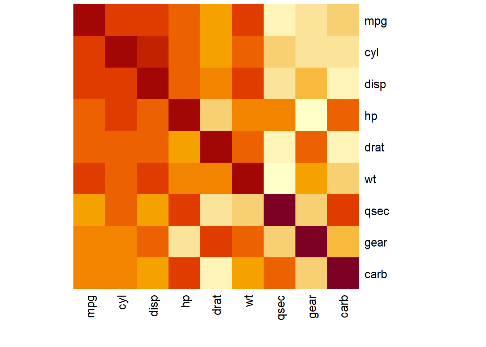

Podemos observar en el gráfico obtenido la correspondencia entre los colores de los cuadrados y las entradas de la matriz que representa: cuanto más rojo es el cuadrado correspondiente a un par de variables, menor es la entrada de la matriz y por lo tanto menos relación lineal existe entre ellas; y cuanto más claro,
mayor es la entrada de la matriz y por consiguiente su relación lineal. Así, podemos advertir en el gráfico que la variable `cyl`, el número de cilindros del vehículo, tiene mucha relación lineal con la cilindrada  (`disp`), el consumo (`mpg`), la potencia (`hp`), el peso (`wt`) y  la relación del eje trasero (`drat`); en cambio, la variable `qsec` (tiempo que tarda el vehículo en recorrer 1/4 de milla) sólo tiene relación lineal con la potencia, `hp`,
y el número de carburadores, `carb`.

Antes de continuar, vamos a explicar los parámetros usados en la aplicación anterior de la función `heatmap`: con `Rowv=NA` y `Colv=NA` impedimos que se añadan al gráfico dendrogramas por filas y por columnas, respectivamente (véase la Sección \@ref(sec:dendr), y con `revC=TRUE` hemos indicado que el orden de las variables de izquierda a derecha sea el mismo que de arriba abajo (por defecto, el orden de las filas se invierte).


La función `corrplot` del paquete homónimo permite producir mapas de calor de matrices de correlaciones más completos:

```r
library(corrplot)
corrplot(cor(mtcars2))
```

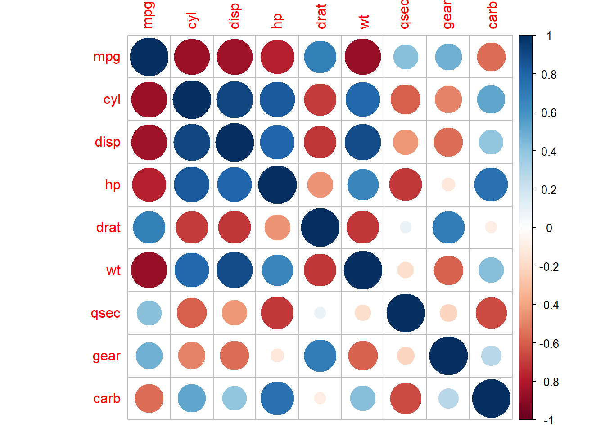

En este caso hemos usado la matriz de correlaciones sin valor absoluto, porque no hace falta: los círculos más grandes indican una mayor correlación en valor absoluto y, por tanto, más relación lineal entre las variables involucradas, y los colores indican el signo de la correlación según el código descrito en la columna de la derecha.
Si además hubiéramos querido que apareciera el valor de la correlación para cada par de variables, hubiéramos podido utilizar las opciones siguientes:

```r
corrplot(cor(mtcars2), method="shade", shade.col=NA, 
   tl.col="black", tl.srt=45, addCoef.col="black")
```

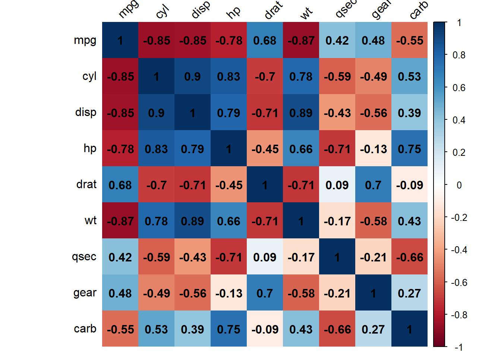

El significado de los parámetros que hemos usado es el siguiente:

* Con `method="shade"` y `shade.col=NA` hemos indicado que queremos las celdas coloreadas homogéneamente, en vez de círculos; 
* El parámetro `tl.col` especifica el color de las etiquetas de las filas y las columnas (por defecto es rojo, como en la anterior aplicación de `corrplot`);  
* El parámetro `tl.srt` especifica el ángulo de inclinación de las etiquetas de las columnas en grados (por defecto, son verticales); 
* Con `addCoef.col="black"` hemos indicado que incluya los valores de las correlaciones en las casillas, escritos en negro.

Os recomendamos consultar la Ayuda de la función para conocer el resto de parámetros disponibles. 


\BeginKnitrBlock{example}<div class="example"><span class="example" id="exm:VEHICLES"><strong>(\#exm:VEHICLES) </strong></span>Ahora vamos a visualizar por medio de un  *heatmap* las diferencias entre los vehículos estudiados en la tabla `mtcars`. Las diferencias las cuantificaremos por medio de la distancia euclídea entre los vectores que definen las filas de la tabla de datos. Como en el ejemplo anterior, sólo vamos a considerar las variables numéricas, así que usaremos el *data frame* `mtcars2`. A modo de ejemplo, las filas de los vehículos `Mazda RX4` y `Valiant` son</div>\EndKnitrBlock{example}

```r
mtcars2[c("Mazda RX4","Valiant"),]
#>            mpg cyl disp  hp drat   wt  qsec gear carb
#> Mazda RX4 21.0   6  160 110 3.90 2.62 16.46    4    4
#> Valiant   18.1   6  225 105 2.76 3.46 20.22    3    1
```

y su distancia euclídea es
$$
\sqrt{(21-18.1)^2+(6-6)^2+(160-225)^2+(110-105)^2+\cdots +(4-1)^2}=65.4565.
$$

Para hallar la matriz de distancias euclídeas entre las filas de la tabla de datos `mtcars2` usamos la instrucción `dist`:

```r
dist.mtcars=as.matrix(dist(mtcars2)) 
round(dist.mtcars[1:4,1:4],2) #Submatriz de las 4 primeras filas y columnas
#>                Mazda RX4 Mazda RX4 Wag Datsun 710 Hornet 4 Drive
#> Mazda RX4           0.00          0.62      54.90          98.10
#> Mazda RX4 Wag       0.62          0.00      54.88          98.09
#> Datsun 710         54.90         54.88       0.00         150.99
#> Hornet 4 Drive     98.10         98.09     150.99           0.00
```

La función  `dist` calcula por defecto las distancias euclídeas entre las filas de una matriz o un *data frame* de variables numéricas. Para calcular alguna otra distancia, se ha de especificar con el parámetro `method`: consultad la Ayuda de la función para conocer  los posibles valores de este parámetro. En el código anterior, hemos usado la función `as.matrix` para transformar el resultado de `dist` en una matriz ya que esta última función produce un objeto de clase `dist` y queremos que el resultado sea una matriz para poderle aplicar la función `heatmap`. 

Dibujemos el *heatmap* de las distancias entre vehículos:

```r
heatmap(dist.mtcars, margins=c(9,9), symm=TRUE, Rowv=NA, Colv=NA, revC=TRUE)  
```

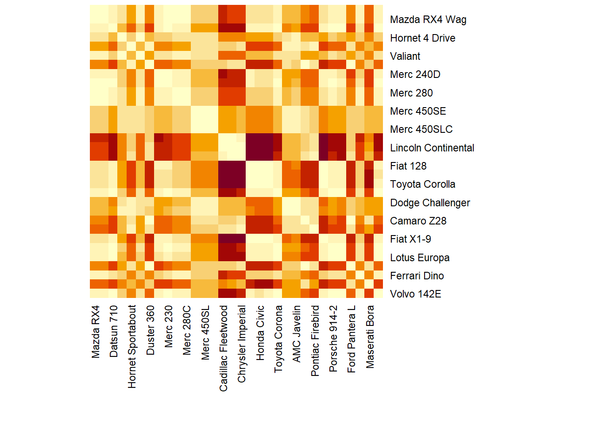

El parámetro `margins` especifica el ancho de los márgenes donde se escriben los nombres de las filas y las columnas y lo hemos adaptado para que quepan los nombres de los vehículos; 
el parámetro `symm=TRUE` indica a R que ha de considerar que la matriz es simétrica. El resto de los parámetros ya los hemos explicado antes. Esta función dispone de muchos más parámetros, que podéis consultar en su Ayuda.

La representación visual tiene el mismo significado que antes, pero referida a la matriz a la que hemos aplicado la función `heatmap`: cuanto más roja es la casilla, menor es la distancia entre los vehículos, y por lo tanto más parecidos son.
Así, por ejemplo, si observamos la columna del vehículo `Mazda RX4`, vemos que los vehículos más diferentes a él son  `Cadillac Fleetwood`, `Lincoln Continental` y `Chrysler Imperial`, ya que aparecen con un color más cercano al blanco, y los más parecidos son `Mazda RX4 Wag`, `Merc 280`, `Merc 280C`, `Merc 230`, `Volvo 142E`, `Toyota Corona`, 
`Porsche 914-2`, `Merc 240D`, etc.


## Dendrogramas {#sec:dendr}

Dada una tabla de datos podemos construir una matriz de distancias entre los individuos representados en ella, aplicando una distancia concreta a cada par de filas; es lo que hicimos en el Ejemplo \@ref(exm:VEHICLES), donde calculamos la distancia euclídea entre cada par de descripciones de tipo de coche. Una vez construida dicha matriz de distancias, podemos ir agrupando los individuos de la tabla de datos usando algún  algoritmo de *agrupamiento*, o *clustering* jerárquico. 

Muchos algoritmos de *clustering* jerárquico siguen una misma estrategia. En un primer paso, se agrupan los dos individuos más parecidos (más cercanos según la distancia usada) en un grupo y se los sustituye por este grupo, al que se considera  un nuevo individuo *virtual*. A partir de aquí, en cada paso, se agrupan en un nuevo grupo los dos individuos (originales o *virtuales*) más cercanos y se los sustituye por el grupo que forman. El algoritmo termina cuando queda un único grupo. Los diferentes algoritmos de este tipo, denominados genéricamente *aglomerativos*,  se distinguen básicamente según la manera como se define la distancia entre grupos a partir de las distancias entre sus individuos; aquí no entraremos en  detalle y nos limitaremos a usar el algoritmo que lleva implementado R por defecto (el llamado *método de enlace completo*: la distancia entre dos grupos es el máximo de las distancias entre sus elementos). Volveremos sobre los diferentes algoritmos de *clustering* en la Lección 11 de la Segunda parte de este manual.

Un *dendrograma* es entonces una representación gráfica del orden en el que se han ido realizando dichas agrupaciones y de las distancias entre los pares de individuos (originales y *virtuales*) que se han ido uniendo. Así podemos visualizar qué individuos se parecen más o si aparece de manera natural alguna clasificación de los individuos.

Veamos un ejemplo detallado.
La tabla de datos `all.mammals.milk.1956` que llevaba el paquete **cluster.datasets** ha quedado obsolota y lo cargamos directamente de la fuente de Hartigan,contiene información sobre 5 variables numéricas relativas a la composición de  la leche materna de 25 especies de mamíferos. Las variables de esta tabla de datos son:

* `name`: El nombre del animal.
* `water`: Porcentaje de agua en la leche.
* `protein`: Porcentaje de  proteína.
* `fat`: Porcentaje de grasa.
* `lactose`: Porcentaje de  lactosa.
* `ash`: Porcentaje de ceniza.

Démosle un vistazo.

```r
#library(cluster.datasets)
#data(all.mammals.milk.1956)  
all.mammals.milk.1956=read.table("https://people.sc.fsu.edu/~jburkardt/datasets/hartigan/file47.txt",
                               header=TRUE,skip=29)
AMM=all.mammals.milk.1956
str(AMM)
#> 'data.frame':	25 obs. of  6 variables:
#>  $ Name   : chr  "Horse" "Orangutan" "Monkey" "Donkey" ...
#>  $ Water  : num  90.1 88.5 88.4 90.3 90.4 87.7 86.9 82.1 81.9 81.6 ...
#>  $ Protein: num  2.6 1.4 2.2 1.7 0.6 3.5 4.8 5.9 7.4 10.1 ...
#>  $ Fat    : num  1 3.5 2.7 1.4 4.5 3.4 1.7 7.9 7.2 6.3 ...
#>  $ Lactose: num  6.9 6 6.4 6.2 4.4 4.8 5.7 4.7 2.7 4.4 ...
#>  $ Ash    : num  0.35 0.24 0.18 0.4 0.1 0.71 0.9 0.78 0.85 0.75 ...
head(AMM)
#>        Name Water Protein Fat Lactose  Ash
#> 1     Horse  90.1     2.6 1.0     6.9 0.35
#> 2 Orangutan  88.5     1.4 3.5     6.0 0.24
#> 3    Monkey  88.4     2.2 2.7     6.4 0.18
#> 4    Donkey  90.3     1.7 1.4     6.2 0.40
#> 5     Hippo  90.4     0.6 4.5     4.4 0.10
#> 6     Camel  87.7     3.5 3.4     4.8 0.71
```

Para cuantificar la diferencia entre las composiciones de la leche de estos mamíferos, usaremos de nuevo la distancia euclídea entre sus vectores de valores de variables numéricas.

```r
dist.AMM=dist(AMM[,2:6])
round(as.matrix(dist.AMM)[1:6,1:6],3)
#>       1     2     3     4     5     6
#> 1 0.000 3.327 2.494 1.226 4.759 4.107
#> 2 3.327 0.000 1.206 2.794 2.798 2.592
#> 3 2.494 1.206 0.000 2.375 3.716 2.348
#> 4 1.226 2.794 2.375 0.000 3.763 4.007
#> 5 4.759 2.798 3.716 3.763 0.000 4.176
#> 6 4.107 2.592 2.348 4.007 4.176 0.000
```

Hemos transformado el objeto `dist` en una matriz para poder consultar algunas entradas, pero lo mantenemos como objeto de tipo `dist` para construir su dendrograma.

Una vez se dispone de la matriz de distancias entre los individuos (en este caso, mamíferos), se calcula su *clustering* jerárquico aplicándole la función `hclust` y se convierte el resultado de esta función en un dendrograma usando `as.dendrogram`.
La función  `hclust` permite especificar el tipo de algoritmo de agrupamiento que queremos usar por medio del parámetro `method`; aquí usaremos el método por defecto. 

```r
dend.AMM=as.dendrogram(hclust(dist.AMM))
```

Y ahora ya podemos dibujar este dendrograma. Hay muchas opciones para hacerlo con R. La básica es aplicarle simplemente la función `plot`:

```r
plot(dend.AMM)
```


En este gráfico, los grupos se representan mediante líneas horizontales y  las alturas representan distancias, de manera que la altura a la que se unen dos grupos es la distancia entre ellos. Así, este dendrograma nos muestra, por ejemplo, que la composición de la leche de los animales 24 y 25 (foca y delfín) es diferente de la del resto, formando un grupo propio que no se ha unido al resto de animales hasta el último paso. En cambio, la ballena (el 23), que comparte hábitat y dieta con ellos, se agrupa con el ciervo y el reno (21 y 22).
Por otro lado, cortando por una línea horizontal imaginaria a altura 30, podemos observar que se forman tres grupos muy claros.

En un dendrograma producido a partir de las distancias entre las filas de un *data frame*, los individuos se representan mediante los identificadores de las filas: en nuestro ejemplo, números. Si queremos los nombres de los animales como etiquetas, una posibilidad es modificar el *data frame* `AMM` usando como identificadores de las filas los nombres de los animales; y ya que estamos, podemos eliminar esta variable del *data frame* resultante:

```r
AMM.nombres=AMM
rownames(AMM.nombres)=AMM.nombres$name
AMM.nombres=AMM.nombres[,-1]
head(AMM.nombres)
#>   Water Protein Fat Lactose  Ash
#> 1  90.1     2.6 1.0     6.9 0.35
#> 2  88.5     1.4 3.5     6.0 0.24
#> 3  88.4     2.2 2.7     6.4 0.18
#> 4  90.3     1.7 1.4     6.2 0.40
#> 5  90.4     0.6 4.5     4.4 0.10
#> 6  87.7     3.5 3.4     4.8 0.71
plot(as.dendrogram(hclust(dist(AMM.nombres))))
```

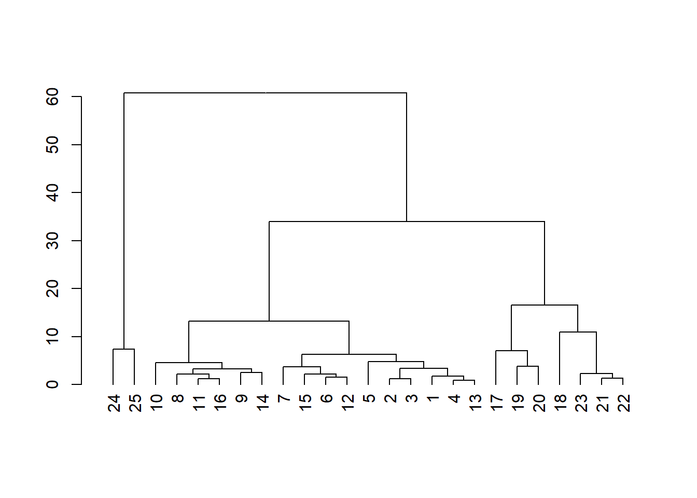


En el gráfico anterior podemos leer (más o menos) los nombres de los animales sin tener que ir a consultar el *data frame*. 

Aparte de los parámetros usuales de la función `plot`, dos parámetros interesantes cuando se aplica a un dendrograma son `horiz=TRUE`, que lo dibuja horizontal, y `type="triangle"`, que dibuja las ramificaciones triangulares en vez de rectangulares.

Para tener más control sobre el aspecto de un dendrograma, por ejemplo cambiar sus etiquetas sin modificar el *data frame* original, escribirlas en un tamaño menor o mayor o colorear ramas o etiquetas a fin de añadir información al dendrograma,  lo más sencillo es utilizar algunas funciones específicas aportadas por diversos paquetes. Aquí vamos a explicar algunas funcionalidades del paquete **dendextend**.

A modo de ejemplo, una vez cargado este paquete, para cambiar directamente las etiquetas del dendrograma del *data frame* `AMM`, podemos usar de manera natural la función `labels`, que nos da las etiquetas de las hojas.

```r
suppressPackageStartupMessages(library(dendextend))
L=labels(dend.AMM)
L
#>  [1] 24 25 10  8 11 16  9 14  7 15  6 12  5  2  3  1  4 13 17 19 20 18 23 21 22
labels(dend.AMM)=AMM$Name[L]
labels(dend.AMM)
#>  [1] "Seal"       "Dolphin"    "Cat"        "Buffalo"    "Fox"       
#>  [6] "Sheep"      "Guinea Pig" "Pig"        "Bison"      "Zebra"     
#> [11] "Camel"      "Llama"      "Hippo"      "Orangutan"  "Monkey"    
#> [16] "Horse"      "Donkey"     "Mule"       "Dog"        "Rabbit"    
#> [21] "Rat"        "Elephant"   "Whale"      "Deer"       "Reindeer"
```

La función `labels` aplicada a un dendrograma nos da las etiquetas de las hojas de izquierda a derecha, y con el paquete **dendextend** nos permite también modificar estas etiquetas. Naturalmente, a cada etiqueta (en nuestro ejemplo, número de fila) le tenemos que hacer corresponder el nombre del animal que le toca: por eso usamos `labels(dend.AMM)=AMM$name[L]` y no `labels(dend.AMM)=AMM$name` a secas, que a la primera etiqueta del dendrograma (la 25) le asignaría el primer nombre de animal, correspondiente a la etiqueta 1. 

Ahora que ya hemos modificado las etiquetas del dendrograma, podemos modificar su apariencia de cara a representarlo gráficamente. Para ello podemos usar la función `set`, cuya sintaxis básica es

```r
set(dendrograma, what="característica", valor)

```

Encontraréis la lista completa de las características que podemos usar en la Ayuda de la función.
Pero cuidado,  `set` no modifica el dendrograma permanentemente, solo temporalmente. Si queréis modificar el dendrograma, tenéis que usar

```r
dendrograma =set(dendrograma, what="característica", valor)
```

Si queremos cambiar más de una característica de golpe, es muy cómodo usar la notación *encadenada* de funciones, en la que a un objeto se le van aplicando funciones una tras otra separándolas con el signo `%>%`. (Esta notación no se puede usar en la instalación básica de R, solo en algunos paquetes, como **dendextend**, que la aceptan.)
En este caso, no se entra el dendrograma dentro de `set`, sino al principio de la cadena.
Por ejemplo, para reducir el tamaño de letra de las etiquetas (para que así quepan en el gráfico) y escribirlas en rojo, podemos entrar el código siguiente:

```r
dend.AMM%>%
   set(what="labels_col", "red")%>% #Colores de las etiquetas
   set(what="labels_cex", 0.8)%>% #Tamaño de las etiquetas
   plot(main="Dendrograma con etiquetas coloreadas\n y reducidas")
```

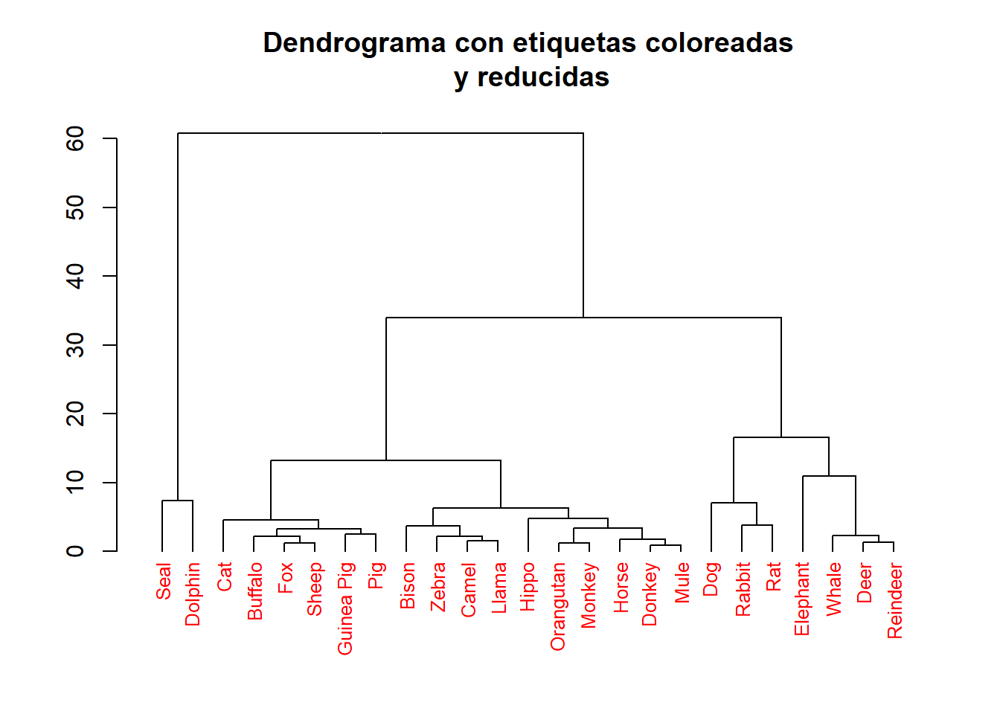

Observad la sintaxis: se toma el objeto `dend.AMM`, se le aplican las dos transformaciones, una tras otra, y al final se le aplica `plot` con los parámetros que deseemos.
No hemos modificado el dendrograma `dend.AMM`, solo su apariencia en el gráfico.

La posibilidad de colorear las etiquetas, o las aristas, puede mejorar la comprensión del dendrograma, o incluso añadir información. Veamos dos aplicaciones:

* Para distinguir visualmente los principales grupos que se forman en el dendrograma, y por ejemplo usar un color en cada grupo,  podemos usar el parámetro `k` igualado al número de grupos que queremos reconocer.
Por ejemplo,


```r
dend.AMM%>%
   set(what="labels_cex", 0.8)%>%
   set(what="labels_colors", c("red","blue","green"), k=3)%>%
   set(what="branches_k_color",c("red","blue","green"),k=3)%>% #Colores de las ramas
   plot(main="Dendrograma con 3 grupos resaltados")
```

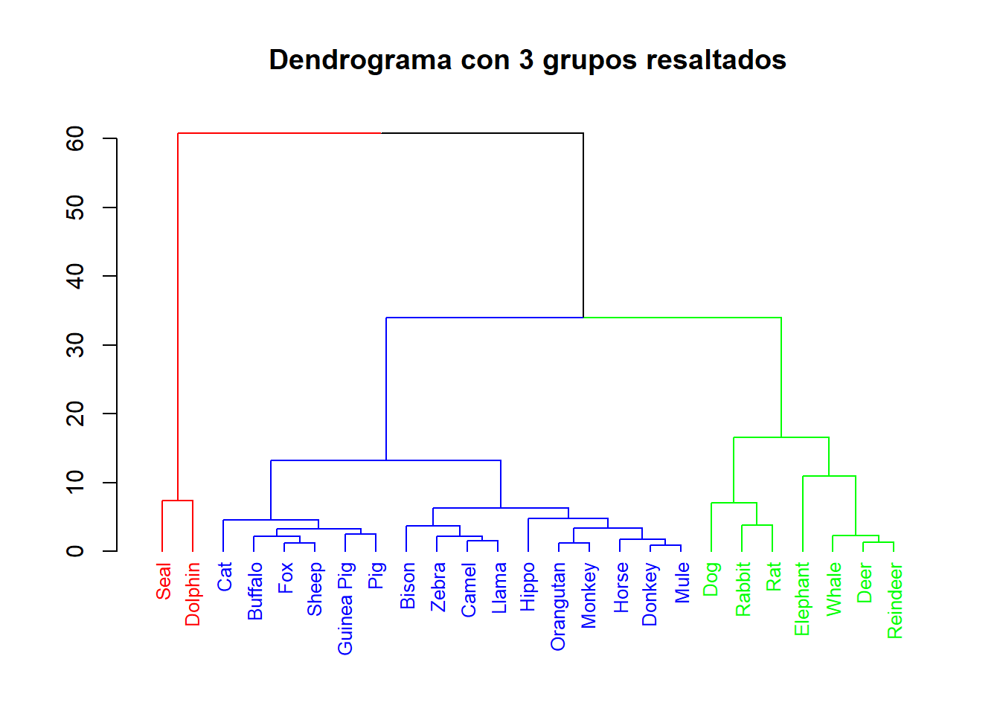


* Podemos clasificar los individuos representados en el dendrograma mediante un factor
y usar este factor para asignar colores a las etiquetas para así ver si los grupos que produce el dendrograma se corresponden con la clasificación según el factor. Como nuestro *data frame* `AMM` no tiene ninguna variable factor que podamos usar, vamos a añadirle una que represente la dieta principal del animal: C para carnívoro, H para   herbívoro, O para omnívoro, P para  piscívoro.

```r
AMM$diet=as.factor(c("H","O","O","H","H","H","H","H","H",
   "C","C","H","H","O","H","H","C","H","H","O","H","H","P",
   "P","P"))
head(AMM)
#>        Name Water Protein Fat Lactose  Ash diet
#> 1     Horse  90.1     2.6 1.0     6.9 0.35    H
#> 2 Orangutan  88.5     1.4 3.5     6.0 0.24    O
#> 3    Monkey  88.4     2.2 2.7     6.4 0.18    O
#> 4    Donkey  90.3     1.7 1.4     6.2 0.40    H
#> 5     Hippo  90.4     0.6 4.5     4.4 0.10    H
#> 6     Camel  87.7     3.5 3.4     4.8 0.71    H
# View(AMM) #Si queréis ver el dataframe completo en la ventana de ficheros
```

Ahora colorearemos las etiquetas del dendrograma según su dieta, y aprovecharemos para ver otra manera de usar `set`, definiendo un nuevo dendrograma `dend.AMM2` donde los cambios realizados sobre `dend.AMM` por las diferentes aplicaciones de `set` sean permanentes.

```r
dend.AMM2=dend.AMM%>%  
   set(what="labels_cex", 0.8)%>%   #Tamaño de etiquetas
   set(what="labels",AMM$Name[L])%>%  #Nombres en las etiquetas
   set(what="labels_color",as.numeric(AMM$diet[L]))  #Colores según la dieta
plot(dend.AMM2, main="Dendrograma de mamíferos clasificados
    \n según la dieta")
```

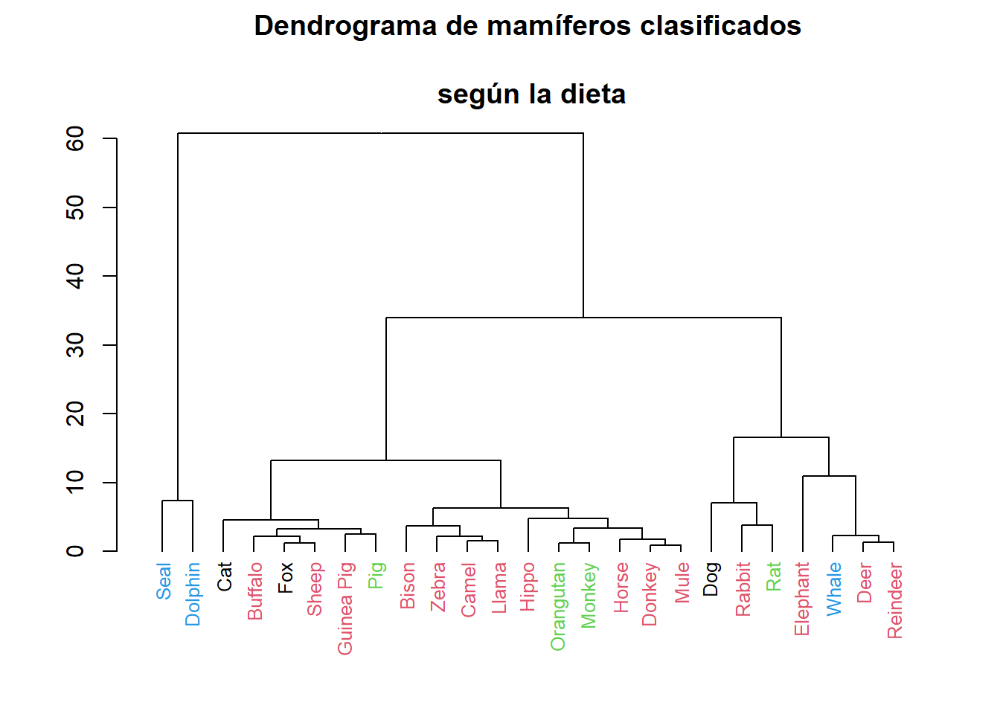

Vemos que la similitud de la composición de la leche materna no tiene mucha correspondencia con la dieta.


Para más información sobre las posibilidades de `dendextend` y su interacción con otros paquetes que dibujan dendrogramas, consultad la Ayuda de **dendextend**. Por ejemplo,
podemos modificar un dendrograma con `set` y luego 
aplicarle la función `circlize_dendrogram` del paquete **circlize** para obtener una representación circular. Véase el gráfico siguiente:


```r
library(circlize)
circlize_dendrogram(dend.AMM2)
```

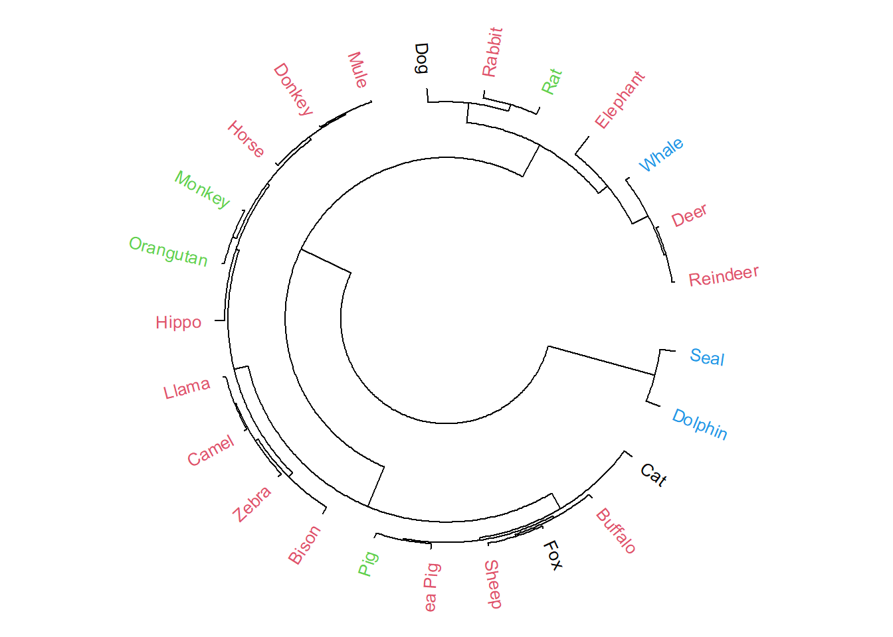


## Gráficos de burbujas o *bubbles*

Hay situaciones en las que nos interesa resaltar la importancia de una variable dibujando figuras geométricas (círculos, cuadrados, etc.) de tamaño proporcional a la importancia del valor de la variable. Este tipo de gráficos se 
denominan *gráficos de burbujas*, o *bubbles*, y la función básica para producirlos es `symbols`. Su sintáxis básica es

```r
symbols(x, y, "parámetro_figura" =z, ...)
```

donde `x` e `y` son los vectores de primeras y segundas coordenadas de los centros de las figuras a dibujar, el
*parámetro_figura* indica el tipo de figuras (`circles` para círculos, `squares` para cuadrados, `stars` para estrellas, etc.), y `z` es el vector de los tamaños *lineales* de las figuras: radio para los círculos, lado para los cuadrados, longitud del rayo para las estrellas, etc. Además se pueden usar los dos parámetros siguientes para añadir colores a las figuras:

* `fg`: el color de la frontera de los símbolos (por defecto, negro).
* `bg`: su color de relleno.

Y finalmente, se pueden usar los parámetros usuales de `plot`; para más información, incluida la lista de figuras disponibles, consultad la Ayuda de la función.

Veamos un ejemplo. Consideremos la tabla de datos `savings` que lleva el paquete **faraway**. Dicha tabla de datos nos da los 5 indicadores económicos siguientes de 50 países durante el período 1960--1970:

 * `sr`:  la tasa de ahorro, *savings rate*, de cada país.
 * `pop15`:  su porcentaje de población menor de 15 años.
 * `pop75`:  su porcentaje de población  mayor de 75 años.
 * `dpi`:  su renta per cápita  en dólares.
 * `ddpi`:  su tasa  de crecimiento como porcentaje de su renta per cápita.

Vamos a producir un gráfico de  burbujas de la tasa de ahorro de cada país en función de su renta per cápita, donde la 
variable *burbuja* será la tasa  de crecimiento; es decir, para cada país, dibujaremos una burbuja centrada en el punto de coordenadas (renta per cápita, tasa de ahorro) de diámetro proporcional a su tasa de crecimiento.
Además, colorearemos las burbujas según una escala de colores ocres que represente el porcentaje de la población menor de 15 años: cuanto más oscura sea la burbuja, mayor es dicho porcentaje. El código para producir el gráfico, tras cargar los paquetes **faraway** (para tener acceso a los datos) y **RColorBrewer** (para poder definir la paleta de colores), es el siguiente:

```r
library(faraway)
library(RColorBrewer)
```
* Agrupamos los porcentajes de población menor de 15 años en 9 grupos:

```r
porcentajes15=as.numeric(cut(savings$pop15, 9)) 
```
* Definimos nuestra paleta en función de los valores de la variable anterior:

```r
colores=brewer.pal(9,"YlOrBr")[porcentajes15]
```
* Dibujamos el gráfico de burbujas y escribimos el nombre de cada país en el centro de su burbuja :

```r
symbols(savings$dpi, savings$sr, circles=savings$ddpi, 
   bg=colores, xlab="Renta per cápita", ylab="Tasa de ahorro") 
text(savings$dpi,savings$sr, rownames(savings), cex=0.75) 
```

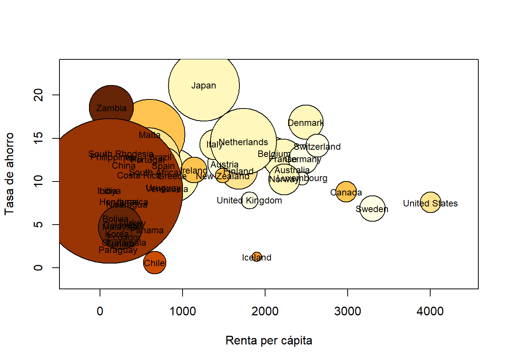

A simple vista se puede observar, por ejemplo, que los Estados Unidos tienen la renta per cápita más alta, una tasa de ahorro entre  moderada y baja, una tasa de crecimiento de la renta per cápita  baja y un porcentaje de población menor de 15 años también  bajo; en cambio, Japón tiene una renta per cápita más baja, una tasa de ahorro y una tasa de crecimiento de la renta per cápita mucho más altas pero la población menor de 15 años sigue siendo baja. También se observa que, en general,  el porcentaje de población menor de 15 años en los países más desarrollados es mucho menor que en los países menos desarrollados. 

Este tipo de gráficos, tal cual los produce R, tienen un defecto: como los tamaños de las burbujas se indican por medio de una dimensión lineal, su área crece con el cuadrado de dicha dimensión; por ejemplo,  en nuestro gráfico, la burbuja de un país con el doble de tasa de crecimiento que otro tiene un área cuatro veces mayor que la de este otro país. Como, instintivamente, comparamos áreas y no diámetros, 
esto puede llevar a confusión. La solución es sencilla: si queremos que las proporcionales a las tasas de crecimiento sean las áreas de los círculos, cuadrados, rectángulos, etc.,  y no sus amplitudes, 
basta entrar como dimensiones de las figuras sus raíces cuadradas. Así, el código siguiente produce un gráfico que, para nuestro gusto, representa mejor los datos.

```r
symbols(savings$dpi, savings$sr, circles=sqrt(savings$ddpi), 
   bg=colores, xlab="Renta per cápita", ylab="Tasa de ahorro") 
text(savings$dpi,savings$sr, rownames(savings), cex=0.75) 
```

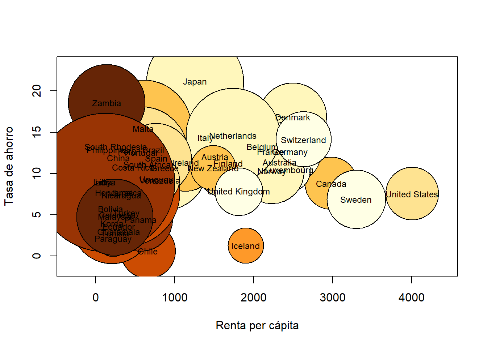


## Gráficos de corrientes  o *streamgraphs*

En los últimos 10 años se han puesto de moda un tipo de gráficos que sirven para visualizar cómo diversas cantidades varían conjuntamente a lo largo del tiempo: son los llamados *gráficos de corrientes*,  o *streamgraphs*. Con R este tipo de gráficos se producen fácilmente con el paquete **streamgraph**, que aún no está disponible en el servidor de la CRAN (al menos en el momento de revisar estas notas, marzo de 2020)  pero puede instalarse desde *GitHub*. Para ello no podemos emplear el instalador de paquetes de *RStudio* ni la función `install.packages`, sino la función específica `install_github` del paquete **devtools**, aplicado al *url* del paquete (que tenemos que conocer). Así, para instalar y cargar el paquete **streamgraph**, a día de hoy hay que ejecutar el código siguiente:

```r
library(devtools)
install_github("hrbrmstr/streamgraph",force=TRUE)
library(streamgraph)   
```


Ahora que ya lo tenemos cargado,  vamos a producir un  *streamgraph* de los diferentes géneros de películas desde los años 30 hasta la actualidad. Para ello, usaremos la tabla de datos `movies`, con información de 58,788 películas, que lleva el paquete **ggplot2movies**.

```r
library(ggplot2movies)
data(movies)
str(movies)
#> tibble [58,788 x 24] (S3: tbl_df/tbl/data.frame)
#>  $ title      : chr [1:58788] "$" "$1000 a Touchdown" "$21 a Day Once a Month" "$40,000" ...
#>  $ year       : int [1:58788] 1971 1939 1941 1996 1975 2000 2002 2002 1987 1917 ...
#>  $ length     : int [1:58788] 121 71 7 70 71 91 93 25 97 61 ...
#>  $ budget     : int [1:58788] NA NA NA NA NA NA NA NA NA NA ...
#>  $ rating     : num [1:58788] 6.4 6 8.2 8.2 3.4 4.3 5.3 6.7 6.6 6 ...
#>  $ votes      : int [1:58788] 348 20 5 6 17 45 200 24 18 51 ...
#>  $ r1         : num [1:58788] 4.5 0 0 14.5 24.5 4.5 4.5 4.5 4.5 4.5 ...
#>  $ r2         : num [1:58788] 4.5 14.5 0 0 4.5 4.5 0 4.5 4.5 0 ...
#>  $ r3         : num [1:58788] 4.5 4.5 0 0 0 4.5 4.5 4.5 4.5 4.5 ...
#>  $ r4         : num [1:58788] 4.5 24.5 0 0 14.5 14.5 4.5 4.5 0 4.5 ...
#>  $ r5         : num [1:58788] 14.5 14.5 0 0 14.5 14.5 24.5 4.5 0 4.5 ...
#>  $ r6         : num [1:58788] 24.5 14.5 24.5 0 4.5 14.5 24.5 14.5 0 44.5 ...
#>  $ r7         : num [1:58788] 24.5 14.5 0 0 0 4.5 14.5 14.5 34.5 14.5 ...
#>  $ r8         : num [1:58788] 14.5 4.5 44.5 0 0 4.5 4.5 14.5 14.5 4.5 ...
#>  $ r9         : num [1:58788] 4.5 4.5 24.5 34.5 0 14.5 4.5 4.5 4.5 4.5 ...
#>  $ r10        : num [1:58788] 4.5 14.5 24.5 45.5 24.5 14.5 14.5 14.5 24.5 4.5 ...
#>  $ mpaa       : chr [1:58788] "" "" "" "" ...
#>  $ Action     : int [1:58788] 0 0 0 0 0 0 1 0 0 0 ...
#>  $ Animation  : int [1:58788] 0 0 1 0 0 0 0 0 0 0 ...
#>  $ Comedy     : int [1:58788] 1 1 0 1 0 0 0 0 0 0 ...
#>  $ Drama      : int [1:58788] 1 0 0 0 0 1 1 0 1 0 ...
#>  $ Documentary: int [1:58788] 0 0 0 0 0 0 0 1 0 0 ...
#>  $ Romance    : int [1:58788] 0 0 0 0 0 0 0 0 0 0 ...
#>  $ Short      : int [1:58788] 0 0 1 0 0 0 0 1 0 0 ...
```

De esta tabla de datos nos vamos a quedar solo con las variables `year` (año de estreno) y
`Action`, `Animation`, `Comedy`, `Drama`, `Documentary`, `Romance` y `Short`, variables binarias que indican si la película entra o no en cada una de las categorías siguientes: acción, animación, comedia, drama, documental, romántica y cortometraje, respectivamente.

```r
movies.small=movies[,c(2,18:24)]
str(movies.small)
#> tibble [58,788 x 8] (S3: tbl_df/tbl/data.frame)
#>  $ year       : int [1:58788] 1971 1939 1941 1996 1975 2000 2002 2002 1987 1917 ...
#>  $ Action     : int [1:58788] 0 0 0 0 0 0 1 0 0 0 ...
#>  $ Animation  : int [1:58788] 0 0 1 0 0 0 0 0 0 0 ...
#>  $ Comedy     : int [1:58788] 1 1 0 1 0 0 0 0 0 0 ...
#>  $ Drama      : int [1:58788] 1 0 0 0 0 1 1 0 1 0 ...
#>  $ Documentary: int [1:58788] 0 0 0 0 0 0 0 1 0 0 ...
#>  $ Romance    : int [1:58788] 0 0 0 0 0 0 0 0 0 0 ...
#>  $ Short      : int [1:58788] 0 0 1 0 0 0 0 1 0 0 ...
```

Ahora hemos de modificar el *data frame* para poderlo usar como una serie temporal, donde para cada año y para cada categoría nos dé el correspondiente número de películas. La manera más sencilla es, en primer lugar, usar la función `pivot_longuer` del paquete `**tidyr**, especializado en funciones para *limpiar* y reorganizar datos.
Con esta función podemos sustituir las variables binarias correspondientes a las categorías por 
una nueva variable factor (la llamaremos `genero`) cuyos valores sean los nombres de dichas variables   y añadir una nueva variable binaria (la llamaremos `valor`)  que da el valor de la variable binaria original.
La sintaxis es


```r
pivot_longer(data="dataframe o tibble", cols="columnas a pivotar", names_to="variable que contiene elnombre de la columna",values_to=""variable que contine el valor")
```

De esta manera, en nuestro caso, cada fila de `movies.small` se convierte en 7 filas del nuevo *data frame*, una para cada variable *agrupada* en la nueva variable `genero`.  

```r
library(tidyverse)
library(tidyr)
movies.agrup=movies.small %>% pivot_longer(cols=c(Action:Short),
                                                             names_to="genero",
                                                            values_to="valor") 
#-year indica "todas las variables menos year"
# Action:Short indica que  toamamos todas las variables entre Action y Short
str(movies.agrup)
#> tibble [411,516 x 3] (S3: tbl_df/tbl/data.frame)
#>  $ year  : int [1:411516] 1971 1971 1971 1971 1971 1971 1971 1939 1939 1939 ...
#>  $ genero: chr [1:411516] "Action" "Animation" "Comedy" "Drama" ...
#>  $ valor : int [1:411516] 0 0 1 1 0 0 0 0 0 1 ...
```
A continuación, observamos que menos del 0.1\% de las películas se filmaron antes de 1930, por lo que en nuestro *streamgraph* esos años van a aparecer muy delgados, así que los eliminamos.


```r
quantile(movies.agrup$year,0.001)
#> 0.1% 
#> 1900
movies.agrup=movies.agrup[movies.agrup$year>=1900,]
```

A continuación, para cada año y cada categoría, sumamos los valores de la variable `valor`: como son ceros y unos, esto nos dará, los números anuales de películas de cada categoría. Una posible manera de hacerlo es con el código siguiente (la suma de dos factores indica que agrupamos los datos por todas la combinaciones de un nivel de cada factor):

```r
sum.movies.agrup=aggregate(valor~year+genero, data=movies.agrup,
   FUN=sum)
str(sum.movies.agrup)
#> 'data.frame':	742 obs. of  3 variables:
#>  $ year  : int  1900 1901 1902 1903 1904 1905 1906 1907 1908 1909 ...
#>  $ genero: chr  "Action" "Action" "Action" "Action" ...
#>  $ valor : int  0 1 0 3 0 0 0 0 3 0 ...
```

Y ahora ya estamos en disposición de dibujar el *streamgraph*. La función para hacerlo es \footnote{En la salida de este bookdown en pdf o word no el gráfico no será  interactivo.})

```r
streamgraph(data frame, "factor", "valores", "tiempo", interactive=...)? 
```
donde especificamos el *factor* del *data frame* de cuyas variables queremos representar sus *valores*  a lo largo del *tiempo*. El parámetro `interactive` es muy interesante, pero por ahora lo declararemos como `FALSE`, puesto que vamos a producir un dibujo para incorporar a este documento.

```r
streamgraph(sum.movies.agrup, "genero", "valor", "year",
   interactive=FALSE)
```

```{=html}
<div id="htmlwidget-65103486777b9d07d9d9" class="streamgraph html-widget" style="width:90%;height:480px;"></div>
<div id="htmlwidget-65103486777b9d07d9d9-legend" style="width:90%" class="streamgraph html-widget-legend"><center><label style='padding-right:5px' for='htmlwidget-65103486777b9d07d9d9-select'></label><select id='htmlwidget-65103486777b9d07d9d9-select' style='visibility:hidden;'></select></center></div>
<script type="application/json" data-for="htmlwidget-65103486777b9d07d9d9">{"x":{"data":{"key":["Action","Animation","Comedy","Documentary","Drama","Romance","Short","Action","Animation","Comedy","Documentary","Drama","Romance","Short","Action","Animation","Comedy","Documentary","Drama","Romance","Short","Action","Animation","Comedy","Documentary","Drama","Romance","Short","Action","Animation","Comedy","Documentary","Drama","Romance","Short","Action","Animation","Comedy","Documentary","Drama","Romance","Short","Action","Animation","Comedy","Documentary","Drama","Romance","Short","Action","Animation","Comedy","Documentary","Drama","Romance","Short","Action","Animation","Comedy","Documentary","Drama","Romance","Short","Action","Animation","Comedy","Documentary","Drama","Romance","Short","Action","Animation","Comedy","Documentary","Drama","Romance","Short","Action","Animation","Comedy","Documentary","Drama","Romance","Short","Action","Animation","Comedy","Documentary","Drama","Romance","Short","Action","Animation","Comedy","Documentary","Drama","Romance","Short","Action","Animation","Comedy","Documentary","Drama","Romance","Short","Action","Animation","Comedy","Documentary","Drama","Romance","Short","Action","Animation","Comedy","Documentary","Drama","Romance","Short","Action","Animation","Comedy","Documentary","Drama","Romance","Short","Action","Animation","Comedy","Documentary","Drama","Romance","Short","Action","Animation","Comedy","Documentary","Drama","Romance","Short","Action","Animation","Comedy","Documentary","Drama","Romance","Short","Action","Animation","Comedy","Documentary","Drama","Romance","Short","Action","Animation","Comedy","Documentary","Drama","Romance","Short","Action","Animation","Comedy","Documentary","Drama","Romance","Short","Action","Animation","Comedy","Documentary","Drama","Romance","Short","Action","Animation","Comedy","Documentary","Drama","Romance","Short","Action","Animation","Comedy","Documentary","Drama","Romance","Short","Action","Animation","Comedy","Documentary","Drama","Romance","Short","Action","Animation","Comedy","Documentary","Drama","Romance","Short","Action","Animation","Comedy","Documentary","Drama","Romance","Short","Action","Animation","Comedy","Documentary","Drama","Romance","Short","Action","Animation","Comedy","Documentary","Drama","Romance","Short","Action","Animation","Comedy","Documentary","Drama","Romance","Short","Action","Animation","Comedy","Documentary","Drama","Romance","Short","Action","Animation","Comedy","Documentary","Drama","Romance","Short","Action","Animation","Comedy","Documentary","Drama","Romance","Short","Action","Animation","Comedy","Documentary","Drama","Romance","Short","Action","Animation","Comedy","Documentary","Drama","Romance","Short","Action","Animation","Comedy","Documentary","Drama","Romance","Short","Action","Animation","Comedy","Documentary","Drama","Romance","Short","Action","Animation","Comedy","Documentary","Drama","Romance","Short","Action","Animation","Comedy","Documentary","Drama","Romance","Short","Action","Animation","Comedy","Documentary","Drama","Romance","Short","Action","Animation","Comedy","Documentary","Drama","Romance","Short","Action","Animation","Comedy","Documentary","Drama","Romance","Short","Action","Animation","Comedy","Documentary","Drama","Romance","Short","Action","Animation","Comedy","Documentary","Drama","Romance","Short","Action","Animation","Comedy","Documentary","Drama","Romance","Short","Action","Animation","Comedy","Documentary","Drama","Romance","Short","Action","Animation","Comedy","Documentary","Drama","Romance","Short","Action","Animation","Comedy","Documentary","Drama","Romance","Short","Action","Animation","Comedy","Documentary","Drama","Romance","Short","Action","Animation","Comedy","Documentary","Drama","Romance","Short","Action","Animation","Comedy","Documentary","Drama","Romance","Short","Action","Animation","Comedy","Documentary","Drama","Romance","Short","Action","Animation","Comedy","Documentary","Drama","Romance","Short","Action","Animation","Comedy","Documentary","Drama","Romance","Short","Action","Animation","Comedy","Documentary","Drama","Romance","Short","Action","Animation","Comedy","Documentary","Drama","Romance","Short","Action","Animation","Comedy","Documentary","Drama","Romance","Short","Action","Animation","Comedy","Documentary","Drama","Romance","Short","Action","Animation","Comedy","Documentary","Drama","Romance","Short","Action","Animation","Comedy","Documentary","Drama","Romance","Short","Action","Animation","Comedy","Documentary","Drama","Romance","Short","Action","Animation","Comedy","Documentary","Drama","Romance","Short","Action","Animation","Comedy","Documentary","Drama","Romance","Short","Action","Animation","Comedy","Documentary","Drama","Romance","Short","Action","Animation","Comedy","Documentary","Drama","Romance","Short","Action","Animation","Comedy","Documentary","Drama","Romance","Short","Action","Animation","Comedy","Documentary","Drama","Romance","Short","Action","Animation","Comedy","Documentary","Drama","Romance","Short","Action","Animation","Comedy","Documentary","Drama","Romance","Short","Action","Animation","Comedy","Documentary","Drama","Romance","Short","Action","Animation","Comedy","Documentary","Drama","Romance","Short","Action","Animation","Comedy","Documentary","Drama","Romance","Short","Action","Animation","Comedy","Documentary","Drama","Romance","Short","Action","Animation","Comedy","Documentary","Drama","Romance","Short","Action","Animation","Comedy","Documentary","Drama","Romance","Short","Action","Animation","Comedy","Documentary","Drama","Romance","Short","Action","Animation","Comedy","Documentary","Drama","Romance","Short","Action","Animation","Comedy","Documentary","Drama","Romance","Short","Action","Animation","Comedy","Documentary","Drama","Romance","Short","Action","Animation","Comedy","Documentary","Drama","Romance","Short","Action","Animation","Comedy","Documentary","Drama","Romance","Short","Action","Animation","Comedy","Documentary","Drama","Romance","Short","Action","Animation","Comedy","Documentary","Drama","Romance","Short","Action","Animation","Comedy","Documentary","Drama","Romance","Short","Action","Animation","Comedy","Documentary","Drama","Romance","Short","Action","Animation","Comedy","Documentary","Drama","Romance","Short","Action","Animation","Comedy","Documentary","Drama","Romance","Short","Action","Animation","Comedy","Documentary","Drama","Romance","Short","Action","Animation","Comedy","Documentary","Drama","Romance","Short","Action","Animation","Comedy","Documentary","Drama","Romance","Short","Action","Animation","Comedy","Documentary","Drama","Romance","Short","Action","Animation","Comedy","Documentary","Drama","Romance","Short","Action","Animation","Comedy","Documentary","Drama","Romance","Short","Action","Animation","Comedy","Documentary","Drama","Romance","Short","Action","Animation","Comedy","Documentary","Drama","Romance","Short","Action","Animation","Comedy","Documentary","Drama","Romance","Short","Action","Animation","Comedy","Documentary","Drama","Romance","Short","Action","Animation","Comedy","Documentary","Drama","Romance","Short","Action","Animation","Comedy","Documentary","Drama","Romance","Short","Action","Animation","Comedy","Documentary","Drama","Romance","Short","Action","Animation","Comedy","Documentary","Drama","Romance","Short","Action","Animation","Comedy","Documentary","Drama","Romance","Short","Action","Animation","Comedy","Documentary","Drama","Romance","Short"],"value":[0,1,5,5,2,0,16,1,0,8,9,5,1,27,0,0,2,2,1,0,9,3,0,8,8,2,1,37,0,0,10,4,3,0,42,0,0,6,2,4,0,17,0,1,2,4,5,0,15,0,1,6,0,1,0,12,3,1,8,1,8,0,24,0,1,7,0,14,1,29,0,0,2,2,14,3,26,1,1,2,1,14,1,21,0,1,4,0,22,5,30,2,2,11,1,13,0,22,1,1,38,1,13,0,38,2,3,22,1,16,0,35,1,6,27,0,13,2,29,0,0,18,0,14,2,15,1,3,23,1,14,2,22,2,3,29,2,17,5,20,0,0,20,0,14,3,13,1,2,23,0,23,6,17,0,4,16,1,20,8,14,1,3,19,2,20,11,17,3,2,24,0,15,7,18,0,4,36,2,27,10,21,5,3,40,2,37,17,26,3,2,32,2,41,21,20,5,6,45,4,51,9,33,0,17,60,11,74,14,54,4,26,125,7,106,53,74,5,41,146,5,138,45,91,5,63,143,6,157,33,116,6,51,159,7,167,66,107,8,49,192,7,164,61,123,17,69,192,13,140,62,122,9,85,212,4,120,47,143,14,75,209,10,153,62,127,8,76,217,11,133,53,126,17,80,183,10,179,35,127,15,85,213,16,156,45,134,16,97,242,16,139,57,141,24,100,203,19,148,40,145,18,74,165,26,129,26,123,11,68,157,14,118,32,101,15,51,126,22,122,28,84,10,66,144,12,135,32,101,14,61,137,7,162,41,85,21,79,172,12,179,35,107,18,80,179,9,187,43,100,14,72,166,11,167,27,99,17,71,187,13,191,39,105,18,69,178,12,194,31,90,21,63,178,13,183,44,92,23,70,168,12,177,47,96,13,61,154,15,220,49,93,13,56,143,17,183,38,83,13,41,142,13,236,44,68,16,36,141,10,219,42,53,24,31,143,13,186,42,50,19,27,126,13,224,35,38,28,30,135,12,186,32,49,25,35,163,11,210,30,53,30,21,164,19,199,32,43,39,28,160,21,189,34,46,29,58,175,29,158,20,85,32,50,176,20,168,20,86,40,43,193,38,200,39,79,45,46,166,37,223,29,79,46,23,164,22,266,31,44,31,12,156,32,252,28,30,55,23,155,40,260,25,42,59,11,146,31,238,19,27,68,9,150,24,258,22,27,85,18,130,27,258,32,25,63,20,148,36,244,32,44,82,16,148,38,250,26,36,79,20,152,24,246,27,26,64,22,151,39,231,30,35,65,20,160,27,248,38,32,72,13,184,33,230,41,38,62,19,178,31,243,43,22,83,18,172,40,255,34,39,78,25,166,31,265,41,33,83,26,190,45,278,57,38,108,33,213,45,256,59,52,131,29,204,31,289,44,40,109,35,252,49,339,55,56,94,37,249,42,332,67,50,132,37,239,37,324,63,63,134,21,232,41,321,65,50,97,37,250,46,330,76,68,120,30,240,74,347,77,75,137,32,254,60,381,84,95,147,41,309,94,435,97,141,161,52,281,84,493,116,165,159,52,352,98,493,127,194,162,49,404,133,555,161,217,144,61,451,133,634,160,279,160,85,562,156,694,184,408,154,89,561,175,793,207,449,169,82,582,196,837,211,468,176,81,591,249,929,245,533,180,94,642,261,899,215,555,147,56,597,258,805,169,480,43,10,123,35,137,37,54],"date":["1900-01-01","1900-01-01","1900-01-01","1900-01-01","1900-01-01","1900-01-01","1900-01-01","1901-01-01","1901-01-01","1901-01-01","1901-01-01","1901-01-01","1901-01-01","1901-01-01","1902-01-01","1902-01-01","1902-01-01","1902-01-01","1902-01-01","1902-01-01","1902-01-01","1903-01-01","1903-01-01","1903-01-01","1903-01-01","1903-01-01","1903-01-01","1903-01-01","1904-01-01","1904-01-01","1904-01-01","1904-01-01","1904-01-01","1904-01-01","1904-01-01","1905-01-01","1905-01-01","1905-01-01","1905-01-01","1905-01-01","1905-01-01","1905-01-01","1906-01-01","1906-01-01","1906-01-01","1906-01-01","1906-01-01","1906-01-01","1906-01-01","1907-01-01","1907-01-01","1907-01-01","1907-01-01","1907-01-01","1907-01-01","1907-01-01","1908-01-01","1908-01-01","1908-01-01","1908-01-01","1908-01-01","1908-01-01","1908-01-01","1909-01-01","1909-01-01","1909-01-01","1909-01-01","1909-01-01","1909-01-01","1909-01-01","1910-01-01","1910-01-01","1910-01-01","1910-01-01","1910-01-01","1910-01-01","1910-01-01","1911-01-01","1911-01-01","1911-01-01","1911-01-01","1911-01-01","1911-01-01","1911-01-01","1912-01-01","1912-01-01","1912-01-01","1912-01-01","1912-01-01","1912-01-01","1912-01-01","1913-01-01","1913-01-01","1913-01-01","1913-01-01","1913-01-01","1913-01-01","1913-01-01","1914-01-01","1914-01-01","1914-01-01","1914-01-01","1914-01-01","1914-01-01","1914-01-01","1915-01-01","1915-01-01","1915-01-01","1915-01-01","1915-01-01","1915-01-01","1915-01-01","1916-01-01","1916-01-01","1916-01-01","1916-01-01","1916-01-01","1916-01-01","1916-01-01","1917-01-01","1917-01-01","1917-01-01","1917-01-01","1917-01-01","1917-01-01","1917-01-01","1918-01-01","1918-01-01","1918-01-01","1918-01-01","1918-01-01","1918-01-01","1918-01-01","1919-01-01","1919-01-01","1919-01-01","1919-01-01","1919-01-01","1919-01-01","1919-01-01","1920-01-01","1920-01-01","1920-01-01","1920-01-01","1920-01-01","1920-01-01","1920-01-01","1921-01-01","1921-01-01","1921-01-01","1921-01-01","1921-01-01","1921-01-01","1921-01-01","1922-01-01","1922-01-01","1922-01-01","1922-01-01","1922-01-01","1922-01-01","1922-01-01","1923-01-01","1923-01-01","1923-01-01","1923-01-01","1923-01-01","1923-01-01","1923-01-01","1924-01-01","1924-01-01","1924-01-01","1924-01-01","1924-01-01","1924-01-01","1924-01-01","1925-01-01","1925-01-01","1925-01-01","1925-01-01","1925-01-01","1925-01-01","1925-01-01","1926-01-01","1926-01-01","1926-01-01","1926-01-01","1926-01-01","1926-01-01","1926-01-01","1927-01-01","1927-01-01","1927-01-01","1927-01-01","1927-01-01","1927-01-01","1927-01-01","1928-01-01","1928-01-01","1928-01-01","1928-01-01","1928-01-01","1928-01-01","1928-01-01","1929-01-01","1929-01-01","1929-01-01","1929-01-01","1929-01-01","1929-01-01","1929-01-01","1930-01-01","1930-01-01","1930-01-01","1930-01-01","1930-01-01","1930-01-01","1930-01-01","1931-01-01","1931-01-01","1931-01-01","1931-01-01","1931-01-01","1931-01-01","1931-01-01","1932-01-01","1932-01-01","1932-01-01","1932-01-01","1932-01-01","1932-01-01","1932-01-01","1933-01-01","1933-01-01","1933-01-01","1933-01-01","1933-01-01","1933-01-01","1933-01-01","1934-01-01","1934-01-01","1934-01-01","1934-01-01","1934-01-01","1934-01-01","1934-01-01","1935-01-01","1935-01-01","1935-01-01","1935-01-01","1935-01-01","1935-01-01","1935-01-01","1936-01-01","1936-01-01","1936-01-01","1936-01-01","1936-01-01","1936-01-01","1936-01-01","1937-01-01","1937-01-01","1937-01-01","1937-01-01","1937-01-01","1937-01-01","1937-01-01","1938-01-01","1938-01-01","1938-01-01","1938-01-01","1938-01-01","1938-01-01","1938-01-01","1939-01-01","1939-01-01","1939-01-01","1939-01-01","1939-01-01","1939-01-01","1939-01-01","1940-01-01","1940-01-01","1940-01-01","1940-01-01","1940-01-01","1940-01-01","1940-01-01","1941-01-01","1941-01-01","1941-01-01","1941-01-01","1941-01-01","1941-01-01","1941-01-01","1942-01-01","1942-01-01","1942-01-01","1942-01-01","1942-01-01","1942-01-01","1942-01-01","1943-01-01","1943-01-01","1943-01-01","1943-01-01","1943-01-01","1943-01-01","1943-01-01","1944-01-01","1944-01-01","1944-01-01","1944-01-01","1944-01-01","1944-01-01","1944-01-01","1945-01-01","1945-01-01","1945-01-01","1945-01-01","1945-01-01","1945-01-01","1945-01-01","1946-01-01","1946-01-01","1946-01-01","1946-01-01","1946-01-01","1946-01-01","1946-01-01","1947-01-01","1947-01-01","1947-01-01","1947-01-01","1947-01-01","1947-01-01","1947-01-01","1948-01-01","1948-01-01","1948-01-01","1948-01-01","1948-01-01","1948-01-01","1948-01-01","1949-01-01","1949-01-01","1949-01-01","1949-01-01","1949-01-01","1949-01-01","1949-01-01","1950-01-01","1950-01-01","1950-01-01","1950-01-01","1950-01-01","1950-01-01","1950-01-01","1951-01-01","1951-01-01","1951-01-01","1951-01-01","1951-01-01","1951-01-01","1951-01-01","1952-01-01","1952-01-01","1952-01-01","1952-01-01","1952-01-01","1952-01-01","1952-01-01","1953-01-01","1953-01-01","1953-01-01","1953-01-01","1953-01-01","1953-01-01","1953-01-01","1954-01-01","1954-01-01","1954-01-01","1954-01-01","1954-01-01","1954-01-01","1954-01-01","1955-01-01","1955-01-01","1955-01-01","1955-01-01","1955-01-01","1955-01-01","1955-01-01","1956-01-01","1956-01-01","1956-01-01","1956-01-01","1956-01-01","1956-01-01","1956-01-01","1957-01-01","1957-01-01","1957-01-01","1957-01-01","1957-01-01","1957-01-01","1957-01-01","1958-01-01","1958-01-01","1958-01-01","1958-01-01","1958-01-01","1958-01-01","1958-01-01","1959-01-01","1959-01-01","1959-01-01","1959-01-01","1959-01-01","1959-01-01","1959-01-01","1960-01-01","1960-01-01","1960-01-01","1960-01-01","1960-01-01","1960-01-01","1960-01-01","1961-01-01","1961-01-01","1961-01-01","1961-01-01","1961-01-01","1961-01-01","1961-01-01","1962-01-01","1962-01-01","1962-01-01","1962-01-01","1962-01-01","1962-01-01","1962-01-01","1963-01-01","1963-01-01","1963-01-01","1963-01-01","1963-01-01","1963-01-01","1963-01-01","1964-01-01","1964-01-01","1964-01-01","1964-01-01","1964-01-01","1964-01-01","1964-01-01","1965-01-01","1965-01-01","1965-01-01","1965-01-01","1965-01-01","1965-01-01","1965-01-01","1966-01-01","1966-01-01","1966-01-01","1966-01-01","1966-01-01","1966-01-01","1966-01-01","1967-01-01","1967-01-01","1967-01-01","1967-01-01","1967-01-01","1967-01-01","1967-01-01","1968-01-01","1968-01-01","1968-01-01","1968-01-01","1968-01-01","1968-01-01","1968-01-01","1969-01-01","1969-01-01","1969-01-01","1969-01-01","1969-01-01","1969-01-01","1969-01-01","1970-01-01","1970-01-01","1970-01-01","1970-01-01","1970-01-01","1970-01-01","1970-01-01","1971-01-01","1971-01-01","1971-01-01","1971-01-01","1971-01-01","1971-01-01","1971-01-01","1972-01-01","1972-01-01","1972-01-01","1972-01-01","1972-01-01","1972-01-01","1972-01-01","1973-01-01","1973-01-01","1973-01-01","1973-01-01","1973-01-01","1973-01-01","1973-01-01","1974-01-01","1974-01-01","1974-01-01","1974-01-01","1974-01-01","1974-01-01","1974-01-01","1975-01-01","1975-01-01","1975-01-01","1975-01-01","1975-01-01","1975-01-01","1975-01-01","1976-01-01","1976-01-01","1976-01-01","1976-01-01","1976-01-01","1976-01-01","1976-01-01","1977-01-01","1977-01-01","1977-01-01","1977-01-01","1977-01-01","1977-01-01","1977-01-01","1978-01-01","1978-01-01","1978-01-01","1978-01-01","1978-01-01","1978-01-01","1978-01-01","1979-01-01","1979-01-01","1979-01-01","1979-01-01","1979-01-01","1979-01-01","1979-01-01","1980-01-01","1980-01-01","1980-01-01","1980-01-01","1980-01-01","1980-01-01","1980-01-01","1981-01-01","1981-01-01","1981-01-01","1981-01-01","1981-01-01","1981-01-01","1981-01-01","1982-01-01","1982-01-01","1982-01-01","1982-01-01","1982-01-01","1982-01-01","1982-01-01","1983-01-01","1983-01-01","1983-01-01","1983-01-01","1983-01-01","1983-01-01","1983-01-01","1984-01-01","1984-01-01","1984-01-01","1984-01-01","1984-01-01","1984-01-01","1984-01-01","1985-01-01","1985-01-01","1985-01-01","1985-01-01","1985-01-01","1985-01-01","1985-01-01","1986-01-01","1986-01-01","1986-01-01","1986-01-01","1986-01-01","1986-01-01","1986-01-01","1987-01-01","1987-01-01","1987-01-01","1987-01-01","1987-01-01","1987-01-01","1987-01-01","1988-01-01","1988-01-01","1988-01-01","1988-01-01","1988-01-01","1988-01-01","1988-01-01","1989-01-01","1989-01-01","1989-01-01","1989-01-01","1989-01-01","1989-01-01","1989-01-01","1990-01-01","1990-01-01","1990-01-01","1990-01-01","1990-01-01","1990-01-01","1990-01-01","1991-01-01","1991-01-01","1991-01-01","1991-01-01","1991-01-01","1991-01-01","1991-01-01","1992-01-01","1992-01-01","1992-01-01","1992-01-01","1992-01-01","1992-01-01","1992-01-01","1993-01-01","1993-01-01","1993-01-01","1993-01-01","1993-01-01","1993-01-01","1993-01-01","1994-01-01","1994-01-01","1994-01-01","1994-01-01","1994-01-01","1994-01-01","1994-01-01","1995-01-01","1995-01-01","1995-01-01","1995-01-01","1995-01-01","1995-01-01","1995-01-01","1996-01-01","1996-01-01","1996-01-01","1996-01-01","1996-01-01","1996-01-01","1996-01-01","1997-01-01","1997-01-01","1997-01-01","1997-01-01","1997-01-01","1997-01-01","1997-01-01","1998-01-01","1998-01-01","1998-01-01","1998-01-01","1998-01-01","1998-01-01","1998-01-01","1999-01-01","1999-01-01","1999-01-01","1999-01-01","1999-01-01","1999-01-01","1999-01-01","2000-01-01","2000-01-01","2000-01-01","2000-01-01","2000-01-01","2000-01-01","2000-01-01","2001-01-01","2001-01-01","2001-01-01","2001-01-01","2001-01-01","2001-01-01","2001-01-01","2002-01-01","2002-01-01","2002-01-01","2002-01-01","2002-01-01","2002-01-01","2002-01-01","2003-01-01","2003-01-01","2003-01-01","2003-01-01","2003-01-01","2003-01-01","2003-01-01","2004-01-01","2004-01-01","2004-01-01","2004-01-01","2004-01-01","2004-01-01","2004-01-01","2005-01-01","2005-01-01","2005-01-01","2005-01-01","2005-01-01","2005-01-01","2005-01-01"]},"markers":null,"annotations":null,"offset":"silhouette","interactive":false,"interpolate":"cardinal","palette":"Spectral","text":"black","tooltip":"black","x_tick_interval":10,"x_tick_units":"year","x_tick_format":"%Y","y_tick_count":5,"y_tick_format":",g","top":20,"right":40,"bottom":30,"left":50,"legend":false,"legend_label":"","fill":"brewer","label_col":"black","x_scale":"date","sort":true,"order":"none"},"evals":[],"jsHooks":[]}</script>
```

En este gráfico, la variable *tiempo* (en nuestro caso, `year`) se representa en el eje horizontal, y las franjas de colores  corresponden, de abajo arriba, a los niveles ordenados del factor `genero`: la franja roja inferior a las películas de acción, la naranja inmediatamente superior a las de animación, y así hasta llegar a la franja azul de los cortometrajes. Su grueso, sobre cada año, representa el número de películas de cada género. 

Por el momento, no se puede añadir fácilmente una leyenda al *streamgraph* producido en modo `interactive=FALSE`. Pero la gracia es producir el gráfico en modo interactivo, con `interactive=TRUE`. Entonces, al pasear el ratón sobre la figura nos muestra, en cada punto, qué categoría estamos consultando y el número de películas en ese año. 

Además, se puede añadir a la figura un menú desplegable con los diferentes niveles del factor usado (en nuestro caso `genero`) que permite ver la evolución de ese nivel, con la función `sg_legend` aplicada al  resultado de `streamgraph`.

```r
streamgraph(sum.movies.agrup, "genero", "valor", "year",
   interactive=TRUE)
```


```r
sg_legend(streamgraph(sum.movies.agrup,"genero", 
   "valor", "year", interactive=TRUE), show=TRUE, 
    label="Género: ")
```

```{=html}
<div id="htmlwidget-fb9a7c8721d5f8fb0c27" class="streamgraph html-widget" style="width:90%;height:480px;"></div>
<div id="htmlwidget-fb9a7c8721d5f8fb0c27-legend" style="width:90%" class="streamgraph html-widget-legend"><center><label style='padding-right:5px' for='htmlwidget-fb9a7c8721d5f8fb0c27-select'></label><select id='htmlwidget-fb9a7c8721d5f8fb0c27-select' style='visibility:hidden;'></select></center></div>
<script type="application/json" data-for="htmlwidget-fb9a7c8721d5f8fb0c27">{"x":{"data":{"key":["Action","Animation","Comedy","Documentary","Drama","Romance","Short","Action","Animation","Comedy","Documentary","Drama","Romance","Short","Action","Animation","Comedy","Documentary","Drama","Romance","Short","Action","Animation","Comedy","Documentary","Drama","Romance","Short","Action","Animation","Comedy","Documentary","Drama","Romance","Short","Action","Animation","Comedy","Documentary","Drama","Romance","Short","Action","Animation","Comedy","Documentary","Drama","Romance","Short","Action","Animation","Comedy","Documentary","Drama","Romance","Short","Action","Animation","Comedy","Documentary","Drama","Romance","Short","Action","Animation","Comedy","Documentary","Drama","Romance","Short","Action","Animation","Comedy","Documentary","Drama","Romance","Short","Action","Animation","Comedy","Documentary","Drama","Romance","Short","Action","Animation","Comedy","Documentary","Drama","Romance","Short","Action","Animation","Comedy","Documentary","Drama","Romance","Short","Action","Animation","Comedy","Documentary","Drama","Romance","Short","Action","Animation","Comedy","Documentary","Drama","Romance","Short","Action","Animation","Comedy","Documentary","Drama","Romance","Short","Action","Animation","Comedy","Documentary","Drama","Romance","Short","Action","Animation","Comedy","Documentary","Drama","Romance","Short","Action","Animation","Comedy","Documentary","Drama","Romance","Short","Action","Animation","Comedy","Documentary","Drama","Romance","Short","Action","Animation","Comedy","Documentary","Drama","Romance","Short","Action","Animation","Comedy","Documentary","Drama","Romance","Short","Action","Animation","Comedy","Documentary","Drama","Romance","Short","Action","Animation","Comedy","Documentary","Drama","Romance","Short","Action","Animation","Comedy","Documentary","Drama","Romance","Short","Action","Animation","Comedy","Documentary","Drama","Romance","Short","Action","Animation","Comedy","Documentary","Drama","Romance","Short","Action","Animation","Comedy","Documentary","Drama","Romance","Short","Action","Animation","Comedy","Documentary","Drama","Romance","Short","Action","Animation","Comedy","Documentary","Drama","Romance","Short","Action","Animation","Comedy","Documentary","Drama","Romance","Short","Action","Animation","Comedy","Documentary","Drama","Romance","Short","Action","Animation","Comedy","Documentary","Drama","Romance","Short","Action","Animation","Comedy","Documentary","Drama","Romance","Short","Action","Animation","Comedy","Documentary","Drama","Romance","Short","Action","Animation","Comedy","Documentary","Drama","Romance","Short","Action","Animation","Comedy","Documentary","Drama","Romance","Short","Action","Animation","Comedy","Documentary","Drama","Romance","Short","Action","Animation","Comedy","Documentary","Drama","Romance","Short","Action","Animation","Comedy","Documentary","Drama","Romance","Short","Action","Animation","Comedy","Documentary","Drama","Romance","Short","Action","Animation","Comedy","Documentary","Drama","Romance","Short","Action","Animation","Comedy","Documentary","Drama","Romance","Short","Action","Animation","Comedy","Documentary","Drama","Romance","Short","Action","Animation","Comedy","Documentary","Drama","Romance","Short","Action","Animation","Comedy","Documentary","Drama","Romance","Short","Action","Animation","Comedy","Documentary","Drama","Romance","Short","Action","Animation","Comedy","Documentary","Drama","Romance","Short","Action","Animation","Comedy","Documentary","Drama","Romance","Short","Action","Animation","Comedy","Documentary","Drama","Romance","Short","Action","Animation","Comedy","Documentary","Drama","Romance","Short","Action","Animation","Comedy","Documentary","Drama","Romance","Short","Action","Animation","Comedy","Documentary","Drama","Romance","Short","Action","Animation","Comedy","Documentary","Drama","Romance","Short","Action","Animation","Comedy","Documentary","Drama","Romance","Short","Action","Animation","Comedy","Documentary","Drama","Romance","Short","Action","Animation","Comedy","Documentary","Drama","Romance","Short","Action","Animation","Comedy","Documentary","Drama","Romance","Short","Action","Animation","Comedy","Documentary","Drama","Romance","Short","Action","Animation","Comedy","Documentary","Drama","Romance","Short","Action","Animation","Comedy","Documentary","Drama","Romance","Short","Action","Animation","Comedy","Documentary","Drama","Romance","Short","Action","Animation","Comedy","Documentary","Drama","Romance","Short","Action","Animation","Comedy","Documentary","Drama","Romance","Short","Action","Animation","Comedy","Documentary","Drama","Romance","Short","Action","Animation","Comedy","Documentary","Drama","Romance","Short","Action","Animation","Comedy","Documentary","Drama","Romance","Short","Action","Animation","Comedy","Documentary","Drama","Romance","Short","Action","Animation","Comedy","Documentary","Drama","Romance","Short","Action","Animation","Comedy","Documentary","Drama","Romance","Short","Action","Animation","Comedy","Documentary","Drama","Romance","Short","Action","Animation","Comedy","Documentary","Drama","Romance","Short","Action","Animation","Comedy","Documentary","Drama","Romance","Short","Action","Animation","Comedy","Documentary","Drama","Romance","Short","Action","Animation","Comedy","Documentary","Drama","Romance","Short","Action","Animation","Comedy","Documentary","Drama","Romance","Short","Action","Animation","Comedy","Documentary","Drama","Romance","Short","Action","Animation","Comedy","Documentary","Drama","Romance","Short","Action","Animation","Comedy","Documentary","Drama","Romance","Short","Action","Animation","Comedy","Documentary","Drama","Romance","Short","Action","Animation","Comedy","Documentary","Drama","Romance","Short","Action","Animation","Comedy","Documentary","Drama","Romance","Short","Action","Animation","Comedy","Documentary","Drama","Romance","Short","Action","Animation","Comedy","Documentary","Drama","Romance","Short","Action","Animation","Comedy","Documentary","Drama","Romance","Short","Action","Animation","Comedy","Documentary","Drama","Romance","Short","Action","Animation","Comedy","Documentary","Drama","Romance","Short","Action","Animation","Comedy","Documentary","Drama","Romance","Short","Action","Animation","Comedy","Documentary","Drama","Romance","Short","Action","Animation","Comedy","Documentary","Drama","Romance","Short","Action","Animation","Comedy","Documentary","Drama","Romance","Short","Action","Animation","Comedy","Documentary","Drama","Romance","Short","Action","Animation","Comedy","Documentary","Drama","Romance","Short","Action","Animation","Comedy","Documentary","Drama","Romance","Short","Action","Animation","Comedy","Documentary","Drama","Romance","Short","Action","Animation","Comedy","Documentary","Drama","Romance","Short","Action","Animation","Comedy","Documentary","Drama","Romance","Short","Action","Animation","Comedy","Documentary","Drama","Romance","Short","Action","Animation","Comedy","Documentary","Drama","Romance","Short","Action","Animation","Comedy","Documentary","Drama","Romance","Short","Action","Animation","Comedy","Documentary","Drama","Romance","Short","Action","Animation","Comedy","Documentary","Drama","Romance","Short","Action","Animation","Comedy","Documentary","Drama","Romance","Short","Action","Animation","Comedy","Documentary","Drama","Romance","Short","Action","Animation","Comedy","Documentary","Drama","Romance","Short"],"value":[0,1,5,5,2,0,16,1,0,8,9,5,1,27,0,0,2,2,1,0,9,3,0,8,8,2,1,37,0,0,10,4,3,0,42,0,0,6,2,4,0,17,0,1,2,4,5,0,15,0,1,6,0,1,0,12,3,1,8,1,8,0,24,0,1,7,0,14,1,29,0,0,2,2,14,3,26,1,1,2,1,14,1,21,0,1,4,0,22,5,30,2,2,11,1,13,0,22,1,1,38,1,13,0,38,2,3,22,1,16,0,35,1,6,27,0,13,2,29,0,0,18,0,14,2,15,1,3,23,1,14,2,22,2,3,29,2,17,5,20,0,0,20,0,14,3,13,1,2,23,0,23,6,17,0,4,16,1,20,8,14,1,3,19,2,20,11,17,3,2,24,0,15,7,18,0,4,36,2,27,10,21,5,3,40,2,37,17,26,3,2,32,2,41,21,20,5,6,45,4,51,9,33,0,17,60,11,74,14,54,4,26,125,7,106,53,74,5,41,146,5,138,45,91,5,63,143,6,157,33,116,6,51,159,7,167,66,107,8,49,192,7,164,61,123,17,69,192,13,140,62,122,9,85,212,4,120,47,143,14,75,209,10,153,62,127,8,76,217,11,133,53,126,17,80,183,10,179,35,127,15,85,213,16,156,45,134,16,97,242,16,139,57,141,24,100,203,19,148,40,145,18,74,165,26,129,26,123,11,68,157,14,118,32,101,15,51,126,22,122,28,84,10,66,144,12,135,32,101,14,61,137,7,162,41,85,21,79,172,12,179,35,107,18,80,179,9,187,43,100,14,72,166,11,167,27,99,17,71,187,13,191,39,105,18,69,178,12,194,31,90,21,63,178,13,183,44,92,23,70,168,12,177,47,96,13,61,154,15,220,49,93,13,56,143,17,183,38,83,13,41,142,13,236,44,68,16,36,141,10,219,42,53,24,31,143,13,186,42,50,19,27,126,13,224,35,38,28,30,135,12,186,32,49,25,35,163,11,210,30,53,30,21,164,19,199,32,43,39,28,160,21,189,34,46,29,58,175,29,158,20,85,32,50,176,20,168,20,86,40,43,193,38,200,39,79,45,46,166,37,223,29,79,46,23,164,22,266,31,44,31,12,156,32,252,28,30,55,23,155,40,260,25,42,59,11,146,31,238,19,27,68,9,150,24,258,22,27,85,18,130,27,258,32,25,63,20,148,36,244,32,44,82,16,148,38,250,26,36,79,20,152,24,246,27,26,64,22,151,39,231,30,35,65,20,160,27,248,38,32,72,13,184,33,230,41,38,62,19,178,31,243,43,22,83,18,172,40,255,34,39,78,25,166,31,265,41,33,83,26,190,45,278,57,38,108,33,213,45,256,59,52,131,29,204,31,289,44,40,109,35,252,49,339,55,56,94,37,249,42,332,67,50,132,37,239,37,324,63,63,134,21,232,41,321,65,50,97,37,250,46,330,76,68,120,30,240,74,347,77,75,137,32,254,60,381,84,95,147,41,309,94,435,97,141,161,52,281,84,493,116,165,159,52,352,98,493,127,194,162,49,404,133,555,161,217,144,61,451,133,634,160,279,160,85,562,156,694,184,408,154,89,561,175,793,207,449,169,82,582,196,837,211,468,176,81,591,249,929,245,533,180,94,642,261,899,215,555,147,56,597,258,805,169,480,43,10,123,35,137,37,54],"date":["1900-01-01","1900-01-01","1900-01-01","1900-01-01","1900-01-01","1900-01-01","1900-01-01","1901-01-01","1901-01-01","1901-01-01","1901-01-01","1901-01-01","1901-01-01","1901-01-01","1902-01-01","1902-01-01","1902-01-01","1902-01-01","1902-01-01","1902-01-01","1902-01-01","1903-01-01","1903-01-01","1903-01-01","1903-01-01","1903-01-01","1903-01-01","1903-01-01","1904-01-01","1904-01-01","1904-01-01","1904-01-01","1904-01-01","1904-01-01","1904-01-01","1905-01-01","1905-01-01","1905-01-01","1905-01-01","1905-01-01","1905-01-01","1905-01-01","1906-01-01","1906-01-01","1906-01-01","1906-01-01","1906-01-01","1906-01-01","1906-01-01","1907-01-01","1907-01-01","1907-01-01","1907-01-01","1907-01-01","1907-01-01","1907-01-01","1908-01-01","1908-01-01","1908-01-01","1908-01-01","1908-01-01","1908-01-01","1908-01-01","1909-01-01","1909-01-01","1909-01-01","1909-01-01","1909-01-01","1909-01-01","1909-01-01","1910-01-01","1910-01-01","1910-01-01","1910-01-01","1910-01-01","1910-01-01","1910-01-01","1911-01-01","1911-01-01","1911-01-01","1911-01-01","1911-01-01","1911-01-01","1911-01-01","1912-01-01","1912-01-01","1912-01-01","1912-01-01","1912-01-01","1912-01-01","1912-01-01","1913-01-01","1913-01-01","1913-01-01","1913-01-01","1913-01-01","1913-01-01","1913-01-01","1914-01-01","1914-01-01","1914-01-01","1914-01-01","1914-01-01","1914-01-01","1914-01-01","1915-01-01","1915-01-01","1915-01-01","1915-01-01","1915-01-01","1915-01-01","1915-01-01","1916-01-01","1916-01-01","1916-01-01","1916-01-01","1916-01-01","1916-01-01","1916-01-01","1917-01-01","1917-01-01","1917-01-01","1917-01-01","1917-01-01","1917-01-01","1917-01-01","1918-01-01","1918-01-01","1918-01-01","1918-01-01","1918-01-01","1918-01-01","1918-01-01","1919-01-01","1919-01-01","1919-01-01","1919-01-01","1919-01-01","1919-01-01","1919-01-01","1920-01-01","1920-01-01","1920-01-01","1920-01-01","1920-01-01","1920-01-01","1920-01-01","1921-01-01","1921-01-01","1921-01-01","1921-01-01","1921-01-01","1921-01-01","1921-01-01","1922-01-01","1922-01-01","1922-01-01","1922-01-01","1922-01-01","1922-01-01","1922-01-01","1923-01-01","1923-01-01","1923-01-01","1923-01-01","1923-01-01","1923-01-01","1923-01-01","1924-01-01","1924-01-01","1924-01-01","1924-01-01","1924-01-01","1924-01-01","1924-01-01","1925-01-01","1925-01-01","1925-01-01","1925-01-01","1925-01-01","1925-01-01","1925-01-01","1926-01-01","1926-01-01","1926-01-01","1926-01-01","1926-01-01","1926-01-01","1926-01-01","1927-01-01","1927-01-01","1927-01-01","1927-01-01","1927-01-01","1927-01-01","1927-01-01","1928-01-01","1928-01-01","1928-01-01","1928-01-01","1928-01-01","1928-01-01","1928-01-01","1929-01-01","1929-01-01","1929-01-01","1929-01-01","1929-01-01","1929-01-01","1929-01-01","1930-01-01","1930-01-01","1930-01-01","1930-01-01","1930-01-01","1930-01-01","1930-01-01","1931-01-01","1931-01-01","1931-01-01","1931-01-01","1931-01-01","1931-01-01","1931-01-01","1932-01-01","1932-01-01","1932-01-01","1932-01-01","1932-01-01","1932-01-01","1932-01-01","1933-01-01","1933-01-01","1933-01-01","1933-01-01","1933-01-01","1933-01-01","1933-01-01","1934-01-01","1934-01-01","1934-01-01","1934-01-01","1934-01-01","1934-01-01","1934-01-01","1935-01-01","1935-01-01","1935-01-01","1935-01-01","1935-01-01","1935-01-01","1935-01-01","1936-01-01","1936-01-01","1936-01-01","1936-01-01","1936-01-01","1936-01-01","1936-01-01","1937-01-01","1937-01-01","1937-01-01","1937-01-01","1937-01-01","1937-01-01","1937-01-01","1938-01-01","1938-01-01","1938-01-01","1938-01-01","1938-01-01","1938-01-01","1938-01-01","1939-01-01","1939-01-01","1939-01-01","1939-01-01","1939-01-01","1939-01-01","1939-01-01","1940-01-01","1940-01-01","1940-01-01","1940-01-01","1940-01-01","1940-01-01","1940-01-01","1941-01-01","1941-01-01","1941-01-01","1941-01-01","1941-01-01","1941-01-01","1941-01-01","1942-01-01","1942-01-01","1942-01-01","1942-01-01","1942-01-01","1942-01-01","1942-01-01","1943-01-01","1943-01-01","1943-01-01","1943-01-01","1943-01-01","1943-01-01","1943-01-01","1944-01-01","1944-01-01","1944-01-01","1944-01-01","1944-01-01","1944-01-01","1944-01-01","1945-01-01","1945-01-01","1945-01-01","1945-01-01","1945-01-01","1945-01-01","1945-01-01","1946-01-01","1946-01-01","1946-01-01","1946-01-01","1946-01-01","1946-01-01","1946-01-01","1947-01-01","1947-01-01","1947-01-01","1947-01-01","1947-01-01","1947-01-01","1947-01-01","1948-01-01","1948-01-01","1948-01-01","1948-01-01","1948-01-01","1948-01-01","1948-01-01","1949-01-01","1949-01-01","1949-01-01","1949-01-01","1949-01-01","1949-01-01","1949-01-01","1950-01-01","1950-01-01","1950-01-01","1950-01-01","1950-01-01","1950-01-01","1950-01-01","1951-01-01","1951-01-01","1951-01-01","1951-01-01","1951-01-01","1951-01-01","1951-01-01","1952-01-01","1952-01-01","1952-01-01","1952-01-01","1952-01-01","1952-01-01","1952-01-01","1953-01-01","1953-01-01","1953-01-01","1953-01-01","1953-01-01","1953-01-01","1953-01-01","1954-01-01","1954-01-01","1954-01-01","1954-01-01","1954-01-01","1954-01-01","1954-01-01","1955-01-01","1955-01-01","1955-01-01","1955-01-01","1955-01-01","1955-01-01","1955-01-01","1956-01-01","1956-01-01","1956-01-01","1956-01-01","1956-01-01","1956-01-01","1956-01-01","1957-01-01","1957-01-01","1957-01-01","1957-01-01","1957-01-01","1957-01-01","1957-01-01","1958-01-01","1958-01-01","1958-01-01","1958-01-01","1958-01-01","1958-01-01","1958-01-01","1959-01-01","1959-01-01","1959-01-01","1959-01-01","1959-01-01","1959-01-01","1959-01-01","1960-01-01","1960-01-01","1960-01-01","1960-01-01","1960-01-01","1960-01-01","1960-01-01","1961-01-01","1961-01-01","1961-01-01","1961-01-01","1961-01-01","1961-01-01","1961-01-01","1962-01-01","1962-01-01","1962-01-01","1962-01-01","1962-01-01","1962-01-01","1962-01-01","1963-01-01","1963-01-01","1963-01-01","1963-01-01","1963-01-01","1963-01-01","1963-01-01","1964-01-01","1964-01-01","1964-01-01","1964-01-01","1964-01-01","1964-01-01","1964-01-01","1965-01-01","1965-01-01","1965-01-01","1965-01-01","1965-01-01","1965-01-01","1965-01-01","1966-01-01","1966-01-01","1966-01-01","1966-01-01","1966-01-01","1966-01-01","1966-01-01","1967-01-01","1967-01-01","1967-01-01","1967-01-01","1967-01-01","1967-01-01","1967-01-01","1968-01-01","1968-01-01","1968-01-01","1968-01-01","1968-01-01","1968-01-01","1968-01-01","1969-01-01","1969-01-01","1969-01-01","1969-01-01","1969-01-01","1969-01-01","1969-01-01","1970-01-01","1970-01-01","1970-01-01","1970-01-01","1970-01-01","1970-01-01","1970-01-01","1971-01-01","1971-01-01","1971-01-01","1971-01-01","1971-01-01","1971-01-01","1971-01-01","1972-01-01","1972-01-01","1972-01-01","1972-01-01","1972-01-01","1972-01-01","1972-01-01","1973-01-01","1973-01-01","1973-01-01","1973-01-01","1973-01-01","1973-01-01","1973-01-01","1974-01-01","1974-01-01","1974-01-01","1974-01-01","1974-01-01","1974-01-01","1974-01-01","1975-01-01","1975-01-01","1975-01-01","1975-01-01","1975-01-01","1975-01-01","1975-01-01","1976-01-01","1976-01-01","1976-01-01","1976-01-01","1976-01-01","1976-01-01","1976-01-01","1977-01-01","1977-01-01","1977-01-01","1977-01-01","1977-01-01","1977-01-01","1977-01-01","1978-01-01","1978-01-01","1978-01-01","1978-01-01","1978-01-01","1978-01-01","1978-01-01","1979-01-01","1979-01-01","1979-01-01","1979-01-01","1979-01-01","1979-01-01","1979-01-01","1980-01-01","1980-01-01","1980-01-01","1980-01-01","1980-01-01","1980-01-01","1980-01-01","1981-01-01","1981-01-01","1981-01-01","1981-01-01","1981-01-01","1981-01-01","1981-01-01","1982-01-01","1982-01-01","1982-01-01","1982-01-01","1982-01-01","1982-01-01","1982-01-01","1983-01-01","1983-01-01","1983-01-01","1983-01-01","1983-01-01","1983-01-01","1983-01-01","1984-01-01","1984-01-01","1984-01-01","1984-01-01","1984-01-01","1984-01-01","1984-01-01","1985-01-01","1985-01-01","1985-01-01","1985-01-01","1985-01-01","1985-01-01","1985-01-01","1986-01-01","1986-01-01","1986-01-01","1986-01-01","1986-01-01","1986-01-01","1986-01-01","1987-01-01","1987-01-01","1987-01-01","1987-01-01","1987-01-01","1987-01-01","1987-01-01","1988-01-01","1988-01-01","1988-01-01","1988-01-01","1988-01-01","1988-01-01","1988-01-01","1989-01-01","1989-01-01","1989-01-01","1989-01-01","1989-01-01","1989-01-01","1989-01-01","1990-01-01","1990-01-01","1990-01-01","1990-01-01","1990-01-01","1990-01-01","1990-01-01","1991-01-01","1991-01-01","1991-01-01","1991-01-01","1991-01-01","1991-01-01","1991-01-01","1992-01-01","1992-01-01","1992-01-01","1992-01-01","1992-01-01","1992-01-01","1992-01-01","1993-01-01","1993-01-01","1993-01-01","1993-01-01","1993-01-01","1993-01-01","1993-01-01","1994-01-01","1994-01-01","1994-01-01","1994-01-01","1994-01-01","1994-01-01","1994-01-01","1995-01-01","1995-01-01","1995-01-01","1995-01-01","1995-01-01","1995-01-01","1995-01-01","1996-01-01","1996-01-01","1996-01-01","1996-01-01","1996-01-01","1996-01-01","1996-01-01","1997-01-01","1997-01-01","1997-01-01","1997-01-01","1997-01-01","1997-01-01","1997-01-01","1998-01-01","1998-01-01","1998-01-01","1998-01-01","1998-01-01","1998-01-01","1998-01-01","1999-01-01","1999-01-01","1999-01-01","1999-01-01","1999-01-01","1999-01-01","1999-01-01","2000-01-01","2000-01-01","2000-01-01","2000-01-01","2000-01-01","2000-01-01","2000-01-01","2001-01-01","2001-01-01","2001-01-01","2001-01-01","2001-01-01","2001-01-01","2001-01-01","2002-01-01","2002-01-01","2002-01-01","2002-01-01","2002-01-01","2002-01-01","2002-01-01","2003-01-01","2003-01-01","2003-01-01","2003-01-01","2003-01-01","2003-01-01","2003-01-01","2004-01-01","2004-01-01","2004-01-01","2004-01-01","2004-01-01","2004-01-01","2004-01-01","2005-01-01","2005-01-01","2005-01-01","2005-01-01","2005-01-01","2005-01-01","2005-01-01"]},"markers":null,"annotations":null,"offset":"silhouette","interactive":true,"interpolate":"cardinal","palette":"Spectral","text":"black","tooltip":"black","x_tick_interval":10,"x_tick_units":"year","x_tick_format":"%Y","y_tick_count":5,"y_tick_format":",g","top":20,"right":40,"bottom":30,"left":50,"legend":true,"legend_label":"Género: ","fill":"brewer","label_col":"black","x_scale":"date","sort":true,"order":"none"},"evals":[],"jsHooks":[]}</script>
```


## Guía rápida


* `VCorpus` del paquete **tm**, sirve para cargar un conjunto de documentos en un *VCorpus*. Sus dos parámetros son:

    * `x`: indica el lugar de donde se han de cargar los documentos. Algunos posibles valores:
`DirSource("directorio", encoding=...)` y `URISource("url", encoding=...)`.

    * `readerControl`: se ha de igualar a una `list` de dos componentes:  `reader`, que indica la función con la que se han de leer los documentos, y  `language`, que indica el idioma de los documentos. Si los ficheros son de texto, no  es necesario especificar la componente  `reader`.


* `inspect` del paquete **tm**, nos da el número de documentos de un *VCorpus* y, de cada uno de ellos, su formato y su número de caracteres.

* `writeLines(as.character(documento))` escribe el `documento` en la consola.

* `tm_map(VCorpus, "transformación")` del paquete **tm**, aplica la `transformación` a todos los documentos del `VCorpus`. Algunas transformaciones:

   * `"tolower"`: convierte todas las letras en minúsculas.

   * `"removePunctuation"`: elimina los signos de puntuación.

   * `"removeWords"`: elimina las palabras del vector que se especifique.

   * `"stripWhitespace"`: elimina los espacios en blanco extra.

   * `"removeNumbers"`: elimina los números.

   * `"stemDocument"`: cargando el paquete **SnowballC**, se queda sólo con las raíces de algunas palabras.


* `stopwords` del paquete **tm**, aplicada al nombre de un idioma, entrecomillado, produce una lista de palabras *comodín* de este idioma.

* `wordcloud` del paquete **wordcloud**, produce una nube de palabras del documento al que se aplica. Algunos parámetros destacables:

   * `scale`: un vector de longitud 2 que sirve para indicar el tamaño relativo  de las palabras de mayor y menor frecuencia.

   * `max.words`: el número máximo de palabras a mostrar.

   * `min.freq`: la frecuencia mínima necesaria para que una palabra aparezca en el gráfico.

   * `rot.per`: la proporción de palabras que se pueden mostrar giradas 90 grados.

   * `colors`: la paleta de colores usada para representar las frecuencias.

* `heatmap` produce el mapa de calor, o *heatmap*, de la matriz a la que se aplica. Algunos parámetros importantes:

   * `Rowv` y `Colv`: igualados a `NA`, impiden que se añadan dendrogramas de las filas y las columnas en los márgenes.

   * `revC`: igualado a `TRUE` invierte el orden de las columnas.


* `corrplot` del paquete **corrplot**, produce el *heatmap* de la matriz de correlaciones a la que se aplica. Algunos parámetros importantes:
 
   * `method`: especifica la forma de las casillas; algunos valores posibles son  `circle` (círculos, el valor por defecto), `square` (cuadrados), `shade` (la casilla sombreada).

   * `addshade`: cuando usamos `method=shade`, permite especificar si queremos marcar las casillas correspondientes a correlación positiva o negativa (o ambas), mediante rectas de pendiente positiva o negativa.

   * `shade.col`: permite especificar el color de las rectas anteriores; igualado a `NA`, no las añade.

   * `tl.col`: el color de las etiquetas de filas y columnas.

   * `tl.srt`: la inclinación de las etiquetas de filas y columnas.

   * `addCoef.col`: igualado a un color, especifica que se escriban en cada casilla la entrada correspondiente de   la matriz en ese color.


   * `dist`, aplicada a una matriz o a un *data frame* de variables numéricas, calcula la matriz de distancias entre sus  filas. El tipo de distancia se especifica con el parámetro `method` y por defecto es la euclídea.


* `hclust` calcula un *clustering* jerárquico de una matriz de distancias calculada por medio de `dist`.
El parámetro `method` permite especificar el algoritmo concreto.

* `as.dendrogram` transforma el resultado de `hclust` en un dendrograma.

* `plot`, aplicado a un dendrograma, lo dibuja. En este contexto, aparte de los parámetros usuales, se dispone de varios parámetros específicos, entre los que destacamos:

   * `type=triangle`: dibuja las ramificaciones triangulares en vez de rectangulares.

   * `horiz=TRUE`: dibuja el dendrograma horizontal.


* `labels`, aplicada a un dendrograma, nos da las etiquetas de sus hojas de izquierda a derecha y, si está cargado el paquete `dendextend`, permite también cambiar los nombres de estas etiquetas.


* `set(dendrograma, what="característica", valor)` del paquete
 **dendextend**, permite modificar la `característica` del `dendrograma`. Algunas características útiles:
 
   * `labels`: los nombres de las etiquetas.
   * `labels_col`: los colores de las etiquetas.
   * `labels_cex`: el tamaño de las etiquetas.

La lista completa se puede consultar en la Ayuda de la función.

* `%>%` permite indicar la aplicación sucesiva de funciones, cada una al resultado de la aplicación anterior. Así
`x%>%f(Y)%>%g(Z)`
toma el objeto `x`, le aplica la función `f` con parámetros `Y` y al resultado le aplica la función `g` con parámetros `Z`; es decir, calcula `g(f(x,Y),Z)`. Esta notación solo está disponible en algunos paquetes (por ejemplo, `dendextend` y `streamgraph`).

* `circlize_dendrogram` del paquete **circlize**, dibuja un dendrograma en forma circular.


* `symbols(x, y, parámetro_figura=z)` dibuja, en cada uno de los puntos de abscisa una entrada del vector `x` y  ordenada  la correspondiente entrada del vector `y`, una figura del tipo especificado por el `parámetro_figura`. 
(`circles` para círculos, `squares` para cuadrados, `stars` para estrellas, etc.)
 de dimensión lineal la especificada por la  entrada correspondiente del vector $z$. Otros parámetros de interés, aparte de los usuales de la función `plot`:

   * `fg`: el color de la frontera de los símbolos.

   * `bg`: su color de relleno.

* `install_github("url")` del paquete **devtools**, instala un paquete del que conocemos su *url* en *GitHub*.

* `gather` del paquete **tidyr**, sustituye en un *data frame* un conjunto de variables numéricas por dos variables: un factor cuyos niveles son los nombres de las variables numéricas originales y una variable numérica nueva que da, para cada nivel de ese factor, el valor de la variable original. De esta manera, cada fila del *data frame* original se desdobla en tantas filas como variables hemos agrupado en el nuevo factor.

* `streamgraph` del paquete **streamgraph**, dibuja el *streamgraph* de tres variables de un *data frame*: una variable temporal, un factor, y una variable que para cada valor de la variable temporal y para cada nivel del factor nos da un valor numérico. Dispone del parámetro `interactive`, que igualado a `FALSE` produce un gráfico estático e igualado a `TRUE` produce un gráfico interactivo.

* `sg_legend` del paquete **streamgraph**, aplicada a un *streamgraph* producido en modo interactivo y a los  parámetros `show=TRUE` y `label` igualado a un nombre que represente el factor del *streamgraph*, añade un menú desplegable con los diferentes valores del factor.


